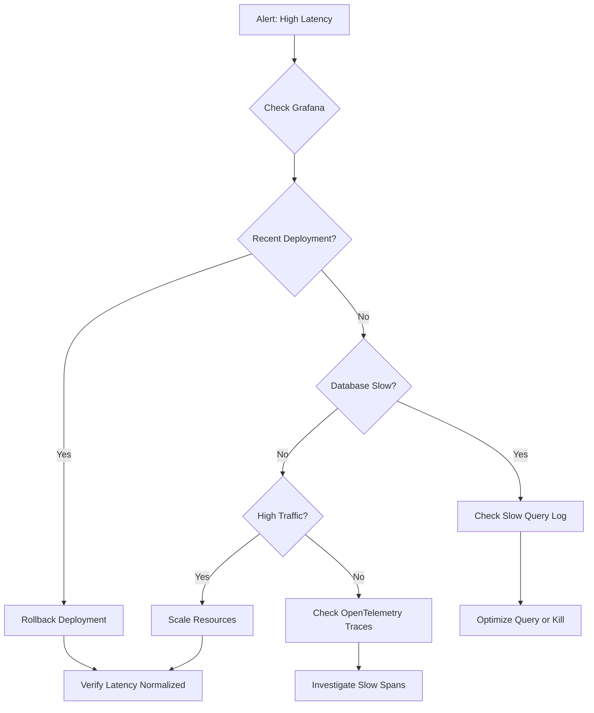

# Phase 01: Consolidate Operations Runbook

**Priority:** HIGH
**Time Estimate:** 2.5 hours
**Impact:** +1.0 point to Observability score (13/15 → 14/15)
**Status:** ⬜ Not Started

---

## Problem Statement

Operational documentation is scattered across multiple files in `docs/production/`, making it difficult for operators to find critical information during incidents. We need a centralized runbook that consolidates operational knowledge with quick reference tables and incident response flowcharts.

**Current Documentation:**
- `docs/production/MONITORING.md` (505+ lines)
- `docs/production/ALERTING.md`
- Other production docs in `docs/production/`

---

## Objective

Create `OPERATIONS_RUNBOOK.md` in the project root that:
1. Provides quick reference for emergency situations
2. Links to detailed documentation for deep dives
3. Includes incident response flowcharts (ASCII or Mermaid)
4. Covers the top 3 incident types:
   - High latency (p95 > SLO)
   - High error rate (> 0.1%)
   - Database connection exhaustion

---

## Context Files

**Review these files before writing (orchestrator will copy to `context/`):**
- `docs/production/MONITORING.md` - Main monitoring documentation
- `docs/production/ALERTING.md` - Alert definitions
- `docs/production/*.md` - Any other production docs
- `COMPLIANCE/AUDIT/AUDIT_LOGGING.md` - Audit trail info
- `docs/security/PROFILES.md` - Security profile reference

---

## Deliverable

**File:** `.phases/01-operations-runbook/output/OPERATIONS_RUNBOOK.md`

**Required Sections:**

### 1. Quick Reference (Top of File)
- Emergency contacts table
- Critical threshold values table
- Most common commands (copy-paste ready)
- Link to monitoring dashboards

### 2. Monitoring Overview
- Grafana dashboard links
- Key metrics to watch (RED metrics: Rate, Errors, Duration)
- Alert severity levels
- Where to find logs

### 3. Incident Response Procedures

**For each of the 3 incident types, include:**
- **Detection:** How the incident is detected (alert name, threshold)
- **Investigation:** Step-by-step debug process with actual commands
- **Remediation:** Specific actions to resolve the issue
- **Communication:** Who to notify and when
- **Follow-up:** Post-incident actions

**Required Incident Types:**

#### 3.1. High Latency
- P95 latency exceeds SLO
- Investigation: Check OpenTelemetry traces, slow queries, connection pool
- Remediation: Scale resources, optimize queries, rollback deployment

#### 3.2. High Error Rate
- Error rate > 0.1%
- Investigation: Check logs, recent deployments, database connectivity
- Remediation: Rollback, fix RLS policies, restart services

#### 3.3. Database Connection Exhaustion
- Connection pool exhausted
- Investigation: Check active connections, long-running queries
- Remediation: Kill long queries, scale connection pool, identify leak

### 4. Deployment Procedures
- Pre-deployment checklist
- Rollback procedure (specific commands)
- Health check verification
- Database migration safety checks

### 5. Troubleshooting Guide
- Common error messages and their meanings
- Debug commands for each subsystem
- Log file locations and formats
- How to query OpenTelemetry traces

### 6. Reference Links
- Link to detailed docs: `docs/production/MONITORING.md`
- Link to security profiles: `docs/security/PROFILES.md`
- Link to audit logging: `COMPLIANCE/AUDIT/AUDIT_LOGGING.md`
- Link to incident response: `COMPLIANCE/SECURITY/INCIDENT_RESPONSE.md` (Phase 04)

---

## Requirements

**Content Quality:**
- [ ] 300-500 lines (comprehensive but scannable)
- [ ] All commands are copy-paste ready with actual paths/values
- [ ] At least 1 flowchart (ASCII art or Mermaid diagram)
- [ ] Quick reference tables at the top
- [ ] Cross-references to detailed docs use relative paths
- [ ] Written for operators under pressure (clear, concise, actionable)

**Tone:**
- Direct, imperative language ("Check logs", not "You should check logs")
- Emergency-focused (assume reader is stressed during incident)
- No fluff or marketing language
- Technical accuracy over completeness

**Format:**
- GitHub-flavored Markdown
- Use tables for quick reference data
- Use code blocks for commands
- Use headings for navigation
- Include a table of contents if >400 lines

---

## Example Structure

```markdown
# FraiseQL Operations Runbook

**Last Updated:** 2025-12-04
**For:** Production Operations Team

---

## 🚨 Quick Reference

### Emergency Contacts
| Role | Contact | Escalation Time |
|------|---------|-----------------|
| On-call Engineer | PagerDuty | Immediate |
| Database Admin | @db-team | 15 minutes |
| Security Team | @security | If data breach |

### Critical Thresholds
| Metric | Warning | Critical | Alert |
|--------|---------|----------|-------|
| P95 Latency | 500ms | 1000ms | HIGH_LATENCY |
| Error Rate | 0.05% | 0.1% | HIGH_ERROR_RATE |
| DB Connections | 80/100 | 95/100 | DB_CONN_EXHAUSTION |

### Quick Commands
```bash
# Check service health
curl https://api.fraiseql.com/health

# View recent errors
tail -100 /var/log/fraiseql/errors.log

# Check database connections
psql -c "SELECT count(*) FROM pg_stat_activity"
```

---

## Monitoring Overview

### Grafana Dashboards
- **Main Dashboard:** https://grafana.example.com/d/fraiseql-overview
- **Database Dashboard:** https://grafana.example.com/d/fraiseql-db
- **Security Dashboard:** https://grafana.example.com/d/fraiseql-security

### Key Metrics (RED)
- **Rate:** Requests per second
- **Errors:** Error rate percentage
- **Duration:** P50, P95, P99 latency

[... continue with full structure ...]
```

---

## Flowchart Example

Include at least one flowchart like this:



Or ASCII art:

```
High Latency Alert
        |
        v
  Check Grafana Dashboard
        |
        v
  Recent Deployment?
   /           \
 YES           NO
  |             |
  v             v
Rollback    Check DB
```

---

## Verification (Orchestrator)

After junior engineer delivers `output/OPERATIONS_RUNBOOK.md`:

```bash
# 1. Check line count
wc -l .phases/01-operations-runbook/output/OPERATIONS_RUNBOOK.md
# Should be 300-500 lines

# 2. Verify all cross-references exist
cd .phases/01-operations-runbook/output/
grep -o "docs/.*\.md" OPERATIONS_RUNBOOK.md | while read f; do
  test -f "../../../$f" && echo "✓ $f" || echo "✗ $f (will exist after other phases)"
done

# 3. Check for required sections
grep -E "^## (Quick Reference|Monitoring|Incident Response|Deployment|Troubleshooting|Reference)" OPERATIONS_RUNBOOK.md

# 4. Verify commands are present
grep -c '```bash' OPERATIONS_RUNBOOK.md
# Should have multiple bash code blocks

# 5. Check for flowchart
grep -E '(```mermaid|graph TD|flowchart)' OPERATIONS_RUNBOOK.md
```

---

## Final Placement (Orchestrator)

After verification passes:

```bash
# Move to project root
cp .phases/01-operations-runbook/output/OPERATIONS_RUNBOOK.md ./OPERATIONS_RUNBOOK.md

# Commit
git add OPERATIONS_RUNBOOK.md
git commit -m "docs(ops): add centralized operations runbook

Consolidate operational documentation into single runbook:
- Quick reference tables for emergency response
- Incident response procedures for top 3 incidents
- Deployment and troubleshooting procedures
- Cross-references to detailed documentation

Impact: +1 point to Observability score (13/15 → 14/15)

Refs: Pentagon-Readiness Assessment - Phase 01"
```

---

## Tips for Documentation Writer

1. **Start with context review:** Read all files in `context/` directory first
2. **Copy actual values:** Use real metric names, actual file paths from the codebase
3. **Test commands mentally:** Imagine you're debugging an incident - would these commands help?
4. **Keep it scannable:** Use tables, bullet points, short paragraphs
5. **Link, don't duplicate:** If detailed info exists elsewhere, link to it
6. **Iterate if needed:** First draft can be rough, orchestrator will review

---

## Success Criteria

- [ ] File created: `.phases/01-operations-runbook/output/OPERATIONS_RUNBOOK.md`
- [ ] 300-500 lines of content
- [ ] Quick reference section at top
- [ ] All 3 incident types documented
- [ ] At least 1 flowchart included
- [ ] All commands are copy-paste ready
- [ ] Cross-references use correct relative paths
- [ ] Written in clear, direct language for emergency situations
