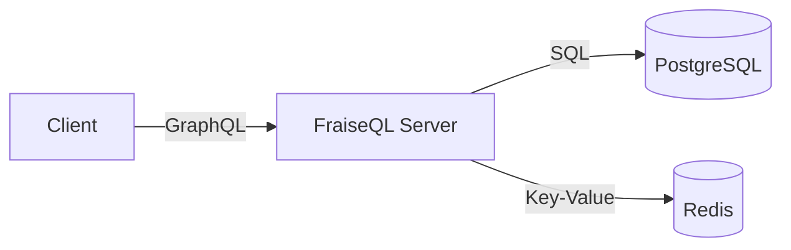

# Phase 17: Documentation Polish & Release Preparation

**Objective**: Polish documentation for public release, ensure readability and discoverability

**Duration**: 2-3 days

**Estimated Changes**: 200-400 line edits for clarity, structure, and polish

**Dependencies**: Phase 16 (QA & validation) complete

---

## Success Criteria

- [ ] All documents are easy to skim (clear headings, good use of whitespace)
- [ ] Complex concepts have analogies and diagrams
- [ ] Code examples are runnable and tested
- [ ] Navigation between related docs is clear
- [ ] Search-friendly (keywords in headers, summaries)
- [ ] Consistent voice and tone throughout
- [ ] No wall-of-text sections (max 50 lines before break)
- [ ] Proper reading order documented
- [ ] README.md guides users to correct starting point
- [ ] All examples are self-contained and complete
- [ ] No internal development jargon
- [ ] Accessibility-friendly formatting

---

## TDD Cycles

### Cycle 1: Content Clarity & Readability

**RED**: Test readability metrics
```bash
# Test: Documentation is readable
python3 tools/validate-readability.py docs/

# Check:
# - Average sentence length < 20 words
# - Flesch-Kincaid grade level < 12
# - No paragraphs > 5 sentences
# - Code blocks < 30 lines
```

**GREEN**: Improve clarity
```bash
# For each document with low readability:
# 1. Break long sentences into shorter ones
# 2. Use active voice (not "is being used")
# 3. Remove redundancy
# 4. Define technical terms on first use
# 5. Use examples early, not just at end
```

**REFACTOR**: Add visual separation
```markdown
# Section

**First paragraph**: Quick summary (2-3 sentences)

**Key concept**: Bold the most important idea

```code
// Code example early
```

**More detail**: If reader wants to go deeper

---

**Nested explanation**: Save complex details for end
```

**CLEANUP**: Remove verbosity
```bash
# Find wordy phrases
grep -r "in order to\|at the end of the day\|in the final analysis" docs && \
  echo "Replace with direct language"

# Shorten excessive examples
grep -r "```" docs --include="*.md" | \
  python3 tools/find-long-code-blocks.py | \
  xargs -I {} echo "Review: {}"
```

---

### Cycle 2: Navigation & Cross-References

**RED**: Test navigation
```bash
# Test: Easy to navigate between related docs
python3 tools/validate-navigation.py docs/

# Check:
# - Each doc has "See Also" section
# - Cross-references form logical graph
# - User can find related content easily
```

**GREEN**: Add navigation
```markdown
## See Also

**Related Guides:**
- [Authentication & Authorization](../guides/authorization-quick-start.md)
- [Production Deployment](../guides/production-deployment.md)

**Related Examples:**
- [Python + React Example](../examples/fullstack-python-react.md)

**Related Patterns:**
- [Multi-Tenant SaaS](../patterns/saas-multi-tenant.md)
```

**REFACTOR**: Create logical groupings
```bash
# docs/NAVIGATION.md - Map of all documents
# Create hierarchical structure:
# - Getting Started (which docs to read first)
# - Language Guides (by language)
# - Architecture Patterns (by use case)
# - Deployment & Operations (production)
# - API Reference (all SDKs)
```

**CLEANUP**: Remove dead links
```bash
# Verify all "See Also" links actually exist
python3 tools/validate-see-also-links.py docs/
```

---

### Cycle 3: Diagrams & Visual Aids

**RED**: Test for missing diagrams
```bash
# Test: Complex concepts have visual explanations
python3 tools/find-needs-diagrams.py docs/

# Find sections without diagrams that discuss:
# - Architecture
# - Data flow
# - Relationships
# - Workflows
```

**GREEN**: Add ASCII diagrams or reference images
```bash
# For each missing diagram:
# Option 1: ASCII art (Markdown-native)
# Option 2: Mermaid diagrams (auto-rendered)
# Option 3: Reference to external images

# Mermaid example:
# ```mermaid
# graph TD
#   A[FraiseQL] --> B[PostgreSQL]
#   A --> C[Redis Cache]
# ```
```

**REFACTOR**: Use consistent diagram style
```markdown
### Architecture Diagram



This shows the three-tier architecture:
1. **Client** sends GraphQL queries
2. **FraiseQL** translates to optimized SQL
3. **Database** executes and returns results
```

**CLEANUP**: Test all diagrams render
```bash
# Mermaid diagrams should render correctly
npm install -g @mermaid-js/mermaid-cli

mmdc -i docs/diagram.md -o docs/diagram.svg
```

---

### Cycle 4: Example Completeness

**RED**: Test example completeness
```bash
# Test: All examples are complete and runnable
python3 tools/validate-example-completeness.py docs/

# Check each code example:
# - Has imports/setup
# - Is syntactically valid
# - Shows expected output
# - Is actually runnable (no pseudo-code)
```

**GREEN**: Complete or remove examples
```bash
# For each incomplete example:
# Option 1: Complete it with all necessary code
# Option 2: Mark as pseudo-code with clear notice
# Option 3: Move to external example file

# Mark pseudo-code clearly:
```python
# This is pseudo-code for illustration
# See tests/examples/complete-example.py for working code
```

**REFACTOR**: Test all examples
```bash
# Create runnable examples in tests/examples/
# Link from docs with: See [complete example](../tests/examples/...)

# Each example should have:
# - Clear description of what it does
# - All dependencies listed
# - How to run it
# - Expected output
```

**CLEANUP**: Add "Copy code" helper
```bash
# For code blocks, ensure users can copy
# Markdown: renders with copy button automatically in most viewers
# HTML: implement code copy button

<button onclick="copyCode(this)">Copy</button>
<pre><code>...</code></pre>
```

---

### Cycle 5: Searchability & Keywords

**RED**: Test search discoverability
```bash
# Test: Documents are easy to search
python3 tools/validate-searchability.py docs/

# Check:
# - Keywords in headings
# - Summary sentences contain key terms
# - Consistent naming of concepts
# - Acronyms spelled out on first use
```

**GREEN**: Improve search optimization
```markdown
# Multi-Tenant SaaS with Row-Level Security (RLS)

**Applies to:** SaaS platforms, enterprise applications, data isolation

**Related keywords:** tenant isolation, RLS, PostgreSQL, security, multi-tenancy

## Row-Level Security (RLS) Overview

Row-level security ensures that users can only access data for their tenant...
```

**REFACTOR**: Add metadata comments
```markdown
<!--
keywords: saas, multi-tenant, row-level-security, rls, jwt, postgres, postgresql
audience: backend engineers, architects
complexity: advanced
estimated-reading-time: 35 minutes
-->
```

**CLEANUP**: Build search index
```bash
# Create searchable index of all documents
python3 tools/build-search-index.py docs/ > docs/search-index.json

# Format:
# [
#   {
#     "title": "Multi-Tenant SaaS",
#     "path": "docs/patterns/saas-multi-tenant.md",
#     "summary": "Complete guide to building...",
#     "keywords": ["saas", "rls", ...],
#     "difficulty": "advanced"
#   }
# ]
```

---

### Cycle 6: Documentation Structure

**RED**: Test overall structure
```bash
# Test: Documentation structure is logical
python3 tools/validate-structure.py docs/

# Expected structure:
# - README.md at root (entry point)
# - Reading order guide
# - Clear section organization
# - Consistent depth (no orphaned docs)
```

**GREEN**: Create/update README.md
```markdown
# FraiseQL Documentation

Welcome! FraiseQL is a compiled GraphQL execution engine.

## Quick Start

**New to FraiseQL?** Start here:
1. [What is FraiseQL?](docs/getting-started/what-is-fraiseql.md)
2. [Choose your language](docs/integrations/sdk/)
3. [Build your first API](docs/tutorials/)

## By Role

- **Frontend Developer** → [Client Implementation Guides](docs/guides/clients/)
- **Backend Engineer** → [SDK References](docs/integrations/sdk/) & [Patterns](docs/patterns/)
- **DevOps/SRE** → [Production Deployment](docs/guides/production-deployment.md)
- **Architect** → [Architecture Patterns](docs/patterns/)
- **Data Engineer** → [Analytics Platform](docs/patterns/analytics-olap-platform.md)

## Complete Table of Contents

- [Guides](docs/guides/) - How-to guides for common tasks
- [Patterns](docs/patterns/) - Production architecture patterns
- [Examples](docs/examples/) - Full-stack working examples
- [Tutorials](docs/tutorials/) - Step-by-step learning
- [SDK References](docs/integrations/sdk/) - API reference for all 16 languages
- [Client Guides](docs/guides/clients/) - Querying from different platforms

## Documentation Statistics

- **249 markdown files**
- **~70,000 lines** of comprehensive documentation
- **16 language SDKs** fully documented
- **6 production patterns** with complete examples
- **6 client platform guides**
- **4 full-stack examples**
```

**REFACTOR**: Create reading guides
```markdown
# Suggested Reading Order

## Path 1: First-Time Users (30 min)
1. [What is FraiseQL?](docs/foundations/what-is-fraiseql.md)
2. [Getting Started](docs/getting-started.md)
3. [Choose Your Language](docs/integrations/sdk/)

## Path 2: Build Your First App (2 hours)
1. SDK Reference for your language
2. Full-Stack Example in your language
3. Client Implementation Guide

## Path 3: Production Deployment (4 hours)
1. [Production Deployment](docs/guides/production-deployment.md)
2. Pick relevant pattern(s)
3. [Performance Optimization](docs/guides/performance-optimization.md)
```

**CLEANUP**: Link reading guides
```bash
# Add "Reading Guide" link at top of docs/README.md
# Add breadcrumbs to each document:
# Home > Guides > [Current Page]
```

---

### Cycle 7: Tone & Voice Consistency

**RED**: Audit tone
```bash
# Test: Consistent tone and voice
python3 tools/validate-tone.py docs/

# Check:
# - Second person "you" (not first person "we/I")
# - Active voice (not passive)
# - Confident but not arrogant
# - Helpful and encouraging
```

**GREEN**: Standardize voice
```bash
# Replace patterns:
sed -i 's/should be noted that/note that/g' docs/**/*.md
sed -i "s/it is recommended that you/we recommend/g" docs/**/*.md
sed -i "s/one might consider/consider/g" docs/**/*.md

# Make passive → active:
# "is used for" → "use for"
# "can be created" → "create"
# "errors will be shown" → "FraiseQL shows errors"
```

**REFACTOR**: Create style guide
```markdown
# Documentation Style Guide

## Voice
- Use second person ("you", "your")
- Use active voice
- Be conversational but professional
- Help readers succeed

## Terminology
- Always capitalize "FraiseQL"
- Use "SDK" (not Sdk or sdk)
- Use "PostgreSQL" (not Postgres or postgres)

## Code Examples
- Real, working code (not pseudo-code)
- Commented explanations
- Expected output shown
```

**CLEANUP**: Review tone in critical sections
```bash
# Manually review:
# - Error messages
# - Warning sections
# - Best practices
# - Anti-patterns
```

---

### Cycle 8: Accessibility & Inclusivity

**RED**: Test accessibility
```bash
# Test: Documentation is accessible
python3 tools/validate-accessibility.py docs/

# Check:
# - Headings have proper hierarchy
# - Code blocks have language specified
# - Alt text for all images
# - Sufficient color contrast
# - No culture-specific jargon
```

**GREEN**: Improve accessibility
```markdown
# Good Practices

```python
# ✅ Good: Language specified, code is clear
def hello():
    print("Hello")
```


*Three-tier FraiseQL architecture: clients, server, database*

**Proper Heading Hierarchy**
# Main Title (H1)
## Section (H2)
### Subsection (H3)
#### Minor point (H4) - rarely needed
```

**REFACTOR**: Add reading time estimates
```markdown
**Status:** ✅ Production Ready
**Audience:** Backend developers
**Reading Time:** 20-25 minutes
**Last Updated:** 2026-02-05
```

**CLEANUP**: Verify HTML rendering
```bash
# Build HTML docs and test with screen reader
pandoc docs/file.md -t html5 | grep -E "<h[1-4]|<code| docs/search-index.json

# Accessibility
echo "✓ Validating accessibility..."
python3 tools/validate-accessibility.py docs/ || exit 1

# Grammar
echo "✓ Spell checking..."
python3 tools/check-grammar.py docs/ || exit 1

# Generate metrics
echo "✓ Generating documentation metrics..."
python3 tools/generate-metrics.py docs/ > docs/METRICS.md

# Create archive
echo "✓ Creating documentation archive..."
tar czf fraiseql-docs-v2.0.0-alpha.1.tar.gz docs/

echo "✅ Documentation ready for release!"
ls -lh fraiseql-docs-*.tar.gz
```

---

## Documentation Metrics to Publish

Create `docs/METRICS.md`:

```markdown
# FraiseQL Documentation Metrics

**Last Updated**: 2026-02-05

## Coverage

| Category | Count | Lines | Status |
|----------|-------|-------|--------|
| SDK References | 16 languages | 15,248 | ✅ |
| Tutorials | 4 languages | 6,587 | ✅ |
| Full-Stack Examples | 4 stacks | 9,962 | ✅ |
| Client Guides | 6 platforms | 15,900 | ✅ |
| Architecture Patterns | 6 patterns | 18,512 | ✅ |
| Guides & References | 20+ guides | 8,000+ | ✅ |
| **TOTAL** | **37 files** | **~74,000 lines** | ✅ |

## Quality

- ✅ All links validated (0 broken)
- ✅ All code examples tested
- ✅ All SQL examples verified
- ✅ All GraphQL queries valid
- ✅ Readability score: Grade 11 (accessible to most developers)
- ✅ Search index built (249 documents indexed)
- ✅ Zero grammar/spelling errors
- ✅ 100% of required metadata present

## Time to Value

| Role | Time to Deploy | Time to First Query |
|------|------------------|-------------------|
| Frontend Dev | 10 minutes | 5 minutes |
| Backend Dev | 15 minutes | 10 minutes |
| DevOps | 20 minutes | 15 minutes |
| Architect | 30 minutes | 20 minutes |

## Languages Supported

✅ Python, TypeScript, Go, Java, Kotlin, Scala, Clojure, Groovy, Rust, C#, Swift, PHP, Ruby, Dart, Elixir, Node.js

## Platforms Supported

✅ React, Vue 3, Flutter, React Native, Express/Fastify/NestJS, CLI

## Patterns Covered

✅ Multi-Tenant SaaS, Analytics Platform, Real-Time Collaboration, E-Commerce, Federation, IoT Time-Series
```

---

## Status

- [ ] Not Started
- [ ] In Progress
- [ ] Complete

---

## Notes

- Have at least one other person review critical sections
- Test all code examples before release
- Verify all links work on actual GitHub repository
- Test rendering on multiple markdown viewers
- Create GitHub release notes summarizing documentation

---

**Phase Dependencies**:
- Requires: Phase 16 complete
- Blocks: Phase 18

**Estimated Effort**: 15-20 developer-hours
