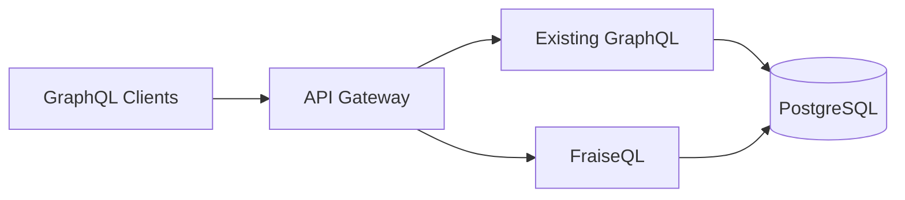

---
← [Frontend Developer](frontend-developer.md) | [Learning Paths](index.md) | [Home](../index.md) →
---

# Migration Path: Moving to FraiseQL

> **For:** Teams migrating from other GraphQL frameworks
> **Time to complete:** 2-3 hours
> **Goal:** Successfully migrate to FraiseQL with minimal disruption

This path helps you migrate from Hasura, PostGraphile, Prisma, or other GraphQL solutions to FraiseQL. Learn migration strategies, pattern mapping, and how to adopt FraiseQL gradually.

## Prerequisites

You should have:

- Experience with your current GraphQL framework
- Understanding of your existing schema
- Basic PostgreSQL knowledge
- Ability to modify database schemas

## Migration Overview

### Why Teams Migrate to FraiseQL

| From | Pain Points | FraiseQL Solution |
|------|------------|-------------------|
| **Hasura** | Complex authorization, limited business logic | PostgreSQL functions, view-based auth |
| **PostGraphile** | Performance issues, inflexible schema | Optimized views, explicit schema control |
| **Prisma** | N+1 queries, ORM limitations | Single-query views, no ORM needed |
| **Apollo Server** | Resolver complexity, performance | Database-driven, no resolvers |
| **Custom GraphQL** | Maintenance burden, scaling issues | Simplified architecture, PostgreSQL scaling |

## Migration Strategies

### Strategy 1: Gradual Migration (Recommended)

Run FraiseQL alongside your existing solution:



### Strategy 2: Feature-by-Feature

Migrate one feature at a time:

1. Start with read-only queries
2. Add mutations for new features
3. Migrate existing mutations
4. Deprecate old endpoints

### Strategy 3: Big Bang (Risky)

Complete rewrite - only for small projects:

1. Build FraiseQL API in parallel
2. Comprehensive testing
3. Switch over completely

## Migration from Hasura

### Hasura Concepts → FraiseQL Patterns

| Hasura Feature | FraiseQL Equivalent |
|----------------|-------------------|
| Tracked tables | Database views (`v_*`) |
| Relationships | JSONB aggregation in views |
| Permissions | PostgreSQL RLS + view filters |
| Actions | PostgreSQL functions (`fn_*`) |
| Event triggers | PostgreSQL triggers + NOTIFY |
| Remote schemas | Not needed (all in PostgreSQL) |

### Step 1: Analyze Hasura Metadata

Export your Hasura metadata:
```bash
hasura metadata export
```

Identify:

- Tables and relationships
- Permission rules
- Custom actions
- Event triggers

### Step 2: Create FraiseQL Views

Convert Hasura tracked tables to views:

```sql
-- Hasura tracked table: users
-- with relationship: users.posts

-- FraiseQL equivalent view
CREATE VIEW v_user AS
SELECT
    u.id,
    u.email,
    jsonb_build_object(
        'id', u.id,
        'email', u.email,
        'name', u.name,
        'posts', COALESCE(
            jsonb_agg(
                jsonb_build_object(
                    'id', p.id,
                    'title', p.title,
                    'published', p.published
                ) ORDER BY p.created_at DESC
            ) FILTER (WHERE p.id IS NOT NULL),
            '[]'::jsonb
        )
    ) AS data
FROM users u
LEFT JOIN posts p ON p.user_id = u.id
GROUP BY u.id;
```

### Step 3: Migrate Permissions

Convert Hasura permissions to PostgreSQL RLS:

```sql
-- Hasura permission: users can see own data
-- FraiseQL approach: Row Level Security

ALTER TABLE users ENABLE ROW LEVEL SECURITY;

CREATE POLICY user_select_own ON users
    FOR SELECT
    USING (id = current_setting('app.user_id')::uuid);

-- Apply in view
CREATE VIEW v_user_profile AS
SELECT
    id,
    jsonb_build_object(
        'id', id,
        'email', email,
        'name', name
    ) AS data
FROM users
WHERE id = current_setting('app.user_id', true)::uuid;
```

### Step 4: Migrate Actions

Convert Hasura actions to PostgreSQL functions:

```sql
-- Hasura action
-- type Mutation {
--   createPost(title: String!, content: String!): Post
-- }

-- FraiseQL function
CREATE OR REPLACE FUNCTION fn_create_post(
    p_title TEXT,
    p_content TEXT,
    p_user_id UUID DEFAULT current_setting('app.user_id')::uuid
) RETURNS UUID AS $$
DECLARE
    v_post_id UUID;
BEGIN
    INSERT INTO posts (title, content, user_id)
    VALUES (p_title, p_content, p_user_id)
    RETURNING id INTO v_post_id;

    RETURN v_post_id;
END;
$$ LANGUAGE plpgsql SECURITY DEFINER;
```

## Migration from PostGraphile

### PostGraphile → FraiseQL Mapping

| PostGraphile Feature | FraiseQL Equivalent |
|---------------------|-------------------|
| Smart comments | Python type definitions |
| Computed columns | View expressions |
| Custom queries | PostgreSQL functions |
| Plugins | Direct PostgreSQL features |
| Inflection | Explicit naming |

### Convert Computed Columns

```sql
-- PostGraphile computed column
CREATE FUNCTION users_full_name(u users)
RETURNS text AS $$
    SELECT u.first_name || ' ' || u.last_name
$$ LANGUAGE sql STABLE;

-- FraiseQL view approach
CREATE VIEW v_user AS
SELECT
    id,
    jsonb_build_object(
        'id', id,
        'fullName', first_name || ' ' || last_name,
        'firstName', first_name,
        'lastName', last_name
    ) AS data
FROM users;
```

### Convert Smart Comments

```sql
-- PostGraphile smart comment
COMMENT ON TABLE users IS E'@omit create,delete';
COMMENT ON COLUMN users.password IS E'@omit';

-- FraiseQL approach: explicit view
CREATE VIEW v_user AS
SELECT
    id,
    jsonb_build_object(
        'id', id,
        'email', email,
        'name', name
        -- password intentionally omitted
    ) AS data
FROM users;

-- Mutations via functions only
CREATE FUNCTION fn_update_user(...) ...;
-- No create/delete functions created
```

## Migration from Prisma

### Prisma → FraiseQL Patterns

| Prisma Concept | FraiseQL Equivalent |
|----------------|-------------------|
| Prisma schema | PostgreSQL schema + Python types |
| Prisma Client | FraiseQL Repository |
| Resolvers | Database views |
| Middleware | PostgreSQL triggers |
| Migrations | SQL migrations |

### Convert Prisma Schema

```prisma
// Prisma schema
model User {
  id        String   @id @default(uuid())
  email     String   @unique
  name      String?
  posts     Post[]
  createdAt DateTime @default(now())
}

model Post {
  id        String   @id @default(uuid())
  title     String
  content   String
  author    User     @relation(fields: [authorId], references: [id])
  authorId  String
  published Boolean  @default(false)
}
```

To FraiseQL:

```python
# Python types
@fraiseql.type
class User:
    id: ID
    email: str
    name: str | None
    posts: list[Post]
    created_at: datetime

@fraiseql.type
class Post:
    id: ID
    title: str
    content: str
    author: User
    published: bool
```

```sql
-- PostgreSQL views
CREATE VIEW v_user AS
SELECT
    u.id,
    u.email,
    jsonb_build_object(
        'id', u.id,
        'email', u.email,
        'name', u.name,
        'posts', COALESCE(
            jsonb_agg(
                jsonb_build_object(
                    'id', p.id,
                    'title', p.title,
                    'published', p.published
                )
            ) FILTER (WHERE p.id IS NOT NULL),
            '[]'::jsonb
        ),
        'createdAt', u.created_at
    ) AS data
FROM users u
LEFT JOIN posts p ON p.author_id = u.id
GROUP BY u.id;
```

### Convert Prisma Queries

```typescript
// Prisma query
const users = await prisma.user.findMany({
  where: {
    email: { contains: '@example.com' }
  },
  include: {
    posts: {
      where: { published: true }
    }
  }
});
```

To FraiseQL:

```python
@fraiseql.query
async def users(info, email_contains: str = None) -> list[User]:
    repo = info.context["repo"]

    where = {}
    if email_contains:
        where["email__contains"] = email_contains  # ✅ Works for string fields

    return await repo.find("v_user", where=where)
```

**⚠️ Important for v0.3.7+**: If you're using exotic PostgreSQL types (IP addresses, MAC addresses, etc.), pattern matching operators like `contains` are no longer available. Use exact matching instead:

```python
# ❌ No longer available for exotic types (was never working correctly)
servers = await repo.find("v_server", where={
    "ip_address__contains": "192.168"  # Removed in v0.3.7
})

# ✅ Use exact matching or IN operators instead
servers = await repo.find("v_server", where={
    "ip_address__in": ["192.168.1.100", "192.168.1.101"]
})
```

## Migration from Apollo Server

### Apollo Resolvers → FraiseQL Views

```javascript
// Apollo resolver
const resolvers = {
  Query: {
    users: async () => {
      return await db.query('SELECT * FROM users');
    }
  },
  User: {
    posts: async (parent) => {
      return await db.query(
        'SELECT * FROM posts WHERE author_id = $1',
        [parent.id]
      );
    }
  }
};
```

To FraiseQL:

```python
# No resolvers needed!
@fraiseql.query
async def users(info) -> list[User]:
    repo = info.context["repo"]
    return await repo.find("v_user")
```

```sql
-- Single query instead of N+1
CREATE VIEW v_user AS
SELECT
    u.id,
    jsonb_build_object(
        'id', u.id,
        'email', u.email,
        'posts', COALESCE(
            jsonb_agg(
                jsonb_build_object(
                    'id', p.id,
                    'title', p.title
                )
            ) FILTER (WHERE p.id IS NOT NULL),
            '[]'::jsonb
        )
    ) AS data
FROM users u
LEFT JOIN posts p ON p.author_id = u.id
GROUP BY u.id;
```

## Testing Migration

### 1. Schema Comparison

Compare GraphQL schemas:

```bash
# Get existing schema
apollo schema:download --endpoint=http://old-api/graphql old-schema.graphql

# Get FraiseQL schema
apollo schema:download --endpoint=http://new-api/graphql new-schema.graphql

# Compare
diff old-schema.graphql new-schema.graphql
```

### 2. Query Testing

Test queries side-by-side:

```python
import asyncio
from gql import gql, Client
from gql.transport.aiohttp import AIOHTTPTransport

async def compare_apis():
    # Test same query on both APIs
    query = gql("""
        query GetUsers {
            users {
                id
                email
                posts {
                    title
                }
            }
        }
    """)

    # Old API
    old_transport = AIOHTTPTransport(url="http://old-api/graphql")
    old_client = Client(transport=old_transport)
    old_result = await old_client.execute_async(query)

    # New API
    new_transport = AIOHTTPTransport(url="http://new-api/graphql")
    new_client = Client(transport=new_transport)
    new_result = await new_client.execute_async(query)

    # Compare results
    assert old_result == new_result
```

### 3. Performance Comparison

```sql
-- Measure query performance
EXPLAIN (ANALYZE, BUFFERS, FORMAT JSON)
SELECT * FROM v_user WHERE id = 'some-uuid';

-- Compare with old approach
-- Check execution time, buffer hits, etc.
```

## Gradual Migration Example

### Phase 1: Read-Only Queries
Week 1-2: Migrate simple read queries
```python
# Start with simple queries
@fraiseql.query
async def users(info) -> list[User]:
    repo = info.context["repo"]
    return await repo.find("v_user")
```

### Phase 2: New Features
Week 3-4: Build new features in FraiseQL
```python
# New features go straight to FraiseQL
@fraiseql.mutation
async def create_comment(info, input: CommentInput) -> Comment:
    # New functionality
    pass
```

### Phase 3: Complex Queries
Week 5-6: Migrate complex queries
```sql
-- Optimize complex views
CREATE VIEW v_dashboard AS
-- Complex aggregations
```

### Phase 4: Mutations
Week 7-8: Migrate write operations
```sql
-- Convert mutations to functions
CREATE FUNCTION fn_update_user(...) ...
```

### Phase 5: Deprecation
Week 9-10: Remove old system

- Update clients
- Remove old endpoints
- Clean up code

## Common Migration Challenges

### Challenge 1: Complex Authorization

**Problem:** Existing system has complex, dynamic authorization

**Solution:** Use PostgreSQL RLS with context variables:
```sql
-- Set context
SET LOCAL app.user_id = '123';
SET LOCAL app.tenant_id = '456';
SET LOCAL app.role = 'admin';

-- Use in policies
CREATE POLICY tenant_isolation ON data
    USING (tenant_id = current_setting('app.tenant_id')::uuid);
```

### Challenge 2: Custom Business Logic

**Problem:** Complex business logic in application code

**Solution:** Move to PostgreSQL functions:
```sql
CREATE FUNCTION fn_complex_business_logic(...)
RETURNS ... AS $$
BEGIN
    -- Business logic here
    -- Transactions, validations, etc.
END;
$$ LANGUAGE plpgsql;
```

### Challenge 3: Real-time Subscriptions

**Problem:** Existing real-time features

**Solution:** PostgreSQL LISTEN/NOTIFY:
```sql
-- Trigger notification
CREATE TRIGGER notify_changes
AFTER INSERT OR UPDATE ON posts
FOR EACH ROW
EXECUTE FUNCTION notify_change();

-- Python subscription handler
async def handle_notifications():
    async with repo.listen('posts_changed') as notifications:
        async for notification in notifications:
            # Push to WebSocket clients
            pass
```

## Migration Checklist

### Pre-Migration

- [ ] Analyze existing schema
- [ ] Document current API usage
- [ ] Identify critical paths
- [ ] Plan migration phases
- [ ] Set up test environment

### During Migration

- [ ] Create database views
- [ ] Define Python types
- [ ] Implement queries
- [ ] Add mutations
- [ ] Set up authentication
- [ ] Configure authorization
- [ ] Test thoroughly

### Post-Migration

- [ ] Performance testing
- [ ] Load testing
- [ ] Monitor errors
- [ ] Update documentation
- [ ] Train team
- [ ] Deprecate old system

## Success Stories

### Case Study 1: E-commerce Platform

- **From:** Hasura with 200+ tables
- **Migration time:** 8 weeks
- **Result:** 10x performance improvement, 50% less code

### Case Study 2: SaaS Application

- **From:** Custom Apollo Server
- **Migration time:** 6 weeks
- **Result:** Eliminated N+1 queries, 80% faster responses

### Case Study 3: Analytics Dashboard

- **From:** PostGraphile
- **Migration time:** 4 weeks
- **Result:** 100x faster aggregations with materialized views

## Getting Help

### Resources

- [Migration Guide](../migration/index.md) - Detailed migration docs
- [GitHub Discussions](https://github.com/fraiseql/fraiseql/discussions) - Community help
- [Discord Server](https://discord.gg/fraiseql) - Real-time chat

### Professional Services

- Migration assessment
- Custom training
- Hands-on assistance
- Performance optimization

## Next Steps

After migrating:

1. **Optimize** - Review and optimize views
2. **Monitor** - Set up performance monitoring
3. **Document** - Update API documentation
4. **Train** - Ensure team knows FraiseQL
5. **Iterate** - Continuously improve

## Tips for Migration Success

💡 **Start small** - Migrate one feature first
💡 **Test thoroughly** - Compare outputs carefully
💡 **Monitor performance** - Track improvements
💡 **Document changes** - Keep team informed
💡 **Have rollback plan** - Be ready to revert

Congratulations on choosing FraiseQL! The migration effort will pay off with better performance, simpler code, and happier developers.
