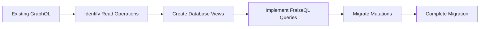

# Migration Overview

Learn how to migrate your existing GraphQL APIs to FraiseQL's database-first approach. This guide covers migration strategies, common patterns, and best practices for transitioning from resolver-based GraphQL frameworks.

## Why Migrate to FraiseQL?

### Performance Benefits

- **4-100x faster** query execution compared to resolver-based approaches
- **No N+1 queries** - Single SQL query per GraphQL request
- **Reduced latency** - Direct database to GraphQL translation
- **Lower resource usage** - No ORM overhead or resolver chains

### Development Benefits

- **Simpler architecture** - Remove layers of abstraction
- **Type safety** - Database schema drives GraphQL schema
- **CQRS pattern** - Clear separation of reads and writes
- **PostgreSQL power** - Leverage advanced database features

### Operational Benefits

- **Predictable performance** - SQL EXPLAIN for every query
- **Easier debugging** - Trace directly to SQL
- **Better caching** - Three-layer caching strategy
- **Reduced complexity** - Fewer moving parts

## Migration Strategies

### 1. Gradual Migration (Recommended)

Start with read-heavy endpoints and gradually migrate writes:



**Phase 1: Analytics & Reporting** (Week 1-2)

- Migrate read-only queries
- Create materialized views for complex aggregations
- Keep existing mutations unchanged

**Phase 2: CRUD Operations** (Week 3-4)

- Migrate simple CRUD queries
- Create PostgreSQL functions for mutations
- Run both systems in parallel

**Phase 3: Complex Business Logic** (Week 5-6)

- Migrate complex queries with joins
- Convert business logic to PostgreSQL functions
- Implement transaction patterns

**Phase 4: Cleanup** (Week 7)

- Remove old resolver code
- Optimize views and indexes
- Performance testing

### 2. Parallel Run Strategy

Run FraiseQL alongside your existing API:

```python
# Existing GraphQL endpoint
app.add_route("/graphql", existing_graphql_handler)

# New FraiseQL endpoint
fraiseql_app = FraiseQL(
    db_url=DATABASE_URL,
    enable_playground=True
)
app.add_route("/graphql-next", fraiseql_app)

# Gradual traffic shift using feature flags
@app.middleware("http")
async def route_by_feature_flag(request, call_next):
    if should_use_fraiseql(request.headers.get("x-user-id")):
        request.url = request.url.replace("/graphql", "/graphql-next")
    return await call_next(request)
```

### 3. Microservice Extraction

Perfect for extracting specific domains:

```yaml
# docker-compose.yml
services:
  main-api:
    image: existing-graphql-api
    ports:

      - "4000:4000"

  analytics-api:
    image: fraiseql-analytics
    environment:
      DATABASE_URL: "postgresql://..."
    ports:

      - "4001:4001"

  api-gateway:
    image: apollo-gateway
    environment:
      SERVICES: |

        - name: main
          url: http://main-api:4000

        - name: analytics
          url: http://analytics-api:4001
```

## Common Migration Patterns

### From Resolver-Based Queries

**Before (Resolver-based):**
```javascript
// Traditional resolver with N+1 problem
const resolvers = {
  Query: {
    users: async (parent, args, context) => {
      return await context.db.query('SELECT * FROM users');
    }
  },
  User: {
    posts: async (user, args, context) => {
      // N+1 query problem!
      return await context.db.query(
        'SELECT * FROM posts WHERE author_id = $1',
        [user.id]
      );
    }
  }
};
```

**After (FraiseQL View):**
```sql
-- Single view with all data
CREATE VIEW v_user AS
SELECT
    id,
    email,
    name,
    -- Include posts as JSONB
    (
        SELECT json_agg(
            json_build_object(
                'id', p.id,
                'title', p.title,
                'publishedAt', p.published_at
            ) ORDER BY p.published_at DESC
        )
        FROM tb_posts p
        WHERE p.author_id = u.id
    ) AS posts,
    -- JSONB data column for FraiseQL
    json_build_object(
        '__typename', 'User',
        'id', id,
        'email', email,
        'name', name,
        'posts', (
            SELECT json_agg(
                json_build_object(
                    '__typename', 'Post',
                    'id', p.id,
                    'title', p.title,
                    'publishedAt', p.published_at
                ) ORDER BY p.published_at DESC
            )
            FROM tb_posts p
            WHERE p.author_id = u.id
        )
    ) AS data
FROM tb_users u;
```

### From ORM-Based Patterns

**Before (ORM with Lazy Loading):**
```python
# SQLAlchemy with relationship loading
class User(Base):
    __tablename__ = 'users'
    id = Column(UUID, primary_key=True)
    posts = relationship("Post", back_populates="author")

@strawberry.type
class UserType:
    @strawberry.field
    async def posts(self, info) -> list[PostType]:
        # Triggers additional query
        return await self.posts
```

**After (FraiseQL Composed View):**
```sql
-- True view composition pattern
CREATE VIEW v_user_with_stats AS
SELECT
    u.id,
    u.email,
    u.name,
    -- Compose data from other views
    json_build_object(
        '__typename', 'UserWithStats',
        'id', u.id,
        'email', u.email,
        'name', u.name,
        'posts', (u.data->'posts'),
        'stats', json_build_object(
            'postCount', (
                SELECT COUNT(*)
                FROM tb_posts
                WHERE author_id = u.id
            ),
            'commentCount', (
                SELECT COUNT(*)
                FROM tb_comments
                WHERE author_id = u.id
            ),
            'totalViews', (
                SELECT COALESCE(SUM(view_count), 0)
                FROM tb_posts
                WHERE author_id = u.id
            )
        )
    ) AS data
FROM v_user u;  -- Build on existing view
```

### From DataLoader Pattern

**Before (DataLoader for Batching):**
```python
class UserLoader(DataLoader):
    async def batch_load_fn(self, user_ids):
        users = await db.query(
            "SELECT * FROM users WHERE id = ANY($1)",
            user_ids
        )
        user_map = {u.id: u for u in users}
        return [user_map.get(uid) for uid in user_ids]

# In resolver
async def resolve_author(post, info):
    return await info.context.user_loader.load(post.author_id)
```

**After (FraiseQL with Built-in Batching):**
```python
from fraiseql import dataloader_field

@type
class Post:
    id: UUID
    title: str
    author_id: UUID

    @dataloader_field
    async def author(self, info) -> User:
        """Automatically batched by FraiseQL."""
        # FraiseQL handles the batching internally
        return await info.context.db.get_user(self.author_id)
```

## Database-First vs Code-First

### Converting Code-First Schemas

**Before (Code-First with Strawberry):**
```python
@strawberry.type
class User:
    id: strawberry.ID
    email: str
    name: str
    created_at: datetime

    @strawberry.field
    async def full_name(self) -> str:
        return f"{self.name} ({self.email})"
```

**After (Database-First with FraiseQL):**
```sql
-- Database drives the schema
CREATE TABLE tb_users (
    id UUID PRIMARY KEY DEFAULT gen_random_uuid(),
    email VARCHAR(255) UNIQUE NOT NULL,
    name VARCHAR(255) NOT NULL,
    created_at TIMESTAMPTZ DEFAULT NOW()
);

-- Computed fields in views
CREATE VIEW v_user AS
SELECT
    id,
    email,
    name,
    created_at,
    json_build_object(
        '__typename', 'User',
        'id', id,
        'email', email,
        'name', name,
        'fullName', name || ' (' || email || ')',
        'createdAt', created_at
    ) AS data
FROM tb_users;
```

### Type System Mapping

| Code-First Type | FraiseQL/PostgreSQL Type | Notes |
|----------------|-------------------------|-------|
| `strawberry.ID` | `UUID` | Automatically mapped to GraphQL ID |
| `str` | `VARCHAR/TEXT` | Automatic conversion |
| `int` | `INTEGER/BIGINT` | Size-appropriate |
| `float` | `DECIMAL/NUMERIC` | Precision-aware |
| `datetime` | `TIMESTAMPTZ` | Timezone-aware |
| `list[T]` | `ARRAY/JSONB` | Depends on use case |
| `T | None` | `NULL`-able column | Automatic |
| `Union[A, B]` | Separate views | Use `__typename` |

## Authentication Migration

### From Middleware-Based Auth

**Before (Middleware Approach):**
```python
async def auth_middleware(request, call_next):
    token = request.headers.get("authorization")
    if token:
        user = await verify_token(token)
        request.state.user = user
    return await call_next(request)

# In resolver
async def resolve_private_data(parent, info):
    if not info.context.request.state.user:
        raise GraphQLError("Unauthorized")
    return private_data
```

**After (FraiseQL Auth):**
```python
from fraiseql.auth import requires_auth, requires_permission

@requires_auth
async def get_private_data(info) -> PrivateData:
    """Automatically checks authentication."""
    user = info.context["user"]
    return await info.context["db"].get_private_data(user.id)

@requires_permission("admin")
async def admin_mutation(info, input: AdminInput) -> AdminResult:
    """Checks both auth and permission."""
    # Implementation
```

### Row-Level Security

```sql
-- Enable RLS on tables
ALTER TABLE tb_posts ENABLE ROW LEVEL SECURITY;

-- Create policies
CREATE POLICY user_posts ON tb_posts
    FOR ALL
    TO application_role
    USING (
        author_id = current_setting('app.user_id')::UUID
        OR is_published = true
    );

-- Set user context in FraiseQL
class AuthenticatedRepository(Repository):
    async def with_user_context(self, user_id: UUID):
        await self.execute(
            "SELECT set_config('app.user_id', $1, true)",
            str(user_id)
        )
```

## Performance Comparison

### Query Performance

```sql
-- Traditional: Multiple queries
-- 1. Get users (1 query)
-- 2. Get posts for each user (N queries)
-- 3. Get comments for each post (N*M queries)
-- Total: 1 + N + N*M queries

-- FraiseQL: Single query
CREATE VIEW v_user_full AS
SELECT json_build_object(
    '__typename', 'User',
    'id', u.id,
    'name', u.name,
    'posts', (
        SELECT json_agg(json_build_object(
            '__typename', 'Post',
            'id', p.id,
            'title', p.title,
            'comments', (
                SELECT json_agg(json_build_object(
                    '__typename', 'Comment',
                    'id', c.id,
                    'content', c.content
                ))
                FROM tb_comments c
                WHERE c.post_id = p.id
            )
        ))
        FROM tb_posts p
        WHERE p.author_id = u.id
    )
) AS data
FROM tb_users u;
-- Total: 1 query
```

### Memory Usage

| Metric | Traditional | FraiseQL | Improvement |
|--------|------------|----------|-------------|
| Memory per request | 50-200 MB | 5-20 MB | 10x lower |
| Connection pool | 100+ connections | 10-20 connections | 5-10x fewer |
| Cache size | GB (objects) | MB (queries) | 100x smaller |
| CPU usage | High (serialization) | Low (passthrough) | 3-5x lower |

## Migration Tools

### Schema Analysis Script

```python
# analyze_schema.py
import inspect
from graphql import build_schema

def analyze_resolvers(schema_file, resolver_module):
    """Analyze existing schema for migration."""
    with open(schema_file) as f:
        schema = build_schema(f.read())

    migration_plan = {
        "queries": [],
        "mutations": [],
        "types": []
    }

    # Analyze queries
    for field in schema.query_type.fields:
        migration_plan["queries"].append({
            "name": field,
            "suggestion": f"CREATE VIEW v_{to_snake_case(field)} AS ..."
        })

    # Analyze mutations
    for field in schema.mutation_type.fields:
        migration_plan["mutations"].append({
            "name": field,
            "suggestion": f"CREATE FUNCTION fn_{to_snake_case(field)}(...)"
        })

    return migration_plan
```

### View Generator

```python
# generate_views.py
def generate_view_from_type(type_def):
    """Generate FraiseQL view from GraphQL type."""
    return f"""
CREATE VIEW v_{to_snake_case(type_def.name)} AS
SELECT
    {generate_columns(type_def.fields)},
    json_build_object(
        '__typename', '{type_def.name}',
        {generate_json_fields(type_def.fields)}
    ) AS data
FROM tb_{to_snake_case(type_def.name)};
"""
```

## Testing During Migration

### Parallel Testing

```python
import pytest
from deepdiff import DeepDiff

@pytest.mark.parametrize("query", load_test_queries())
async def test_migration_compatibility(query):
    """Ensure FraiseQL returns same data as old API."""
    # Run on old API
    old_result = await old_client.execute(query)

    # Run on FraiseQL
    new_result = await fraiseql_client.execute(query)

    # Compare results (ignoring order)
    diff = DeepDiff(
        old_result,
        new_result,
        ignore_order=True,
        exclude_regex_paths=[r".*__typename.*"]
    )

    assert not diff, f"Results differ: {diff}"
```

### Performance Benchmarking

```python
# benchmark.py
async def benchmark_endpoints():
    """Compare performance of old vs new."""
    queries = load_production_queries()

    for query in queries:
        # Old API
        old_start = time.time()
        await old_client.execute(query)
        old_time = time.time() - old_start

        # FraiseQL
        new_start = time.time()
        await fraiseql_client.execute(query)
        new_time = time.time() - new_start

        print(f"{query.name}: {old_time:.2f}s -> {new_time:.2f}s "
              f"({old_time/new_time:.1f}x faster)")
```

## Common Challenges and Solutions

### Challenge 1: Complex Business Logic

**Problem:** Business logic spread across resolvers
**Solution:** Consolidate in PostgreSQL functions

```sql
-- Encapsulate complex logic
CREATE OR REPLACE FUNCTION calculate_user_score(user_id UUID)
RETURNS NUMERIC AS $$
DECLARE
    post_score NUMERIC;
    comment_score NUMERIC;
    engagement_score NUMERIC;
BEGIN
    -- Complex scoring logic in one place
    SELECT COUNT(*) * 10 INTO post_score
    FROM tb_posts WHERE author_id = user_id;

    SELECT COUNT(*) * 2 INTO comment_score
    FROM tb_comments WHERE author_id = user_id;

    SELECT COUNT(*) * 5 INTO engagement_score
    FROM tb_likes WHERE user_id = user_id;

    RETURN post_score + comment_score + engagement_score;
END;
$$ LANGUAGE plpgsql;
```

### Challenge 2: External Service Calls

**Problem:** Resolvers calling external APIs
**Solution:** Use PostgreSQL extensions or async patterns

```python
# Keep external calls in Python layer
@type
class User:
    id: UUID
    email: str

    @dataloader_field
    async def external_profile(self, info) -> ExternalProfile:
        """Fetch from external service."""
        async with httpx.AsyncClient() as client:
            response = await client.get(
                f"https://api.external.com/users/{self.id}"
            )
            return ExternalProfile.from_dict(response.json())
```

### Challenge 3: Real-time Subscriptions

**Problem:** Existing WebSocket subscriptions
**Solution:** PostgreSQL LISTEN/NOTIFY with FraiseQL

```sql
-- Trigger for real-time updates
CREATE OR REPLACE FUNCTION notify_post_change()
RETURNS TRIGGER AS $$
BEGIN
    PERFORM pg_notify(
        'post_changes',
        json_build_object(
            'operation', TG_OP,
            'post_id', NEW.id,
            'data', row_to_json(NEW)
        )::text
    );
    RETURN NEW;
END;
$$ LANGUAGE plpgsql;

CREATE TRIGGER post_change_trigger
AFTER INSERT OR UPDATE OR DELETE ON tb_posts
FOR EACH ROW EXECUTE FUNCTION notify_post_change();
```

## Migration Checklist

### Pre-Migration

- [ ] Analyze current schema complexity
- [ ] Identify performance bottlenecks
- [ ] Document business logic
- [ ] Plan database schema
- [ ] Choose migration strategy

### Database Setup

- [ ] Design tables with proper normalization
- [ ] Create views following FraiseQL patterns
- [ ] Implement PostgreSQL functions for mutations
- [ ] Add indexes for common queries
- [ ] Set up row-level security if needed

### Implementation

- [ ] Migrate read operations first
- [ ] Convert mutations to functions
- [ ] Implement authentication patterns
- [ ] Add caching layers
- [ ] Set up monitoring

### Testing

- [ ] Compare outputs with existing API
- [ ] Benchmark performance improvements
- [ ] Test error handling
- [ ] Verify authorization rules
- [ ] Load test at scale

### Deployment

- [ ] Run parallel for validation period
- [ ] Gradual traffic migration
- [ ] Monitor error rates
- [ ] Track performance metrics
- [ ] Plan rollback strategy

## Success Stories

### E-commerce Platform

- **Before:** 500ms average query time, 50 req/s max
- **After:** 50ms average query time, 500 req/s max
- **Migration time:** 4 weeks
- **Strategy:** Gradual migration starting with product catalog

### Analytics Dashboard

- **Before:** 3-5 second load times for dashboards
- **After:** 200-300ms with materialized views
- **Migration time:** 2 weeks
- **Strategy:** Complete rewrite using CQRS pattern

### Social Media API

- **Before:** Severe N+1 problems with feeds
- **After:** Single query for entire feed
- **Migration time:** 6 weeks
- **Strategy:** Microservice extraction for feed service

## Next Steps

1. **Start with Analysis**

   - Run the schema analyzer on your existing API
   - Identify the most expensive queries
   - Plan your migration phases

2. **Proof of Concept**

   - Pick one complex query
   - Create the necessary views
   - Compare performance

3. **Plan the Migration**

   - Choose your strategy
   - Set up parallel infrastructure
   - Create migration scripts

4. **Execute Gradually**

   - Start with read operations
   - Add mutations incrementally
   - Monitor continuously

## Related Documentation

- [Mutations Migration Guide](../mutations/migration-guide.md) - Detailed mutation migration patterns
- [Getting Started](../getting-started/index.md) - FraiseQL basics
- [Architecture](../core-concepts/architecture.md) - Understanding FraiseQL architecture
- [Database Views](../core-concepts/database-views.md) - View design patterns
- [Type System](../core-concepts/type-system.md) - Type mapping and decorators
