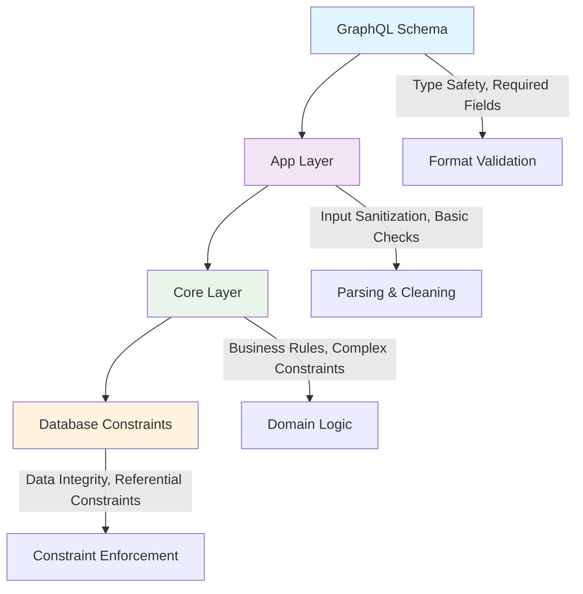

# Validation Patterns

Comprehensive multi-layer validation strategies for FraiseQL applications that ensure data integrity, business rule compliance, and user-friendly error handling.

## Overview

FraiseQL implements a **four-layer validation architecture** that provides comprehensive data validation and business rule enforcement. Each layer has specific responsibilities and works together to create a robust validation system.

### Validation Architecture



### Layer Responsibilities

| Layer | Purpose | Examples | Error Type |
|-------|---------|----------|------------|
| **GraphQL Schema** | Type safety, nullability, basic format | Email format, string length, required fields | `ValidationError` |
| **App Layer** | Input sanitization, JSONB parsing, preliminary checks | Trim whitespace, normalize email, validate JSON structure | `ValidationError` |
| **Core Layer** | Business logic validation, cross-entity constraints | User limits, domain restrictions, state transitions | `BusinessRuleError` |
| **Database** | Data integrity, foreign keys, unique constraints | Primary keys, foreign keys, check constraints | `ConstraintViolationError` |

### Validation Philosophy

**Defense in Depth**: Multiple validation layers ensure that invalid data cannot reach the database, while each layer focuses on its specific concerns.

**Fail Fast**: Validate the most common failure cases first to minimize resource usage and provide quick feedback.

**Rich Error Context**: Each validation layer provides detailed error information for debugging and user feedback.

**Performance Optimization**: Validation is ordered by computational cost, with expensive business rule checks performed last.

## GraphQL Schema Validation

The first validation layer uses GraphQL's type system and custom validators to ensure type safety and basic format validation.

### Type-Based Validation

```python
from typing import Optional, Annotated
from pydantic import Field, EmailStr, validator, root_validator
from decimal import Decimal
from datetime import date
import re

@fraiseql.input
class CreateUserInput:
    """User creation input with built-in validation."""

    # Required fields with type validation
    email: EmailStr  # Built-in email format validation
    name: Annotated[str, Field(min_length=2, max_length=100)]

    # Optional fields with constraints
    bio: Optional[Annotated[str, Field(max_length=1000)]] = None
    phone: Optional[Annotated[str, Field(pattern=r'^\+?[\d\s\-\(\)]+$')]] = None

    # Custom validation methods
    @validator('name')
    def validate_name(cls, v):
        if not v.strip():
            raise ValueError('Name cannot be empty or only whitespace')
        if any(char in v for char in '<>{}[]'):
            raise ValueError('Name contains invalid characters')
        return v.strip()

    @validator('phone')
    def validate_phone(cls, v):
        if v is None:
            return v
        # Remove all non-digits for length check
        digits_only = re.sub(r'\D', '', v)
        if len(digits_only) < 10 or len(digits_only) > 15:
            raise ValueError('Phone number must be 10-15 digits')
        return v
```

### Complex Input Validation

```python
@fraiseql.input
class UpdateContractInput:
    """Contract update with conditional validation."""

    name: Optional[str] = None
    start_date: Optional[date] = None
    end_date: Optional[date] = None
    value: Optional[Annotated[Decimal, Field(ge=0, le=Decimal('999999.99'))]] = None
    status: Optional[str] = None

    @validator('status')
    def validate_status(cls, v):
        if v is not None:
            valid_statuses = ['draft', 'active', 'suspended', 'terminated']
            if v not in valid_statuses:
                raise ValueError(f'Status must be one of: {", ".join(valid_statuses)}')
        return v

    @root_validator
    def validate_date_range(cls, values):
        start_date = values.get('start_date')
        end_date = values.get('end_date')

        if start_date and end_date and start_date >= end_date:
            raise ValueError('Start date must be before end date')

        return values

    @root_validator
    def validate_status_transitions(cls, values):
        # If we're updating to terminated, end_date should be provided
        status = values.get('status')
        end_date = values.get('end_date')

        if status == 'terminated' and end_date is None:
            raise ValueError('End date is required when terminating a contract')

        return values
```

### Nested Object Validation

```python
@fraiseql.input
class ContractItemInput:
    """Contract item with product validation."""

    product_id: UUID
    quantity: Annotated[int, Field(gt=0, le=10000)]
    unit_price: Annotated[Decimal, Field(gt=0, le=Decimal('99999.99'))]
    description: Optional[str] = None

    @validator('description')
    def validate_description(cls, v):
        if v is not None:
            v = v.strip()
            if len(v) > 500:
                raise ValueError('Description must be 500 characters or less')
        return v

@fraiseql.input
class CreateContractWithItemsInput:
    """Contract creation with embedded items."""

    name: Annotated[str, Field(min_length=2, max_length=200)]
    start_date: date
    end_date: date
    items: list[ContractItemInput] = Field(min_items=1, max_items=100)

    @root_validator
    def validate_contract_consistency(cls, values):
        start_date = values.get('start_date')
        end_date = values.get('end_date')
        items = values.get('items', [])

        # Date validation
        if start_date and end_date and start_date >= end_date:
            raise ValueError('Start date must be before end date')

        # Items validation
        if not items:
            raise ValueError('At least one contract item is required')

        # Duplicate product check
        product_ids = [item.product_id for item in items]
        if len(product_ids) != len(set(product_ids)):
            raise ValueError('Duplicate products are not allowed')

        return values
```

## App Layer Validation

The app layer handles input sanitization, JSONB parsing, and preliminary business rule checks.

### Input Sanitization and Parsing

```sql
-- App layer: Input sanitization and basic validation
CREATE OR REPLACE FUNCTION app.create_user(
    input_pk_organization UUID,
    input_created_by UUID,
    input_payload JSONB
) RETURNS app.mutation_result AS $$
DECLARE
    v_input app.type_user_input;
    v_validation_errors JSONB := '{}'::JSONB;
    v_sanitized_input JSONB;
BEGIN
    -- Parse and validate JSONB structure
    BEGIN
        v_input := jsonb_populate_record(NULL::app.type_user_input, input_payload);

        -- Sanitize input for security
        v_sanitized_input := core.sanitize_jsonb_input(input_payload);

    EXCEPTION WHEN OTHERS THEN
        RETURN core.log_and_return_mutation(
            input_pk_organization,
            input_created_by,
            'user',
            NULL,
            'NOOP',
            'noop:invalid_input',
            ARRAY[]::TEXT[],
            'Invalid input format: ' || SQLERRM,
            NULL,
            NULL,
            jsonb_build_object(
                'trigger', 'api_create',
                'validation_layer', 'app',
                'error_type', 'json_parse_error',
                'raw_input', input_payload
            )
        );
    END;

    -- Required field validation with detailed messages
    IF v_input.email IS NULL OR length(trim(v_input.email)) = 0 THEN
        v_validation_errors := v_validation_errors ||
            jsonb_build_object('email', 'Email is required and cannot be empty');
    END IF;

    IF v_input.name IS NULL OR length(trim(v_input.name)) = 0 THEN
        v_validation_errors := v_validation_errors ||
            jsonb_build_object('name', 'Name is required and cannot be empty');
    END IF;

    -- Format validation with specific error messages
    IF v_input.email IS NOT NULL AND NOT v_input.email ~ '^[A-Za-z0-9._%+-]+@[A-Za-z0-9.-]+\.[A-Z|a-z]{2,}$' THEN
        v_validation_errors := v_validation_errors ||
            jsonb_build_object('email', 'Email address format is invalid');
    END IF;

    -- Length validation
    IF v_input.name IS NOT NULL AND length(v_input.name) > 100 THEN
        v_validation_errors := v_validation_errors ||
            jsonb_build_object('name', 'Name must be 100 characters or less');
    END IF;

    IF v_input.bio IS NOT NULL AND length(v_input.bio) > 1000 THEN
        v_validation_errors := v_validation_errors ||
            jsonb_build_object('bio', 'Bio must be 1000 characters or less');
    END IF;

    -- Phone number validation
    IF v_input.phone IS NOT NULL THEN
        DECLARE
            v_phone_digits TEXT;
        BEGIN
            v_phone_digits := regexp_replace(v_input.phone, '[^\d]', '', 'g');
            IF length(v_phone_digits) < 10 OR length(v_phone_digits) > 15 THEN
                v_validation_errors := v_validation_errors ||
                    jsonb_build_object('phone', 'Phone number must contain 10-15 digits');
            END IF;
        END;
    END IF;

    -- Return field validation errors if any
    IF jsonb_object_keys(v_validation_errors) IS NOT NULL THEN
        RETURN core.log_and_return_mutation(
            input_pk_organization,
            input_created_by,
            'user',
            NULL,
            'NOOP',
            'noop:validation_failed',
            ARRAY[]::TEXT[],
            'Input validation failed',
            NULL,
            NULL,
            jsonb_build_object(
                'trigger', 'api_create',
                'validation_layer', 'app',
                'validation_type', 'field_validation',
                'field_errors', v_validation_errors,
                'validated_input', row_to_json(v_input)
            )
        );
    END IF;

    -- Input sanitization
    v_input.name := trim(v_input.name);
    v_input.email := lower(trim(v_input.email));
    v_input.bio := CASE
        WHEN v_input.bio IS NOT NULL THEN trim(v_input.bio)
        ELSE NULL
    END;
    v_input.phone := CASE
        WHEN v_input.phone IS NOT NULL THEN trim(v_input.phone)
        ELSE NULL
    END;

    -- Delegate to core layer with sanitized input
    RETURN core.create_user(
        input_pk_organization,
        input_created_by,
        v_input,
        v_sanitized_input
    );
END;
$$ LANGUAGE plpgsql SECURITY DEFINER;
```

### Input Sanitization Helper

```sql
-- Helper function for input sanitization
CREATE OR REPLACE FUNCTION core.sanitize_jsonb_input(
    input_payload JSONB
) RETURNS JSONB AS $$
DECLARE
    v_sanitized JSONB;
    v_key TEXT;
    v_value TEXT;
BEGIN
    v_sanitized := '{}'::JSONB;

    -- Iterate through all keys in the input
    FOR v_key IN SELECT jsonb_object_keys(input_payload)
    LOOP
        -- Get the value as text for sanitization
        v_value := input_payload ->> v_key;

        -- Skip null values
        IF v_value IS NULL THEN
            v_sanitized := v_sanitized || jsonb_build_object(v_key, NULL);
            CONTINUE;
        END IF;

        -- Sanitize common attack vectors
        v_value := replace(v_value, '<script', '&lt;script');
        v_value := replace(v_value, '</script>', '&lt;/script&gt;');
        v_value := replace(v_value, 'javascript:', '');
        v_value := replace(v_value, 'data:text/html', '');

        -- Trim whitespace for string fields
        IF v_key IN ('name', 'email', 'bio', 'phone', 'description') THEN
            v_value := trim(v_value);
        END IF;

        -- Normalize email to lowercase
        IF v_key = 'email' THEN
            v_value := lower(v_value);
        END IF;

        v_sanitized := v_sanitized || jsonb_build_object(v_key, v_value);
    END LOOP;

    RETURN v_sanitized;
END;
$$ LANGUAGE plpgsql IMMUTABLE;

-- Comprehensive batch validation for multiple fields
CREATE OR REPLACE FUNCTION app.validate_contract_fields(
    input_payload JSONB
) RETURNS TABLE(
    field_name TEXT,
    error_message TEXT,
    error_code TEXT
) AS $$
DECLARE
    v_name TEXT;
    v_start_date DATE;
    v_end_date DATE;
    v_value DECIMAL;
BEGIN
    -- Extract fields for validation
    v_name := input_payload->>'name';
    v_start_date := (input_payload->>'start_date')::DATE;
    v_end_date := (input_payload->>'end_date')::DATE;
    v_value := (input_payload->>'value')::DECIMAL;

    -- Name validation
    IF v_name IS NULL OR length(trim(v_name)) = 0 THEN
        field_name := 'name';
        error_message := 'Contract name is required';
        error_code := 'REQUIRED_FIELD';
        RETURN NEXT;
    ELSIF length(v_name) > 200 THEN
        field_name := 'name';
        error_message := 'Contract name must be 200 characters or less';
        error_code := 'LENGTH_EXCEEDED';
        RETURN NEXT;
    END IF;

    -- Date validation
    IF v_start_date IS NULL THEN
        field_name := 'start_date';
        error_message := 'Contract start date is required';
        error_code := 'REQUIRED_FIELD';
        RETURN NEXT;
    END IF;

    IF v_end_date IS NULL THEN
        field_name := 'end_date';
        error_message := 'Contract end date is required';
        error_code := 'REQUIRED_FIELD';
        RETURN NEXT;
    END IF;

    -- Date range validation
    IF v_start_date IS NOT NULL AND v_end_date IS NOT NULL THEN
        IF v_start_date >= v_end_date THEN
            field_name := 'end_date';
            error_message := 'End date must be after start date';
            error_code := 'INVALID_DATE_RANGE';
            RETURN NEXT;
        END IF;

        -- Business rule: contract cannot be longer than 10 years
        IF v_end_date - v_start_date > INTERVAL '10 years' THEN
            field_name := 'end_date';
            error_message := 'Contract duration cannot exceed 10 years';
            error_code := 'DURATION_EXCEEDED';
            RETURN NEXT;
        END IF;
    END IF;

    -- Value validation
    IF v_value IS NOT NULL THEN
        IF v_value <= 0 THEN
            field_name := 'value';
            error_message := 'Contract value must be positive';
            error_code := 'INVALID_VALUE';
            RETURN NEXT;
        ELSIF v_value > 999999.99 THEN
            field_name := 'value';
            error_message := 'Contract value cannot exceed $999,999.99';
            error_code := 'VALUE_EXCEEDED';
            RETURN NEXT;
        END IF;
    END IF;

    -- No validation errors found
    RETURN;
END;
$$ LANGUAGE plpgsql STABLE;
```

## Core Layer Business Validation

The core layer implements complex business rules, state transition validation, and domain-specific constraints.

### Business Rule Validation

```sql
-- Core layer: Business logic validation
CREATE OR REPLACE FUNCTION core.create_user(
    input_pk_organization UUID,
    input_created_by UUID,
    input_data app.type_user_input,
    input_payload JSONB
) RETURNS app.mutation_result AS $$
DECLARE
    v_org_settings JSONB;
    v_user_count INTEGER;
    v_domain_allowed BOOLEAN;
    v_email_domain TEXT;
    v_validation_context JSONB;
    v_creator_permissions JSONB;
BEGIN
    -- Get organization settings for business rule validation
    SELECT data INTO v_org_settings
    FROM tenant.tb_organization
    WHERE pk_organization = input_pk_organization;

    -- Get creator permissions for authorization checks
    SELECT data INTO v_creator_permissions
    FROM tenant.tb_user
    WHERE pk_user = input_created_by;

    v_validation_context := jsonb_build_object(
        'trigger', 'api_create',
        'validation_layer', 'core',
        'organization_settings', v_org_settings,
        'creator_permissions', v_creator_permissions
    );

    -- Business Rule 1: Organization user limit check
    SELECT COUNT(*) INTO v_user_count
    FROM tenant.tb_user
    WHERE fk_customer_org = input_pk_organization
    AND deleted_at IS NULL;

    IF (v_org_settings->>'max_users')::INTEGER IS NOT NULL
       AND v_user_count >= (v_org_settings->>'max_users')::INTEGER THEN
        RETURN core.log_and_return_mutation(
            input_pk_organization,
            input_created_by,
            'user',
            NULL,
            'NOOP',
            'noop:business_rule_user_limit',
            ARRAY[]::TEXT[],
            format('Organization has reached maximum user limit of %s',
                   v_org_settings->>'max_users'),
            NULL,
            NULL,
            v_validation_context || jsonb_build_object(
                'business_rule', 'max_users_exceeded',
                'current_count', v_user_count,
                'max_allowed', (v_org_settings->>'max_users')::INTEGER
            )
        );
    END IF;

    -- Business Rule 2: Email domain restriction validation
    v_email_domain := split_part(input_data.email, '@', 2);

    IF v_org_settings->'allowed_email_domains' IS NOT NULL THEN
        SELECT v_email_domain = ANY(
            ARRAY(SELECT jsonb_array_elements_text(v_org_settings->'allowed_email_domains'))
        ) INTO v_domain_allowed;

        IF NOT v_domain_allowed THEN
            RETURN core.log_and_return_mutation(
                input_pk_organization,
                input_created_by,
                'user',
                NULL,
                'NOOP',
                'noop:business_rule_email_domain',
                ARRAY[]::TEXT[],
                format('Email domain %s is not allowed for this organization', v_email_domain),
                NULL,
                NULL,
                v_validation_context || jsonb_build_object(
                    'business_rule', 'email_domain_restricted',
                    'attempted_domain', v_email_domain,
                    'allowed_domains', v_org_settings->'allowed_email_domains'
                )
            );
        END IF;
    END IF;

    -- Business Rule 3: Duplicate prevention with idempotent response
    DECLARE
        v_existing_user_id UUID;
        v_existing_user JSONB;
    BEGIN
        SELECT pk_user INTO v_existing_user_id
        FROM tenant.tb_user
        WHERE fk_customer_org = input_pk_organization
        AND data->>'email' = input_data.email
        AND deleted_at IS NULL;

        IF v_existing_user_id IS NOT NULL THEN
            -- Get user data from cached view for performance
            SELECT data INTO v_existing_user
            FROM public.tv_user
            WHERE tenant_id = input_pk_organization
            AND id = v_existing_user_id;

            RETURN core.log_and_return_mutation(
                input_pk_organization,
                input_created_by,
                'user',
                v_existing_user_id,
                'NOOP',
                'noop:already_exists',
                ARRAY[]::TEXT[],
                'User with this email already exists',
                v_existing_user,
                v_existing_user,
                v_validation_context || jsonb_build_object(
                    'business_rule', 'unique_email',
                    'existing_user_id', v_existing_user_id,
                    'existing_email', input_data.email
                )
            );
        END IF;
    END;

    -- Business Rule 4: Role creation permission validation
    DECLARE
        v_creator_role TEXT;
        v_requested_role TEXT;
    BEGIN
        v_creator_role := v_creator_permissions->>'role';
        v_requested_role := COALESCE(input_data.role, 'user');

        -- Only admins can create admin users
        IF v_requested_role = 'admin' AND v_creator_role != 'admin' THEN
            RETURN core.log_and_return_mutation(
                input_pk_organization,
                input_created_by,
                'user',
                NULL,
                'NOOP',
                'noop:business_rule_insufficient_permissions',
                ARRAY[]::TEXT[],
                'Only administrators can create admin users',
                NULL,
                NULL,
                v_validation_context || jsonb_build_object(
                    'business_rule', 'role_creation_permission',
                    'creator_role', v_creator_role,
                    'requested_role', v_requested_role
                )
            );
        END IF;

        -- Managers can only create users and viewers
        IF v_creator_role = 'manager' AND v_requested_role NOT IN ('user', 'viewer') THEN
            RETURN core.log_and_return_mutation(
                input_pk_organization,
                input_created_by,
                'user',
                NULL,
                'NOOP',
                'noop:business_rule_insufficient_permissions',
                ARRAY[]::TEXT[],
                'Managers can only create users and viewers',
                NULL,
                NULL,
                v_validation_context || jsonb_build_object(
                    'business_rule', 'manager_role_limitation',
                    'creator_role', v_creator_role,
                    'requested_role', v_requested_role
                )
            );
        END IF;
    END;

    -- Business Rule 5: Organization subscription level validation
    DECLARE
        v_subscription_level TEXT;
        v_feature_allowed BOOLEAN := TRUE;
    BEGIN
        v_subscription_level := v_org_settings->>'subscription_level';

        -- Premium features only for paid subscriptions
        IF v_requested_role IN ('admin', 'manager')
           AND v_subscription_level = 'free' THEN
            v_feature_allowed := FALSE;
        END IF;

        IF NOT v_feature_allowed THEN
            RETURN core.log_and_return_mutation(
                input_pk_organization,
                input_created_by,
                'user',
                NULL,
                'NOOP',
                'noop:business_rule_subscription_limitation',
                ARRAY[]::TEXT[],
                format('Creating %s users requires a paid subscription', v_requested_role),
                NULL,
                NULL,
                v_validation_context || jsonb_build_object(
                    'business_rule', 'subscription_feature_gate',
                    'subscription_level', v_subscription_level,
                    'required_level', 'paid',
                    'requested_role', v_requested_role
                )
            );
        END IF;
    END;

    -- All business rules passed, proceed with user creation
    DECLARE
        v_user_id UUID;
        v_payload_after JSONB;
        v_user_data JSONB;
    BEGIN
        -- Build complete user data object
        v_user_data := jsonb_build_object(
            'email', input_data.email,
            'name', input_data.name,
            'bio', input_data.bio,
            'phone', input_data.phone,
            'role', COALESCE(input_data.role, 'user'),
            'status', 'active',
            'email_verified', false,
            'created_via', 'api',
            'onboarding_completed', false
        );

        -- Insert new user
        INSERT INTO tenant.tb_user (
            pk_user,
            pk_organization,
            fk_customer_org,
            data,
            created_at,
            created_by,
            updated_at,
            updated_by
        ) VALUES (
            gen_random_uuid(),
            input_pk_organization,
            input_pk_organization,
            v_user_data,
            NOW(),
            input_created_by,
            NOW(),
            input_created_by
        ) RETURNING pk_user INTO v_user_id;

        -- Refresh related caches
        PERFORM app.refresh_user_cache(v_user_id);
        PERFORM app.refresh_organization_user_count_cache(input_pk_organization);

        -- Get complete user data from view
        SELECT data INTO v_payload_after
        FROM public.tv_user
        WHERE tenant_id = input_pk_organization
        AND id = v_user_id;

        RETURN core.log_and_return_mutation(
            input_pk_organization,
            input_created_by,
            'user',
            v_user_id,
            'INSERT',
            'new',
            ARRAY['email', 'name', 'bio', 'phone', 'role', 'status'],
            'User created successfully',
            NULL,
            v_payload_after,
            v_validation_context || jsonb_build_object(
                'business_rules_passed', ARRAY[
                    'user_limit_check',
                    'email_domain_check',
                    'duplicate_check',
                    'role_permission_check',
                    'subscription_level_check'
                ],
                'user_created', true
            )
        );
    END;
END;
$$ LANGUAGE plpgsql;
```

### State Transition Validation

```sql
-- State transition validation for contracts
CREATE OR REPLACE FUNCTION core.validate_contract_state_transition(
    input_current_status TEXT,
    input_new_status TEXT,
    input_user_role TEXT,
    input_contract_data JSONB
) RETURNS TABLE(
    is_valid BOOLEAN,
    error_message TEXT,
    required_role TEXT
) AS $$
BEGIN
    -- Define valid state transitions
    CASE
        WHEN input_current_status = 'draft' THEN
            -- Draft contracts can transition to active or cancelled
            IF input_new_status = 'active' THEN
                -- Only admins and managers can activate contracts
                IF input_user_role NOT IN ('admin', 'manager') THEN
                    is_valid := FALSE;
                    error_message := 'Only administrators and managers can activate contracts';
                    required_role := 'admin,manager';
                ELSE
                    is_valid := TRUE;
                    error_message := NULL;
                    required_role := NULL;
                END IF;
            ELSIF input_new_status = 'cancelled' THEN
                is_valid := TRUE;  -- Anyone can cancel a draft
                error_message := NULL;
                required_role := NULL;
            ELSE
                is_valid := FALSE;
                error_message := format('Invalid transition from %s to %s',
                                       input_current_status, input_new_status);
                required_role := NULL;
            END IF;

        WHEN input_current_status = 'active' THEN
            -- Active contracts can be suspended or terminated
            IF input_new_status IN ('suspended', 'terminated') THEN
                -- Only admins can suspend or terminate active contracts
                IF input_user_role != 'admin' THEN
                    is_valid := FALSE;
                    error_message := format('Only administrators can %s active contracts',
                                           input_new_status);
                    required_role := 'admin';
                ELSE
                    is_valid := TRUE;
                    error_message := NULL;
                    required_role := NULL;
                END IF;
            ELSE
                is_valid := FALSE;
                error_message := format('Invalid transition from %s to %s',
                                       input_current_status, input_new_status);
                required_role := NULL;
            END IF;

        WHEN input_current_status = 'suspended' THEN
            -- Suspended contracts can be reactivated or terminated
            IF input_new_status = 'active' THEN
                -- Admins and managers can reactivate
                IF input_user_role NOT IN ('admin', 'manager') THEN
                    is_valid := FALSE;
                    error_message := 'Only administrators and managers can reactivate contracts';
                    required_role := 'admin,manager';
                ELSE
                    is_valid := TRUE;
                    error_message := NULL;
                    required_role := NULL;
                END IF;
            ELSIF input_new_status = 'terminated' THEN
                -- Only admins can terminate suspended contracts
                IF input_user_role != 'admin' THEN
                    is_valid := FALSE;
                    error_message := 'Only administrators can terminate contracts';
                    required_role := 'admin';
                ELSE
                    is_valid := TRUE;
                    error_message := NULL;
                    required_role := NULL;
                END IF;
            ELSE
                is_valid := FALSE;
                error_message := format('Invalid transition from %s to %s',
                                       input_current_status, input_new_status);
                required_role := NULL;
            END IF;

        WHEN input_current_status = 'terminated' THEN
            -- Terminated contracts cannot transition to any other state
            is_valid := FALSE;
            error_message := 'Terminated contracts cannot be modified';
            required_role := NULL;

        WHEN input_current_status = 'cancelled' THEN
            -- Cancelled contracts cannot transition to any other state
            is_valid := FALSE;
            error_message := 'Cancelled contracts cannot be modified';
            required_role := NULL;

        ELSE
            -- Unknown status
            is_valid := FALSE;
            error_message := format('Unknown contract status: %s', input_current_status);
            required_role := NULL;
    END CASE;

    RETURN NEXT;
END;
$$ LANGUAGE plpgsql STABLE;
```

### Complex Domain Validation

```sql
-- Domain-specific validation for contract values and terms
CREATE OR REPLACE FUNCTION core.validate_contract_business_rules(
    input_contract_data JSONB,
    input_organization_settings JSONB
) RETURNS TABLE(
    rule_name TEXT,
    is_valid BOOLEAN,
    error_message TEXT,
    severity TEXT
) AS $$
DECLARE
    v_contract_value DECIMAL;
    v_start_date DATE;
    v_end_date DATE;
    v_contract_duration INTEGER;
    v_payment_terms TEXT;
    v_max_contract_value DECIMAL;
    v_min_contract_duration INTEGER;
    v_max_contract_duration INTEGER;
BEGIN
    -- Extract contract data
    v_contract_value := (input_contract_data->>'value')::DECIMAL;
    v_start_date := (input_contract_data->>'start_date')::DATE;
    v_end_date := (input_contract_data->>'end_date')::DATE;
    v_payment_terms := input_contract_data->>'payment_terms';
    v_contract_duration := v_end_date - v_start_date;

    -- Extract organization limits
    v_max_contract_value := (input_organization_settings->>'max_contract_value')::DECIMAL;
    v_min_contract_duration := (input_organization_settings->>'min_contract_duration_days')::INTEGER;
    v_max_contract_duration := (input_organization_settings->>'max_contract_duration_days')::INTEGER;

    -- Rule 1: Contract value limits
    rule_name := 'contract_value_limit';
    IF v_contract_value IS NOT NULL AND v_max_contract_value IS NOT NULL THEN
        IF v_contract_value > v_max_contract_value THEN
            is_valid := FALSE;
            error_message := format('Contract value $%s exceeds organization limit of $%s',
                                   v_contract_value, v_max_contract_value);
            severity := 'error';
        ELSE
            is_valid := TRUE;
            error_message := NULL;
            severity := 'info';
        END IF;
    ELSE
        is_valid := TRUE;
        error_message := NULL;
        severity := 'info';
    END IF;
    RETURN NEXT;

    -- Rule 2: Contract duration limits
    rule_name := 'contract_duration_limit';
    IF v_min_contract_duration IS NOT NULL AND v_contract_duration < v_min_contract_duration THEN
        is_valid := FALSE;
        error_message := format('Contract duration %s days is below minimum of %s days',
                               v_contract_duration, v_min_contract_duration);
        severity := 'error';
    ELSIF v_max_contract_duration IS NOT NULL AND v_contract_duration > v_max_contract_duration THEN
        is_valid := FALSE;
        error_message := format('Contract duration %s days exceeds maximum of %s days',
                               v_contract_duration, v_max_contract_duration);
        severity := 'error';
    ELSE
        is_valid := TRUE;
        error_message := NULL;
        severity := 'info';
    END IF;
    RETURN NEXT;

    -- Rule 3: Payment terms validation
    rule_name := 'payment_terms_validation';
    IF v_payment_terms IS NOT NULL THEN
        IF v_payment_terms NOT IN ('net_30', 'net_60', 'immediate', 'milestone') THEN
            is_valid := FALSE;
            error_message := format('Invalid payment terms: %s', v_payment_terms);
            severity := 'error';
        ELSE
            is_valid := TRUE;
            error_message := NULL;
            severity := 'info';
        END IF;
    ELSE
        is_valid := TRUE;
        error_message := NULL;
        severity := 'info';
    END IF;
    RETURN NEXT;

    -- Rule 4: Start date business rules
    rule_name := 'start_date_business_rules';
    IF v_start_date IS NOT NULL THEN
        -- Cannot start contracts in the past (more than 1 day ago)
        IF v_start_date < CURRENT_DATE - INTERVAL '1 day' THEN
            is_valid := FALSE;
            error_message := 'Contract start date cannot be in the past';
            severity := 'error';
        -- Warning for contracts starting too far in the future
        ELSIF v_start_date > CURRENT_DATE + INTERVAL '1 year' THEN
            is_valid := TRUE;
            error_message := 'Contract start date is more than 1 year in the future';
            severity := 'warning';
        ELSE
            is_valid := TRUE;
            error_message := NULL;
            severity := 'info';
        END IF;
    ELSE
        is_valid := TRUE;
        error_message := NULL;
        severity := 'info';
    END IF;
    RETURN NEXT;

    -- Rule 5: Value-duration consistency check
    rule_name := 'value_duration_consistency';
    IF v_contract_value IS NOT NULL AND v_contract_duration IS NOT NULL THEN
        DECLARE
            v_daily_value DECIMAL;
        BEGIN
            v_daily_value := v_contract_value / v_contract_duration;

            -- Very high daily value might indicate an error
            IF v_daily_value > 1000 THEN
                is_valid := TRUE;
                error_message := format('High daily contract value: $%s per day',
                                       round(v_daily_value, 2));
                severity := 'warning';
            -- Very low daily value might indicate an error
            ELSIF v_daily_value < 1 THEN
                is_valid := TRUE;
                error_message := format('Low daily contract value: $%s per day',
                                       round(v_daily_value, 2));
                severity := 'warning';
            ELSE
                is_valid := TRUE;
                error_message := NULL;
                severity := 'info';
            END IF;
        END;
    ELSE
        is_valid := TRUE;
        error_message := NULL;
        severity := 'info';
    END IF;
    RETURN NEXT;
END;
$$ LANGUAGE plpgsql STABLE;
```

## Database Constraint Validation

The database layer provides the final validation through constraints, foreign keys, and triggers.

### Data Integrity Constraints

```sql
-- Database constraints for data integrity
ALTER TABLE tenant.tb_user
ADD CONSTRAINT chk_user_email_format
CHECK (data->>'email' ~ '^[A-Za-z0-9._%+-]+@[A-Za-z0-9.-]+\.[A-Z|a-z]{2,}$');

ALTER TABLE tenant.tb_user
ADD CONSTRAINT chk_user_name_length
CHECK (length(data->>'name') >= 2 AND length(data->>'name') <= 100);

ALTER TABLE tenant.tb_user
ADD CONSTRAINT chk_user_role_valid
CHECK (data->>'role' IN ('user', 'admin', 'manager', 'viewer'));

ALTER TABLE tenant.tb_user
ADD CONSTRAINT chk_user_status_valid
CHECK (data->>'status' IN ('active', 'inactive', 'pending', 'suspended'));

-- Contract constraints
ALTER TABLE tenant.tb_contract
ADD CONSTRAINT chk_contract_dates_valid
CHECK ((data->>'start_date')::DATE < (data->>'end_date')::DATE);

ALTER TABLE tenant.tb_contract
ADD CONSTRAINT chk_contract_value_positive
CHECK ((data->>'value')::DECIMAL > 0);

ALTER TABLE tenant.tb_contract
ADD CONSTRAINT chk_contract_status_valid
CHECK (data->>'status' IN ('draft', 'active', 'suspended', 'terminated', 'cancelled'));

-- Unique constraint on email per organization
CREATE UNIQUE INDEX uq_user_email_per_org
ON tenant.tb_user (fk_customer_org, (data->>'email'))
WHERE deleted_at IS NULL;

-- Unique constraint on contract identifier per organization
CREATE UNIQUE INDEX uq_contract_identifier_per_org
ON tenant.tb_contract (pk_organization, (data->>'identifier'))
WHERE deleted_at IS NULL;
```

### Foreign Key Constraints

```sql
-- Foreign key constraints for referential integrity
ALTER TABLE tenant.tb_user
ADD CONSTRAINT fk_user_organization
FOREIGN KEY (fk_customer_org) REFERENCES tenant.tb_organization(pk_organization);

ALTER TABLE tenant.tb_user
ADD CONSTRAINT fk_user_created_by
FOREIGN KEY (created_by) REFERENCES tenant.tb_user(pk_user);

ALTER TABLE tenant.tb_contract
ADD CONSTRAINT fk_contract_organization
FOREIGN KEY (pk_organization) REFERENCES tenant.tb_organization(pk_organization);

ALTER TABLE tenant.tb_contract
ADD CONSTRAINT fk_contract_created_by
FOREIGN KEY (created_by) REFERENCES tenant.tb_user(pk_user);

ALTER TABLE tenant.tb_contract_item
ADD CONSTRAINT fk_contract_item_contract
FOREIGN KEY (fk_contract) REFERENCES tenant.tb_contract(pk_contract);

ALTER TABLE tenant.tb_contract_item
ADD CONSTRAINT fk_contract_item_product
FOREIGN KEY (fk_product) REFERENCES tenant.tb_product(pk_product);
```

### Validation Triggers

```sql
-- Trigger to validate complex business rules at database level
CREATE OR REPLACE FUNCTION tenant.validate_user_business_rules()
RETURNS TRIGGER AS $$
DECLARE
    v_user_count INTEGER;
    v_org_settings JSONB;
BEGIN
    -- Only validate on INSERT and significant UPDATEs
    IF TG_OP = 'UPDATE' AND OLD.data = NEW.data THEN
        RETURN NEW;
    END IF;

    -- Get organization settings
    SELECT data INTO v_org_settings
    FROM tenant.tb_organization
    WHERE pk_organization = NEW.fk_customer_org;

    -- Check user limit constraint
    IF TG_OP = 'INSERT' THEN
        SELECT COUNT(*) INTO v_user_count
        FROM tenant.tb_user
        WHERE fk_customer_org = NEW.fk_customer_org
        AND deleted_at IS NULL;

        IF (v_org_settings->>'max_users')::INTEGER IS NOT NULL
           AND v_user_count >= (v_org_settings->>'max_users')::INTEGER THEN
            RAISE EXCEPTION 'Organization user limit exceeded: % users allowed, % current',
                (v_org_settings->>'max_users')::INTEGER, v_user_count;
        END IF;
    END IF;

    RETURN NEW;
END;
$$ LANGUAGE plpgsql;

CREATE TRIGGER trigger_validate_user_business_rules
    BEFORE INSERT OR UPDATE ON tenant.tb_user
    FOR EACH ROW
    EXECUTE FUNCTION tenant.validate_user_business_rules();
```

## Validation Error Handling

Structured error responses provide clear feedback for each validation layer.

### Error Response Types

```python
from typing import Optional, Any
from fraiseql import failure

@fraiseql.failure
class ValidationError:
    """Comprehensive validation error response."""
    message: str
    error_code: str = "VALIDATION_ERROR"

    # Field-specific errors
    field_errors: Optional[dict[str, str]] = None

    # Validation metadata
    validation_layer: str  # 'graphql', 'app', 'core', 'database'
    failed_rules: Optional[list[str]] = None

    # Context for debugging
    validation_context: Optional[dict[str, Any]] = None

@fraiseql.failure
class BusinessRuleError:
    """Business rule validation error."""
    message: str
    error_code: str = "BUSINESS_RULE_ERROR"

    # Business rule details
    rule_name: str
    rule_description: Optional[str] = None

    # Required permissions or conditions
    required_role: Optional[str] = None
    required_subscription: Optional[str] = None

    # Current state information
    current_state: Optional[dict[str, Any]] = None

@fraiseql.failure
class ConstraintViolationError:
    """Database constraint violation error."""
    message: str
    error_code: str = "CONSTRAINT_VIOLATION"

    # Constraint details
    constraint_name: str
    constraint_type: str  # 'foreign_key', 'unique', 'check', 'not_null'

    # Related entity information
    conflicting_entity: Optional[dict[str, Any]] = None

    # Resolution suggestions
    resolution_hint: Optional[str] = None
```

### Error Mapping in Mutations

```python
@fraiseql.mutation
async def create_user(
    info: GraphQLResolveInfo,
    input: CreateUserInput
) -> CreateUserSuccess | ValidationError | BusinessRuleError | ConstraintViolationError:
    """Create user with comprehensive validation error handling."""

    db = info.context["db"]
    user_id = info.context.get("user_id")
    tenant_id = info.context.get("tenant_id")

    try:
        result = await db.call_function(
            "app.create_user",
            input_pk_organization=tenant_id,
            input_created_by=user_id,
            input_payload=input.to_dict()
        )

        status = result.get("status", "")
        metadata = result.get("extra_metadata", {})

        if status == "new":
            return CreateUserSuccess(
                user=User.from_dict(result["object_data"]),
                message=result["message"]
            )

        elif status.startswith("noop:validation_") or status.startswith("noop:business_rule_"):
            # Map validation NOOPs to appropriate error types
            validation_layer = metadata.get("validation_layer", "unknown")

            if "business_rule" in metadata:
                return BusinessRuleError(
                    message=result["message"],
                    rule_name=metadata["business_rule"],
                    rule_description=metadata.get("rule_description"),
                    required_role=metadata.get("required_role"),
                    required_subscription=metadata.get("required_subscription"),
                    current_state=metadata.get("current_state")
                )
            else:
                return ValidationError(
                    message=result["message"],
                    validation_layer=validation_layer,
                    field_errors=metadata.get("field_errors"),
                    failed_rules=metadata.get("failed_rules"),
                    validation_context=metadata
                )

        elif status.startswith("noop:"):
            # Other NOOPs become success with existing data
            return CreateUserNoop(
                existing_user=User.from_dict(result["object_data"]),
                message=result["message"],
                noop_reason=status.replace("noop:", "")
            )
        else:
            return CreateUserError(
                message=result.get("message", "User creation failed"),
                error_code="CREATION_FAILED"
            )

    except psycopg.IntegrityError as e:
        # Database constraint violations
        constraint_info = parse_constraint_error(str(e))

        return ConstraintViolationError(
            message=f"Data integrity violation: {constraint_info['message']}",
            constraint_name=constraint_info["constraint_name"],
            constraint_type=constraint_info["constraint_type"],
            conflicting_entity=constraint_info.get("conflicting_entity"),
            resolution_hint=constraint_info.get("resolution_hint")
        )

    except psycopg.DatabaseError as e:
        # Other database errors
        return CreateUserError(
            message="Database error occurred",
            error_code="DATABASE_ERROR",
            technical_details=str(e) if info.context.get("show_technical_errors") else None
        )
```

### Error Parsing Utilities

```python
def parse_constraint_error(error_message: str) -> dict[str, Any]:
    """Parse PostgreSQL constraint error messages into structured information."""

    constraint_patterns = {
        'unique': r'duplicate key value violates unique constraint "([^"]+)"',
        'foreign_key': r'violates foreign key constraint "([^"]+)"',
        'check': r'violates check constraint "([^"]+)"',
        'not_null': r'null value in column "([^"]+)" violates not-null constraint'
    }

    for constraint_type, pattern in constraint_patterns.items():
        match = re.search(pattern, error_message)
        if match:
            constraint_name = match.group(1)

            # Generate user-friendly messages and hints
            if constraint_type == 'unique':
                if 'email' in constraint_name:
                    message = "This email address is already in use"
                    hint = "Please use a different email address or update the existing user"
                elif 'identifier' in constraint_name:
                    message = "This identifier is already in use"
                    hint = "Please choose a unique identifier"
                else:
                    message = "This value must be unique"
                    hint = "Please choose a different value"

            elif constraint_type == 'foreign_key':
                if 'organization' in constraint_name:
                    message = "Referenced organization does not exist"
                    hint = "Please ensure the organization ID is valid"
                elif 'user' in constraint_name:
                    message = "Referenced user does not exist"
                    hint = "Please ensure the user ID is valid"
                else:
                    message = "Referenced entity does not exist"
                    hint = "Please ensure all referenced IDs are valid"

            elif constraint_type == 'check':
                if 'email_format' in constraint_name:
                    message = "Email address format is invalid"
                    hint = "Please provide a valid email address"
                elif 'role_valid' in constraint_name:
                    message = "Invalid user role specified"
                    hint = "Please use a valid role: user, admin, manager, viewer"
                else:
                    message = "Value does not meet requirements"
                    hint = "Please check the field requirements"

            else:  # not_null
                field_name = match.group(1)
                message = f"Field '{field_name}' is required"
                hint = f"Please provide a value for {field_name}"

            return {
                "constraint_name": constraint_name,
                "constraint_type": constraint_type,
                "message": message,
                "resolution_hint": hint
            }

    # Fallback for unrecognized constraint errors
    return {
        "constraint_name": "unknown",
        "constraint_type": "unknown",
        "message": "Data validation failed",
        "resolution_hint": "Please check your input and try again"
    }

def extract_conflicting_entity(error_message: str, constraint_type: str) -> dict[str, Any] | None:
    """Extract information about conflicting entities from error messages."""

    if constraint_type == 'unique':
        # Try to extract the conflicting value
        value_match = re.search(r'Key \(([^)]+)\)=\(([^)]+)\)', error_message)
        if value_match:
            field = value_match.group(1)
            value = value_match.group(2)
            return {
                "field": field,
                "value": value,
                "type": "duplicate_value"
            }

    elif constraint_type == 'foreign_key':
        # Try to extract the missing key
        key_match = re.search(r'Key \(([^)]+)\)=\(([^)]+)\)', error_message)
        if key_match:
            field = key_match.group(1)
            value = key_match.group(2)
            return {
                "field": field,
                "value": value,
                "type": "missing_reference"
            }

    return None
```

## Cross-Entity Validation

Validating relationships and dependencies between multiple entities requires specialized patterns.

### Cross-Entity Relationship Validation

```sql
-- Cross-entity validation example: Contract with items
CREATE OR REPLACE FUNCTION core.validate_contract_items(
    input_contract_data JSONB,
    input_items JSONB[]
) RETURNS TABLE(
    is_valid BOOLEAN,
    error_message TEXT,
    failed_item_index INTEGER,
    error_code TEXT
) AS $$
DECLARE
    v_item JSONB;
    v_item_index INTEGER := 0;
    v_total_value DECIMAL := 0;
    v_contract_value DECIMAL;
    v_product_ids UUID[];
    v_missing_products UUID[];
    v_inactive_products UUID[];
    v_organization_id UUID;
BEGIN
    v_contract_value := (input_contract_data->>'total_value')::DECIMAL;
    v_organization_id := (input_contract_data->>'organization_id')::UUID;

    -- Collect all product IDs for batch validation
    SELECT ARRAY(
        SELECT (value->>'product_id')::UUID
        FROM unnest(input_items) AS value
    ) INTO v_product_ids;

    -- Batch validate product existence
    SELECT ARRAY(
        SELECT unnest(v_product_ids)
        EXCEPT
        SELECT pk_product
        FROM tenant.tb_product
        WHERE pk_product = ANY(v_product_ids)
        AND pk_organization = v_organization_id
        AND deleted_at IS NULL
    ) INTO v_missing_products;

    -- Batch validate product status
    SELECT ARRAY(
        SELECT pk_product
        FROM tenant.tb_product
        WHERE pk_product = ANY(v_product_ids)
        AND pk_organization = v_organization_id
        AND data->>'status' != 'active'
        AND deleted_at IS NULL
    ) INTO v_inactive_products;

    -- Check for missing products first
    IF array_length(v_missing_products, 1) > 0 THEN
        is_valid := FALSE;
        error_message := format('Products not found: %s', array_to_string(v_missing_products, ', '));
        failed_item_index := NULL;  -- Multiple items affected
        error_code := 'PRODUCT_NOT_FOUND';
        RETURN NEXT;
        RETURN;
    END IF;

    -- Check for inactive products
    IF array_length(v_inactive_products, 1) > 0 THEN
        is_valid := FALSE;
        error_message := format('Inactive products cannot be used: %s', array_to_string(v_inactive_products, ', '));
        failed_item_index := NULL;  -- Multiple items affected
        error_code := 'PRODUCT_INACTIVE';
        RETURN NEXT;
        RETURN;
    END IF;

    -- Validate each item in detail
    FOR v_item IN SELECT unnest(input_items)
    LOOP
        v_item_index := v_item_index + 1;

        -- Check quantity is positive and reasonable
        IF (v_item->>'quantity')::INTEGER <= 0 THEN
            is_valid := FALSE;
            error_message := 'Item quantity must be positive';
            failed_item_index := v_item_index;
            error_code := 'INVALID_QUANTITY';
            RETURN NEXT;
            RETURN;
        ELSIF (v_item->>'quantity')::INTEGER > 10000 THEN
            is_valid := FALSE;
            error_message := 'Item quantity exceeds maximum limit of 10,000';
            failed_item_index := v_item_index;
            error_code := 'QUANTITY_EXCEEDED';
            RETURN NEXT;
            RETURN;
        END IF;

        -- Check unit price is positive and reasonable
        IF (v_item->>'unit_price')::DECIMAL <= 0 THEN
            is_valid := FALSE;
            error_message := 'Item unit price must be positive';
            failed_item_index := v_item_index;
            error_code := 'INVALID_PRICE';
            RETURN NEXT;
            RETURN;
        ELSIF (v_item->>'unit_price')::DECIMAL > 99999.99 THEN
            is_valid := FALSE;
            error_message := 'Item unit price exceeds maximum limit of $99,999.99';
            failed_item_index := v_item_index;
            error_code := 'PRICE_EXCEEDED';
            RETURN NEXT;
            RETURN;
        END IF;

        -- Accumulate total value for contract consistency check
        v_total_value := v_total_value +
            ((v_item->>'quantity')::INTEGER * (v_item->>'unit_price')::DECIMAL);
    END LOOP;

    -- Validate total value matches contract value (within tolerance)
    IF v_contract_value IS NOT NULL AND ABS(v_total_value - v_contract_value) > 0.01 THEN
        is_valid := FALSE;
        error_message := format('Item total ($%s) does not match contract value ($%s)',
                               v_total_value, v_contract_value);
        failed_item_index := NULL;  -- Not specific to one item
        error_code := 'VALUE_MISMATCH';
        RETURN NEXT;
        RETURN;
    END IF;

    -- Check for duplicate products in the same contract
    IF (SELECT COUNT(*) FROM unnest(v_product_ids)) != (SELECT COUNT(DISTINCT unnest) FROM unnest(v_product_ids)) THEN
        is_valid := FALSE;
        error_message := 'Duplicate products are not allowed in the same contract';
        failed_item_index := NULL;
        error_code := 'DUPLICATE_PRODUCTS';
        RETURN NEXT;
        RETURN;
    END IF;

    -- All validations passed
    is_valid := TRUE;
    error_message := NULL;
    failed_item_index := NULL;
    error_code := 'VALIDATION_PASSED';
    RETURN NEXT;
END;
$$ LANGUAGE plpgsql STABLE;
```

### Dependency Chain Validation

```sql
-- Validate complex dependency chains
CREATE OR REPLACE FUNCTION core.validate_user_organization_dependencies(
    input_user_id UUID,
    input_organization_id UUID,
    input_new_role TEXT
) RETURNS TABLE(
    dependency_type TEXT,
    is_valid BOOLEAN,
    error_message TEXT,
    blocking_entities JSONB
) AS $$
DECLARE
    v_current_role TEXT;
    v_org_admin_count INTEGER;
    v_user_contracts JSONB[];
    v_active_sessions INTEGER;
BEGIN
    -- Get current user role
    SELECT data->>'role' INTO v_current_role
    FROM tenant.tb_user
    WHERE pk_user = input_user_id
    AND fk_customer_org = input_organization_id;

    -- Dependency 1: Organization must have at least one admin
    dependency_type := 'organization_admin_requirement';

    SELECT COUNT(*) INTO v_org_admin_count
    FROM tenant.tb_user
    WHERE fk_customer_org = input_organization_id
    AND data->>'role' = 'admin'
    AND deleted_at IS NULL
    AND pk_user != input_user_id;  -- Exclude current user

    IF v_current_role = 'admin' AND input_new_role != 'admin' AND v_org_admin_count = 0 THEN
        is_valid := FALSE;
        error_message := 'Cannot change role: organization must have at least one administrator';
        blocking_entities := jsonb_build_object(
            'current_admin_count', v_org_admin_count + 1,
            'required_admin_count', 1
        );
    ELSE
        is_valid := TRUE;
        error_message := NULL;
        blocking_entities := NULL;
    END IF;
    RETURN NEXT;

    -- Dependency 2: Active contracts dependency
    dependency_type := 'active_contracts_dependency';

    SELECT ARRAY(
        SELECT jsonb_build_object(
            'contract_id', pk_contract,
            'contract_name', data->>'name',
            'status', data->>'status'
        )
        FROM tenant.tb_contract
        WHERE created_by = input_user_id
        AND data->>'status' IN ('active', 'draft')
        AND deleted_at IS NULL
    ) INTO v_user_contracts;

    IF input_new_role IN ('viewer', 'inactive') AND array_length(v_user_contracts, 1) > 0 THEN
        is_valid := FALSE;
        error_message := format('Cannot change to %s role: user has %s active contracts',
                               input_new_role, array_length(v_user_contracts, 1));
        blocking_entities := jsonb_build_object(
            'active_contracts', array_to_json(v_user_contracts)
        );
    ELSE
        is_valid := TRUE;
        error_message := NULL;
        blocking_entities := NULL;
    END IF;
    RETURN NEXT;

    -- Dependency 3: Active user sessions
    dependency_type := 'active_sessions_dependency';

    -- This would typically check a sessions table
    v_active_sessions := 0; -- Placeholder

    IF input_new_role = 'inactive' AND v_active_sessions > 0 THEN
        is_valid := FALSE;
        error_message := format('Cannot deactivate user: %s active sessions must be terminated first',
                               v_active_sessions);
        blocking_entities := jsonb_build_object(
            'active_sessions', v_active_sessions
        );
    ELSE
        is_valid := TRUE;
        error_message := NULL;
        blocking_entities := NULL;
    END IF;
    RETURN NEXT;
END;
$$ LANGUAGE plpgsql STABLE;
```

## Performance Validation Patterns

Optimizing validation queries for high-throughput scenarios.

### Efficient Existence Checks

```sql
-- Optimized existence checks using indexes
CREATE INDEX idx_product_org_status ON tenant.tb_product
(pk_organization, (data->>'status'))
WHERE deleted_at IS NULL;

CREATE INDEX idx_user_org_role ON tenant.tb_user
(fk_customer_org, (data->>'role'))
WHERE deleted_at IS NULL;

-- Batch validation for multiple items with single query
CREATE OR REPLACE FUNCTION core.batch_validate_product_exists(
    input_organization_id UUID,
    input_product_ids UUID[]
) RETURNS TABLE(
    product_id UUID,
    exists BOOLEAN,
    is_active BOOLEAN,
    name TEXT
) AS $$
BEGIN
    RETURN QUERY
    SELECT
        p.pk_product,
        TRUE as exists,
        (p.data->>'status' = 'active') as is_active,
        p.data->>'name' as name
    FROM tenant.tb_product p
    WHERE p.pk_product = ANY(input_product_ids)
    AND p.pk_organization = input_organization_id
    AND p.deleted_at IS NULL

    UNION ALL

    -- Return non-existent products
    SELECT
        missing.product_id,
        FALSE as exists,
        FALSE as is_active,
        NULL as name
    FROM (
        SELECT unnest(input_product_ids) as product_id
        EXCEPT
        SELECT pk_product
        FROM tenant.tb_product
        WHERE pk_product = ANY(input_product_ids)
        AND pk_organization = input_organization_id
        AND deleted_at IS NULL
    ) missing;
END;
$$ LANGUAGE plpgsql STABLE;
```

### Early Exit Validation

```sql
-- Validation with early exit for performance
CREATE OR REPLACE FUNCTION core.validate_with_early_exit(
    input_data JSONB,
    input_organization_id UUID
) RETURNS JSONB AS $$
DECLARE
    v_validation_result JSONB := '{"valid": true}'::JSONB;
    v_email TEXT;
    v_name TEXT;
BEGIN
    -- Step 1: Required field validation (fastest check)
    v_email := input_data->>'email';
    v_name := input_data->>'name';

    IF v_email IS NULL OR length(trim(v_email)) = 0 THEN
        RETURN jsonb_build_object(
            'valid', false,
            'error', 'Email is required',
            'field', 'email',
            'error_code', 'REQUIRED_FIELD'
        );
    END IF;

    IF v_name IS NULL OR length(trim(v_name)) = 0 THEN
        RETURN jsonb_build_object(
            'valid', false,
            'error', 'Name is required',
            'field', 'name',
            'error_code', 'REQUIRED_FIELD'
        );
    END IF;

    -- Step 2: Format validation (medium cost)
    IF NOT v_email ~ '^[A-Za-z0-9._%+-]+@[A-Za-z0-9.-]+\.[A-Z|a-z]{2,}$' THEN
        RETURN jsonb_build_object(
            'valid', false,
            'error', 'Invalid email format',
            'field', 'email',
            'error_code', 'INVALID_FORMAT'
        );
    END IF;

    -- Step 3: Database existence check (expensive - done last)
    IF EXISTS (
        SELECT 1 FROM tenant.tb_user
        WHERE fk_customer_org = input_organization_id
        AND data->>'email' = v_email
        AND deleted_at IS NULL
    ) THEN
        RETURN jsonb_build_object(
            'valid', false,
            'error', 'Email address is already in use',
            'field', 'email',
            'error_code', 'DUPLICATE_EMAIL'
        );
    END IF;

    -- Step 4: Complex business rule validation (most expensive)
    DECLARE
        v_org_settings JSONB;
        v_user_count INTEGER;
    BEGIN
        SELECT data INTO v_org_settings
        FROM tenant.tb_organization
        WHERE pk_organization = input_organization_id;

        IF (v_org_settings->>'max_users')::INTEGER IS NOT NULL THEN
            SELECT COUNT(*) INTO v_user_count
            FROM tenant.tb_user
            WHERE fk_customer_org = input_organization_id
            AND deleted_at IS NULL;

            IF v_user_count >= (v_org_settings->>'max_users')::INTEGER THEN
                RETURN jsonb_build_object(
                    'valid', false,
                    'error', 'Organization user limit exceeded',
                    'field', NULL,
                    'error_code', 'USER_LIMIT_EXCEEDED'
                );
            END IF;
        END IF;
    END;

    -- All validations passed
    RETURN v_validation_result;
END;
$$ LANGUAGE plpgsql STABLE;
```

### Cached Validation Results

```sql
-- Cache validation results for expensive checks
CREATE TABLE IF NOT EXISTS cache.validation_cache (
    cache_key TEXT PRIMARY KEY,
    validation_result JSONB NOT NULL,
    created_at TIMESTAMP DEFAULT NOW(),
    expires_at TIMESTAMP NOT NULL
);

CREATE INDEX idx_validation_cache_expires ON cache.validation_cache (expires_at);

-- Function to use cached validation with fallback
CREATE OR REPLACE FUNCTION core.validate_with_cache(
    input_cache_key TEXT,
    input_data JSONB,
    input_organization_id UUID,
    input_cache_ttl_seconds INTEGER DEFAULT 300  -- 5 minutes
) RETURNS JSONB AS $$
DECLARE
    v_cached_result JSONB;
    v_validation_result JSONB;
BEGIN
    -- Try to get cached result
    SELECT validation_result INTO v_cached_result
    FROM cache.validation_cache
    WHERE cache_key = input_cache_key
    AND expires_at > NOW();

    IF v_cached_result IS NOT NULL THEN
        -- Return cached result with cache hit indicator
        RETURN v_cached_result || jsonb_build_object('cache_hit', true);
    END IF;

    -- Cache miss - perform validation
    v_validation_result := core.validate_with_early_exit(input_data, input_organization_id);

    -- Cache the result if it's expensive validation
    IF (v_validation_result->>'error_code') IN ('USER_LIMIT_EXCEEDED', 'DOMAIN_RESTRICTED') THEN
        INSERT INTO cache.validation_cache (cache_key, validation_result, expires_at)
        VALUES (
            input_cache_key,
            v_validation_result,
            NOW() + (input_cache_ttl_seconds || ' seconds')::INTERVAL
        )
        ON CONFLICT (cache_key) DO UPDATE SET
            validation_result = EXCLUDED.validation_result,
            expires_at = EXCLUDED.expires_at;
    END IF;

    -- Return result with cache miss indicator
    RETURN v_validation_result || jsonb_build_object('cache_hit', false);
END;
$$ LANGUAGE plpgsql;

-- Cleanup expired cache entries
CREATE OR REPLACE FUNCTION cache.cleanup_expired_validations()
RETURNS INTEGER AS $$
DECLARE
    v_deleted_count INTEGER;
BEGIN
    DELETE FROM cache.validation_cache
    WHERE expires_at < NOW();

    GET DIAGNOSTICS v_deleted_count = ROW_COUNT;
    RETURN v_deleted_count;
END;
$$ LANGUAGE plpgsql;
```

## Testing Validation Patterns

Comprehensive testing strategies for each validation layer.

### GraphQL Schema Validation Tests

```python
import pytest
from pydantic import ValidationError
from your_app.models import CreateUserInput

def test_graphql_input_validation():
    """Test GraphQL input type validation."""

    # Test required field validation
    with pytest.raises(ValidationError) as exc_info:
        CreateUserInput()

    errors = exc_info.value.errors()
    assert any(error['loc'] == ('email',) for error in errors)
    assert any(error['loc'] == ('name',) for error in errors)

    # Test email format validation
    with pytest.raises(ValidationError) as exc_info:
        CreateUserInput(
            email="invalid-email",
            name="Test User"
        )

    assert 'email' in str(exc_info.value)

    # Test string length validation
    with pytest.raises(ValidationError) as exc_info:
        CreateUserInput(
            email="test@example.com",
            name="A"  # Too short
        )

    # Test successful validation
    user_input = CreateUserInput(
        email="test@example.com",
        name="Test User",
        bio="Test bio"
    )
    assert user_input.email == "test@example.com"
    assert user_input.name == "Test User"

def test_nested_input_validation():
    """Test nested object validation."""

    # Test contract with invalid items
    with pytest.raises(ValidationError):
        CreateContractWithItemsInput(
            name="Test Contract",
            start_date="2024-01-01",
            end_date="2023-12-31",  # Invalid: before start date
            items=[]  # Empty items not allowed
        )

    # Test duplicate products
    with pytest.raises(ValidationError):
        CreateContractWithItemsInput(
            name="Test Contract",
            start_date="2024-01-01",
            end_date="2024-12-31",
            items=[
                ContractItemInput(
                    product_id="550e8400-e29b-41d4-a716-446655440000",
                    quantity=1,
                    unit_price=100.00
                ),
                ContractItemInput(
                    product_id="550e8400-e29b-41d4-a716-446655440000",  # Duplicate
                    quantity=2,
                    unit_price=200.00
                )
            ]
        )
```

### App Layer Validation Tests

```python
import pytest
from fraiseql.testing import DatabaseTest

class TestAppLayerValidation(DatabaseTest):
    """Test app layer validation functions."""

    async def test_input_sanitization(self):
        """Test input sanitization and basic validation."""

        # Test XSS sanitization
        malicious_input = {
            "name": "<script>alert('xss')</script>Test Name",
            "email": "  TEST@EXAMPLE.COM  ",  # Test trimming and lowercasing
            "bio": "  Some bio content  "
        }

        result = await self.db.call_function(
            "app.create_user",
            input_pk_organization=self.test_org_id,
            input_created_by=self.test_user_id,
            input_payload=malicious_input
        )

        # Should sanitize script tags
        if result["status"] == "new":
            user_data = result["object_data"]
            assert "<script>" not in user_data["name"]
            assert user_data["email"] == "test@example.com"  # Lowercased and trimmed
            assert user_data["bio"] == "Some bio content"  # Trimmed

    async def test_batch_field_validation(self):
        """Test comprehensive field validation."""

        invalid_contract = {
            "name": "",  # Empty name
            "start_date": "invalid-date",  # Invalid date format
            "end_date": "2024-01-01",
            "value": -100  # Negative value
        }

        # Call validation function directly
        validation_results = []
        async for row in self.db.execute(
            "SELECT * FROM app.validate_contract_fields($1)",
            [invalid_contract]
        ):
            validation_results.append(dict(row))

        # Should return multiple validation errors
        assert len(validation_results) > 0

        error_codes = [r["error_code"] for r in validation_results]
        assert "REQUIRED_FIELD" in error_codes
        assert "INVALID_VALUE" in error_codes

    async def test_jsonb_parsing_errors(self):
        """Test handling of malformed JSON input."""

        # This would typically be caught by FastAPI/GraphQL before reaching our function
        # But we test the error handling anyway
        result = await self.db.call_function(
            "app.create_user",
            input_pk_organization=self.test_org_id,
            input_created_by=self.test_user_id,
            input_payload='{"invalid": json}'  # This would fail JSONB parsing
        )

        assert result["status"].startswith("noop:")
        assert "invalid_input" in result["status"]
```

### Core Layer Validation Tests

```python
class TestCoreLayerValidation(DatabaseTest):
    """Test core business rule validation."""

    async def test_user_limit_validation(self):
        """Test organization user limit enforcement."""

        # Set organization user limit
        await self.db.execute(
            """
            UPDATE tenant.tb_organization
            SET data = data || '{"max_users": 2}'
            WHERE pk_organization = $1
            """,
            [self.test_org_id]
        )

        # Create first user (should succeed)
        result1 = await self.db.call_function(
            "app.create_user",
            input_pk_organization=self.test_org_id,
            input_created_by=self.test_user_id,
            input_payload={
                "email": "user1@example.com",
                "name": "User One"
            }
        )
        assert result1["status"] == "new"

        # Create second user (should succeed)
        result2 = await self.db.call_function(
            "app.create_user",
            input_pk_organization=self.test_org_id,
            input_created_by=self.test_user_id,
            input_payload={
                "email": "user2@example.com",
                "name": "User Two"
            }
        )
        assert result2["status"] == "new"

        # Try to create third user (should fail)
        result3 = await self.db.call_function(
            "app.create_user",
            input_pk_organization=self.test_org_id,
            input_created_by=self.test_user_id,
            input_payload={
                "email": "user3@example.com",
                "name": "User Three"
            }
        )
        assert result3["status"] == "noop:business_rule_user_limit"
        assert "maximum user limit" in result3["message"]

    async def test_role_permission_validation(self):
        """Test role-based creation permissions."""

        # Create a manager user
        manager_result = await self.db.call_function(
            "app.create_user",
            input_pk_organization=self.test_org_id,
            input_created_by=self.test_admin_user_id,
            input_payload={
                "email": "manager@example.com",
                "name": "Manager User",
                "role": "manager"
            }
        )
        manager_id = manager_result["object_uuid"]

        # Manager tries to create admin user (should fail)
        admin_result = await self.db.call_function(
            "app.create_user",
            input_pk_organization=self.test_org_id,
            input_created_by=manager_id,
            input_payload={
                "email": "admin@example.com",
                "name": "Admin User",
                "role": "admin"
            }
        )
        assert admin_result["status"] == "noop:business_rule_insufficient_permissions"

        # Manager creates regular user (should succeed)
        user_result = await self.db.call_function(
            "app.create_user",
            input_pk_organization=self.test_org_id,
            input_created_by=manager_id,
            input_payload={
                "email": "regular@example.com",
                "name": "Regular User",
                "role": "user"
            }
        )
        assert user_result["status"] == "new"

    async def test_state_transition_validation(self):
        """Test contract state transition rules."""

        # Create a draft contract
        contract_result = await self.db.call_function(
            "app.create_contract",
            input_pk_organization=self.test_org_id,
            input_created_by=self.test_user_id,
            input_payload={
                "name": "Test Contract",
                "status": "draft",
                "start_date": "2024-01-01",
                "end_date": "2024-12-31",
                "value": 10000.00
            }
        )
        contract_id = contract_result["object_uuid"]

        # Test valid state transition (draft -> active)
        transition_result = []
        async for row in self.db.execute(
            "SELECT * FROM core.validate_contract_state_transition($1, $2, $3, $4)",
            ["draft", "active", "admin", "{}"]
        ):
            transition_result.append(dict(row))

        assert transition_result[0]["is_valid"] is True

        # Test invalid state transition (terminated -> active)
        transition_result = []
        async for row in self.db.execute(
            "SELECT * FROM core.validate_contract_state_transition($1, $2, $3, $4)",
            ["terminated", "active", "admin", "{}"]
        ):
            transition_result.append(dict(row))

        assert transition_result[0]["is_valid"] is False
        assert "cannot be modified" in transition_result[0]["error_message"]
```

### Database Constraint Tests

```python
class TestDatabaseConstraints(DatabaseTest):
    """Test database-level constraints."""

    async def test_unique_constraint_violation(self):
        """Test unique constraint on email per organization."""

        # Create first user
        await self.db.execute(
            """
            INSERT INTO tenant.tb_user (pk_user, fk_customer_org, data, created_by)
            VALUES ($1, $2, $3, $4)
            """,
            [
                uuid.uuid4(),
                self.test_org_id,
                {"email": "test@example.com", "name": "First User"},
                self.test_user_id
            ]
        )

        # Try to create second user with same email (should fail)
        with pytest.raises(psycopg.IntegrityError) as exc_info:
            await self.db.execute(
                """
                INSERT INTO tenant.tb_user (pk_user, fk_customer_org, data, created_by)
                VALUES ($1, $2, $3, $4)
                """,
                [
                    uuid.uuid4(),
                    self.test_org_id,
                    {"email": "test@example.com", "name": "Second User"},
                    self.test_user_id
                ]
            )

        assert "unique constraint" in str(exc_info.value)

    async def test_check_constraint_validation(self):
        """Test check constraints on data fields."""

        # Test invalid email format
        with pytest.raises(psycopg.IntegrityError):
            await self.db.execute(
                """
                INSERT INTO tenant.tb_user (pk_user, fk_customer_org, data, created_by)
                VALUES ($1, $2, $3, $4)
                """,
                [
                    uuid.uuid4(),
                    self.test_org_id,
                    {"email": "invalid-email", "name": "Test User"},
                    self.test_user_id
                ]
            )

        # Test invalid role
        with pytest.raises(psycopg.IntegrityError):
            await self.db.execute(
                """
                INSERT INTO tenant.tb_user (pk_user, fk_customer_org, data, created_by)
                VALUES ($1, $2, $3, $4)
                """,
                [
                    uuid.uuid4(),
                    self.test_org_id,
                    {"email": "test@example.com", "name": "Test User", "role": "invalid_role"},
                    self.test_user_id
                ]
            )

    async def test_foreign_key_constraints(self):
        """Test foreign key constraint validation."""

        # Try to create user with non-existent organization
        with pytest.raises(psycopg.IntegrityError):
            await self.db.execute(
                """
                INSERT INTO tenant.tb_user (pk_user, fk_customer_org, data, created_by)
                VALUES ($1, $2, $3, $4)
                """,
                [
                    uuid.uuid4(),
                    uuid.uuid4(),  # Non-existent organization
                    {"email": "test@example.com", "name": "Test User"},
                    self.test_user_id
                ]
            )
```

### Integration Testing

```python
class TestValidationIntegration(DatabaseTest):
    """Test complete validation pipeline."""

    async def test_complete_validation_flow(self):
        """Test validation across all layers."""

        # This should pass all validation layers
        success_result = await self.graphql_client.execute(
            """
            mutation CreateUser($input: CreateUserInput!) {
                createUser(input: $input) {
                    __typename
                    ... on CreateUserSuccess {
                        user {
                            id
                            email
                            name
                        }
                        message
                    }
                    ... on ValidationError {
                        message
                        validationLayer
                        fieldErrors
                    }
                    ... on BusinessRuleError {
                        message
                        ruleName
                    }
                    ... on ConstraintViolationError {
                        message
                        constraintName
                        constraintType
                    }
                }
            }
            """,
            variables={
                "input": {
                    "email": "newuser@example.com",
                    "name": "New User",
                    "bio": "User biography"
                }
            }
        )

        assert success_result["data"]["createUser"]["__typename"] == "CreateUserSuccess"
        assert success_result["data"]["createUser"]["user"]["email"] == "newuser@example.com"

    async def test_validation_error_propagation(self):
        """Test that validation errors propagate correctly."""

        # Test GraphQL layer validation error
        graphql_error = await self.graphql_client.execute(
            """
            mutation CreateUser($input: CreateUserInput!) {
                createUser(input: $input) {
                    __typename
                    ... on ValidationError {
                        message
                        validationLayer
                        fieldErrors
                    }
                }
            }
            """,
            variables={
                "input": {
                    "email": "invalid-email-format",
                    "name": "Test User"
                }
            }
        )

        assert graphql_error["data"]["createUser"]["__typename"] == "ValidationError"
        assert graphql_error["data"]["createUser"]["validationLayer"] == "graphql"

        # Test business rule validation error
        business_rule_error = await self.graphql_client.execute(
            """
            mutation CreateUser($input: CreateUserInput!) {
                createUser(input: $input) {
                    __typename
                    ... on BusinessRuleError {
                        message
                        ruleName
                    }
                }
            }
            """,
            variables={
                "input": {
                    "email": "admin@example.com",
                    "name": "Admin User",
                    "role": "admin"  # Non-admin trying to create admin
                }
            },
            context={"user_role": "user"}
        )

        assert business_rule_error["data"]["createUser"]["__typename"] == "BusinessRuleError"
        assert "insufficient_permissions" in business_rule_error["data"]["createUser"]["ruleName"]
```

## Best Practices

Key principles for implementing robust validation patterns.

### 1. Validation Layer Separation

- **GraphQL Layer**: Focus on type safety and basic format validation
- **App Layer**: Handle input sanitization and preliminary checks
- **Core Layer**: Implement business logic and complex rules
- **Database Layer**: Enforce data integrity constraints

### 2. Performance Optimization

- **Order validations by cost**: Check cheap validations first (required fields) before expensive ones (database queries)
- **Use batch validation**: Validate multiple related entities in a single query
- **Implement early exit**: Return immediately when validation fails
- **Cache expensive validations**: Store results of complex business rule checks

### 3. Error Handling Strategy

- **Structured errors**: Use typed error responses with specific error codes
- **Layer identification**: Include which validation layer failed
- **Context preservation**: Provide debugging information in metadata
- **User-friendly messages**: Convert technical errors to actionable user feedback

### 4. Testing Approach

- **Test each layer independently**: Unit tests for each validation layer
- **Integration testing**: Test complete validation pipeline
- **Edge case coverage**: Test boundary conditions and error scenarios
- **Performance testing**: Validate that optimizations work under load

### 5. Maintenance Guidelines

- **Documentation**: Document business rules and their rationale
- **Consistency**: Use consistent validation patterns across entities
- **Monitoring**: Track validation failures to identify issues
- **Versioning**: Plan for validation rule changes over time

## Troubleshooting

Common validation issues and their solutions.

### Performance Issues

**Problem**: Validation queries are slow
**Solution**:

- Add appropriate indexes on JSONB fields
- Use batch validation for multiple items
- Implement early exit patterns
- Cache expensive business rule validations

### Inconsistent Validation

**Problem**: Different validation results between layers
**Solution**:

- Ensure validation rules are consistent across layers
- Use shared validation functions where possible
- Test the complete validation pipeline
- Document validation dependencies

### Complex Error Handling

**Problem**: Difficult to determine which validation failed
**Solution**:

- Use structured error types with layer identification
- Include validation context in error metadata
- Implement proper error mapping in GraphQL resolvers
- Provide clear error messages with resolution hints

### Business Rule Changes

**Problem**: Need to update validation rules without breaking existing data
**Solution**:

- Plan validation rule versioning strategy
- Implement gradual rule changes with warnings
- Use feature flags for new validation rules
- Provide migration paths for existing data

This comprehensive validation patterns guide provides the foundation for building robust, performant, and maintainable validation systems in FraiseQL applications.
