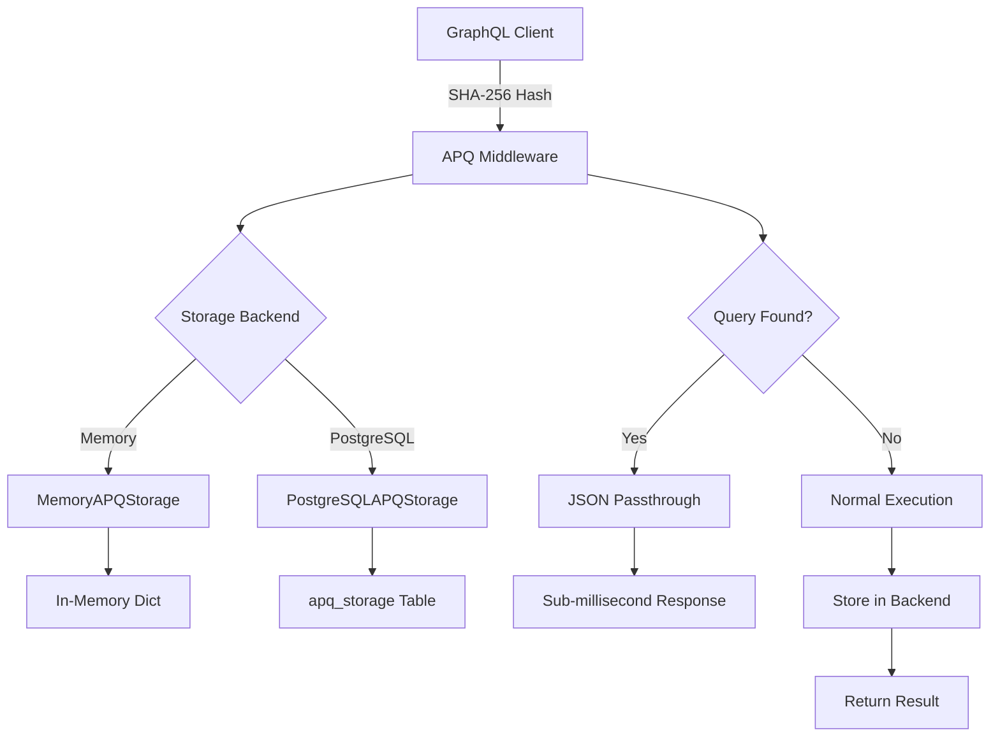

# APQ Storage Backend Abstraction

Complete guide to FraiseQL's Automatic Persisted Queries (APQ) storage backend system, enabling enterprise-scale query caching with pluggable storage options.

## Overview

FraiseQL's APQ implementation provides a clean abstraction layer for storing and retrieving persisted GraphQL queries. The system supports multiple storage backends, from simple in-memory caching for development to enterprise PostgreSQL storage for production multi-instance deployments.

## Architecture



## Storage Backend Types

### Memory Backend (Default)

Perfect for development and single-instance deployments:

```python
from fraiseql import FraiseQLConfig, create_fraiseql_app

config = FraiseQLConfig(
    apq_storage_backend="memory",
    apq_memory_max_size=10000,  # Maximum queries to cache
    apq_memory_ttl=3600         # TTL in seconds (1 hour)
)

app = create_fraiseql_app(types=[User], config=config)
```

**Characteristics:**
- **Zero configuration** - works out of the box
- **Lightning fast** - O(1) dictionary lookup
- **Memory efficient** - LRU eviction with size limits
- **Instance-local** - each process maintains its own cache

### PostgreSQL Backend (Enterprise)

Designed for production multi-instance environments:

```python
config = FraiseQLConfig(
    apq_storage_backend="postgresql",
    apq_storage_schema="apq_cache",    # Custom schema for isolation
    apq_storage_table="query_cache",   # Custom table name
    apq_postgres_ttl=86400,            # 24 hour TTL
    apq_postgres_cleanup_interval=3600 # Cleanup every hour
)

app = create_fraiseql_app(types=[User], config=config)
```

**Characteristics:**
- **Persistent storage** - queries survive restarts
- **Multi-instance coordination** - shared cache across all instances
- **Automatic cleanup** - configurable TTL and maintenance
- **Enterprise ready** - handles thousands of concurrent connections

## Configuration Reference

### Memory Backend Settings

| Parameter | Type | Default | Description |
|-----------|------|---------|-------------|
| `apq_memory_max_size` | int | 10000 | Maximum number of queries to cache |
| `apq_memory_ttl` | int | 3600 | Time-to-live in seconds |
| `apq_memory_cleanup_interval` | int | 300 | Cleanup interval in seconds |

### PostgreSQL Backend Settings

| Parameter | Type | Default | Description |
|-----------|------|---------|-------------|
| `apq_storage_schema` | str | "public" | PostgreSQL schema for APQ tables |
| `apq_storage_table` | str | "apq_storage" | Table name for query storage |
| `apq_postgres_ttl` | int | 86400 | TTL in seconds (24 hours) |
| `apq_postgres_cleanup_interval` | int | 3600 | Cleanup interval (1 hour) |
| `apq_postgres_connection_pool` | bool | True | Use connection pooling |

## Backend Implementation Details

### Memory Backend

The memory backend uses an in-memory dictionary with LRU eviction:

```python
class MemoryAPQStorage:
    def __init__(self, max_size: int = 10000, ttl: int = 3600):
        self._cache: Dict[str, Tuple[str, float]] = {}
        self._max_size = max_size
        self._ttl = ttl

    async def get_query(self, query_hash: str) -> Optional[str]:
        """Get query by hash with TTL check."""
        if query_hash in self._cache:
            query, timestamp = self._cache[query_hash]
            if time.time() - timestamp < self._ttl:
                return query
            del self._cache[query_hash]
        return None

    async def store_query(self, query_hash: str, query: str) -> bool:
        """Store query with LRU eviction."""
        if len(self._cache) >= self._max_size:
            # Remove oldest entry
            oldest_key = min(self._cache.keys(),
                           key=lambda k: self._cache[k][1])
            del self._cache[oldest_key]

        self._cache[query_hash] = (query, time.time())
        return True
```

### PostgreSQL Backend

The PostgreSQL backend uses a dedicated table with automatic maintenance:

```sql
-- Schema created automatically by FraiseQL
CREATE SCHEMA IF NOT EXISTS apq_cache;

CREATE TABLE IF NOT EXISTS apq_cache.apq_storage (
    query_hash TEXT PRIMARY KEY,
    query_text TEXT NOT NULL,
    created_at TIMESTAMPTZ NOT NULL DEFAULT NOW(),
    last_accessed TIMESTAMPTZ NOT NULL DEFAULT NOW(),
    access_count INTEGER NOT NULL DEFAULT 1
);

-- Indexes for performance
CREATE INDEX IF NOT EXISTS idx_apq_storage_created_at
    ON apq_cache.apq_storage(created_at);
CREATE INDEX IF NOT EXISTS idx_apq_storage_last_accessed
    ON apq_cache.apq_storage(last_accessed);
```

## Usage Examples

### Basic APQ Flow

```python
# 1. Client registers query
POST /graphql
{
    "query": "query GetUser($id: ID!) { user(id: $id) { name email } }",
    "extensions": {
        "persistedQuery": {
            "version": 1,
            "sha256Hash": "abc123..."
        }
    }
}

# 2. Subsequent requests use hash only
POST /graphql
{
    "extensions": {
        "persistedQuery": {
            "version": 1,
            "sha256Hash": "abc123..."
        }
    },
    "variables": { "id": "user-123" }
}
```

### Custom Storage Backend

You can implement custom storage backends:

```python
from fraiseql.apq import APQStorageBackend

class RedisAPQStorage(APQStorageBackend):
    def __init__(self, redis_client):
        self.redis = redis_client

    async def get_query(self, query_hash: str) -> Optional[str]:
        """Retrieve query from Redis."""
        return await self.redis.get(f"apq:{query_hash}")

    async def store_query(self, query_hash: str, query: str) -> bool:
        """Store query in Redis with TTL."""
        await self.redis.setex(f"apq:{query_hash}", 3600, query)
        return True

    async def remove_query(self, query_hash: str) -> bool:
        """Remove query from Redis."""
        return await self.redis.delete(f"apq:{query_hash}") > 0

# Register custom backend
config = FraiseQLConfig(
    apq_storage_backend=RedisAPQStorage(redis_client)
)
```

## Performance Characteristics

### Memory Backend Performance

| Operation | Time Complexity | Memory Usage |
|-----------|----------------|--------------|
| Query Lookup | O(1) | ~1KB per query |
| Query Storage | O(1) amortized | Linear with cache size |
| Cleanup | O(n) during eviction | Minimal overhead |

**Benchmark Results:**
- **Lookup**: ~0.01ms per operation
- **Storage**: ~0.02ms per operation
- **Memory**: ~1KB per cached query
- **Throughput**: 100,000+ operations/second

### PostgreSQL Backend Performance

| Operation | Time Complexity | Overhead |
|-----------|----------------|----------|
| Query Lookup | O(log n) | 0.5-2ms |
| Query Storage | O(log n) | 1-3ms |
| Cleanup | O(n) batch | Background |

**Benchmark Results:**
- **Lookup**: ~1-2ms per operation
- **Storage**: ~2-3ms per operation
- **Throughput**: 1,000-5,000 operations/second
- **Concurrency**: Excellent with connection pooling

## Production Deployment

### Single Instance Setup

For single-instance deployments, memory backend is optimal:

```python
# Single instance configuration
config = FraiseQLConfig(
    apq_storage_backend="memory",
    apq_memory_max_size=50000,    # Large cache for better hit rates
    apq_memory_ttl=7200,          # 2 hour TTL
    json_passthrough_enabled=True  # Enable sub-ms responses
)
```

### Multi-Instance Setup

For multi-instance deployments, use PostgreSQL backend:

```python
# Multi-instance configuration
config = FraiseQLConfig(
    apq_storage_backend="postgresql",
    apq_storage_schema="shared_apq",
    apq_postgres_ttl=86400,        # 24 hour persistence
    apq_postgres_cleanup_interval=1800,  # 30 min cleanup
    json_passthrough_enabled=True
)
```

### Kubernetes Deployment

```yaml
apiVersion: apps/v1
kind: Deployment
metadata:
  name: fraiseql-api
spec:
  replicas: 3
  template:
    spec:
      containers:
      - name: api
        image: myapp/fraiseql:latest
        env:
        - name: FRAISEQL_APQ_STORAGE_BACKEND
          value: "postgresql"
        - name: FRAISEQL_APQ_STORAGE_SCHEMA
          value: "apq_shared"
        - name: FRAISEQL_APQ_POSTGRES_TTL
          value: "86400"
        - name: FRAISEQL_JSON_PASSTHROUGH_ENABLED
          value: "true"
```

## Monitoring and Metrics

### Memory Backend Metrics

```python
# Access metrics through the storage backend
storage = app.apq_storage
metrics = {
    "cache_size": len(storage._cache),
    "max_size": storage._max_size,
    "hit_rate": storage.hit_count / storage.total_requests,
    "memory_usage": sys.getsizeof(storage._cache)
}
```

### PostgreSQL Backend Metrics

```sql
-- Query cache statistics
SELECT
    COUNT(*) as total_queries,
    AVG(access_count) as avg_access_count,
    MAX(access_count) as max_access_count,
    COUNT(*) FILTER (WHERE created_at > NOW() - INTERVAL '1 hour') as recent_queries
FROM apq_cache.apq_storage;

-- Top accessed queries
SELECT
    query_hash,
    access_count,
    last_accessed,
    LEFT(query_text, 100) as query_preview
FROM apq_cache.apq_storage
ORDER BY access_count DESC
LIMIT 10;
```

## Troubleshooting

### High Memory Usage (Memory Backend)

**Symptoms:** Gradual memory increase over time

**Solutions:**
1. Reduce `apq_memory_max_size`
2. Lower `apq_memory_ttl`
3. Enable more frequent cleanup

```python
config = FraiseQLConfig(
    apq_memory_max_size=5000,     # Reduce cache size
    apq_memory_ttl=1800,          # 30 minute TTL
    apq_memory_cleanup_interval=120  # 2 minute cleanup
)
```

### Slow Query Lookups (PostgreSQL Backend)

**Symptoms:** Increased response times for cached queries

**Solutions:**
1. Add database indexes
2. Optimize cleanup frequency
3. Use connection pooling

```sql
-- Additional performance indexes
CREATE INDEX CONCURRENTLY idx_apq_storage_hash_partial
    ON apq_cache.apq_storage(query_hash)
    WHERE last_accessed > NOW() - INTERVAL '1 day';
```

### Cache Miss Rate Too High

**Symptoms:** Low cache hit rates, poor performance

**Solutions:**
1. Increase cache size/TTL
2. Implement cache warming
3. Monitor query patterns

```python
# Cache warming strategy
async def warm_cache(app):
    """Pre-populate cache with common queries."""
    common_queries = [
        "query GetUser($id: ID!) { user(id: $id) { name email } }",
        "query ListUsers { users { id name email } }"
    ]

    for query in common_queries:
        query_hash = hashlib.sha256(query.encode()).hexdigest()
        await app.apq_storage.store_query(query_hash, query)
```

## Best Practices

### 1. Choose the Right Backend

- **Memory**: Development, single-instance, high-performance requirements
- **PostgreSQL**: Production, multi-instance, persistence requirements

### 2. Optimize Cache Settings

```python
# Production memory backend
config = FraiseQLConfig(
    apq_memory_max_size=25000,    # ~25MB memory usage
    apq_memory_ttl=3600,          # 1 hour TTL
    apq_memory_cleanup_interval=300  # 5 minute cleanup
)

# Production PostgreSQL backend
config = FraiseQLConfig(
    apq_postgres_ttl=43200,       # 12 hour TTL
    apq_postgres_cleanup_interval=1800  # 30 minute cleanup
)
```

### 3. Monitor Performance

- Track cache hit rates (target: >95%)
- Monitor response times
- Watch memory/disk usage
- Set up alerts for cache misses

### 4. Plan for Scale

- Start with memory backend for simplicity
- Migrate to PostgreSQL when scaling horizontally
- Consider custom backends for specific requirements

## See Also

- [Configuration Reference](./configuration.md) - Complete APQ configuration options
- [Performance Guide](./performance.md) - APQ performance optimization
- [JSON Passthrough](./json-passthrough.md) - Sub-millisecond response optimization
- [TurboRouter](./turbo-router.md) - Query pre-compilation and caching
