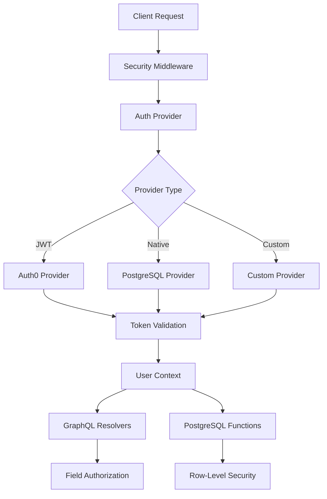

# Authentication Patterns

Comprehensive authentication patterns and implementations for securing FraiseQL APIs with JWT, session-based auth, and database-level authorization.

## Overview

FraiseQL provides a flexible, provider-based authentication system designed for enterprise applications. The framework supports multiple authentication strategies including JWT tokens, session-based authentication, OAuth2/OIDC providers, and native PostgreSQL-backed authentication with advanced features like token rotation and theft detection.

The authentication system integrates deeply with GraphQL resolvers, enabling field-level authorization and automatic context propagation through your entire API stack, including PostgreSQL functions and views.

## Architecture

FraiseQL's authentication architecture follows a provider-based pattern with pluggable implementations:



## Configuration

### Basic Setup

```python
from fraiseql import FraiseQL
from fraiseql.auth import Auth0Provider, NativeAuthProvider
from fraiseql.auth.native import TokenManager

# Auth0 Integration
auth0_provider = Auth0Provider(
    domain="your-domain.auth0.com",
    api_identifier="https://your-api.com",
    algorithms=["RS256"]  # Default
)

# Native PostgreSQL Authentication
token_manager = TokenManager(
    secret_key="your-secret-key",
    access_token_expires=timedelta(minutes=15),
    refresh_token_expires=timedelta(days=30),
    algorithm="HS256"
)

native_provider = NativeAuthProvider(
    token_manager=token_manager,
    db_pool=db_pool
)

# Initialize FraiseQL with authentication
app = FraiseQL(
    connection_string="postgresql://...",
    auth_provider=auth0_provider  # or native_provider
)
```

### Environment Variables

```bash
# Auth0 Configuration
AUTH0_DOMAIN=your-domain.auth0.com
AUTH0_API_IDENTIFIER=https://your-api.com
AUTH0_MANAGEMENT_DOMAIN=your-domain.auth0.com
AUTH0_MANAGEMENT_CLIENT_ID=your-client-id
AUTH0_MANAGEMENT_CLIENT_SECRET=your-client-secret

# Native Auth Configuration
JWT_SECRET_KEY=your-secret-key
JWT_ACCESS_TOKEN_EXPIRE_MINUTES=15
JWT_REFRESH_TOKEN_EXPIRE_DAYS=30
JWT_ALGORITHM=HS256

# Security Settings
SECURITY_RATE_LIMIT_PER_MINUTE=60
SECURITY_ENABLE_CSRF=true
SECURITY_ENABLE_CORS=true
```

## Implementation

### JWT Integration

#### Auth0 Provider Example

```python
from fraiseql import FraiseQL, query, mutation
from fraiseql.auth import Auth0Provider, requires_auth, requires_permission
from fraiseql.auth.decorators import requires_role
import strawberry

# Configure Auth0 Provider
auth_provider = Auth0Provider(
    domain=os.getenv("AUTH0_DOMAIN"),
    api_identifier=os.getenv("AUTH0_API_IDENTIFIER")
)

@strawberry.type
class User:
    id: str
    email: str
    name: str

    @strawberry.field
    @requires_permission("users:read:sensitive")
    def social_security_number(self) -> str:
        """Only users with sensitive data permission can access"""
        return self._ssn

@query(table="v_users", return_type=User)
@requires_auth
async def current_user(info) -> User:
    """Get current authenticated user"""
    user_context = info.context["user"]
    return {"user_id": user_context.user_id}

@mutation(function="fn_update_user_profile", schema="app")
@requires_permission("users:write")
class UpdateUserProfile:
    """Update user profile with permission check"""
    input: UpdateProfileInput
    success: UpdateProfileSuccess
    failure: UpdateProfileError
```

#### Token Validation and Management

```python
from fraiseql.auth.token_revocation import TokenRevocationService, RedisRevocationStore
import redis.asyncio as redis

# Setup token revocation for logout functionality
redis_client = redis.from_url("redis://localhost:6379")
revocation_store = RedisRevocationStore(redis_client)
revocation_service = TokenRevocationService(revocation_store)

# Custom auth provider with revocation support
class CustomAuthProvider(Auth0Provider):
    def __init__(self, *args, revocation_service: TokenRevocationService, **kwargs):
        super().__init__(*args, **kwargs)
        self.revocation_service = revocation_service

    async def validate_token(self, token: str) -> dict[str, Any]:
        payload = await super().validate_token(token)

        # Check if token is revoked
        if await self.revocation_service.is_token_revoked(payload):
            raise AuthenticationError("Token has been revoked")

        return payload

    async def logout(self, token: str) -> None:
        """Revoke token on logout"""
        payload = jwt.decode(token, options={"verify_signature": False})
        await self.revocation_service.revoke_token(payload)
```

### Session-based Auth

Native PostgreSQL-backed session management with secure refresh token rotation:

```python
from fraiseql.auth.native import NativeAuthProvider, TokenManager
from fraiseql.auth.native.middleware import SessionAuthMiddleware

# Configure session-based authentication
token_manager = TokenManager(
    secret_key=os.getenv("JWT_SECRET_KEY"),
    access_token_expires=timedelta(minutes=15),
    refresh_token_expires=timedelta(days=30),
    algorithm="HS256"
)

native_auth = NativeAuthProvider(
    token_manager=token_manager,
    db_pool=db_pool
)

# Add session middleware
app.add_middleware(SessionAuthMiddleware, auth_provider=native_auth)

@mutation(function="fn_login", schema="auth")
class Login:
    """User login with session creation"""
    input: LoginInput
    success: LoginSuccess
    failure: LoginError

    async def post_process(self, result: LoginSuccess, info) -> LoginSuccess:
        """Add tokens to response"""
        if isinstance(result, LoginSuccess):
            # Tokens are automatically set in HTTP-only cookies
            info.context["response"].set_cookie(
                "access_token",
                result.access_token,
                httponly=True,
                secure=True,
                samesite="lax"
            )
        return result

@mutation(function="fn_refresh_token", schema="auth")
class RefreshToken:
    """Rotate refresh token with theft detection"""
    success: RefreshSuccess
    failure: RefreshError
```

### OAuth2/OIDC Integration

Complete OAuth2 flow implementation with state management:

```python
from fraiseql.auth.oauth2 import OAuth2Provider
from authlib.integrations.starlette_client import OAuth

# Configure OAuth2 providers
oauth = OAuth()
oauth.register(
    name='google',
    client_id=os.getenv('GOOGLE_CLIENT_ID'),
    client_secret=os.getenv('GOOGLE_CLIENT_SECRET'),
    server_metadata_url='https://accounts.google.com/.well-known/openid-configuration',
    client_kwargs={'scope': 'openid email profile'}
)

class GoogleOAuth2Provider(OAuth2Provider):
    def __init__(self, oauth_client):
        self.client = oauth_client

    async def get_authorization_url(self, redirect_uri: str) -> str:
        """Generate OAuth2 authorization URL"""
        return await self.client.google.authorize_redirect(redirect_uri)

    async def handle_callback(self, request) -> UserContext:
        """Process OAuth2 callback and create user context"""
        token = await self.client.google.authorize_access_token(request)
        user_info = token.get('userinfo')

        # Create or update user in database
        async with db_pool.connection() as conn:
            user = await conn.fetchrow("""
                INSERT INTO tb_users (email, name, oauth_provider, oauth_id)
                VALUES ($1, $2, $3, $4)
                ON CONFLICT (email)
                DO UPDATE SET
                    last_login = CURRENT_TIMESTAMP,
                    name = EXCLUDED.name
                RETURNING id, email, name
            """, user_info['email'], user_info['name'], 'google', user_info['sub'])

        return UserContext(
            user_id=str(user['id']),
            email=user['email'],
            name=user['name'],
            metadata={'provider': 'google'}
        )
```

### API Key Authentication

Service-to-service authentication with API keys:

```python
from fraiseql.auth.api_key import APIKeyProvider

class DatabaseAPIKeyProvider(APIKeyProvider):
    def __init__(self, db_pool):
        self.db_pool = db_pool

    async def validate_api_key(self, api_key: str) -> UserContext | None:
        """Validate API key against database"""
        async with self.db_pool.connection() as conn:
            # Check API key and get associated service account
            service = await conn.fetchrow("""
                SELECT
                    s.id,
                    s.name,
                    s.permissions,
                    s.rate_limit
                FROM tb_service_accounts s
                JOIN tb_api_keys k ON k.service_account_id = s.id
                WHERE k.key_hash = crypt($1, k.key_hash)
                    AND k.expires_at > CURRENT_TIMESTAMP
                    AND k.is_active = true
            """, api_key)

            if not service:
                return None

            # Log API key usage
            await conn.execute("""
                INSERT INTO tb_api_key_usage (api_key_id, used_at, ip_address)
                VALUES (
                    (SELECT id FROM tb_api_keys WHERE key_hash = crypt($1, key_hash)),
                    CURRENT_TIMESTAMP,
                    $2
                )
            """, api_key, info.context.get("client_ip"))

            return UserContext(
                user_id=f"service:{service['id']}",
                name=service['name'],
                permissions=service['permissions'],
                metadata={'rate_limit': service['rate_limit']}
            )

# Use in middleware
app.add_middleware(
    APIKeyAuthMiddleware,
    provider=DatabaseAPIKeyProvider(db_pool),
    header_name="X-API-Key"
)
```

### Context Propagation

FraiseQL automatically propagates authentication context through all layers:

```python
@mutation(
    function="fn_create_post",
    schema="app",
    context_params={
        "author_id": "user",  # Maps context["user"].user_id to function parameter
        "tenant_id": "tenant_id",  # Maps context["tenant_id"] to parameter
    }
)
class CreatePost:
    """Context parameters are automatically injected into PostgreSQL function"""
    input: CreatePostInput
    success: Post
    failure: CreatePostError

# The PostgreSQL function receives context
"""
CREATE FUNCTION fn_create_post(
    p_title text,
    p_content text,
    p_author_id uuid,  -- Automatically injected from context
    p_tenant_id uuid   -- Automatically injected from context
) RETURNS jsonb AS $$
BEGIN
    -- Context is also available via session variables
    -- current_setting('app.user_id')
    -- current_setting('app.tenant_id')

    INSERT INTO tb_posts (title, content, author_id, tenant_id)
    VALUES (p_title, p_content, p_author_id, p_tenant_id);

    -- Return through secure view
    RETURN (
        SELECT row_to_json(p)
        FROM v_posts p
        WHERE p.id = LASTVAL()
    );
END;
$$ LANGUAGE plpgsql SECURITY DEFINER;
"""

# Context is also available in queries
@query(
    sql="""
    SELECT * FROM v_posts
    WHERE tenant_id = current_setting('app.tenant_id')::uuid
        AND (
            author_id = current_setting('app.user_id')::uuid
            OR EXISTS (
                SELECT 1 FROM v_post_permissions
                WHERE post_id = v_posts.id
                    AND user_id = current_setting('app.user_id')::uuid
            )
        )
    """,
    return_type=list[Post]
)
@requires_auth
async def my_posts(info) -> list[Post]:
    """Posts filtered by tenant and permissions"""
    pass
```

### PostgreSQL Role Integration

Advanced database-level security with row-level security policies:

```python
# Setup database roles and policies
"""
-- Create application roles
CREATE ROLE app_anonymous;
CREATE ROLE app_authenticated;
CREATE ROLE app_admin;

-- Grant base permissions
GRANT SELECT ON v_public_posts TO app_anonymous;
GRANT SELECT, INSERT, UPDATE ON v_posts TO app_authenticated;
GRANT ALL ON ALL TABLES IN SCHEMA app TO app_admin;

-- Row Level Security Policies
ALTER TABLE tb_posts ENABLE ROW LEVEL SECURITY;

CREATE POLICY tenant_isolation ON tb_posts
    FOR ALL
    TO app_authenticated
    USING (tenant_id = current_setting('app.tenant_id')::uuid);

CREATE POLICY author_access ON tb_posts
    FOR UPDATE, DELETE
    TO app_authenticated
    USING (author_id = current_setting('app.user_id')::uuid);

-- Function to set session context
CREATE FUNCTION set_auth_context(
    p_user_id uuid,
    p_tenant_id uuid,
    p_role text
) RETURNS void AS $$
BEGIN
    PERFORM set_config('app.user_id', p_user_id::text, true);
    PERFORM set_config('app.tenant_id', p_tenant_id::text, true);
    EXECUTE format('SET LOCAL ROLE %I', p_role);
END;
$$ LANGUAGE plpgsql SECURITY DEFINER;
"""

# Middleware to set PostgreSQL context
class PostgreSQLAuthMiddleware:
    async def resolve(self, next, root, info, **args):
        user_context = info.context.get("user")

        if user_context:
            # Set PostgreSQL session variables
            async with info.context["db_pool"].connection() as conn:
                await conn.execute(
                    "SELECT set_auth_context($1, $2, $3)",
                    user_context.user_id,
                    info.context.get("tenant_id"),
                    "app_authenticated" if not user_context.has_role("admin") else "app_admin"
                )

        return await next(root, info, **args)
```

### Multi-tenant Patterns

Complete multi-tenant authentication with automatic tenant isolation:

```python
from fraiseql.auth.multitenant import TenantMiddleware, TenantContext

@dataclass
class TenantContext:
    tenant_id: str
    tenant_name: str
    tenant_settings: dict[str, Any]

class DatabaseTenantMiddleware(TenantMiddleware):
    async def get_tenant_from_request(self, request) -> TenantContext | None:
        # Extract tenant from subdomain
        host = request.headers.get("host", "")
        subdomain = host.split(".")[0]

        async with self.db_pool.connection() as conn:
            tenant = await conn.fetchrow("""
                SELECT id, name, settings
                FROM tb_tenants
                WHERE subdomain = $1 AND is_active = true
            """, subdomain)

            if tenant:
                return TenantContext(
                    tenant_id=str(tenant['id']),
                    tenant_name=tenant['name'],
                    tenant_settings=tenant['settings']
                )

        return None

# Automatic tenant filtering in queries
@query(
    table="v_tenant_users",  # View automatically filters by tenant
    return_type=list[User]
)
@requires_auth
async def list_users(info) -> list[User]:
    """List all users in current tenant"""
    # The view v_tenant_users already filters by current_setting('app.tenant_id')
    pass

# Tenant-aware mutations
@mutation(
    function="fn_invite_user",
    schema="app",
    context_params={
        "tenant_id": "tenant_id",
        "invited_by": "user"
    }
)
class InviteUser:
    """Invite user to current tenant"""
    input: InviteUserInput
    success: InviteUserSuccess
    failure: InviteUserError
```

## Performance Considerations

### Token Validation Caching

```python
from fraiseql.auth.caching import TokenCache
import redis.asyncio as redis

# Redis-backed token cache
redis_client = redis.from_url("redis://localhost:6379")
token_cache = TokenCache(redis_client, ttl=300)  # 5 minute cache

class CachedAuthProvider(Auth0Provider):
    def __init__(self, *args, token_cache: TokenCache, **kwargs):
        super().__init__(*args, **kwargs)
        self.token_cache = token_cache

    async def validate_token(self, token: str) -> dict[str, Any]:
        # Check cache first
        cached = await self.token_cache.get(token)
        if cached:
            return cached

        # Validate and cache
        payload = await super().validate_token(token)
        await self.token_cache.set(token, payload)
        return payload
```

### Database Connection Pooling

```python
# Optimize connection pool for auth queries
auth_pool = await asyncpg.create_pool(
    connection_string,
    min_size=10,  # Keep connections ready for auth
    max_size=20,  # Limit concurrent auth operations
    max_inactive_connection_lifetime=300
)

# Dedicated read replica for auth queries
read_replica_pool = await asyncpg.create_pool(
    read_replica_connection_string,
    min_size=5,
    max_size=10
)
```

### Query Performance

- **Index user lookups**: `CREATE INDEX idx_users_email ON tb_users(email)`
- **Index API keys**: `CREATE INDEX idx_api_keys_hash ON tb_api_keys(key_hash)`
- **Partial indexes for active records**: `CREATE INDEX idx_active_sessions ON tb_sessions(user_id) WHERE expires_at > CURRENT_TIMESTAMP`
- **Composite indexes for tenant queries**: `CREATE INDEX idx_tenant_users ON tb_users(tenant_id, email)`

## Security Implications

### Token Security

1. **Short-lived access tokens**: 15 minutes default expiry
2. **Refresh token rotation**: New refresh token on each use
3. **Token theft detection**: Invalidate token family on reuse
4. **Secure storage**: HTTP-only cookies for web apps
5. **CSRF protection**: Double-submit cookie pattern

### Rate Limiting

```python
from fraiseql.auth.native.middleware import RateLimitMiddleware

# Configure rate limiting
app.add_middleware(
    RateLimitMiddleware,
    rate_limit_per_minute=60,
    auth_endpoints_limit=10,  # Stricter for auth endpoints
    by_ip=True,
    by_user=True
)
```

### Input Validation

```python
from fraiseql.validation import EmailStr, SecurePassword

@strawberry.input
class LoginInput:
    email: EmailStr  # Validates email format
    password: SecurePassword  # Validates password strength

    @validator("password")
    def validate_password(cls, v):
        if len(v) < 12:
            raise ValueError("Password must be at least 12 characters")
        return v
```

## Best Practices

1. **Always use HTTPS** in production for token transmission
2. **Implement token rotation** for refresh tokens to prevent theft
3. **Use field-level authorization** for sensitive data
4. **Log authentication events** for security auditing
5. **Implement account lockout** after failed attempts
6. **Use secure password hashing** (bcrypt, scrypt, or argon2)
7. **Validate all inputs** to prevent injection attacks
8. **Set secure headers** (HSTS, CSP, X-Frame-Options)
9. **Use database roles** for defense in depth
10. **Monitor for anomalies** in authentication patterns

## Common Pitfalls

### Pitfall 1: Storing tokens in localStorage
**Problem**: Vulnerable to XSS attacks
**Solution**: Use HTTP-only cookies or secure memory storage

```python
# Bad: JavaScript accessible
localStorage.setItem('token', token)

# Good: HTTP-only cookie
response.set_cookie(
    "access_token",
    token,
    httponly=True,
    secure=True,
    samesite="lax",
    max_age=900  # 15 minutes
)
```

### Pitfall 2: Not validating token expiry
**Problem**: Accepting expired tokens
**Solution**: Always validate expiry and implement token refresh

```python
# Bad: No expiry check
payload = jwt.decode(token, key, options={"verify_signature": True})

# Good: Full validation
payload = jwt.decode(
    token,
    key,
    algorithms=["HS256"],
    options={
        "verify_signature": True,
        "verify_exp": True,
        "verify_nbf": True,
        "verify_iat": True,
        "verify_aud": True,
        "require": ["exp", "iat", "nbf"]
    }
)
```

### Pitfall 3: Weak session invalidation
**Problem**: Sessions remain valid after logout
**Solution**: Implement proper token revocation

```python
# Bad: Client-side only logout
localStorage.removeItem('token')

# Good: Server-side revocation
@mutation
async def logout(info) -> bool:
    token = info.context["auth_token"]
    await auth_provider.logout(token)

    # Clear session data
    await conn.execute("""
        UPDATE tb_sessions
        SET revoked_at = CURRENT_TIMESTAMP
        WHERE token = $1
    """, token)

    return True
```

### Pitfall 4: Insufficient context isolation
**Problem**: Tenant data leakage
**Solution**: Always filter by tenant at database level

```python
# Bad: Application-level filtering
posts = await get_all_posts()
return [p for p in posts if p.tenant_id == current_tenant]

# Good: Database-level filtering with RLS
"""
CREATE POLICY tenant_isolation ON tb_posts
    FOR ALL
    USING (tenant_id = current_setting('app.tenant_id')::uuid);
"""
```

## Troubleshooting

### Error: "JWT signature verification failed"
**Cause**: Mismatched signing keys or algorithms
**Solution**:
```python
# Verify JWKS endpoint for Auth0
print(f"JWKS URL: {auth_provider.jwks_uri}")
# Check algorithm matches
print(f"Algorithms: {auth_provider.algorithms}")
```

### Error: "Token has been revoked"
**Cause**: Token in revocation list
**Solution**:
```python
# Check revocation status
is_revoked = await revocation_service.is_token_revoked(payload)
# Clear revocation if needed (admin action)
await revocation_service.clear_revocation(jti)
```

### Error: "Refresh token theft detected"
**Cause**: Refresh token reused after rotation
**Solution**:
```python
# Invalidate entire token family
await token_manager.invalidate_token_family(family_id)
# Force user to re-authenticate
```

### Error: "Permission denied for relation"
**Cause**: PostgreSQL role lacks permissions
**Solution**:
```sql
-- Check current role
SELECT current_user, current_setting('role');
-- Grant necessary permissions
GRANT SELECT ON v_posts TO app_authenticated;
```

## See Also

- [Security Guide](./security.md) - Comprehensive security features
- [Configuration Reference](./configuration.md) - All authentication environment variables
- [Field Authorization](../api-reference/decorators.md#authorize_field) - Field-level permission control
- [PostgreSQL Function Mutations](../mutations/postgresql-function-based.md) - Secure mutation patterns
- [Multi-tenant Patterns](./domain-driven-database.md#multi-tenant-design) - Tenant isolation strategies
