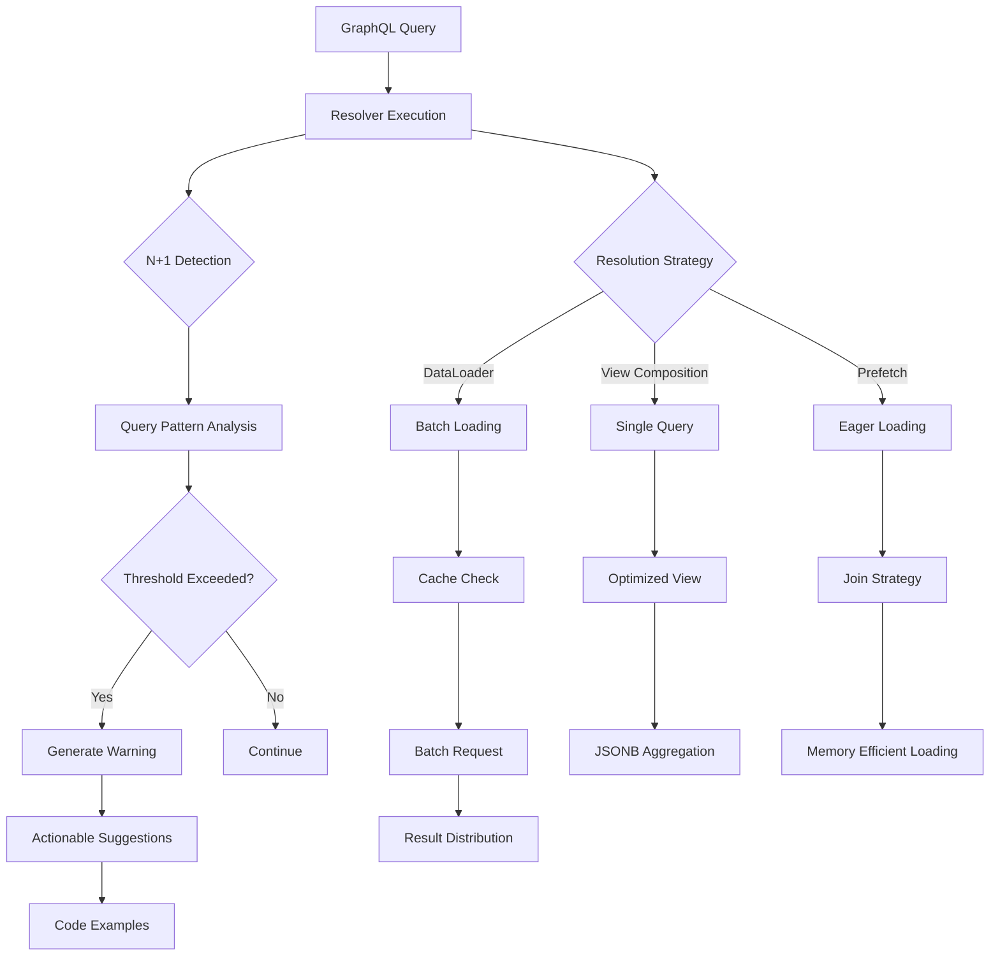

# N+1 Query Prevention

Deep dive into eliminating N+1 queries with automatic detection, DataLoader integration, and PostgreSQL view composition strategies.

## Overview

N+1 queries are one of the most common performance problems in GraphQL APIs. They occur when resolving a list of items requires one query for the list plus N additional queries for related data on each item. FraiseQL provides multiple layers of defense against N+1 queries: automatic detection in development, DataLoader integration for batching, sophisticated view composition strategies, and developer-friendly decorators that make prevention effortless.

The framework's approach combines proactive detection with multiple resolution strategies, allowing you to choose the most appropriate solution for your specific use case while maintaining type safety and code clarity.

## Architecture

FraiseQL's N+1 prevention architecture operates at multiple levels:



## Configuration

### Development Mode Detection

```python
from fraiseql import FraiseQL
from fraiseql.optimization import configure_detector

# Enable N+1 detection in development
app = FraiseQL(
    connection_string="postgresql://...",
    debug=True,  # Enables N+1 detection
    n1_detection_config={
        "threshold": 10,        # Warn after 10 similar queries
        "time_window": 1.0,     # Within 1 second
        "raise_on_detection": False,  # Just warn, don't crash
        "log_level": "WARNING",       # Logging level for detections
        "exclude_patterns": [         # Patterns to ignore
            r"^SELECT \* FROM tb_audit_log",
            r"^SELECT current_setting"
        ]
    }
)
```

### DataLoader Configuration

```python
from fraiseql.optimization import DataLoaderConfig

# Configure DataLoader behavior
dataloader_config = DataLoaderConfig(
    max_batch_size=1000,      # Maximum keys per batch
    cache_enabled=True,       # Enable request-scoped caching
    cache_exceptions=False,   # Don't cache failed loads
    batch_interval_ms=0,      # Dispatch immediately (no artificial delay)
)

app = FraiseQL(
    connection_string="postgresql://...",
    dataloader_config=dataloader_config
)
```

## Implementation

### Automatic Detection

FraiseQL automatically detects N+1 queries in development mode:

```python
# This code will trigger N+1 detection
@strawberry.type
class Post:
    id: UUID
    title: str
    author_id: UUID

    @strawberry.field
    async def author(self, info) -> User:
        # BAD: This executes once per post
        db = info.context["db"]
        user_data = await db.fetchrow(
            "SELECT * FROM v_user WHERE id = $1",
            self.author_id
        )
        return User.from_dict(user_data)

# When you query:
"""
query {
    posts {
        title
        author {  # N+1 query here!
            name
        }
    }
}
"""

# FraiseQL will warn:
"""
WARNING: N+1 query pattern detected!
Field: Post.author
Queries: 11 similar queries in 0.23s
Average execution time: 0.021s per query

Suggested solutions:
1. Use a DataLoader:
   @dataloader_field(UserDataLoader, key_field="author_id")
   async def author(self, info) -> User:
       pass

2. Use view composition:
   CREATE VIEW v_post_with_author AS
   SELECT p.*,
          jsonb_build_object('id', u.id, 'name', u.name) as author
   FROM tb_posts p
   JOIN tb_users u ON u.id = p.author_id;

3. Use prefetching in your query
"""
```

### DataLoader Integration

#### Basic DataLoader Implementation

```python
from fraiseql.optimization import DataLoader
from typing import Any
import asyncpg

class UserDataLoader(DataLoader[UUID, dict[str, Any]]):
    """Batch load users by ID."""

    def __init__(self, db_pool: asyncpg.Pool):
        super().__init__()
        self.db_pool = db_pool

    async def batch_load(self, user_ids: list[UUID]) -> list[dict[str, Any] | None]:
        """Load multiple users in a single query."""
        async with self.db_pool.acquire() as conn:
            # Use ANY for efficient batch loading
            rows = await conn.fetch(
                """
                SELECT * FROM v_user
                WHERE id = ANY($1::uuid[])
                """,
                user_ids
            )

            # Create lookup map
            user_map = {row["id"]: dict(row) for row in rows}

            # Return in same order as requested
            return [user_map.get(user_id) for user_id in user_ids]

# Usage in resolver
@strawberry.field
async def author(self, info) -> User | None:
    """Efficiently load author using DataLoader."""
    loader = info.context["loaders"].get_loader(UserDataLoader)
    user_data = await loader.load(self.author_id)
    return User.from_dict(user_data) if user_data else None
```

#### Automatic DataLoader with Decorator

```python
from fraiseql import dataloader_field

@strawberry.type
class Post:
    id: UUID
    title: str
    author_id: UUID

    @dataloader_field(UserDataLoader, key_field="author_id")
    async def author(self, info) -> User | None:
        """Author is automatically loaded via DataLoader."""
        pass  # Implementation is auto-generated!

    @dataloader_field(CommentsByPostLoader, key_field="id")
    async def comments(self, info) -> list[Comment]:
        """Comments are automatically batched."""
        pass  # Implementation is auto-generated!
```

#### Complex DataLoader Patterns

```python
class CommentsByPostDataLoader(DataLoader[UUID, list[dict[str, Any]]]):
    """Load comments grouped by post ID with nested author data."""

    def __init__(self, db_pool: asyncpg.Pool, limit: int = 100):
        super().__init__()
        self.db_pool = db_pool
        self.limit = limit

    async def batch_load(self, post_ids: list[UUID]) -> list[list[dict[str, Any]]]:
        """Load comments for multiple posts with authors."""
        async with self.db_pool.acquire() as conn:
            # Use window functions for efficient grouping
            rows = await conn.fetch(
                """
                WITH ranked_comments AS (
                    SELECT
                        c.*,
                        jsonb_build_object(
                            'id', u.id,
                            'name', u.name,
                            'avatar_url', u.avatar_url
                        ) as author,
                        ROW_NUMBER() OVER (
                            PARTITION BY c.post_id
                            ORDER BY c.created_at DESC
                        ) as rn
                    FROM tb_comments c
                    JOIN tb_users u ON u.id = c.author_id
                    WHERE c.post_id = ANY($1::uuid[])
                        AND c.is_deleted = false
                )
                SELECT * FROM ranked_comments
                WHERE rn <= $2
                ORDER BY post_id, created_at DESC
                """,
                post_ids,
                self.limit
            )

            # Group by post_id
            comments_by_post: dict[UUID, list[dict]] = {}
            for row in rows:
                post_id = row["post_id"]
                if post_id not in comments_by_post:
                    comments_by_post[post_id] = []
                comments_by_post[post_id].append(dict(row))

            # Return in order with empty lists for posts without comments
            return [comments_by_post.get(post_id, []) for post_id in post_ids]
```

### View Composition Strategies

#### Basic View Composition

```sql
-- Instead of N+1 queries, compose data in a single view
CREATE OR REPLACE VIEW v_post_with_author AS
SELECT
    p.id,
    p.title,
    p.content,
    p.created_at,
    p.author_id,
    -- Embed author data directly
    jsonb_build_object(
        'id', u.id,
        'email', u.email,
        'name', u.name,
        'avatar_url', u.avatar_url
    ) as author
FROM tb_posts p
LEFT JOIN tb_users u ON u.id = p.author_id;

-- Use in GraphQL
@strawberry.type
class PostWithAuthor:
    id: UUID
    title: str
    content: str
    author: User

    @classmethod
    def from_row(cls, row: dict) -> "PostWithAuthor":
        return cls(
            id=row["id"],
            title=row["title"],
            content=row["content"],
            author=User.from_dict(row["author"])
        )
```

#### Advanced Nested Composition

```sql
-- Compose deeply nested data structures
CREATE OR REPLACE VIEW v_post_full AS
SELECT
    p.id,
    p.title,
    p.content,
    p.created_at,
    jsonb_build_object(
        'id', p.id,
        'title', p.title,
        'content', p.content,
        'created_at', p.created_at,
        -- Author with stats
        'author', jsonb_build_object(
            'id', u.id,
            'name', u.name,
            'email', u.email,
            'post_count', (
                SELECT count(*)
                FROM tb_posts
                WHERE author_id = u.id
            ),
            'comment_count', (
                SELECT count(*)
                FROM tb_comments
                WHERE author_id = u.id
            )
        ),
        -- Comments with nested replies
        'comments', COALESCE(
            (SELECT jsonb_agg(
                jsonb_build_object(
                    'id', c.id,
                    'content', c.content,
                    'created_at', c.created_at,
                    'author', jsonb_build_object(
                        'id', cu.id,
                        'name', cu.name
                    ),
                    'replies', (
                        SELECT jsonb_agg(
                            jsonb_build_object(
                                'id', r.id,
                                'content', r.content,
                                'author_name', ru.name
                            )
                            ORDER BY r.created_at
                        )
                        FROM tb_comments r
                        JOIN tb_users ru ON ru.id = r.author_id
                        WHERE r.parent_id = c.id
                    )
                )
                ORDER BY c.created_at DESC
            )
            FROM tb_comments c
            JOIN tb_users cu ON cu.id = c.author_id
            WHERE c.post_id = p.id
                AND c.parent_id IS NULL
                AND c.is_deleted = false
            ),
            '[]'::jsonb
        ),
        -- Tags
        'tags', COALESCE(
            (SELECT array_agg(t.name ORDER BY t.name)
             FROM tb_post_tags pt
             JOIN tb_tags t ON t.id = pt.tag_id
             WHERE pt.post_id = p.id),
            '{}'::text[]
        ),
        -- Statistics
        'stats', jsonb_build_object(
            'view_count', p.view_count,
            'like_count', (
                SELECT count(*)
                FROM tb_post_likes
                WHERE post_id = p.id
            ),
            'comment_count', (
                SELECT count(*)
                FROM tb_comments
                WHERE post_id = p.id
                    AND is_deleted = false
            )
        )
    ) AS data
FROM tb_posts p
JOIN tb_users u ON u.id = p.author_id
WHERE p.is_published = true
    AND p.deleted_at IS NULL;
```

#### Materialized Views for Performance

```sql
-- For expensive aggregations, use materialized views
CREATE MATERIALIZED VIEW tv_popular_posts AS
WITH post_scores AS (
    SELECT
        p.id,
        p.title,
        p.author_id,
        p.created_at,
        -- Calculate popularity score
        (
            (SELECT count(*) FROM tb_post_views WHERE post_id = p.id) * 1.0 +
            (SELECT count(*) FROM tb_post_likes WHERE post_id = p.id) * 2.0 +
            (SELECT count(*) FROM tb_comments WHERE post_id = p.id) * 3.0
        ) as score,
        -- Pre-aggregate stats
        jsonb_build_object(
            'views', (SELECT count(*) FROM tb_post_views WHERE post_id = p.id),
            'likes', (SELECT count(*) FROM tb_post_likes WHERE post_id = p.id),
            'comments', (SELECT count(*) FROM tb_comments WHERE post_id = p.id)
        ) as stats
    FROM tb_posts p
    WHERE p.is_published = true
        AND p.created_at > CURRENT_DATE - INTERVAL '30 days'
)
SELECT
    ps.*,
    u.name as author_name,
    u.avatar_url as author_avatar
FROM post_scores ps
JOIN tb_users u ON u.id = ps.author_id
WHERE ps.score > 0
ORDER BY ps.score DESC
LIMIT 100;

-- Refresh periodically
CREATE OR REPLACE FUNCTION refresh_popular_posts()
RETURNS void AS $$
BEGIN
    REFRESH MATERIALIZED VIEW CONCURRENTLY tv_popular_posts;
END;
$$ LANGUAGE plpgsql;

-- Schedule refresh
SELECT cron.schedule(
    'refresh-popular-posts',
    '*/15 * * * *',  -- Every 15 minutes
    'SELECT refresh_popular_posts()'
);
```

### Batch Loading Techniques

#### Window Function Batching

```python
class TasksByProjectLoader(DataLoader[UUID, list[dict[str, Any]]]):
    """Load tasks for multiple projects using window functions."""

    async def batch_load(self, project_ids: list[UUID]) -> list[list[dict[str, Any]]]:
        # Use ROW_NUMBER() for efficient limiting per group
        query = """
        WITH ranked_tasks AS (
            SELECT
                t.*,
                u.name as assignee_name,
                ROW_NUMBER() OVER (
                    PARTITION BY t.project_id
                    ORDER BY
                        CASE t.priority
                            WHEN 'critical' THEN 1
                            WHEN 'high' THEN 2
                            WHEN 'medium' THEN 3
                            WHEN 'low' THEN 4
                        END,
                        t.created_at DESC
                ) as rn
            FROM tb_tasks t
            LEFT JOIN tb_users u ON u.id = t.assignee_id
            WHERE t.project_id = ANY($1::uuid[])
                AND t.status != 'archived'
        )
        SELECT * FROM ranked_tasks
        WHERE rn <= $2
        ORDER BY project_id, rn
        """

        rows = await self.db.fetch(query, project_ids, self.limit)

        # Group and return
        tasks_by_project = defaultdict(list)
        for row in rows:
            tasks_by_project[row["project_id"]].append(dict(row))

        return [tasks_by_project[pid] for pid in project_ids]
```

#### Prefetch with JOIN

```python
async def get_posts_with_comments(
    db: asyncpg.Pool,
    limit: int = 20
) -> list[PostWithComments]:
    """Prefetch posts with their comments in a single query."""

    # Use lateral join for correlated subqueries
    query = """
    SELECT
        p.*,
        COALESCE(comments.data, '[]'::jsonb) as comments
    FROM tb_posts p
    LEFT JOIN LATERAL (
        SELECT jsonb_agg(
            jsonb_build_object(
                'id', c.id,
                'content', c.content,
                'author_name', u.name,
                'created_at', c.created_at
            )
            ORDER BY c.created_at DESC
        ) as data
        FROM tb_comments c
        JOIN tb_users u ON u.id = c.author_id
        WHERE c.post_id = p.id
        LIMIT 10  -- First 10 comments per post
    ) comments ON true
    WHERE p.is_published = true
    ORDER BY p.created_at DESC
    LIMIT $1
    """

    rows = await db.fetch(query, limit)
    return [PostWithComments.from_row(row) for row in rows]
```

### Performance Monitoring

#### Custom N+1 Detection Context

```python
from fraiseql.optimization import n1_detection_context

@strawberry.field
async def posts(self, info, limit: int = 20) -> list[Post]:
    """Query posts with N+1 monitoring."""

    # Custom detection context with specific configuration
    async with n1_detection_context(
        request_id=info.context["request_id"],
        threshold=5,  # More sensitive for this query
        field_path="Query.posts"
    ) as detector:

        posts = await fetch_posts(limit)

        # Check for issues after resolution
        if issues := detector.get_issues():
            logger.warning(
                f"N+1 issues detected: {issues}",
                extra={"request_id": info.context["request_id"]}
            )

        return posts
```

#### Performance Metrics Collection

```python
from fraiseql.monitoring import metrics

class InstrumentedDataLoader(DataLoader[K, V]):
    """DataLoader with performance metrics."""

    async def batch_load(self, keys: list[K]) -> list[V | None]:
        with metrics.timer("dataloader.batch_load",
                          tags={"loader": self.__class__.__name__}):

            # Track batch size
            metrics.histogram(
                "dataloader.batch_size",
                len(keys),
                tags={"loader": self.__class__.__name__}
            )

            # Track cache performance
            cache_hits = sum(1 for k in keys if k in self._cache)
            if cache_hits > 0:
                metrics.counter(
                    "dataloader.cache_hits",
                    cache_hits,
                    tags={"loader": self.__class__.__name__}
                )

            return await super().batch_load(keys)
```

### Migration Strategies

#### Migrating from N+1 Prone Code

```python
# Step 1: Identify N+1 patterns (before)
@strawberry.type
class Author:
    id: UUID
    name: str

    @strawberry.field
    async def recent_posts(self, info) -> list[Post]:
        # BAD: Executes for each author
        db = info.context["db"]
        rows = await db.fetch(
            "SELECT * FROM v_posts WHERE author_id = $1 ORDER BY created_at DESC LIMIT 5",
            self.id
        )
        return [Post.from_dict(row) for row in rows]

# Step 2: Add DataLoader (intermediate)
class RecentPostsByAuthorLoader(DataLoader[UUID, list[dict]]):
    async def batch_load(self, author_ids: list[UUID]) -> list[list[dict]]:
        # Single query for all authors
        query = """
        WITH recent_posts AS (
            SELECT *,
                   ROW_NUMBER() OVER (PARTITION BY author_id ORDER BY created_at DESC) as rn
            FROM tb_posts
            WHERE author_id = ANY($1::uuid[])
        )
        SELECT * FROM recent_posts WHERE rn <= 5
        """
        # ... implementation

# Step 3: Apply decorator (final)
@strawberry.type
class Author:
    id: UUID
    name: str

    @dataloader_field(RecentPostsByAuthorLoader, key_field="id")
    async def recent_posts(self, info) -> list[Post]:
        """Recent posts are now automatically batched!"""
        pass
```

#### Progressive Enhancement Strategy

```python
# Phase 1: Add monitoring
app = FraiseQL(
    connection_string="...",
    n1_detection_config={"enabled": True, "threshold": 10}
)

# Phase 2: Implement DataLoaders for hot paths
loaders = [
    UserDataLoader,
    PostsByAuthorLoader,
    CommentsByPostLoader,
]

# Phase 3: Create optimized views
"""
CREATE VIEW v_dashboard_data AS
-- Combine multiple queries into one
SELECT ...
"""

# Phase 4: Add caching layer
class CachedDataLoader(DataLoader[K, V]):
    def __init__(self, redis_client):
        self.redis = redis_client

    async def load(self, key: K) -> V | None:
        # Check Redis first
        if cached := await self.redis.get(f"loader:{key}"):
            return json.loads(cached)

        # Fall back to batch loading
        return await super().load(key)
```

## Performance Considerations

### DataLoader Optimization

- **Batch Size**: Keep batches under 1000 items to avoid query size limits
- **Cache Duration**: DataLoaders are request-scoped; use Redis for longer caching
- **Key Ordering**: Maintain key order in batch_load return values
- **Error Handling**: Return None for missing items rather than raising exceptions

```python
# Optimal batch size configuration
class OptimizedLoader(DataLoader[UUID, dict]):
    def __init__(self, db_pool, max_batch_size: int = 500):
        super().__init__(max_batch_size=max_batch_size)
        self.db_pool = db_pool

    async def batch_load(self, ids: list[UUID]) -> list[dict | None]:
        # Use prepared statement for better performance
        stmt = await self.db_pool.prepare(
            "SELECT * FROM v_entities WHERE id = ANY($1::uuid[])"
        )
        rows = await stmt.fetch(ids)
        # ... rest of implementation
```

### View Performance

- **Index JSONB**: Create GIN indexes on JSONB columns
- **Limit Nesting**: Avoid views more than 3 levels deep
- **Use EXISTS**: Prefer EXISTS over COUNT for boolean checks
- **Analyze Plans**: Regular EXPLAIN ANALYZE on view queries

```sql
-- Optimize JSONB aggregation
CREATE INDEX idx_posts_data ON tb_posts USING GIN (data);

-- Efficient existence check
'has_comments', EXISTS (
    SELECT 1 FROM tb_comments
    WHERE post_id = p.id
    LIMIT 1
)

-- Avoid deep nesting - break into CTEs
WITH author_stats AS (
    SELECT author_id, count(*) as post_count
    FROM tb_posts
    GROUP BY author_id
),
comment_stats AS (
    SELECT post_id, count(*) as comment_count
    FROM tb_comments
    GROUP BY post_id
)
SELECT ... -- Combine CTEs
```

### Memory Management

```python
# Prevent memory leaks with proper cleanup
class ManagedDataLoader(DataLoader[K, V]):
    async def cleanup(self):
        """Clear caches and release resources."""
        self._cache.clear()
        self._queue.clear()

    def __del__(self):
        """Ensure cleanup on garbage collection."""
        if self._cache:
            self._cache.clear()

# Use context manager for automatic cleanup
@asynccontextmanager
async def loader_context(db_pool):
    loaders = LoaderRegistry()
    try:
        yield loaders
    finally:
        # Clean up all loaders
        for loader in loaders._loaders.values():
            if hasattr(loader, 'cleanup'):
                await loader.cleanup()
```

## Security Implications

### SQL Injection Prevention

```python
class SecureDataLoader(DataLoader[str, dict]):
    """DataLoader with SQL injection prevention."""

    async def batch_load(self, keys: list[str]) -> list[dict | None]:
        # Validate keys before using in query
        for key in keys:
            if not self._is_valid_key(key):
                raise ValueError(f"Invalid key format: {key}")

        # Use parameterized queries
        query = "SELECT * FROM v_data WHERE key = ANY($1::text[])"
        rows = await self.db.fetch(query, keys)

        # Never use string formatting for queries!
        # BAD: f"WHERE key IN ({','.join(keys)})"

        return self._map_results(rows, keys)

    def _is_valid_key(self, key: str) -> bool:
        """Validate key format to prevent injection."""
        # Example: alphanumeric + hyphens only
        return bool(re.match(r'^[a-zA-Z0-9\-]+$', key))
```

### Access Control in DataLoaders

```python
class AuthorizedDataLoader(DataLoader[UUID, dict]):
    """DataLoader with built-in authorization."""

    def __init__(self, db_pool, user_context: UserContext):
        super().__init__()
        self.db_pool = db_pool
        self.user_context = user_context

    async def batch_load(self, ids: list[UUID]) -> list[dict | None]:
        # Include authorization in query
        query = """
        SELECT * FROM v_secure_data
        WHERE id = ANY($1::uuid[])
            AND (
                is_public = true
                OR owner_id = $2
                OR $3 = ANY(allowed_users)
            )
        """

        rows = await self.db_pool.fetch(
            query,
            ids,
            self.user_context.user_id,
            self.user_context.user_id
        )

        # Return None for unauthorized items
        authorized_map = {row["id"]: dict(row) for row in rows}
        return [authorized_map.get(id) for id in ids]
```

## Best Practices

1. **Enable Detection Early**: Turn on N+1 detection during development
2. **Measure First**: Profile before optimizing - not all N+1s are problematic
3. **Choose the Right Strategy**: DataLoaders for dynamic data, views for static relationships
4. **Maintain Type Safety**: Use typed DataLoaders with proper generics
5. **Request Scoping**: Ensure DataLoaders are request-scoped to prevent stale data
6. **Error Handling**: Return None for missing items, don't throw exceptions
7. **Batch Size Limits**: Respect database parameter limits (usually ~32K parameters)
8. **Monitor Production**: Use APM tools to track query patterns
9. **Document Patterns**: Clearly document which fields use DataLoaders
10. **Test Thoroughly**: Include N+1 prevention in your test suite

## Common Pitfalls

### Pitfall 1: Forgetting Request Scoping
**Problem**: Sharing DataLoaders across requests causes stale data
**Solution**: Always create new DataLoader instances per request

```python
# Bad: Global DataLoader instance
user_loader = UserDataLoader(db_pool)  # Shared across requests!

# Good: Request-scoped DataLoader
@strawberry.field
async def resolve_user(parent, info):
    # Get request-scoped loader
    loader = info.context["loaders"].get_loader(UserDataLoader)
    return await loader.load(parent.user_id)
```

### Pitfall 2: Over-fetching in Views
**Problem**: Complex views fetch unnecessary data
**Solution**: Create focused views for specific use cases

```sql
-- Bad: Fetching everything
CREATE VIEW v_post_heavy AS
SELECT p.*,
       (SELECT row_to_json(u.*) FROM tb_users u WHERE u.id = p.author_id),
       (SELECT array_agg(row_to_json(c.*)) FROM tb_comments c WHERE c.post_id = p.id),
       -- ... many more joins

-- Good: Focused view for listing
CREATE VIEW v_post_list AS
SELECT p.id, p.title, p.excerpt, p.created_at,
       u.name as author_name,
       (SELECT count(*) FROM tb_comments WHERE post_id = p.id) as comment_count
FROM tb_posts p
JOIN tb_users u ON u.id = p.author_id;
```

### Pitfall 3: Incorrect Batch Result Ordering
**Problem**: DataLoader returns results in wrong order
**Solution**: Always maintain input key order

```python
# Bad: Returning in database order
async def batch_load(self, ids: list[UUID]) -> list[dict]:
    rows = await self.db.fetch("SELECT * FROM users WHERE id = ANY($1)", ids)
    return [dict(row) for row in rows]  # Wrong order!

# Good: Maintaining key order
async def batch_load(self, ids: list[UUID]) -> list[dict | None]:
    rows = await self.db.fetch("SELECT * FROM users WHERE id = ANY($1)", ids)
    user_map = {row["id"]: dict(row) for row in rows}
    return [user_map.get(id) for id in ids]  # Correct order!
```

### Pitfall 4: Memory Leaks with Large Batches
**Problem**: Loading too much data into memory
**Solution**: Implement pagination and limits

```python
# Bad: Unlimited batch size
async def batch_load(self, ids: list[UUID]) -> list[list[dict]]:
    # Could load millions of rows!
    rows = await self.db.fetch(
        "SELECT * FROM comments WHERE post_id = ANY($1)",
        ids
    )

# Good: Limited and paginated
async def batch_load(self, ids: list[UUID]) -> list[list[dict]]:
    rows = await self.db.fetch(
        """
        SELECT * FROM (
            SELECT *, ROW_NUMBER() OVER (PARTITION BY post_id ORDER BY created_at DESC) as rn
            FROM comments
            WHERE post_id = ANY($1)
        ) t
        WHERE rn <= 100  -- Limit per post
        """,
        ids
    )
```

## Troubleshooting

### N+1 Detection Not Working
**Cause**: Detection disabled in production
**Solution**: Check environment and configuration
```python
# Verify detection is enabled
from fraiseql.optimization import get_detector
detector = get_detector()
print(f"Detection enabled: {detector.enabled}")
print(f"Current threshold: {detector.threshold}")
```

### DataLoader Not Batching
**Cause**: Synchronous resolution preventing batching
**Solution**: Ensure concurrent field resolution
```python
# Enable concurrent resolution
@strawberry.type
class Query:
    @strawberry.field
    async def posts(self) -> list[Post]:
        # Concurrent resolution allows batching
        return await get_posts()

# GraphQL query should request multiple fields
query {
    posts {
        id
        author { name }  # These will batch
        comments { content }  # These will batch
    }
}
```

### View Performance Degradation
**Cause**: Missing indexes or statistics
**Solution**: Analyze and optimize
```sql
-- Check view performance
EXPLAIN (ANALYZE, BUFFERS) SELECT * FROM v_post_full LIMIT 10;

-- Update statistics
ANALYZE tb_posts, tb_users, tb_comments;

-- Add missing indexes
CREATE INDEX CONCURRENTLY idx_comments_post_id
ON tb_comments(post_id)
WHERE is_deleted = false;
```

### Memory Usage Spikes
**Cause**: Large batch sizes or cache growth
**Solution**: Monitor and limit
```python
# Add monitoring
import psutil
import logging

class MonitoredDataLoader(DataLoader):
    async def batch_load(self, keys):
        before = psutil.Process().memory_info().rss / 1024 / 1024
        result = await super().batch_load(keys)
        after = psutil.Process().memory_info().rss / 1024 / 1024

        if after - before > 50:  # 50MB increase
            logging.warning(
                f"Large memory increase in {self.__class__.__name__}: "
                f"{after - before:.2f}MB for {len(keys)} keys"
            )

        return result
```

## See Also

- [Performance Optimization](./performance.md) - General performance best practices
- [DataLoader API](../api-reference/dataloader.md) - Complete DataLoader reference
- [Database Views](../core-concepts/database-views.md) - View composition strategies
- [Monitoring Guide](../operations/monitoring.md) - Production monitoring setup
- [Testing DataLoaders](../testing/dataloader-testing.md) - Testing strategies for N+1 prevention
