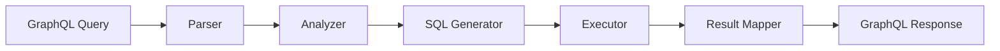

# Advanced Topics

Deep technical guides for FraiseQL v0.1.0 advanced features, performance optimization, and architectural patterns.

## Performance & Optimization

### [Performance Guide](./performance.md)
Complete guide to FraiseQL performance optimization including connection pooling, query optimization, caching strategies, and monitoring.

### [TurboRouter](./turbo-router.md)
High-performance direct SQL execution for registered queries, bypassing GraphQL parsing overhead for optimal response times.

### [Lazy Caching](./lazy-caching.md)
Database-native caching system that stores pre-computed GraphQL responses in PostgreSQL with automatic invalidation through bounded context version tracking, achieving sub-millisecond response times while preserving valuable historical data.

### [Eliminating N+1 Queries](./eliminating-n-plus-one.md)
Strategies for preventing N+1 query problems using composable SQL views and strategic DataLoader usage.

### [Performance Comparison](./performance-comparison.md)
Benchmarks and comparisons with other GraphQL frameworks.

## Architecture & Design Patterns

### [Domain-Driven Database](./domain-driven-database.md)
Implementing domain-driven design patterns directly in PostgreSQL with CQRS views and event sourcing.

### [Database API Patterns](./database-api-patterns.md)
Best practices for designing database schemas optimized for GraphQL APIs, including view composition and JSONB strategies.

### [LLM-Native Architecture](./llm-native-architecture.md)
How FraiseQL's design enables AI-assisted development with predictable patterns and self-documenting schemas.

## Configuration & Deployment

### [Configuration Reference](./configuration.md)
Complete reference for all FraiseQL configuration options, environment variables, and tuning parameters.

### [Authentication Patterns](./authentication.md)
Implementing authentication and authorization with Auth0, custom providers, and field-level security.

### [Security Best Practices](./security.md)
Production security guide covering SQL injection prevention, rate limiting, query complexity analysis, and CORS.

## Advanced Features

### [Pagination Patterns](./pagination.md)
Implementing efficient cursor-based and offset pagination with proper index usage and performance optimization.

### [Subscription Architecture](./subscriptions.md)
WebSocket-based real-time subscriptions with PostgreSQL LISTEN/NOTIFY and pub/sub patterns.

### [JSONB Optimization](./jsonb-optimization.md)
Leveraging PostgreSQL's JSONB capabilities for flexible schemas and efficient nested data queries.

## Key Concepts

### Query Translation Pipeline

FraiseQL's core innovation is its efficient GraphQL to SQL translation:



### Execution Modes

FraiseQL automatically selects the optimal execution mode:

1. **TurboRouter with Lazy Cache**
   - Pre-computed GraphQL responses
   - Sub-millisecond cache hits
   - Automatic invalidation via bounded contexts
   - Perfect for hot paths

2. **TurboRouter Direct SQL**
   - Pre-compiled SQL templates
   - Zero GraphQL parsing overhead
   - Fresh data every time

3. **JSON Passthrough**
   - Direct JSONB extraction
   - Minimal transformation
   - Ideal for view-based queries

4. **Standard Mode**
   - Full GraphQL processing
   - Maximum flexibility
   - Complex query support

### Connection Pool Architecture

```python
# Optimal pool configuration by load
config = FraiseQLConfig(
    database_pool_size=50,      # Base connections
    database_max_overflow=20,   # Burst capacity
    database_pool_timeout=10,   # Fast failure
)
```

**Sizing Guidelines**:
- Small apps: 10-20 connections
- Medium apps: 20-50 connections
- Large apps: 50-100 connections
- Enterprise: 100+ with read replicas

### Type System Performance

FraiseQL's type system is optimized for:

- **Zero-copy deserialization**: Direct PostgreSQL to JSON
- **Lazy field resolution**: Only compute requested fields
- **Batch loading**: Automatic N+1 prevention
- **Type caching**: Schema built once at startup

## Performance Estimates

*Note: The following performance figures are estimates provided for guidance. Actual performance will vary based on your hardware, database design, query complexity, and deployment configuration. We recommend conducting your own benchmarks for production planning.*

### Estimated Query Latencies (p95)

| Query Type | FraiseQL (est.) | Typical ORM-based (est.) |
|------------|-----------------|---------------------------|
| Simple fetch | < 5ms | 10-50ms |
| Nested 3-level | < 10ms | 50-200ms |
| List (100 items) | < 20ms | 100-500ms |
| Mutations | < 10ms | 20-100ms |

### Estimated Throughput Capability

| Scenario | Estimated Range |
|----------|-----------------|
| Simple queries | 1,000-10,000 req/s |
| Complex queries | 500-5,000 req/s |
| Mixed workload | 800-8,000 req/s |

*Estimates based on a 4-core server with optimized PostgreSQL configuration.*

### Resource Usage Estimates

| Metric | Estimated Range |
|--------|-----------------|
| Base memory | 40-60MB |
| Per connection | 1-3MB |
| Per 1000 req/s | 100-200MB additional |

## Architecture Decisions

### Why Direct SQL?

FraiseQL generates SQL directly rather than using an ORM because:

1. **Performance**: No ORM overhead or abstraction penalty
2. **Predictability**: SQL output is deterministic and optimizable
3. **PostgreSQL Features**: Full access to JSONB, CTEs, window functions
4. **Query Planning**: Leverage PostgreSQL's optimizer directly

### Why Views Over Joins?

FraiseQL recommends composable views because:

1. **Single Query**: Entire object graph in one round trip
2. **Index Usage**: Views can have optimized indexes
3. **Maintainability**: Business logic in database
4. **Performance**: PostgreSQL optimizes view queries

Example:
```sql
-- Composable view eliminates N+1
CREATE VIEW v_user_with_stats AS
SELECT
    u.*,
    jsonb_build_object(
        'post_count', COUNT(p.id),
        'comment_count', COUNT(c.id),
        'last_login', MAX(l.created_at)
    ) as stats
FROM users u
LEFT JOIN posts p ON p.author_id = u.id
LEFT JOIN comments c ON c.user_id = u.id
LEFT JOIN login_history l ON l.user_id = u.id
GROUP BY u.id;
```

### Why JSONB for Nested Data?

1. **Atomic Fetches**: Complete objects in single column
2. **Index Support**: GIN indexes for fast queries
3. **Flexibility**: Schema evolution without migrations
4. **Performance**: Native PostgreSQL optimization

## Security Architecture

### SQL Injection Prevention

FraiseQL uses multiple layers of protection:

1. **Parameterized Queries**: All values use placeholders
2. **Type Validation**: Strong typing prevents injection
3. **Query Analysis**: AST validation before execution
4. **Allowlist Mode**: TurboRouter only executes known queries

### Query Complexity Analysis

```python
# Automatic complexity scoring
config = FraiseQLConfig(
    complexity_enabled=True,
    complexity_max_score=1000,
    complexity_max_depth=10
)
```

Prevents:
- Deeply nested queries
- Expensive list operations
- Cartesian products
- Resource exhaustion

### Field-Level Authorization

```python
@fraise_type
class User:
    id: UUID          # Public
    email: str        # Public

    @field
    @requires_role("admin")
    def ssn(self) -> str:
        return self._ssn  # Admin only

    @field
    @requires_auth
    def private_notes(self) -> str:
        return self._notes  # Authenticated only
```

## Monitoring & Observability

### Built-in Metrics

FraiseQL provides Prometheus-compatible metrics:

- `fraiseql_query_duration_seconds`
- `fraiseql_query_complexity_score`
- `fraiseql_db_pool_connections`
- `fraiseql_cache_hit_ratio`
- `fraiseql_turbo_router_hits`

### Performance Profiling

```python
# Enable detailed timing
config = FraiseQLConfig(
    include_execution_metadata=True,
    enable_request_logging=True
)
```

Response includes:
```json
{
  "data": { ... },
  "extensions": {
    "execution_time_ms": 1.2,
    "mode": "turbo",
    "complexity_score": 15,
    "db_queries": 1
  }
}
```

## Production Checklist

### Essential Configuration

- [ ] Set `environment="production"`
- [ ] Disable introspection
- [ ] Enable TurboRouter
- [ ] Configure connection pool
- [ ] Set up monitoring
- [ ] Enable rate limiting
- [ ] Configure CORS properly
- [ ] Set query timeout
- [ ] Enable complexity analysis
- [ ] Set up error tracking

### Performance Tuning

- [ ] Create appropriate indexes
- [ ] Build composable views
- [ ] Register hot queries with TurboRouter
- [ ] Enable JSON passthrough
- [ ] Configure connection pool size
- [ ] Set up caching strategy
- [ ] Monitor slow queries
- [ ] Implement pagination
- [ ] Optimize JSONB columns
- [ ] Use read replicas for scale

## Next Steps

- [Performance Optimization](./performance.md) - Detailed tuning guide
- [TurboRouter Configuration](./turbo-router.md) - High-performance setup
- [Security Hardening](./security.md) - Production security
- [Monitoring Setup](./monitoring.md) - Observability configuration
