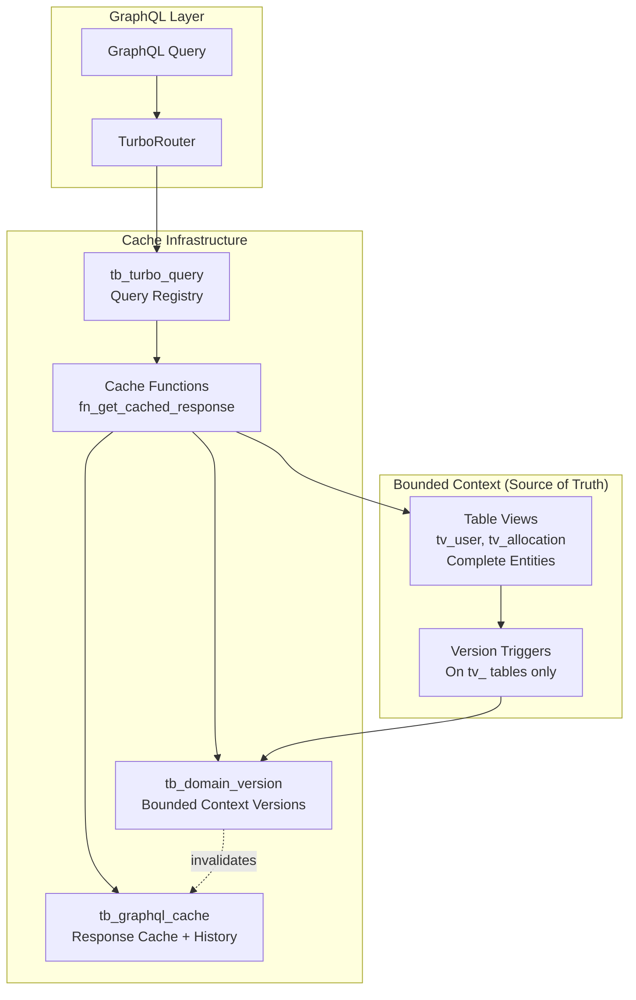

---
← [Authentication](./authentication.md) | [Advanced Index](./index.md) | [TurboRouter →](./turbo-router.md)
---

# Lazy Caching with TurboRouter

> **In this section:** Master database-native caching for sub-millisecond GraphQL responses
> **Prerequisites:** Understanding of caching strategies and PostgreSQL advanced features
> **Time to complete:** 35 minutes

Deep dive into FraiseQL's database-native lazy caching system that delivers sub-millisecond response times through pre-computed GraphQL responses stored directly in PostgreSQL.

## Overview

Lazy caching is FraiseQL's approach to achieving extreme performance by:
1. **Pre-computing complete GraphQL responses** at the database level
2. **Storing responses in PostgreSQL** alongside the data
3. **Automatic invalidation** through version tracking on bounded contexts
4. **Historical data preservation** as a valuable side effect
5. **Seamless integration** with TurboRouter for transparent caching

Unlike traditional application-level caching (Redis, Memcached), FraiseQL's lazy caching lives entirely within PostgreSQL, eliminating network overhead and external dependencies while providing an audit trail.

## Architecture

### Core Components



### Database Schema

```sql
-- 1. Cache Storage: Complete GraphQL responses with history
CREATE TABLE turbo.tb_graphql_cache (
    tenant_id UUID NOT NULL,
    query_type TEXT NOT NULL,      -- 'user', 'allocations', etc.
    query_key TEXT NOT NULL,        -- Unique identifier for this query instance
    response_json JSONB NOT NULL,   -- Complete GraphQL response
    record_count INT DEFAULT 0,
    cache_version BIGINT NOT NULL,  -- Version when cached
    created_at TIMESTAMP DEFAULT NOW(),
    updated_at TIMESTAMP DEFAULT NOW(),
    is_current BOOLEAN DEFAULT true, -- Current vs historical
    PRIMARY KEY (tenant_id, query_type, query_key, cache_version)
);

-- Partial unique index for current cache
CREATE UNIQUE INDEX idx_current_cache
ON turbo.tb_graphql_cache(tenant_id, query_type, query_key)
WHERE is_current = true;

-- 2. Version Tracking: Bounded context versions
CREATE TABLE turbo.tb_domain_version (
    tenant_id UUID NOT NULL,
    domain TEXT NOT NULL,           -- Bounded context: 'user', 'allocation', 'contract'
    version BIGINT NOT NULL DEFAULT 0,
    last_modified TIMESTAMP DEFAULT NOW(),
    modified_by TEXT,               -- For audit
    change_summary TEXT,            -- Optional change description
    PRIMARY KEY (tenant_id, domain)
);

-- Keep version history for audit
CREATE TABLE turbo.tb_domain_version_history (
    tenant_id UUID NOT NULL,
    domain TEXT NOT NULL,
    version BIGINT NOT NULL,
    modified_at TIMESTAMP NOT NULL,
    modified_by TEXT,
    change_summary TEXT,
    PRIMARY KEY (tenant_id, domain, version)
);
```

## Bounded Context Pattern

### Philosophy: tv_ Tables as Source of Truth

Table views (`tv_`) represent complete, denormalized entities that serve as the source of truth for their bounded context. Changes to these tables trigger cache invalidation for the entire context.

```sql
-- Example: tv_user_profile with proper Sacred Trinity + Foreign Key pattern
CREATE TABLE tv_user_profile (
    -- Sacred Trinity pattern
    id INTEGER GENERATED BY DEFAULT AS IDENTITY,
    pk_user_profile UUID DEFAULT gen_random_uuid() NOT NULL,

    -- Foreign key to source entity
    fk_user INTEGER NOT NULL,

    -- Multi-tenant support
    tenant_id UUID NOT NULL,

    -- Complete denormalized data including all relationships
    data JSONB NOT NULL,
    version INTEGER NOT NULL DEFAULT 1,
    updated_at TIMESTAMPTZ DEFAULT NOW(),
    updated_by TEXT,

    -- Constraints
    CONSTRAINT pk_tv_user_profile PRIMARY KEY (id),
    CONSTRAINT uq_tv_user_profile_pk UNIQUE (pk_user_profile),
    CONSTRAINT fk_tv_user_profile_user FOREIGN KEY (fk_user) REFERENCES tb_users(id),
    CONSTRAINT uq_tv_user_profile_user_tenant UNIQUE (fk_user, tenant_id)
);

-- Single trigger on the tv_ table handles all invalidation
CREATE TRIGGER tr_user_profile_context_version
AFTER INSERT OR UPDATE OR DELETE ON tv_user_profile
FOR EACH STATEMENT  -- More efficient than FOR EACH ROW
EXECUTE FUNCTION turbo.fn_increment_context_version('user');
```

### Version Increment Function

```sql
CREATE OR REPLACE FUNCTION turbo.fn_increment_context_version()
RETURNS TRIGGER AS $$
DECLARE
    v_domain TEXT;
    v_tenant_id UUID;
    v_old_version BIGINT;
BEGIN
    -- Extract bounded context from trigger argument
    v_domain := TG_ARGV[0];

    -- Get affected tenant(s)
    -- For INSERT/UPDATE use NEW, for DELETE use OLD
    IF TG_OP IN ('INSERT', 'UPDATE') THEN
        SELECT DISTINCT tenant_id INTO v_tenant_id
        FROM NEW;
    ELSE
        SELECT DISTINCT tenant_id INTO v_tenant_id
        FROM OLD;
    END IF;

    -- Archive current version
    INSERT INTO turbo.tb_domain_version_history
        (tenant_id, domain, version, modified_at, modified_by, change_summary)
    SELECT
        tenant_id,
        domain,
        version,
        last_modified,
        modified_by,
        change_summary
    FROM turbo.tb_domain_version
    WHERE tenant_id = v_tenant_id AND domain = v_domain;

    -- Increment version
    INSERT INTO turbo.tb_domain_version
        (tenant_id, domain, version, last_modified, modified_by, change_summary)
    VALUES (
        v_tenant_id,
        v_domain,
        1,
        NOW(),
        current_setting('app.user_id', true),
        format('%s on tv_%s', TG_OP, v_domain)
    )
    ON CONFLICT (tenant_id, domain) DO UPDATE
    SET version = turbo.tb_domain_version.version + 1,
        last_modified = NOW(),
        modified_by = current_setting('app.user_id', true),
        change_summary = format('%s on tv_%s', TG_OP, v_domain);

    RETURN NULL;
END;
$$ LANGUAGE plpgsql;
```

### Advantages of tv_ Table Triggers

1. **Single Point of Truth**: One trigger per bounded context instead of many
2. **Consistency**: All changes to the context flow through the tv_ table
3. **Simplicity**: No need to track which base tables affect which caches
4. **Performance**: Fewer triggers to maintain and execute
5. **Audit Trail**: Natural place to capture context-level changes

## Historical Data as a Feature

### Cache History for Time Travel

The massive storage used for caching becomes an asset for historical analysis:

```sql
-- Enhanced cache with history preservation
CREATE OR REPLACE FUNCTION turbo.fn_get_cached_response_with_history(
    p_query_type TEXT,
    p_query_key TEXT,
    p_domain TEXT,
    p_builder_function TEXT,
    p_params JSONB,
    p_preserve_history BOOLEAN DEFAULT true
)
RETURNS json AS $$
DECLARE
    v_tenant_id UUID;
    v_current_version BIGINT;
    v_cached_data RECORD;
    v_fresh_data JSONB;
BEGIN
    v_tenant_id := current_setting('app.tenant_id')::uuid;

    -- Get current domain version
    SELECT COALESCE(version, 0) INTO v_current_version
    FROM turbo.tb_domain_version
    WHERE tenant_id = v_tenant_id AND domain = p_domain;

    -- Try current cache
    SELECT response_json, cache_version INTO v_cached_data
    FROM turbo.tb_graphql_cache
    WHERE tenant_id = v_tenant_id
      AND query_type = p_query_type
      AND query_key = p_query_key
      AND is_current = true;

    -- Return if fresh
    IF v_cached_data.response_json IS NOT NULL
       AND v_cached_data.cache_version >= v_current_version THEN
        RETURN v_cached_data.response_json::json;
    END IF;

    -- Build fresh data
    EXECUTE format('SELECT %s(%L::jsonb)', p_builder_function, p_params)
    INTO v_fresh_data;

    IF p_preserve_history AND v_cached_data.response_json IS NOT NULL THEN
        -- Archive old cache entry
        UPDATE turbo.tb_graphql_cache
        SET is_current = false
        WHERE tenant_id = v_tenant_id
          AND query_type = p_query_type
          AND query_key = p_query_key
          AND is_current = true;
    END IF;

    -- Insert new cache entry
    INSERT INTO turbo.tb_graphql_cache
        (tenant_id, query_type, query_key, response_json,
         cache_version, is_current)
    VALUES
        (v_tenant_id, p_query_type, p_query_key, v_fresh_data,
         v_current_version, true)
    ON CONFLICT (tenant_id, query_type, query_key)
    WHERE is_current = true
    DO UPDATE SET
        response_json = EXCLUDED.response_json,
        cache_version = EXCLUDED.cache_version,
        updated_at = NOW();

    RETURN v_fresh_data::json;
END;
$$ LANGUAGE plpgsql;
```

### Time Travel Queries

Query historical state at any point:

```sql
-- Get user state at specific version
CREATE FUNCTION turbo.fn_get_historical_response(
    p_query_type TEXT,
    p_query_key TEXT,
    p_version BIGINT DEFAULT NULL,
    p_timestamp TIMESTAMP DEFAULT NULL
)
RETURNS json AS $$
BEGIN
    IF p_version IS NOT NULL THEN
        -- Get specific version
        RETURN (
            SELECT response_json::json
            FROM turbo.tb_graphql_cache
            WHERE tenant_id = current_setting('app.tenant_id')::uuid
              AND query_type = p_query_type
              AND query_key = p_query_key
              AND cache_version = p_version
        );
    ELSIF p_timestamp IS NOT NULL THEN
        -- Get state at timestamp
        RETURN (
            SELECT response_json::json
            FROM turbo.tb_graphql_cache
            WHERE tenant_id = current_setting('app.tenant_id')::uuid
              AND query_type = p_query_type
              AND query_key = p_query_key
              AND created_at <= p_timestamp
            ORDER BY created_at DESC
            LIMIT 1
        );
    END IF;
END;
$$ LANGUAGE plpgsql;

-- Example: Compare user profile over time
WITH historical_data AS (
    SELECT
        cache_version,
        created_at,
        response_json->'data'->'user'->>'name' as name,
        response_json->'data'->'user'->>'email' as email,
        jsonb_array_length(
            response_json->'data'->'user'->'posts'
        ) as post_count
    FROM turbo.tb_graphql_cache
    WHERE query_type = 'user'
      AND query_key = '123e4567-e89b-12d3-a456-426614174000'
    ORDER BY cache_version
)
SELECT * FROM historical_data;
```

### Audit and Compliance Benefits

```sql
-- Audit view: Track all changes to a bounded context
CREATE VIEW v_audit_trail AS
SELECT
    v.domain as bounded_context,
    v.version,
    v.modified_at,
    v.modified_by,
    v.change_summary,
    COUNT(DISTINCT c.query_key) as affected_entities,
    pg_size_pretty(
        SUM(pg_column_size(c.response_json))::bigint
    ) as cache_size_at_version
FROM turbo.tb_domain_version_history v
LEFT JOIN turbo.tb_graphql_cache c ON
    c.tenant_id = v.tenant_id
    AND c.cache_version = v.version
GROUP BY v.domain, v.version, v.modified_at, v.modified_by, v.change_summary
ORDER BY v.modified_at DESC;

-- Compliance: Prove data state at specific date
CREATE FUNCTION compliance.fn_get_data_state_at_date(
    p_date DATE,
    p_entity_type TEXT,
    p_entity_id TEXT
)
RETURNS TABLE(
    version BIGINT,
    data JSONB,
    captured_at TIMESTAMP
) AS $$
BEGIN
    RETURN QUERY
    SELECT
        cache_version as version,
        response_json as data,
        created_at as captured_at
    FROM turbo.tb_graphql_cache
    WHERE tenant_id = current_setting('app.tenant_id')::uuid
      AND query_type = p_entity_type
      AND query_key = p_entity_id
      AND created_at::date = p_date
    ORDER BY created_at;
END;
$$ LANGUAGE plpgsql;
```

## Storage Economics & Benefits

### Storage Investment Analysis

```sql
-- Analyze storage usage and value
CREATE VIEW v_cache_storage_analysis AS
WITH storage_stats AS (
    SELECT
        query_type as bounded_context,
        COUNT(*) FILTER (WHERE is_current) as current_entries,
        COUNT(*) FILTER (WHERE NOT is_current) as historical_entries,
        pg_size_pretty(
            SUM(pg_column_size(response_json))::bigint
        ) as total_storage,
        pg_size_pretty(
            AVG(pg_column_size(response_json))::bigint
        ) as avg_entry_size,
        MIN(created_at) as oldest_entry,
        MAX(created_at) as newest_entry
    FROM turbo.tb_graphql_cache
    GROUP BY query_type
),
value_stats AS (
    SELECT
        query_type,
        COUNT(*) as access_count,
        AVG(execution_time_ms) as avg_access_time_ms
    FROM turbo.tb_cache_metrics
    WHERE created_at > NOW() - INTERVAL '30 days'
    GROUP BY query_type
)
SELECT
    s.*,
    v.access_count as monthly_accesses,
    v.avg_access_time_ms,
    -- Calculate value: faster access * frequency
    ROUND(
        (v.access_count * v.avg_access_time_ms / 1000.0)::numeric,
        2
    ) as time_saved_seconds
FROM storage_stats s
LEFT JOIN value_stats v ON s.bounded_context = v.query_type
ORDER BY s.total_storage DESC;
```

### Benefits of Historical Cache

1. **Debugging**: See exact state when issue occurred
2. **Auditing**: Prove compliance at any point in time
3. **Analytics**: Analyze trends and changes over time
4. **Recovery**: Restore to previous state if needed
5. **Testing**: Replay historical scenarios

```sql
-- Example: Analyze business metrics evolution
CREATE VIEW v_business_metrics_timeline AS
SELECT
    DATE_TRUNC('day', created_at) as date,
    (response_json->'data'->'dashboard'->'metrics'->>'revenue')::numeric as daily_revenue,
    (response_json->'data'->'dashboard'->'metrics'->>'user_count')::int as active_users,
    (response_json->'data'->'dashboard'->'metrics'->>'order_count')::int as orders
FROM turbo.tb_graphql_cache
WHERE query_type = 'dashboard'
  AND query_key = 'executive_summary'
ORDER BY date;
```

## Implementation Patterns

### Pattern 1: Single Bounded Context

For a well-defined bounded context:

```sql
-- 1. Create table view as source of truth with proper pattern
CREATE TABLE tv_contract (
    -- Sacred Trinity pattern
    id INTEGER GENERATED BY DEFAULT AS IDENTITY,
    pk_contract UUID DEFAULT gen_random_uuid() NOT NULL,

    -- Foreign key to source entity
    fk_contract INTEGER NOT NULL,

    -- Multi-tenant support
    tenant_id UUID NOT NULL,

    -- Business data and versioning
    data JSONB NOT NULL,  -- Complete contract with all relationships
    version INTEGER NOT NULL DEFAULT 1,
    updated_at TIMESTAMPTZ DEFAULT NOW(),

    -- Constraints
    CONSTRAINT pk_tv_contract PRIMARY KEY (id),
    CONSTRAINT uq_tv_contract_pk UNIQUE (pk_contract),
    CONSTRAINT fk_tv_contract_source FOREIGN KEY (fk_contract) REFERENCES tb_contracts(id),
    CONSTRAINT uq_tv_contract_source_tenant UNIQUE (fk_contract, tenant_id)
);

-- 2. Single trigger for the context
CREATE TRIGGER tr_contract_version
AFTER INSERT OR UPDATE OR DELETE ON tv_contract
FOR EACH STATEMENT
EXECUTE FUNCTION turbo.fn_increment_context_version('contract');

-- 3. Register queries that depend on this context
INSERT INTO graphql.tb_turbo_query (operation_name, sql_template)
VALUES
    ('GetContract',
     'SELECT turbo.fn_get_cached_response(
         ''contract'', $1, ''contract'',
         ''contract.fn_build'',
         jsonb_build_object(''id'', $1)
     )'),
    ('ListContracts',
     'SELECT turbo.fn_get_cached_response(
         ''contracts'', ''all'', ''contract'',
         ''contract.fn_build_list'',
         jsonb_build_object(''limit'', $1)
     )');
```

### Pattern 2: Cross-Context Dependencies

When contexts depend on each other:

```sql
-- Allocation context depends on both machine and contract contexts
CREATE TABLE tv_allocation (
    id UUID PRIMARY KEY,
    tenant_id UUID NOT NULL,
    machine_id UUID NOT NULL,
    contract_id UUID NOT NULL,
    data JSONB NOT NULL,  -- Includes machine and contract data
    updated_at TIMESTAMP DEFAULT NOW()
);

-- Track multiple domain versions
CREATE FUNCTION turbo.fn_get_cached_multi_context(
    p_query_type TEXT,
    p_query_key TEXT,
    p_contexts TEXT[],  -- ['allocation', 'machine', 'contract']
    p_builder TEXT,
    p_params JSONB
)
RETURNS json AS $$
DECLARE
    v_max_version BIGINT;
BEGIN
    -- Get highest version across all contexts
    SELECT MAX(version) INTO v_max_version
    FROM turbo.tb_domain_version
    WHERE tenant_id = current_setting('app.tenant_id')::uuid
      AND domain = ANY(p_contexts);

    -- Rest follows standard pattern...
END;
$$ LANGUAGE plpgsql;
```

### Pattern 3: Materialized Aggregations

For expensive aggregations, combine with materialized views:

```sql
-- Materialized view refreshed by trigger
CREATE MATERIALIZED VIEW mv_allocation_summary AS
SELECT
    tenant_id,
    COUNT(*) as total_allocations,
    COUNT(DISTINCT machine_id) as unique_machines,
    COUNT(DISTINCT contract_id) as unique_contracts,
    jsonb_build_object(
        'by_status', jsonb_object_agg(status, count),
        'by_month', jsonb_object_agg(month, monthly_count)
    ) as aggregations
FROM (
    -- Complex aggregation logic
) agg
GROUP BY tenant_id;

-- Refresh on tv_allocation changes
CREATE OR REPLACE FUNCTION refresh_allocation_summary()
RETURNS TRIGGER AS $$
BEGIN
    REFRESH MATERIALIZED VIEW CONCURRENTLY mv_allocation_summary;
    RETURN NULL;
END;
$$ LANGUAGE plpgsql;

CREATE TRIGGER tr_refresh_summary
AFTER INSERT OR UPDATE OR DELETE ON tv_allocation
FOR EACH STATEMENT
EXECUTE FUNCTION refresh_allocation_summary();
```

## Performance Optimization

### Selective History Preservation

Not all queries need history:

```sql
-- Configure history preservation per query type
CREATE TABLE turbo.tb_cache_config (
    query_type TEXT PRIMARY KEY,
    preserve_history BOOLEAN DEFAULT false,
    history_retention_days INT DEFAULT 90,
    cache_ttl_hours INT DEFAULT 24
);

-- Cleanup job respecting configuration
CREATE FUNCTION turbo.fn_cleanup_cache_history()
RETURNS void AS $$
BEGIN
    -- Delete old history based on config
    DELETE FROM turbo.tb_graphql_cache c
    USING turbo.tb_cache_config cfg
    WHERE c.query_type = cfg.query_type
      AND NOT c.is_current
      AND (
        (NOT cfg.preserve_history) OR
        (c.created_at < NOW() - (cfg.history_retention_days || ' days')::interval)
      );

    -- Delete stale current cache
    DELETE FROM turbo.tb_graphql_cache c
    USING turbo.tb_cache_config cfg
    WHERE c.query_type = cfg.query_type
      AND c.is_current
      AND c.updated_at < NOW() - (cfg.cache_ttl_hours || ' hours')::interval;
END;
$$ LANGUAGE plpgsql;
```

### Compression Strategies

```sql
-- Enable TOAST compression
ALTER TABLE turbo.tb_graphql_cache
SET (
    toast_compression = lz4,
    fillfactor = 90
);

-- Compress historical entries more aggressively
CREATE FUNCTION turbo.fn_compress_old_cache()
RETURNS void AS $$
BEGIN
    -- Move old entries to compressed storage
    INSERT INTO turbo.tb_graphql_cache_compressed
    SELECT
        tenant_id,
        query_type,
        query_key,
        cache_version,
        compress(response_json::text) as response_compressed,
        created_at
    FROM turbo.tb_graphql_cache
    WHERE NOT is_current
      AND created_at < NOW() - INTERVAL '30 days';

    -- Delete from main table
    DELETE FROM turbo.tb_graphql_cache
    WHERE NOT is_current
      AND created_at < NOW() - INTERVAL '30 days';
END;
$$ LANGUAGE plpgsql;
```

## Monitoring & Observability

### Cache Effectiveness Dashboard

```sql
CREATE VIEW v_cache_dashboard AS
WITH context_stats AS (
    SELECT
        domain as bounded_context,
        version as current_version,
        last_modified,
        modified_by
    FROM turbo.tb_domain_version
),
cache_stats AS (
    SELECT
        query_type,
        COUNT(*) FILTER (WHERE is_current) as active_caches,
        COUNT(*) FILTER (WHERE NOT is_current) as historical_entries,
        MAX(cache_version) as latest_version,
        pg_size_pretty(SUM(pg_column_size(response_json))::bigint) as total_size
    FROM turbo.tb_graphql_cache
    GROUP BY query_type
),
performance_stats AS (
    SELECT
        query_type,
        COUNT(*) as requests_24h,
        AVG(CASE WHEN cache_hit THEN execution_time_ms END) as avg_hit_time_ms,
        AVG(CASE WHEN NOT cache_hit THEN execution_time_ms END) as avg_miss_time_ms,
        100.0 * COUNT(*) FILTER (WHERE cache_hit) / COUNT(*) as hit_rate
    FROM turbo.tb_cache_metrics
    WHERE created_at > NOW() - INTERVAL '24 hours'
    GROUP BY query_type
)
SELECT
    ctx.bounded_context,
    ctx.current_version,
    ctx.last_modified,
    c.active_caches,
    c.historical_entries,
    c.total_size,
    p.requests_24h,
    ROUND(p.hit_rate, 2) as hit_rate_percent,
    ROUND(p.avg_hit_time_ms, 2) as avg_hit_ms,
    ROUND(p.avg_miss_time_ms, 2) as avg_miss_ms
FROM context_stats ctx
LEFT JOIN cache_stats c ON ctx.bounded_context = c.query_type
LEFT JOIN performance_stats p ON ctx.bounded_context = p.query_type
ORDER BY p.requests_24h DESC NULLS LAST;
```

## Best Practices

### 1. Bounded Context Design

- **One tv_ table per context** as single source of truth
- **Complete denormalization** in tv_ tables
- **Single trigger** for version management
- **Clear context boundaries** following DDD principles

### 2. History Management

- **Selective preservation** based on business value
- **Compression** for old entries
- **Retention policies** to manage growth
- **Indexing strategy** for time-based queries

### 3. Version Granularity

- **Coarse-grained** for related changes
- **Fine-grained** for independent contexts
- **Batch updates** to minimize version churn

## Conclusion

FraiseQL's lazy caching with bounded context triggers provides:

- **Simplicity**: One trigger per context instead of many
- **Performance**: Sub-millisecond cached responses
- **History**: Time-travel and audit capabilities
- **Storage efficiency**: History becomes valuable rather than waste
- **Consistency**: Clear bounded context boundaries

The massive storage investment (7-10x) transforms from a cost into a valuable asset providing historical insights, audit trails, and debugging capabilities while delivering exceptional performance.
