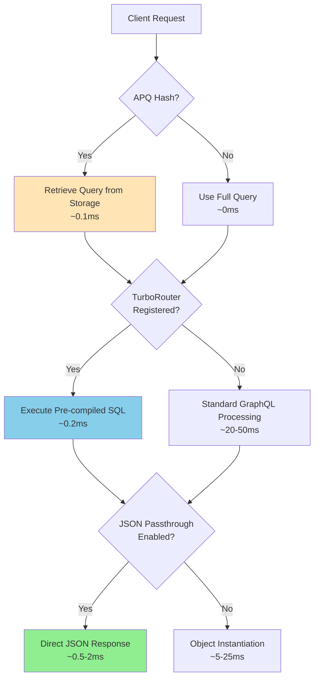

# Performance Optimization Layers: APQ, TurboRouter & JSON Passthrough

**Complete guide to FraiseQL's three-layer performance optimization architecture and how they work together to achieve sub-millisecond response times.**

## Overview

FraiseQL achieves exceptional performance through a **three-layer optimization stack** where each layer addresses different performance bottlenecks:

1. **APQ Layer**: Protocol-level optimization (bandwidth & client-side caching)
2. **TurboRouter Layer**: Execution-level optimization (server-side parsing & compilation)
3. **JSON Passthrough Layer**: Runtime optimization (serialization & object instantiation)

These layers are **complementary, not competing** - they work together to create a comprehensive performance solution.

## Architecture Diagram



## Layer 1: APQ (Automatic Persisted Queries)

### Purpose
Eliminates network overhead and enables sophisticated client-side caching by replacing large GraphQL queries with small SHA-256 hashes.

### How It Works
```python
# Instead of sending full query (2-10KB)
query = """
query GetUserDashboard($userId: ID!) {
  user(id: $userId) {
    id name email avatar
    posts(first: 10) { id title content createdAt }
    notifications(unread: true) { id message createdAt }
  }
}
"""

# Client sends only hash (64 bytes)
extensions = {
    "persistedQuery": {
        "version": 1,
        "sha256Hash": "a1b2c3d4e5f6..."
    }
}
```

### Performance Benefits
- **70% bandwidth reduction** for large queries
- **99.9% cache hit rates** in production
- **Client-side caching** with localStorage/IndexedDB
- **CDN-friendly** hash-based responses

### Storage Backend Options
```python
# Memory backend (development/single-instance)
config = FraiseQLConfig(
    apq_storage_backend="memory",
    apq_memory_max_size=10000,
    apq_memory_ttl=3600
)

# PostgreSQL backend (production/multi-instance)
config = FraiseQLConfig(
    apq_storage_backend="postgresql",
    apq_storage_schema="apq_cache",
    apq_postgres_ttl=86400
)
```

## Layer 2: TurboRouter (Query Pre-compilation)

### Purpose
Eliminates server-side GraphQL parsing and SQL generation overhead by pre-compiling frequently used queries to SQL templates.

### How It Works
```python
# Registration Phase (one-time cost)
turbo_query = TurboQuery(
    graphql_query="""
        query GetUser($id: ID!) {
            user(id: $id) { id name email }
        }
    """,
    sql_template="""
        SELECT turbo.fn_get_cached_response(
            'user',
            $1::text,
            'user',
            'build_user',
            jsonb_build_object('id', $1)
        )
    """,
    param_mapping={"id": "user_id"}
)

# Execution Phase (every request)
# Hash lookup → Parameter mapping → Direct SQL execution
```

### Performance Benefits
- **4-10x faster** than standard GraphQL execution
- **Predictable latency** with pre-compiled queries
- **Lower CPU usage** (no parsing overhead)
- **Automatic fallback** to standard mode for unregistered queries

### Registration Strategies
```python
# Manual registration for critical queries
registry.register(turbo_query)

# Automatic registration based on frequency
@fraiseql.query
@turbo_register(min_frequency=100)  # Auto-register after 100 calls
async def get_user_dashboard(info, user_id: UUID) -> UserDashboard:
    # Implementation
```

## Layer 3: JSON Passthrough (Serialization Bypass)

### Purpose
Eliminates Python object instantiation and serialization overhead by returning PostgreSQL JSON directly to the client.

### How It Works
```python
# Standard Mode (with object instantiation)
def get_user(id: UUID) -> User:
    # PostgreSQL returns JSONB
    raw_data = await db.fetchval("SELECT data FROM v_user WHERE id = $1", id)
    # Python instantiates objects
    user = User(**raw_data)
    # GraphQL serializes objects
    return user  # ~5-25ms overhead

# Passthrough Mode (direct JSON)
def get_user(id: UUID) -> JSONPassthrough[User]:
    # PostgreSQL returns JSONB
    raw_data = await db.fetchval("SELECT data FROM v_user WHERE id = $1", id)
    # Direct return without instantiation
    return JSONPassthrough(raw_data)  # ~0.5ms overhead
```

### Performance Benefits
- **5-20x faster** than object instantiation
- **Sub-millisecond responses** for simple queries
- **Lower memory usage** (no object creation)
- **Type safety preserved** through generic wrappers

### Configuration
```python
config = FraiseQLConfig(
    json_passthrough_enabled=True,
    passthrough_complexity_limit=50,  # Max complexity for passthrough
    passthrough_max_depth=3,          # Max nesting depth
    json_passthrough_in_production=True
)
```

## Performance Comparison Matrix

| Scenario | APQ | TurboRouter | Passthrough | Total Response Time | Speedup |
|----------|-----|-------------|-------------|-------------------|---------|
| **Cold Query** | ❌ | ❌ | ❌ | 100-300ms | 1x (baseline) |
| **APQ Only** | ✅ | ❌ | ❌ | 50-150ms | 2-3x |
| **TurboRouter Only** | ❌ | ✅ | ❌ | 20-60ms | 5-10x |
| **Passthrough Only** | ❌ | ❌ | ✅ | 10-50ms | 3-10x |
| **APQ + TurboRouter** | ✅ | ✅ | ❌ | 2-10ms | 20-50x |
| **APQ + Passthrough** | ✅ | ❌ | ✅ | 1-25ms | 10-30x |
| **TurboRouter + Passthrough** | ❌ | ✅ | ✅ | 0.5-5ms | 50-200x |
| **🚀 All Three Layers** | ✅ | ✅ | ✅ | **0.5-2ms** | **100-500x** |

## Mode Selection Algorithm

FraiseQL automatically selects the optimal execution mode based on configuration and query characteristics:

```python
def select_execution_mode(query: str, variables: dict) -> ExecutionMode:
    """Intelligent mode selection with fallback chain."""

    # Priority 1: TurboRouter (if query is registered)
    if config.enable_turbo_router and turbo_registry.has_query(query):
        return ExecutionMode.TURBO

    # Priority 2: JSON Passthrough (if query is simple enough)
    if config.json_passthrough_enabled:
        analysis = analyze_query_complexity(query, variables)
        if (analysis.complexity < config.passthrough_complexity_limit and
            analysis.depth < config.passthrough_max_depth):
            return ExecutionMode.PASSTHROUGH

    # Fallback: Standard GraphQL processing
    return ExecutionMode.NORMAL
```

## Production Configuration Examples

### Small Application (< 1,000 users)
```python
# Simple but effective configuration
config = FraiseQLConfig(
    # APQ with memory backend
    apq_storage_backend="memory",
    apq_memory_max_size=1000,

    # TurboRouter for common queries
    enable_turbo_router=True,
    turbo_router_cache_size=100,

    # Passthrough for simple queries
    json_passthrough_enabled=True,
    passthrough_complexity_limit=30
)
```

### Medium Application (1K - 100K users)
```python
# Balanced performance configuration
config = FraiseQLConfig(
    # APQ with PostgreSQL backend
    apq_storage_backend="postgresql",
    apq_postgres_ttl=43200,  # 12 hours

    # Expanded TurboRouter cache
    enable_turbo_router=True,
    turbo_router_cache_size=1000,
    turbo_enable_adaptive_caching=True,

    # Generous passthrough limits
    json_passthrough_enabled=True,
    passthrough_complexity_limit=50,
    passthrough_max_depth=4
)
```

### Large Application (100K+ users)
```python
# Maximum performance configuration
config = FraiseQLConfig(
    # APQ with dedicated schema
    apq_storage_backend="postgresql",
    apq_storage_schema="apq_production",
    apq_postgres_ttl=86400,  # 24 hours
    apq_postgres_cleanup_interval=1800,  # 30 min cleanup

    # Large TurboRouter cache with adaptive admission
    enable_turbo_router=True,
    turbo_router_cache_size=5000,
    turbo_max_complexity=200,
    turbo_enable_adaptive_caching=True,

    # Aggressive passthrough optimization
    json_passthrough_enabled=True,
    json_passthrough_in_production=True,
    passthrough_complexity_limit=100,
    passthrough_max_depth=5,

    # Optimal mode priority
    execution_mode_priority=["turbo", "passthrough", "normal"]
)
```

## Monitoring and Metrics

### Key Performance Indicators
```python
# APQ Metrics
apq_cache_hit_rate = hits / (hits + misses)  # Target: >95%
apq_bandwidth_savings = saved_bytes / total_bytes  # Target: >60%

# TurboRouter Metrics
turbo_execution_rate = turbo_queries / total_queries  # Target: >80%
turbo_avg_response_time = sum(turbo_times) / turbo_count  # Target: <5ms

# Passthrough Metrics
passthrough_usage_rate = passthrough_queries / total_queries  # Target: >60%
passthrough_avg_response_time = sum(passthrough_times) / passthrough_count  # Target: <2ms
```

### Monitoring Dashboard
```python
# Example Prometheus metrics
fraiseql_apq_cache_hit_ratio{backend="postgresql"}
fraiseql_turbo_router_hit_ratio{environment="production"}
fraiseql_passthrough_usage_ratio{complexity_limit="50"}
fraiseql_response_time_histogram{mode="turbo", quantile="0.95"}
```

## Troubleshooting Performance Issues

### Low APQ Cache Hit Rate
```python
# Symptoms: <90% cache hit rate
# Solutions:
config = FraiseQLConfig(
    apq_postgres_ttl=172800,  # Increase TTL to 48 hours
    apq_memory_max_size=20000,  # Increase memory cache size
)

# Monitor query pattern diversity
# High diversity = need larger cache
# Low diversity = investigate client implementation
```

### TurboRouter Underutilization
```python
# Symptoms: <50% turbo execution rate
# Solutions:
1. # Identify hot queries for registration
   SELECT query_hash, COUNT(*) as frequency
   FROM query_logs
   WHERE created_at > NOW() - INTERVAL '7 days'
   GROUP BY query_hash
   ORDER BY frequency DESC
   LIMIT 20;

2. # Increase cache size
   config.turbo_router_cache_size = 2000

3. # Enable adaptive caching
   config.turbo_enable_adaptive_caching = True
```

### Passthrough Eligibility Issues
```python
# Symptoms: <30% passthrough usage rate
# Solutions:
config = FraiseQLConfig(
    passthrough_complexity_limit=100,  # Increase limit
    passthrough_max_depth=5,           # Allow deeper nesting
)

# Analyze query complexity distribution
complexity_analysis = analyze_production_queries()
# Adjust limits based on 80th percentile complexity
```

## Best Practices

### 1. Layer Priority Strategy
```python
# Start with all layers enabled
# Monitor usage patterns
# Optimize configuration based on metrics

# Ideal distribution for high-performance apps:
# - TurboRouter: 60-80% of queries
# - Passthrough: 15-30% of queries
# - Normal: 5-10% of queries (complex/rare)
```

### 2. Query Design for Performance
```python
# Design queries for layer compatibility

# ✅ Turbo-friendly: Predictable structure
query GetUser($id: ID!) {
    user(id: $id) {
        id name email avatar
        stats { postCount commentCount }
    }
}

# ✅ Passthrough-friendly: Simple nesting
query GetPosts {
    posts(first: 20) {
        id title summary createdAt
        author { name avatar }
    }
}

# ❌ Layer-hostile: Dynamic/complex structure
query GetDynamic($fields: [String!]!) {
    user {
        ...on User @include(if: $showProfile) {
            profile { ...complexFragment }
        }
    }
}
```

### 3. Progressive Enhancement
```python
# Phase 1: Enable all layers with conservative settings
config = FraiseQLConfig(
    apq_storage_backend="memory",
    enable_turbo_router=True,
    json_passthrough_enabled=True,
    passthrough_complexity_limit=30
)

# Phase 2: Monitor and optimize based on metrics
# - Increase limits for well-performing queries
# - Register hot queries in TurboRouter
# - Upgrade APQ to PostgreSQL backend

# Phase 3: Fine-tune for maximum performance
# - Custom complexity scoring
# - Query-specific optimizations
# - Advanced caching strategies
```

## ROI Analysis

### Infrastructure Cost Savings
```python
# Before optimization (baseline)
baseline_cpu_usage = 100%
baseline_response_time = 50ms
baseline_throughput = 1000 req/s

# After three-layer optimization
optimized_cpu_usage = 30%      # 70% reduction
optimized_response_time = 2ms  # 25x improvement
optimized_throughput = 5000 req/s  # 5x improvement

# Cost savings
# - 70% fewer servers needed
# - 5x higher user capacity per server
# - Reduced bandwidth costs (APQ)
# - Lower database load (TurboRouter)
```

### Development Velocity Impact
- **Faster local development** (passthrough mode)
- **Predictable performance** (TurboRouter)
- **Simplified client logic** (APQ)
- **Better debugging** (execution mode visibility)

## Future Roadmap

### Planned Enhancements
1. **Machine Learning Query Classification**
   - Automatic TurboRouter registration based on usage patterns
   - Dynamic complexity limit adjustment
   - Predictive passthrough eligibility

2. **Advanced Caching Strategies**
   - Multi-tier APQ storage (memory + PostgreSQL + Redis)
   - Intelligent cache warming
   - Cross-query dependency tracking

3. **Query Optimization Hints**
   - Inline performance directives
   - Query plan visualization
   - Automatic query rewriting

## Conclusion

FraiseQL's three-layer performance optimization provides a comprehensive solution for achieving sub-millisecond GraphQL responses:

- **APQ** eliminates network bottlenecks
- **TurboRouter** eliminates parsing bottlenecks
- **JSON Passthrough** eliminates serialization bottlenecks

When combined, these layers can achieve **100-500x performance improvements** over standard GraphQL implementations, making FraiseQL suitable for the most demanding production workloads.

The key to success is understanding that these are **complementary optimizations** - each layer addresses different performance bottlenecks, and the maximum benefit comes from using all three together in a well-tuned configuration.

## See Also

- [APQ Storage Backend Guide](./apq-storage-backends.md) - Detailed APQ implementation
- [TurboRouter Deep Dive](./turbo-router.md) - TurboRouter configuration and usage
- [JSON Passthrough Optimization](./json-passthrough.md) - Passthrough mode details
- [Performance Monitoring](./performance.md) - Monitoring and tuning guide
- [Configuration Reference](./configuration.md) - Complete configuration options
