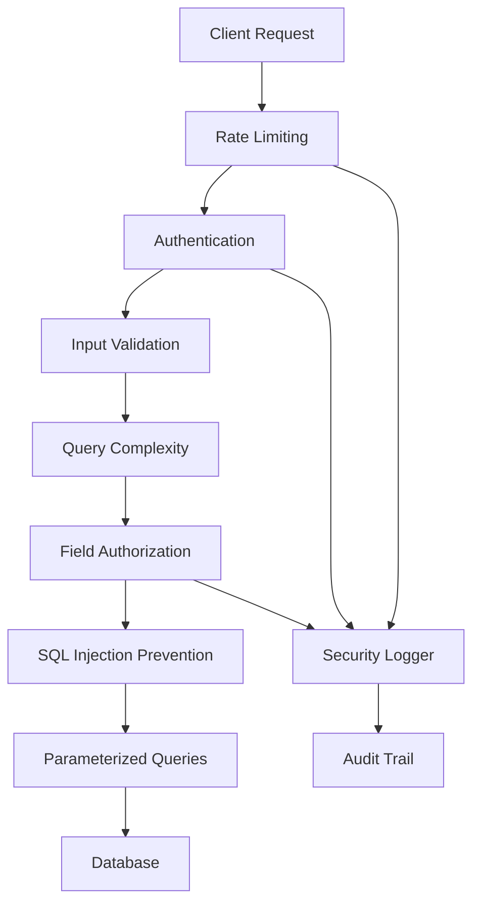

# Security Guide

Comprehensive security features and best practices for FraiseQL applications.

## Overview

FraiseQL provides multiple layers of security to protect your GraphQL API from common vulnerabilities and attacks. The framework implements defense-in-depth strategies with automatic protections, configurable security controls, and best practice patterns for secure API development.

## Architecture



## SQL Injection Prevention

FraiseQL uses multiple layers of protection against SQL injection attacks:

### Parameterized Queries

All SQL queries use parameterized statements with psycopg3's SQL composition:

```python
# FraiseQL automatically generates safe SQL
from psycopg.sql import SQL, Composed, Literal

# Never concatenates user input
# Always uses parameterized queries
query = SQL("SELECT * FROM v_user WHERE email = %s")
params = (user_email,)  # Safely escaped
```

### Input Validation

Before SQL generation, all inputs are validated for suspicious patterns:

```python
from fraiseql.security import InputValidator

# Automatic validation for all mutations
validator = InputValidator()
result = validator.validate_mutation_input({
    "email": "user@example.com",
    "name": "Robert'); DROP TABLE tb_users;--"  # Detected and blocked
})

if not result.is_valid:
    raise ValueError(f"Invalid input: {result.errors}")
```

### Suspicious Pattern Detection

The framework detects and blocks common injection patterns:

- SQL comments (`--`, `#`, `/* */`)
- Stacked queries (`;SELECT`, `;DROP`)
- Dangerous functions (`EXEC`, `xp_cmdshell`)
- Union select attempts
- Path traversal attempts (`../`, `..\\`)

### JSONB Safety

FraiseQL safely handles JSONB queries using PostgreSQL's native operators:

```python
# Safe JSONB extraction with type casting
# User input never directly concatenated
SQL("(data ->> %s)::text").format(Literal(field_name))
```

## Query Depth Limiting

Prevent DoS attacks through deeply nested queries:

```python
config = FraiseQLConfig(
    max_query_depth=10,  # Maximum nesting level
    complexity_max_depth=10,  # Complexity-based limit
    complexity_max_score=1000,  # Total complexity score limit
)
```

### Query Complexity Analysis

FraiseQL calculates query complexity before execution:

```graphql
# This query would be rejected if complexity > 1000
query {
  v_users(limit: 100) {  # Complexity: 100
    posts(limit: 10) {  # Complexity: 100 * 10 = 1000
      comments {  # Would exceed limit
        author {
          name
        }
      }
    }
  }
}
```

### Complexity Configuration

```python
config = FraiseQLConfig(
    complexity_enabled=True,
    complexity_max_score=1000,
    complexity_default_list_size=10,  # Assumed size for unbounded lists
    complexity_field_multipliers={
        "expensive_computation": 10,  # Custom multipliers
        "full_text_search": 5,
    },
    complexity_include_in_response=False,  # Hide from clients
)
```

## Rate Limiting

Protect against abuse and DoS attacks:

### Configuration

```python
config = FraiseQLConfig(
    rate_limit_enabled=True,
    rate_limit_requests_per_minute=60,
    rate_limit_requests_per_hour=1000,
    rate_limit_burst_size=10,  # Allow short bursts
    rate_limit_window_type="sliding",  # sliding or fixed window
    rate_limit_whitelist=["192.168.1.0/24"],  # Trusted IPs
    rate_limit_blacklist=["10.0.0.5"],  # Blocked IPs
)
```

### Custom Rate Limit Rules

```python
from fraiseql.security import RateLimit, RateLimitRule

# Different limits for different endpoints
rules = [
    RateLimitRule(
        path_pattern="/graphql",
        rate_limit=RateLimit(
            requests=100,
            window=60,  # seconds
            strategy="sliding_window"
        ),
        key_func=lambda req: req.client.host,  # Per IP
    ),
    RateLimitRule(
        path_pattern="/graphql/subscription",
        rate_limit=RateLimit(
            requests=10,
            window=60,
            burst=5,
        ),
    ),
]
```

### Rate Limit Strategies

1. **Fixed Window**: Resets at fixed intervals
2. **Sliding Window**: Smooth rate limiting
3. **Token Bucket**: Allows controlled bursts

## Field-Level Authorization

Control access to specific fields based on user permissions:

### Basic Field Authorization

```python
from fraiseql import fraise_type, field
from fraiseql.security import authorize_field

@fraise_type
class VUser:  # Maps to v_user view
    id: int
    name: str  # Public field

    @field
    @authorize_field(lambda info: info.context.get("is_admin", False))
    def email(self) -> str:
        """Only admins can see email addresses."""
        return self._email

    @field
    @authorize_field(
        lambda info, root: info.context.get("user_id") == root.id,
        error_message="You can only view your own phone number"
    )
    def phone(self) -> str:
        """Users can only see their own phone number."""
        return self._phone
```

### Role-Based Field Access

```python
def has_role(required_role: str):
    """Check if user has required role."""
    def check(info):
        user_roles = info.context.get("roles", [])
        return required_role in user_roles
    return check

@fraise_type
class VFinancialData:  # Maps to v_financial_data view
    @field
    @authorize_field(has_role("finance"))
    def revenue(self) -> float:
        return self._revenue

    @field
    @authorize_field(has_role("executive"))
    def profit_margin(self) -> float:
        return self._profit_margin
```

### Dynamic Field Authorization

```python
async def check_data_ownership(info, root):
    """Check if user owns the data."""
    user_id = info.context.get("user_id")
    if not user_id:
        return False

    # Check ownership in database
    pool = info.context["db_pool"]
    async with pool.connection() as conn:
        result = await conn.fetchone(
            "SELECT owner_id FROM v_sensitive_data WHERE id = %s",
            (root.id,)
        )
        return result and result["owner_id"] == user_id

@fraise_type
class VSensitiveData:  # Maps to v_sensitive_data view
    @field
    @authorize_field(check_data_ownership)
    def content(self) -> str:
        return self._content
```

## Row-Level Security

Integrate with PostgreSQL RLS for database-level security:

### PostgreSQL RLS Setup

```sql
-- Enable RLS on base table
ALTER TABLE tb_users ENABLE ROW LEVEL SECURITY;

-- Create policies
CREATE POLICY user_isolation ON tb_users
    FOR ALL
    USING (id = current_setting('app.current_user_id')::int);

-- Create view for GraphQL
CREATE VIEW v_user AS
SELECT * FROM tb_users
WHERE id = current_setting('app.current_user_id')::int;

-- Create table view for materialized access
CREATE MATERIALIZED VIEW tv_user_profiles AS
SELECT
    u.id,
    u.name,
    u.email,
    p.bio,
    p.avatar_url
FROM tb_users u
JOIN tb_profiles p ON u.id = p.user_id
WHERE u.active = true;

-- Refresh function for single record
CREATE FUNCTION refresh_tv_user_profile(p_user_id int)
RETURNS void AS $$
BEGIN
    -- Update specific record in table view
    DELETE FROM tv_user_profiles WHERE id = p_user_id;
    INSERT INTO tv_user_profiles
    SELECT
        u.id,
        u.name,
        u.email,
        p.bio,
        p.avatar_url
    FROM tb_users u
    JOIN tb_profiles p ON u.id = p.user_id
    WHERE u.id = p_user_id AND u.active = true;
END;
$$ LANGUAGE plpgsql;
```

### Application Integration

```python
@fraise_type
class VUser:  # Maps to v_user (filtered by RLS)
    """Automatically filtered by RLS policies."""
    id: int
    name: str
    email: str

@fraise_type
class TVUserProfile:  # Maps to tv_user_profiles (table view)
    """Materialized view with fast access."""
    id: int
    name: str
    email: str
    bio: str
    avatar_url: str

async def context_getter(request: Request) -> dict:
    """Set database session variables for RLS."""
    user_id = get_user_id_from_token(request)

    async with get_db_pool().connection() as conn:
        # Set session variable for RLS
        await conn.execute(
            "SET LOCAL app.current_user_id = %s",
            (user_id,)
        )

    return {
        "user_id": user_id,
        "db_conn": conn,
    }
```

## CORS Configuration

Configure Cross-Origin Resource Sharing for browser security:

```python
config = FraiseQLConfig(
    cors_enabled=True,
    cors_origins=[
        "https://app.example.com",
        "https://staging.example.com",
    ],
    cors_methods=["GET", "POST", "OPTIONS"],
    cors_headers=["Content-Type", "Authorization"],
)

# Development configuration
dev_config = FraiseQLConfig(
    cors_origins=["http://localhost:3000"],  # React dev server
    cors_methods=["*"],
    cors_headers=["*"],
)
```

## Secret Management

Best practices for handling sensitive configuration:

### Environment Variables

```python
import os
from fraiseql import FraiseQLConfig

config = FraiseQLConfig(
    database_url=os.getenv("DATABASE_URL"),  # Never hardcode
    auth0_domain=os.getenv("AUTH0_DOMAIN"),
    auth0_api_identifier=os.getenv("AUTH0_API_IDENTIFIER"),
)
```

### Secret Rotation

```python
import boto3
from fraiseql import FraiseQLConfig

def get_secret(secret_name: str) -> str:
    """Retrieve secret from AWS Secrets Manager."""
    client = boto3.client("secretsmanager")
    response = client.get_secret_value(SecretId=secret_name)
    return response["SecretString"]

config = FraiseQLConfig(
    database_url=get_secret("prod/database/url"),
    auth0_domain=get_secret("prod/auth0/domain"),
)
```

### Kubernetes Secrets

```yaml
apiVersion: v1
kind: Secret
metadata:
  name: fraiseql-secrets
type: Opaque
data:
  database-url: <base64-encoded-url>
  auth0-domain: <base64-encoded-domain>
```

## Audit Logging

Track security-relevant events:

### Security Event Logging

```python
from fraiseql.audit import get_security_logger

logger = get_security_logger()

# Automatic logging of security events
logger.log_authentication_attempt(user_id, success=True)
logger.log_authorization_failure(user_id, resource="VUser.email")
logger.log_rate_limit_exceeded(ip_address, endpoint="/graphql")
logger.log_suspicious_input(field="name", pattern="SQL injection attempt")
```

### Audit Trail Configuration

```python
config = FraiseQLConfig(
    audit_enabled=True,
    audit_log_level="INFO",
    audit_include_request_body=False,  # PII protection
    audit_include_response=False,
    audit_storage="database",  # database, file, or syslog
)
```

### Database Audit Table

```sql
-- Audit table for security events
CREATE TABLE tb_audit_log (
    id SERIAL PRIMARY KEY,
    event_type VARCHAR(50) NOT NULL,
    user_id INT,
    ip_address INET,
    resource VARCHAR(255),
    action VARCHAR(50),
    success BOOLEAN,
    details JSONB,
    created_at TIMESTAMP DEFAULT CURRENT_TIMESTAMP
);

-- View for recent audit events
CREATE VIEW v_recent_audit AS
SELECT * FROM tb_audit_log
WHERE created_at > NOW() - INTERVAL '7 days'
ORDER BY created_at DESC;

-- Table view for frequent queries
CREATE MATERIALIZED VIEW tv_user_audit_summary AS
SELECT
    user_id,
    COUNT(*) as total_events,
    COUNT(CASE WHEN success = false THEN 1 END) as failed_attempts,
    MAX(created_at) as last_activity
FROM tb_audit_log
GROUP BY user_id;
```

### Custom Audit Events

```python
from fraiseql.audit import audit_event

@audit_event("user_data_export")
async def export_user_data(user_id: int, format: str):
    """Audited function for compliance."""
    # Function is automatically logged to tb_audit_log
    data = await fetch_user_data(user_id)
    return format_data(data, format)
```

## XSS Prevention

Protect against Cross-Site Scripting attacks:

### Input Sanitization

```python
from fraiseql.security import InputValidator

validator = InputValidator()

# Automatically detects and blocks XSS patterns
result = validator.validate_field_value(
    "bio",
    "<script>alert('XSS')</script>",
    allow_html=False  # Blocks HTML tags
)

if not result.is_valid:
    # Contains: "Script tag detected"
    raise ValueError(result.errors)
```

### Content Security Policy

```python
from fastapi import FastAPI
from fastapi.middleware.trustedhost import TrustedHostMiddleware

app = create_fraiseql_app(...)

# Add security headers
@app.middleware("http")
async def add_security_headers(request, call_next):
    response = await call_next(request)
    response.headers["Content-Security-Policy"] = (
        "default-src 'self'; "
        "script-src 'self' 'unsafe-inline' https://cdn.jsdelivr.net; "
        "style-src 'self' 'unsafe-inline';"
    )
    response.headers["X-Content-Type-Options"] = "nosniff"
    response.headers["X-Frame-Options"] = "DENY"
    response.headers["X-XSS-Protection"] = "1; mode=block"
    return response
```

## Token Revocation

Manage compromised tokens:

```python
config = FraiseQLConfig(
    revocation_enabled=True,
    revocation_check_enabled=True,
    revocation_ttl=86400,  # 24 hours
    revocation_store_type="redis",  # or "memory"
)

# Revoke a token
from fraiseql.security import revoke_token

async def handle_logout(token: str):
    await revoke_token(token)
    return {"message": "Logged out successfully"}
```

### Token Revocation Storage

```sql
-- Table for revoked tokens
CREATE TABLE tb_revoked_tokens (
    token_hash VARCHAR(64) PRIMARY KEY,
    revoked_at TIMESTAMP DEFAULT CURRENT_TIMESTAMP,
    revoked_by INT REFERENCES tb_users(id),
    reason VARCHAR(255)
);

-- Index for fast lookups
CREATE INDEX idx_revoked_tokens_hash ON tb_revoked_tokens(token_hash);

-- View for active revocations
CREATE VIEW v_active_revocations AS
SELECT * FROM tb_revoked_tokens
WHERE revoked_at > NOW() - INTERVAL '24 hours';
```

## Security Checklist

### Development Phase
- [ ] Enable query depth limiting
- [ ] Configure rate limiting
- [ ] Set up input validation
- [ ] Implement field authorization
- [ ] Test SQL injection prevention
- [ ] Configure CORS appropriately
- [ ] Set up audit logging

### Pre-Production
- [ ] Disable GraphQL introspection
- [ ] Disable GraphQL playground
- [ ] Review all field authorizations
- [ ] Test rate limiting under load
- [ ] Verify secret management
- [ ] Set up monitoring and alerting
- [ ] Perform security scan

### Production Deployment
- [ ] Use HTTPS only
- [ ] Implement proper authentication
- [ ] Enable all security features
- [ ] Configure firewall rules
- [ ] Set up DDoS protection
- [ ] Implement backup and recovery
- [ ] Regular security updates

## Common Vulnerabilities

### Vulnerability: Exposed GraphQL Schema
**Risk**: Attackers can explore your entire API structure.
**Mitigation**:
```python
config = FraiseQLConfig(
    environment="production",
    enable_introspection=False,  # Hide schema
    enable_playground=False,  # No GraphQL IDE
)
```

### Vulnerability: N+1 Query Attacks
**Risk**: Malicious queries causing database overload.
**Mitigation**:
```python
config = FraiseQLConfig(
    complexity_max_score=500,  # Limit complexity
    rate_limit_requests_per_minute=30,  # Throttle requests
    max_query_depth=5,  # Shallow queries only
)
```

### Vulnerability: Authorization Bypass
**Risk**: Users accessing unauthorized data.
**Mitigation**: Use field-level authorization and RLS:
```python
@field
@authorize_field(check_ownership)
def sensitive_data(self) -> str:
    return self._data
```

### Vulnerability: SQL Injection
**Risk**: Database compromise through malicious input.
**Mitigation**: FraiseQL automatically uses parameterized queries and input validation.

## Best Practices

### 1. Defense in Depth
Layer multiple security controls:
```python
# Multiple layers of protection
config = FraiseQLConfig(
    # Layer 1: Rate limiting
    rate_limit_enabled=True,
    # Layer 2: Query complexity
    complexity_enabled=True,
    # Layer 3: Input validation
    validation_enabled=True,
    # Layer 4: Field authorization
    auth_enabled=True,
)
```

### 2. Principle of Least Privilege
Grant minimum necessary permissions:
```python
@fraise_type
class VUser:  # Maps to v_user view
    # Public fields
    id: int
    username: str

    # Restricted fields
    @field
    @authorize_field(is_self_or_admin)
    def email(self) -> str:
        return self._email
```

### 3. Secure Defaults
Start with restrictive settings:
```python
config = FraiseQLConfig(
    environment="production",
    enable_introspection=False,
    enable_playground=False,
    auth_enabled=True,
    rate_limit_enabled=True,
    complexity_max_score=100,  # Start low, increase as needed
)
```

### 4. Regular Security Audits
```python
# Enable comprehensive audit logging
config = FraiseQLConfig(
    audit_enabled=True,
    audit_log_suspicious_patterns=True,
    audit_log_authorization_failures=True,
    audit_log_rate_limit_violations=True,
)
```

## Troubleshooting

### Issue: Legitimate Queries Blocked
**Solution**: Adjust validation sensitivity:
```python
config = FraiseQLConfig(
    complexity_max_score=2000,  # Increase limit
    rate_limit_requests_per_minute=100,  # More requests
    validation_strict_mode=False,  # Less strict
)
```

### Issue: Performance Impact from Security
**Solution**: Optimize security checks:
```python
config = FraiseQLConfig(
    # Cache authorization results
    auth_cache_ttl=300,
    # Consider rate limiting at the reverse proxy level (nginx, Cloudflare)
    # to avoid additional infrastructure dependencies
    # Async validation
    validation_async=True,
)
```

### Issue: False Positive SQL Injection Detection
**Solution**: Customize validation patterns:
```python
from fraiseql.security import InputValidator

# Customize validator for your use case
class CustomValidator(InputValidator):
    SUSPICIOUS_SQL_PATTERNS = [
        # Remove patterns that cause false positives
        # Add domain-specific patterns
    ]
```

## See Also

- [Configuration Reference](./configuration.md) - Security configuration options
- [Authentication Patterns](./authentication.md) - Authentication implementation
- [Performance Guide](./performance.md) - Security vs performance trade-offs
- [Audit System](./audit-system.md) - Comprehensive audit logging
- [Best Practices](../best-practices/index.md) - Security best practices
