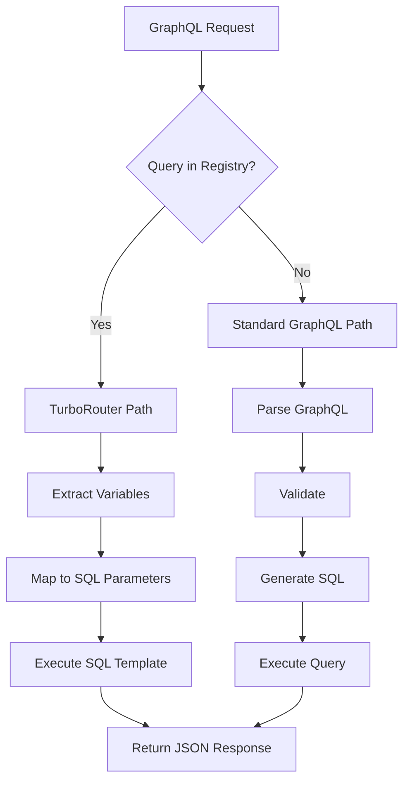

# TurboRouter Deep Dive

Technical documentation for FraiseQL's TurboRouter - a high-performance query execution engine that bypasses GraphQL parsing for pre-registered queries.

## Architecture Overview

TurboRouter is FraiseQL's solution for achieving sub-millisecond query latencies by:

1. **Pre-compiling** GraphQL queries to SQL templates
2. **Caching** parsed query structures
3. **Direct execution** without GraphQL overhead
4. **Parameter mapping** for security and flexibility



## How TurboRouter Works

### Query Registration

TurboRouter maintains a registry of pre-validated query patterns:

```python
from fraiseql.fastapi import TurboRegistry, TurboQuery

class TurboQuery:
    graphql_query: str      # Original GraphQL query
    sql_template: str       # Pre-generated SQL (often calls lazy cache)
    param_mapping: dict     # Variable mapping
    operation_name: str     # Optional operation name
```

### Execution Flow

1. **Query Hashing**: Incoming queries are normalized and hashed
2. **Registry Lookup**: Hash checked against registered queries
3. **Variable Extraction**: GraphQL variables extracted from request
4. **Parameter Mapping**: Variables mapped to SQL parameters
5. **Direct Execution**: SQL template executed with parameters
6. **Lazy Cache Check**: SQL often calls cache functions for instant responses
7. **JSON Response**: Results returned directly as JSON

### Integration with Lazy Caching

TurboRouter achieves sub-millisecond performance by combining with [Lazy Caching](./lazy-caching.md):

```sql
-- SQL template in TurboRouter often calls cache functions
sql_template = 'SELECT turbo.fn_get_cached_response(
    ''user'',           -- query type
    $1::text,          -- query key
    ''user'',          -- bounded context
    ''build_user'',    -- builder function
    jsonb_build_object(''id'', $1)
)'
```

This means:
- **Cache hit**: < 1ms response (just fetching pre-computed JSON)
- **Cache miss**: 5-10ms response (rebuild from table views, then cache)
- **No GraphQL overhead**: Direct SQL execution bypasses parsing

## Configuration

### Basic Setup

```python
from fraiseql import create_fraiseql_app
from fraiseql.fastapi import FraiseQLConfig, TurboRegistry

# Configure TurboRouter
config = FraiseQLConfig(
    database_url="postgresql://...",
    enable_turbo_router=True,
    turbo_router_cache_size=1000,
    turbo_max_complexity=100,
    turbo_enable_adaptive_caching=True,
)

# Create registry
turbo_registry = TurboRegistry(max_size=1000)

# Create app with TurboRouter
app = create_fraiseql_app(
    config=config,
    turbo_registry=turbo_registry,
    types=[User, Post, Comment]
)
```

### Advanced Configuration

```python
config = FraiseQLConfig(
    # TurboRouter settings
    enable_turbo_router=True,
    turbo_router_cache_size=2000,  # Max cached queries

    # Adaptive caching
    turbo_enable_adaptive_caching=True,
    turbo_max_complexity=150,  # Max complexity to cache
    turbo_max_total_weight=5000.0,  # Total cache weight limit

    # Auto-registration
    turbo_router_auto_register=False,  # Manual registration only

    # Execution priority
    execution_mode_priority=["turbo", "passthrough", "normal"],
)
```

## Registering Queries

### Manual Registration

```python
from fraiseql.fastapi import TurboQuery

# Simple query registration
get_user_query = TurboQuery(
    graphql_query="""
        query GetUser($id: UUID!) {
            getUser(id: $id) {
                id
                name
                email
                createdAt
            }
        }
    """,
    sql_template="""
        SELECT
            id::text as id,
            name,
            email,
            created_at::text as "createdAt"
        FROM v_user
        WHERE id = %(id)s
    """,
    param_mapping={"id": "id"},
    operation_name="GetUser"
)

turbo_registry.register(get_user_query)
```

### Complex Query Registration

```python
# Query with nested data
user_with_posts = TurboQuery(
    graphql_query="""
        query UserWithPosts($userId: UUID!, $limit: Int = 10) {
            user(id: $userId) {
                id
                name
                posts(limit: $limit) {
                    id
                    title
                    content
                    createdAt
                }
            }
        }
    """,
    sql_template="""
        SELECT jsonb_build_object(
            'user', jsonb_build_object(
                'id', u.id::text,
                'name', u.name,
                'posts', (
                    SELECT jsonb_agg(
                        jsonb_build_object(
                            'id', p.id::text,
                            'title', p.title,
                            'content', p.content,
                            'createdAt', p.created_at::text
                        )
                    )
                    FROM (
                        SELECT * FROM posts
                        WHERE author_id = u.id
                        ORDER BY created_at DESC
                        LIMIT %(limit)s
                    ) p
                )
            )
        ) as data
        FROM v_user u
        WHERE u.id = %(userId)s
    """,
    param_mapping={
        "userId": "userId",
        "limit": "limit"
    }
)
```

### Batch Registration

```python
# Register multiple queries at startup
def register_turbo_queries(registry: TurboRegistry):
    queries = [
        # User queries
        TurboQuery(
            graphql_query="query GetUser($id: UUID!) { ... }",
            sql_template="SELECT * FROM v_user WHERE id = %(id)s",
            param_mapping={"id": "id"}
        ),
        # Post queries
        TurboQuery(
            graphql_query="query GetPost($id: UUID!) { ... }",
            sql_template="SELECT * FROM v_post WHERE id = %(id)s",
            param_mapping={"id": "id"}
        ),
        # List queries
        TurboQuery(
            graphql_query="query ListPosts($limit: Int!) { ... }",
            sql_template="SELECT * FROM v_post LIMIT %(limit)s",
            param_mapping={"limit": "limit"}
        ),
    ]

    for query in queries:
        registry.register(query)
```

## Performance Characteristics

### Latency Comparison

*Note: These are estimates for guidance. Actual performance varies by setup.*

| Operation | Standard Mode | TurboRouter | Improvement |
|-----------|--------------|-------------|-------------|
| Parse GraphQL | ~0.5ms | 0ms | Skip |
| Validate | ~0.3ms | 0ms | Skip |
| Generate SQL | ~0.2ms | 0ms | Pre-generated |
| Total Overhead | ~1ms | ~0.05ms | 20x faster |

### Memory Usage

```python
# Memory per cached query (approximate)
query_memory = {
    "query_hash": 64,  # bytes for SHA-256
    "sql_template": 500,  # Average SQL size
    "param_mapping": 100,  # Mapping metadata
    "total": 664  # bytes per query
}

# For 1000 cached queries
total_memory = 1000 * 664  # ~650 KB
```

## Query Patterns

### Simple Lookups

Perfect for TurboRouter - frequently called, simple structure:

```python
# ID-based lookups
TurboQuery(
    graphql_query="""
        query GetById($table: String!, $id: UUID!) {
            getRecord(table: $table, id: $id) {
                data
            }
        }
    """,
    sql_template="""
        SELECT data
        FROM %(table)s
        WHERE id = %(id)s
    """,
    param_mapping={"table": "table", "id": "id"}
)
```

### Paginated Lists

Common pattern with consistent structure:

```python
TurboQuery(
    graphql_query="""
        query ListItems(
            $limit: Int = 20,
            $offset: Int = 0,
            $orderBy: String = "created_at"
        ) {
            items(limit: $limit, offset: $offset, orderBy: $orderBy) {
                edges {
                    node {
                        id
                        name
                        createdAt
                    }
                }
                pageInfo {
                    hasNextPage
                    total
                }
            }
        }
    """,
    sql_template="""
        WITH items_cte AS (
            SELECT *, COUNT(*) OVER() as total_count
            FROM v_item
            ORDER BY %(orderBy)s
            LIMIT %(limit)s
            OFFSET %(offset)s
        )
        SELECT jsonb_build_object(
            'items', jsonb_build_object(
                'edges', jsonb_agg(
                    jsonb_build_object(
                        'node', jsonb_build_object(
                            'id', id::text,
                            'name', name,
                            'createdAt', created_at::text
                        )
                    )
                ),
                'pageInfo', jsonb_build_object(
                    'hasNextPage',
                    COALESCE(MAX(total_count), 0) > %(offset)s + %(limit)s,
                    'total', COALESCE(MAX(total_count), 0)
                )
            )
        ) as data
        FROM items_cte
    """,
    param_mapping={
        "limit": "limit",
        "offset": "offset",
        "orderBy": "orderBy"
    }
)
```

### Search Queries

Structured search with consistent parameters:

```python
TurboQuery(
    graphql_query="""
        query SearchUsers($term: String!, $limit: Int = 10) {
            searchUsers(term: $term, limit: $limit) {
                id
                name
                email
                matchScore
            }
        }
    """,
    sql_template="""
        SELECT jsonb_agg(
            jsonb_build_object(
                'id', id::text,
                'name', name,
                'email', email,
                'matchScore', ts_rank(search_vector, query)
            )
        ) as data
        FROM v_user,
             plainto_tsquery('english', %(term)s) query
        WHERE search_vector @@ query
        ORDER BY ts_rank(search_vector, query) DESC
        LIMIT %(limit)s
    """,
    param_mapping={"term": "term", "limit": "limit"}
)
```

## Security Considerations

### SQL Injection Prevention

TurboRouter maintains security through:

1. **Parameterized queries** - All values use placeholders
2. **Pre-validation** - Queries validated at registration
3. **Type checking** - Variable types enforced
4. **No dynamic SQL** - Templates are static

```python
# Safe: Uses parameters
sql_template = "SELECT * FROM users WHERE id = %(id)s"

# Unsafe: Would be rejected at registration
sql_template = f"SELECT * FROM users WHERE id = {id}"  # Never do this
```

### Query Validation

```python
def validate_turbo_query(query: TurboQuery) -> bool:
    """Validate query before registration."""

    # Check for SQL injection patterns
    forbidden_patterns = [
        "--;", "/*", "*/", "xp_", "sp_",
        "DROP", "DELETE", "INSERT", "UPDATE"
    ]

    for pattern in forbidden_patterns:
        if pattern.upper() in query.sql_template.upper():
            raise ValueError(f"Forbidden pattern in SQL: {pattern}")

    # Ensure all parameters are mapped
    import re
    sql_params = re.findall(r'%\((\w+)\)s', query.sql_template)
    for param in sql_params:
        if param not in query.param_mapping.values():
            raise ValueError(f"Unmapped parameter: {param}")

    return True
```

## Monitoring TurboRouter

### Metrics

```python
from prometheus_client import Counter, Histogram

turbo_hits = Counter(
    'fraiseql_turbo_router_hits',
    'TurboRouter cache hits'
)

turbo_misses = Counter(
    'fraiseql_turbo_router_misses',
    'TurboRouter cache misses'
)

turbo_execution_time = Histogram(
    'fraiseql_turbo_execution_seconds',
    'TurboRouter execution time'
)
```

### Debug Logging

```python
import logging

logging.basicConfig(level=logging.DEBUG)
logger = logging.getLogger("fraiseql.turbo")

# Enable TurboRouter debug logs
config = FraiseQLConfig(
    log_level="DEBUG",
    enable_request_logging=True,
)
```

### Performance Analysis

```python
# Track TurboRouter effectiveness
@app.on_event("shutdown")
async def analyze_turbo_performance():
    stats = turbo_registry.get_stats()

    print(f"TurboRouter Statistics:")
    print(f"  Total queries: {stats['total_queries']}")
    print(f"  Cache hits: {stats['hits']} ({stats['hit_rate']:.1%})")
    print(f"  Cache misses: {stats['misses']}")
    print(f"  Avg execution time: {stats['avg_execution_ms']:.2f}ms")
    print(f"  Memory usage: {stats['memory_bytes'] / 1024:.1f}KB")
```

## Best Practices

### When to Use TurboRouter

**Ideal for:**
- Frequently called queries (> 100 calls/min)
- Simple to moderate complexity
- Stable query patterns
- Mobile/web app queries
- Public API endpoints

**Not recommended for:**
- Ad-hoc queries
- Highly dynamic queries
- Rarely used queries
- Development/debugging

### Registration Strategy

```python
# 1. Identify hot queries from logs
SELECT
    query_fingerprint,
    calls,
    mean_exec_time
FROM pg_stat_statements
WHERE calls > 1000
ORDER BY calls DESC;

# 2. Generate SQL templates
def generate_sql_template(graphql_query: str) -> str:
    """Generate SQL from GraphQL for registration."""
    # Use FraiseQL's SQL generator
    from fraiseql.core import translate_query
    return translate_query(graphql_query)

# 3. Register progressively
def progressive_registration(registry: TurboRegistry):
    """Register queries based on usage patterns."""

    # Phase 1: Critical queries (login, auth)
    register_auth_queries(registry)

    # Phase 2: Common lookups
    register_lookup_queries(registry)

    # Phase 3: List/search queries
    register_list_queries(registry)

    # Phase 4: Analytics queries
    if config.environment == "production":
        register_analytics_queries(registry)
```

### Cache Management

```python
# Implement cache warming
async def warm_turbo_cache(app: FastAPI):
    """Pre-warm TurboRouter cache on startup."""

    common_queries = load_common_queries()

    for query in common_queries:
        turbo_registry.register(query)

    logger.info(f"Warmed TurboRouter with {len(common_queries)} queries")

# Periodic cache analysis
async def analyze_cache_effectiveness():
    """Analyze and optimize cache contents."""

    stats = turbo_registry.get_query_stats()

    # Remove rarely used queries
    for query_hash, stats in stats.items():
        if stats['calls'] < 10 and stats['age_hours'] > 24:
            turbo_registry.evict(query_hash)

    # Log cache effectiveness
    logger.info(f"Cache hit rate: {stats['hit_rate']:.1%}")
```

## Troubleshooting

### Query Not Using TurboRouter

**Check:**
1. Query registered correctly
2. Query normalization matches
3. TurboRouter enabled in config
4. Complexity within limits

```python
# Debug why query isn't cached
def debug_turbo_miss(query: str):
    normalized = turbo_registry.normalize_query(query)
    query_hash = turbo_registry.hash_query(normalized)

    if query_hash not in turbo_registry._queries:
        print(f"Query not registered. Hash: {query_hash}")
        print(f"Normalized: {normalized}")
    else:
        print(f"Query found but not executed via TurboRouter")
```

### Performance Degradation

**Common causes:**
1. Cache thrashing (size too small)
2. Complex queries in cache
3. Database connection issues

**Solution:**
```python
# Increase cache size
config.turbo_router_cache_size = 5000

# Limit complexity
config.turbo_max_complexity = 50

# Monitor cache metrics
turbo_registry.enable_metrics()
```

## Integration Examples

### With Authentication

```python
# Secure TurboRouter queries
secure_user_query = TurboQuery(
    graphql_query="""
        query GetMyProfile {
            me {
                id
                name
                email
                role
            }
        }
    """,
    sql_template="""
        SELECT jsonb_build_object(
            'me', jsonb_build_object(
                'id', id::text,
                'name', name,
                'email', email,
                'role', role
            )
        ) as data
        FROM v_user
        WHERE id = %(user_id)s
    """,
    param_mapping={},  # user_id injected from context
    requires_auth=True  # Custom flag for auth check
)
```

### With Caching

```python
# Combine TurboRouter with Redis caching
class CachedTurboRouter(TurboRouter):
    def __init__(self, registry, cache):
        super().__init__(registry)
        self.cache = cache

    async def execute(self, query, variables, context):
        # Check cache first
        cache_key = self.get_cache_key(query, variables)
        cached = await self.cache.get(cache_key)
        if cached:
            return cached

        # Execute via TurboRouter
        result = await super().execute(query, variables, context)

        # Cache result
        if result:
            await self.cache.set(cache_key, result, ttl=300)

        return result
```

## Lazy Caching Integration

TurboRouter's true power comes from integration with [Lazy Caching](./lazy-caching.md). Instead of just bypassing GraphQL parsing, registered queries can leverage pre-computed responses stored in PostgreSQL.

### Architecture Overview


### Real-World Implementation

From the PrintOptim system:

```python
# 1. Load queries from database with cache-enabled SQL templates
async def load_queries(self, turbo_registry):
    sql = """
    SELECT
        query_hash,
        operation_name,
        graphql_query,
        sql_template,  -- Points to lazy cache functions
        param_mapping
    FROM graphql.tb_turbo_query
    WHERE is_active = true
    ORDER BY execution_count DESC  -- Prioritize hot queries
    """

    for row in queries:
        turbo_query = TurboQuery(
            graphql_query=row["graphql_query"],
            sql_template=row["sql_template"],  # Uses fn_get_cached_response
            param_mapping=row["param_mapping"]
        )
        turbo_registry.register(turbo_query)
```

### Cache-Enabled SQL Templates

```sql
-- Traditional TurboRouter: Direct SQL
sql_template = 'SELECT * FROM v_user WHERE id = $1'

-- With Lazy Caching: Cache function
sql_template = 'SELECT turbo.fn_get_cached_response(
    ''user'', $1::text, ''user'',
    ''user.fn_build'', jsonb_build_object(''id'', $1)
)'
```

### Performance Impact

| Scenario | Without Cache | With Lazy Cache | Improvement |
|----------|--------------|-----------------|-------------|
| Simple query | 5-10ms | < 1ms (hit) | 10x |
| Complex nested | 20-50ms | < 1ms (hit) | 50x |
| Aggregations | 100-500ms | < 1ms (hit) | 500x |
| Cache miss | N/A | 5-10ms | Still fast |

### Bounded Context Triggers

The lazy cache is automatically invalidated when the bounded context changes:

```sql
-- Single trigger on tv_ table (source of truth)
CREATE TRIGGER tr_user_context
AFTER INSERT OR UPDATE OR DELETE ON tv_user
FOR EACH STATEMENT
EXECUTE FUNCTION turbo.fn_increment_context_version('user');

-- All cached queries for 'user' context are automatically refreshed
```

### Best Practices for Cache Integration

1. **Register hot queries first** - Focus on frequently executed queries
2. **Use bounded contexts** - Group related queries by domain
3. **Monitor cache hit rates** - Aim for >90% hit rate
4. **Set appropriate TTLs** - Fallback for long-lived cache entries
5. **Preserve history selectively** - Not all queries need historical data

## Next Steps

- [Lazy Caching Deep Dive](./lazy-caching.md) - Complete caching architecture
- [Performance Guide](./performance.md) - General optimization strategies
- [Database API Patterns](./database-api-patterns.md) - Optimal schema design
- [Monitoring](./monitoring.md) - Production observability
