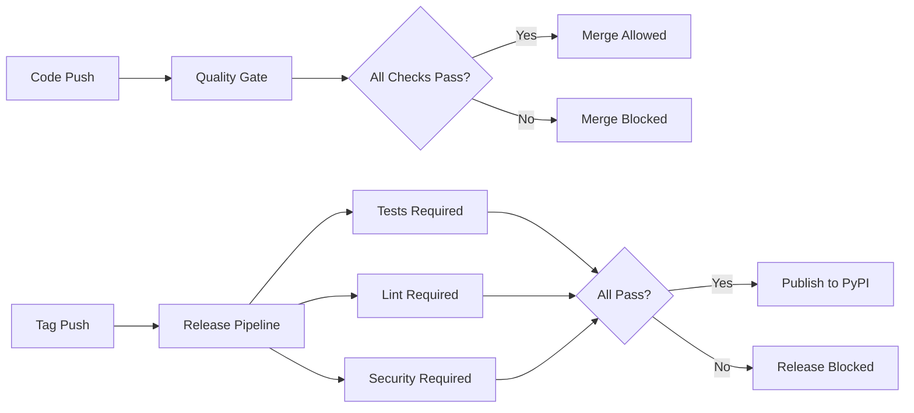

# CI/CD Pipeline Documentation

## Overview

FraiseQL uses a comprehensive CI/CD pipeline with multiple quality gates to ensure only high-quality, tested code reaches production.

## Pipeline Architecture



## Workflows

### 1. Quality Gate (`quality-gate.yml`)
**Triggers**: Push to `main`/`dev`, PRs to `main`/`dev`

**Purpose**: Comprehensive quality checks that must pass before merge.

**Jobs**:

- **Tests**: Full test suite including core and integration tests
- **Lint**: Code formatting and style checks (ruff)
- **Security**: Security vulnerability scanning (bandit)
- **Quality Gate Summary**: Aggregates results, fails if any check fails

**Branch Protection**: This workflow should be required for `main` branch protection.

### 2. Publish (`publish.yml`)
**Triggers**: Push to tags matching `v*`

**Purpose**: Publishes releases to PyPI with mandatory quality checks.

**Critical Feature**: 🚨 **Publish job requires ALL quality jobs to pass**
```yaml
publish:
  needs: [test, lint, security]  # Will not run if any dependency fails
```

**Jobs**:

1. **Test**: Full test suite (required for release)
2. **Lint**: Code quality checks (required for release)
3. **Security**: Security checks (required for release)
4. **Publish**: Package build and PyPI upload (only if all pass)

### 3. Test Legacy (`test.yml`)
**Status**: Deprecated, being phased out

**Triggers**: Feature branches, PRs to dev

**Purpose**: Backward compatibility during transition

## Quality Standards

### Tests Must Pass ✅

- Core test suite: `pytest tests/ -m "not blog_simple and not blog_enterprise"`
- Integration tests: `pytest tests/integration/examples/`
- Coverage reporting to Codecov

### Code Quality Must Pass ✅

- Ruff linting: `ruff check .`
- Ruff formatting: `ruff format --check .`

### Security Must Pass ✅

- Bandit security scanning: `bandit -r src/`

## Release Process

### Safe Release Steps

1. **Develop on feature branch**
2. **Create PR to dev** → Quality gate runs
3. **Merge to dev** (only if quality gate passes)
4. **Create PR to main** → Quality gate runs
5. **Merge to main** (only if quality gate passes)
6. **Create tag** (`git tag v1.0.0`)
7. **Push tag** (`git push origin v1.0.0`) → Release pipeline runs
8. **Publish only if ALL checks pass** ✅

### Historical Issue (Fixed)

**Problem**: Package v0.5.3 was published despite failing tests.

**Root Cause**: Original publish workflow had no dependency on test success.

**Evidence**:
```json
// GitHub API response for commit 351bb8b (v0.5.3):
{"conclusion":"failure","workflowName":"Test"},      // ❌ Tests failed
{"conclusion":"success","workflowName":"Publish"},   // ✅ Published anyway!
```

**Solution**: New publish workflow requires test/lint/security to pass:
```yaml
publish:
  needs: [test, lint, security]  # 🚨 CRITICAL: Won't run if any fail
```

## Branch Protection Rules

### Recommended Settings for `main` branch:

- ✅ Require status checks to pass before merging
- ✅ Require up-to-date branches before merging
- ✅ Required status checks:

  - `quality-gate / Tests`
  - `quality-gate / Lint`
  - `quality-gate / Security`
  - `quality-gate / Quality Gate ✅`

### Recommended Settings for `dev` branch:

- ✅ Require status checks to pass before merging
- ✅ Required status checks:

  - `quality-gate / Tests`
  - `quality-gate / Lint`

## Monitoring and Debugging

### Check Workflow Status
```bash
# List recent workflow runs
gh run list --limit 10

# Check specific workflow
gh run view <run-id>

# Check failing workflow logs
gh run view <run-id> --log-failed
```

### Verify Release Safety
```bash
# Before creating a tag, ensure latest commit passes all checks
gh run list --branch main --limit 1 --json conclusion,workflowName

# Should show all workflows with "conclusion": "success"
```

## Emergency Procedures

### If Bad Release is Published

1. **Yank from PyPI** (if possible)
2. **Create hotfix branch**
3. **Fix issue**
4. **Follow full release process**
5. **Publish patched version**

### If Quality Gate Blocks Valid Code

1. **Check workflow logs**: `gh run view <run-id> --log-failed`
2. **Fix actual issue** (don't bypass unless critical)
3. **For urgent fixes**: Use admin override with justification

## Best Practices

### For Developers

- ✅ Run tests locally before pushing: `pytest tests/`
- ✅ Run linting locally: `ruff check . && ruff format --check .`
- ✅ Check quality gate status before requesting review
- ✅ Address all quality gate failures

### For Maintainers

- ✅ Never bypass quality gates without documented justification
- ✅ Monitor failed releases and improve pipeline accordingly
- ✅ Regularly review and update quality standards
- ✅ Ensure branch protection rules are properly configured

## Contact

For CI/CD pipeline issues, create an issue with the `ci/cd` label.
