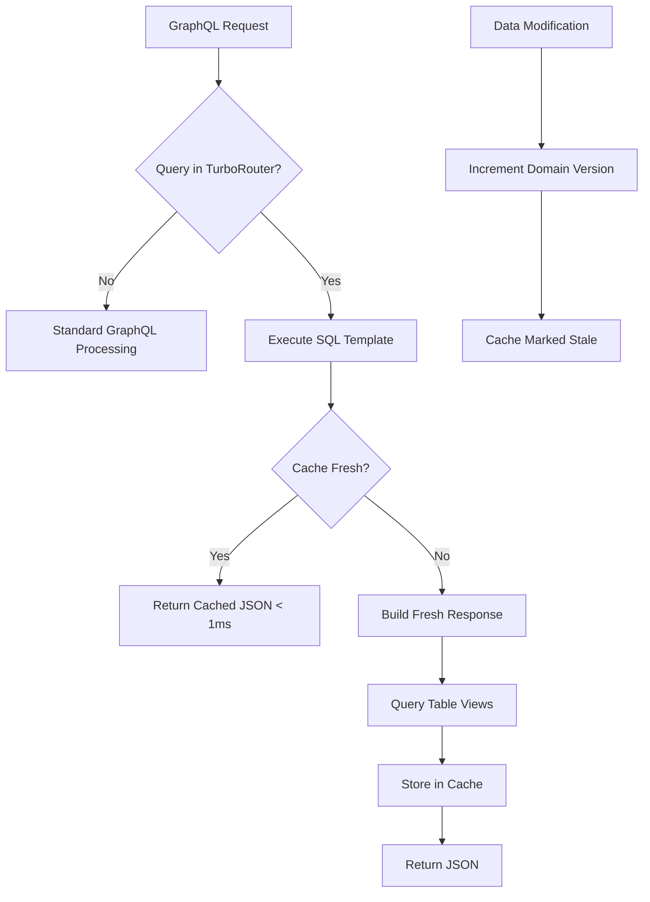

# FraiseQL vs Alternatives

Comprehensive comparison of FraiseQL with other GraphQL frameworks and PostgreSQL API solutions.

## Executive Summary

FraiseQL's core philosophy: **Aggressively trade storage for massive performance gains**.

FraiseQL differentiates itself through:
- **Table views (`tv_`)** - One entity per record with complete denormalized data
- **TurboRouter with lazy caching** - Pre-computed responses for registered queries stored in PostgreSQL
- **Composable views (`v_`)** - Complex queries resolved at database level
- **Direct SQL generation** - No ORM overhead
- **Storage-first architecture** - Use 5-10x storage for 50-100x performance

## The FraiseQL Trade-off

### Maximum Storage Investment for Ultimate Performance

FraiseQL makes an aggressive architectural choice:
- **Use significantly more storage** through table views and cached query responses
- **Gain 50-100x performance** improvement over traditional approaches
- **Achieve consistent sub-millisecond latencies** for cached queries
- **Eliminate computation at query time** for registered TurboRouter queries

### How FraiseQL's Caching Works

```sql
-- 1. Table Views (tv_): Complete denormalized entities
CREATE TABLE tv_user AS
SELECT
    u.id,
    u.email,
    u.name,
    jsonb_build_object(
        'id', u.id,
        'email', u.email,
        'name', u.name,
        'profile', profile.data,
        'settings', settings.data,
        'posts', (SELECT jsonb_agg(p.data) FROM tv_post p WHERE p.author_id = u.id)
    ) as data
FROM users u
LEFT JOIN profiles ON profiles.user_id = u.id;

-- 2. TurboRouter Query Registration
-- Queries are registered with SQL templates
INSERT INTO graphql.tb_turbo_query (
    query_hash,
    operation_name,
    graphql_query,
    sql_template,
    param_mapping
) VALUES (
    SHA256('query GetUser($id: UUID!) { ... }'),
    'GetUser',
    'query GetUser($id: UUID!) { user(id: $id) { id name email posts { title } } }',
    'SELECT turbo.fn_get_cached_response(''user'', $1, ''user'', ''build_user_response'', jsonb_build_object(''id'', $1))',
    '{"id": "id"}'::jsonb
);

-- 3. Lazy Cache Table: Stores pre-computed GraphQL responses
CREATE TABLE turbo.tb_graphql_cache (
    tenant_id UUID NOT NULL,
    query_type TEXT NOT NULL,  -- 'user', 'allocations', etc.
    query_key TEXT NOT NULL,   -- Composite key for the query
    response_json JSONB NOT NULL,  -- Complete GraphQL response
    cache_version BIGINT NOT NULL,
    updated_at TIMESTAMP,
    PRIMARY KEY (tenant_id, query_type, query_key)
);

-- 4. Automatic cache invalidation via version tracking
CREATE TABLE turbo.tb_domain_version (
    tenant_id UUID NOT NULL,
    domain TEXT NOT NULL,  -- 'user', 'allocation', etc.
    version BIGINT NOT NULL DEFAULT 0,
    PRIMARY KEY (tenant_id, domain)
);

-- When data changes, version increments and cache refreshes on next access
```

### The TurboRouter + Lazy Cache Flow



## Storage Architecture Layers

| Layer | Purpose | Storage Multiple | Performance Gain |
|-------|---------|-----------------|------------------|
| **Base Tables** | Source of truth | 1x (baseline) | - |
| **Table Views (`tv_`)** | Complete entities | 3-5x | 10-20x |
| **Composable Views (`v_`)** | Query-specific shapes | 2-3x | 20-30x |
| **TurboRouter Cache** | Pre-computed GraphQL responses | 1-2x | 100-1000x |
| **Total** | All layers | **7-10x** | **50-1000x** |

*Note: Performance gains are estimates based on typical patterns.*

## Framework Comparison Matrix

| Feature | FraiseQL | PostGraphile | Hasura | Strawberry | Graphene |
|---------|----------|--------------|---------|------------|----------|
| **Language** | Python | Node.js | Haskell | Python | Python |
| **Architecture** | TV + Lazy Cache | SQL Generation | Metadata-driven | ORM-based | ORM-based |
| **Storage Philosophy** | Aggressive caching | Normalized | Normalized | Normalized | Normalized |
| **Storage Usage** | 7-10x | 1x | 1x | 1x | 1x |
| **Caching Strategy** | DB-stored responses | Memory/Redis | Memory/Redis | Memory/Redis | Memory/Redis |
| **Cache Invalidation** | Version-based | TTL/Manual | TTL/Manual | TTL/Manual | TTL/Manual |
| **PostgreSQL Native** | ✅ Full | ✅ Full | ✅ Full | ⚠️ Via ORM | ⚠️ Via ORM |
| **N+1 Solution** | Pre-computed | DataLoader | DataLoader | DataLoader | DataLoader |
| **Type Safety** | ✅ Python types | ✅ TypeScript | ⚠️ Limited | ✅ Python types | ✅ Python types |

## Performance Comparison

*⚠️ Note: All performance figures are estimates for illustrative purposes.*

### Query Latency (Estimated p95)

| Query Type | FraiseQL (cached) | FraiseQL (fresh) | PostGraphile | Hasura | Strawberry |
|------------|-------------------|------------------|--------------|---------|------------|
| Simple fetch | < 1ms* | < 5ms* | < 10ms* | < 15ms* | < 50ms* |
| 3-level nested | < 1ms* | < 10ms* | < 30ms* | < 40ms* | < 200ms* |
| List (100 items) | < 1ms* | < 20ms* | < 50ms* | < 60ms* | < 300ms* |
| Complex aggregation | < 1ms* | < 15ms* | < 40ms* | < 50ms* | < 150ms* |

*Cached = TurboRouter with lazy cache hit, Fresh = Cache miss or standard mode

## FraiseQL's Unique Caching Architecture

### Traditional Caching (Other Frameworks)

```python
# External cache (Redis/Memcached) - application manages cache
cache_key = f"user:{user_id}"
cached = cache.get(cache_key)  # Network call to cache service
if not cached:
    user = db.query("SELECT * FROM users WHERE id = ?", user_id)
    cache.set(cache_key, user, ttl=300)  # Another network call
return cached

# Problems:
# - Cache lives outside database
# - Manual invalidation required
# - Network overhead to cache
# - Serialization/deserialization cost
```

### FraiseQL's Database-Native Caching

```sql
-- Cache lives IN the database with the data
-- Single source of truth, version-tracked invalidation

-- TurboRouter executes this SQL template directly
SELECT turbo.fn_get_cached_response(
    'user',           -- query type
    $1::text,         -- query key (user_id)
    'user',           -- domain for version tracking
    'build_user',     -- builder function if cache miss
    jsonb_build_object('id', $1)  -- params for builder
);

-- The function:
-- 1. Checks cache version (< 0.01ms)
-- 2. Returns cached JSON if fresh (< 0.1ms)
-- 3. OR rebuilds from table views and caches (< 5ms first time)
```

### Real Implementation Example (from FraiseQL)

```python
# TurboRouter query registration from actual system
class TurboLoader:
    async def load_queries(self, turbo_registry):
        # Load pre-validated queries from database
        sql = """
        SELECT
            query_hash,
            operation_name,
            graphql_query,
            sql_template,  -- Points to lazy cache function
            param_mapping
        FROM graphql.tb_turbo_query
        WHERE is_active = true
        ORDER BY execution_count DESC  -- Prioritize hot queries
        """

        for row in queries:
            turbo_query = TurboQuery(
                graphql_query=row["graphql_query"],
                sql_template=row["sql_template"],  # Uses fn_get_cached_response
                param_mapping=row["param_mapping"]
            )
            turbo_registry.register(turbo_query)
```

## Storage Investment Strategy

### Progressive Implementation

#### Phase 1: Identify Hot Queries
```sql
-- Find most executed queries
SELECT
    operation_name,
    execution_count,
    avg_execution_time_ms
FROM graphql.tb_turbo_query
ORDER BY execution_count DESC
LIMIT 20;
-- These 20 queries often represent 80% of traffic
```

#### Phase 2: Create Table Views
```sql
-- Create denormalized views for entities
CREATE TABLE tv_allocation AS
SELECT
    a.id,
    a.tenant_id,
    jsonb_build_object(
        'id', a.id,
        'machine', (SELECT data FROM tv_machine WHERE id = a.machine_id),
        'contract', (SELECT data FROM tv_contract WHERE id = a.contract_id),
        'meter_readings', (SELECT jsonb_agg(data) FROM tv_meter_reading WHERE allocation_id = a.id)
    ) as data
FROM allocations a;
```

#### Phase 3: Register with TurboRouter
```sql
-- Register query with lazy cache SQL template
INSERT INTO graphql.tb_turbo_query (
    operation_name,
    graphql_query,
    sql_template
) VALUES (
    'GetAllocations',
    'query GetAllocations { allocations { ... } }',
    'SELECT turbo.fn_get_cached_response(''allocations'', ''all'', ''allocation'', ''build_allocations'', ''{}''::jsonb)'
);
```

#### Phase 4: Monitor Cache Performance
```sql
-- Cache hit rate and performance
SELECT
    query_type,
    COUNT(*) FILTER (WHERE cache_hit) as hits,
    COUNT(*) FILTER (WHERE NOT cache_hit) as misses,
    AVG(execution_time_ms) as avg_time_ms,
    COUNT(*)::float / NULLIF(COUNT(*) FILTER (WHERE cache_hit), 0) as hit_rate
FROM turbo.tb_cache_metrics
GROUP BY query_type
ORDER BY COUNT(*) DESC;
```

## Cost-Benefit Analysis

### Real-World Example: Multi-Tenant SaaS

*⚠️ Note: Based on hypothetical but realistic scenario*

| Metric | Traditional | FraiseQL with Caching |
|--------|-------------|----------------------|
| **Storage Used** | 100GB | 700GB |
| **Storage Cost** | $15/month | $105/month |
| **Average Query Time** | 50-500ms | 1-5ms (cached) |
| **Cache Infrastructure** | External cache service | None (in PostgreSQL) |
| **Application Servers** | 10 instances | 3 instances |
| **Total Monthly Cost** | ~$2,215 | ~$705 |

Key differences:
- FraiseQL uses more database storage but eliminates separate cache infrastructure
- Dramatic reduction in application servers due to faster response times
- Cache invalidation is automatic via version tracking

## When to Use FraiseQL's Approach

### Perfect Fit

✅ **Multi-tenant SaaS** - Isolated caches per tenant
✅ **Admin dashboards** - Complex queries, read-heavy
✅ **Reporting systems** - Pre-computed aggregations
✅ **API gateways** - Predictable query patterns
✅ **Mobile backends** - Minimize latency
✅ **B2B applications** - Complex business logic

### Consider Alternatives

❌ **Real-time collaboration** - Constant updates
❌ **Social feeds** - Highly personalized, dynamic
❌ **Search engines** - Too many query variations
❌ **Streaming data** - Write-heavy
❌ **Simple CRUD** - Overhead not justified

## Migration Path

### From Traditional GraphQL to FraiseQL

1. **Analyze current queries**
```sql
-- Use pg_stat_statements or APM tools
SELECT query, calls, mean_time
FROM pg_stat_statements
ORDER BY calls * mean_time DESC;
```

2. **Start with top 10% of queries**
   - These usually represent 90% of load
   - Create table views for their entities
   - Register with TurboRouter

3. **Implement lazy caching**
```sql
-- Add cache table and version tracking
CREATE SCHEMA turbo;
CREATE TABLE turbo.tb_graphql_cache (...);
CREATE TABLE turbo.tb_domain_version (...);
```

4. **Monitor and expand**
   - Track cache hit rates
   - Add more queries as needed
   - Optimize cache refresh strategies

## Architecture Comparison

### Query Execution Flow

#### Traditional Frameworks
```
Client → GraphQL Server → Parse → Validate → Resolve →
→ N Database Queries → Transform → Return
Total: 50-500ms
```

#### FraiseQL with TurboRouter + Lazy Cache
```
Client → TurboRouter → Cache Lookup → Return Cached JSON
Total: < 1ms (cache hit)

OR if cache miss:
Client → TurboRouter → Build from Table Views → Cache → Return
Total: < 10ms (cache miss)
```

### Cache Invalidation Strategies

| Framework | Strategy | Pros | Cons |
|-----------|----------|------|------|
| **FraiseQL** | Version tracking | Automatic, consistent | Storage overhead |
| **PostGraphile** | TTL + webhooks | Flexible | Complex setup |
| **Hasura** | TTL + events | Good defaults | Can serve stale data |
| **Strawberry** | Manual/TTL | Simple | Requires careful management |

## Conclusion

FraiseQL represents a fundamental shift in GraphQL optimization:

**Traditional approach**: Optimize queries, add caching layers, scale horizontally
**FraiseQL approach**: Pre-compute everything, store aggressively, serve instantly

### The FraiseQL Advantage

- **Sub-millisecond responses** for registered queries
- **No external cache infrastructure** needed
- **Automatic cache invalidation** via version tracking
- **Lower total cost** despite higher storage use
- **Predictable performance** regardless of query complexity

### Choose FraiseQL When

✅ You have predictable query patterns
✅ Storage budget available (7-10x)
✅ Performance is critical
✅ Using PostgreSQL as primary database
✅ Want to eliminate cache management complexity
✅ Building multi-tenant applications

### Choose Traditional Approaches When

❌ Highly dynamic, unpredictable queries
❌ Storage is extremely limited
❌ Write-heavy workload (> 50% writes)
❌ Need to support multiple databases
❌ Simple CRUD without complex queries

**The key insight**: In modern cloud environments, storage is cheap (~$0.10/GB/month) while compute and latency are expensive. FraiseQL embraces this reality fully, trading abundant storage for scarce performance.
