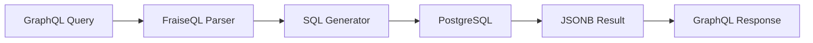

# Core Concepts

FraiseQL revolutionizes GraphQL API development by treating PostgreSQL as the single source of truth. This database-first approach delivers 4-100x performance improvements while maintaining complete type safety.

## Philosophy

### Database Domain-Driven Design (DDD)

FraiseQL embraces the database as the domain model:

- **Views define your API**: Database views shape your GraphQL schema
- **Functions implement business logic**: PostgreSQL functions handle mutations
- **Constraints ensure integrity**: Database constraints prevent invalid states
- **Transactions guarantee consistency**: ACID properties protect your data

This isn't just using a database - it's designing your entire domain model within PostgreSQL.

### CQRS Pattern

FraiseQL implements Command Query Responsibility Segregation naturally:

**Queries (Read Model)**
- Database views (`v_` prefix) for on-demand computation
- Materialized views (`tv_` prefix) for cached results
- Optimized for reading with JSONB aggregation
- Zero N+1 query problems

**Commands (Write Model)**
- PostgreSQL functions (`fn_` prefix) for mutations
- Transactional integrity built-in
- Business logic close to data
- Atomic operations guaranteed

### Type-First Development

Start with types, let FraiseQL handle the rest:

```python
@dataclass
class User:
    id: ID  # PostgreSQL UUID → GraphQL ID
    name: str
    posts: list[Post]  # Relationships from views
```

Your Python types become your GraphQL schema automatically.

## How FraiseQL Works

### Request Flow



1. **GraphQL Query arrives**: Standard GraphQL over HTTP
2. **FraiseQL parses**: Analyzes requested fields and filters
3. **SQL generation**: Creates optimized PostgreSQL query
4. **Database execution**: Single query fetches all data
5. **JSONB transformation**: Database returns pre-formatted JSON
6. **GraphQL response**: Direct mapping, no post-processing

### The Magic: Sub-millisecond Translation

FraiseQL doesn't interpret or execute resolvers. It translates:

```graphql
query {
  users(role: "admin") {
    id
    name
    posts {
      title
    }
  }
}
```

Becomes:

```sql
SELECT data FROM v_user
WHERE role = 'admin'
-- data already contains nested posts!
```

One query. No loops. No N+1 problems.

## PostgreSQL as the Engine

### Why PostgreSQL?

- **JSONB native**: Perfect for GraphQL's nested structure
- **Views for abstraction**: Separate storage from API shape
- **Functions for logic**: Complex operations stay atomic
- **Constraints for validation**: Data integrity at the source
- **Performance**: Optimized query planner, indexes, materialization

### Not a Limitation, a Feature

FraiseQL is PostgreSQL-only by design:
- **Leverage full power**: CTEs, window functions, full-text search
- **No abstraction penalty**: Direct SQL, no ORM overhead
- **Production-proven**: PostgreSQL handles Fortune 500 scale
- **Single source of truth**: One database, no synchronization

## Key Concepts

### Views Define APIs

Your database view IS your API:

```sql
CREATE VIEW v_post AS
SELECT
    id,  -- For filtering
    user_id,  -- For relationships
    published,  -- For filtering
    jsonb_build_object(
        '__typename', 'Post',
        'id', id,
        'title', title,
        'content', content,
        'author', (SELECT data FROM v_user WHERE id = user_id)
    ) AS data
```

This view becomes a fully-functional GraphQL type with relationships.

### Functions Handle Mutations

PostgreSQL functions are your mutation handlers:

```sql
CREATE FUNCTION fn_create_post(
    p_title TEXT,
    p_content TEXT,
    p_user_id UUID
) RETURNS jsonb AS $$
BEGIN
    -- Business logic here
    -- Validation, authorization, etc.
    -- All atomic, all consistent
END;
$$ LANGUAGE plpgsql;
```

### Type Safety End-to-End

```python
# Python type
@dataclass
class Post:
    id: ID
    title: str
    content: str | None  # Optional field

# Automatically becomes GraphQL schema:
# type Post {
#   id: ID!
#   title: String!
#   content: String
# }

# And expects matching database view
```

## Performance Benefits

### Traditional GraphQL Stack

```
Request → Framework → ORM → Database → ORM → Resolvers → Response
        ↓          ↓       ↓         ↓       ↓           ↓
       10ms       5ms    20ms      20ms    15ms        5ms
                        Total: 75ms
```

### FraiseQL Stack

```
Request → FraiseQL → PostgreSQL → Response
        ↓         ↓            ↓
       0.5ms     2ms         0.5ms
              Total: 3ms
```

**25x faster** for typical queries. For complex nested queries, the difference grows to 100x or more.

## When to Use FraiseQL

### Perfect For

- **High-performance APIs**: When milliseconds matter
- **PostgreSQL-centric teams**: Leverage existing database expertise
- **CQRS architectures**: Natural fit for command/query separation
- **Type-safe applications**: Full typing from database to client
- **Complex queries**: Let PostgreSQL's optimizer handle it

### Consider Alternatives If

- **Multi-database required**: Need MongoDB, Redis, etc. in GraphQL
- **Existing large codebase**: Significant resolver logic to migrate
- **Database-agnostic needed**: Must support multiple database engines
- **Dynamic schema**: Schema changes without database modifications

## Core Principles

1. **Database First**: Design your API in PostgreSQL
2. **Single Query**: One GraphQL query = one SQL query
3. **Type Safety**: Types flow from database to client
4. **Performance**: Sub-millisecond query translation
5. **Simplicity**: Less code, less complexity, fewer bugs

## Architecture Benefits

### Separation of Concerns

- **Tables**: Store normalized data
- **Views**: Shape API responses
- **Functions**: Implement business logic
- **Types**: Define contracts

### Scalability

- **Vertical**: PostgreSQL scales to terabytes
- **Horizontal**: Read replicas for queries
- **Caching**: Materialized views for hot data
- **Connection pooling**: Built-in with pgBouncer

### Maintainability

- **Less code**: 70% less than traditional stacks
- **SQL debugging**: Standard PostgreSQL tools
- **Version control**: Migrations for schema changes
- **Testing**: Test database logic directly

## Next Steps

Ready to dive deeper?

- **[Architecture](architecture.md)**: Detailed system design
- **[Type System](type-system.md)**: Python to GraphQL type mapping
- **[Database Views](database-views.md)**: Designing effective views
- **[Query Translation](query-translation.md)**: How FraiseQL generates SQL

Or jump to practical guides:

- **[First API](../getting-started/first-api.md)**: Build something real
- **[Blog Tutorial](../tutorials/blog-api.md)**: Complex application example
- **[Migration Guide](../migration/)**: Moving from other frameworks
