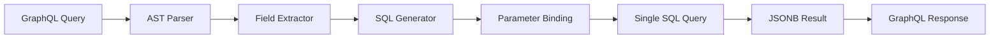

# Query Translation

FraiseQL's query translation engine converts GraphQL queries directly to SQL in sub-millisecond time, eliminating the N+1 query problem by design.

## Translation Pipeline

The translation process follows these steps:



## Basic Query Translation

### Simple Query
**GraphQL:**
```graphql
query {
  user(id: "123e4567-e89b-12d3-a456-426614174000") {
    id
    name
    email
  }
}
```

**Generated SQL:**
```sql
SELECT jsonb_build_object(
    'id', data->>'id',
    'name', data->>'name', 
    'email', data->>'email'
) AS result
FROM v_user
WHERE id = $1
LIMIT 1;
```

**Parameters:**
```python
params = ["123e4567-e89b-12d3-a456-426614174000"]
```

### Nested Query
**GraphQL:**
```graphql
query {
  post(id: "456") {
    title
    author {
      name
      email
    }
    comments {
      content
      created_at
    }
  }
}
```

**Generated SQL:**
```sql
SELECT jsonb_build_object(
    'title', data->>'title',
    'author', data->'author',
    'comments', data->'comments'
) AS result
FROM v_post_with_author_and_comments
WHERE id = $1
LIMIT 1;
```

Notice how nested relationships are handled by the view, not by multiple queries.

## Repository Pattern Implementation

The repository layer handles the translation:

```python
from fraiseql.cqrs.repository import FraiseQLRepository

class BlogRepository(FraiseQLRepository):
    async def get_user(self, user_id: str):
        """Get user by ID using view."""
        return await self.get_by_id("v_user", user_id)
    
    async def get_posts(self, where=None, limit=20, offset=0):
        """Get posts with filtering."""
        return await self.select_from_json_view(
            "v_post_with_author",
            where=where,
            limit=limit,
            offset=offset,
            order_by="published_at DESC"
        )
```

## WHERE Clause Generation

FraiseQL generates type-safe WHERE clauses from GraphQL filters:

### Basic Filtering
**GraphQL:**
```graphql
query {
  posts(where: { is_published: true, author_id: "123" }) {
    id
    title
  }
}
```

**Generated SQL:**
```sql
SELECT jsonb_agg(
    jsonb_build_object(
        'id', data->>'id',
        'title', data->>'title'
    )
) AS result
FROM v_post
WHERE is_published = $1 
  AND author_id = $2;
```

### Complex Filtering
**GraphQL:**
```graphql
query {
  posts(where: {
    AND: [
      { is_published: true },
      { OR: [
        { title_contains: "GraphQL" },
        { content_contains: "GraphQL" }
      ]},
      { created_at_gte: "2024-01-01" }
    ]
  }) {
    id
    title
  }
}
```

**Generated SQL:**
```sql
SELECT jsonb_agg(data) AS result
FROM v_post
WHERE is_published = $1
  AND (
    title ILIKE $2 
    OR content ILIKE $3
  )
  AND created_at >= $4;
```

### Comparison Operators

| GraphQL Operator | SQL Operator | Example |
|-----------------|--------------|---------|
| `eq` | `=` | `{ age_eq: 25 }` |
| `ne` | `!=` | `{ status_ne: "deleted" }` |
| `lt` | `<` | `{ price_lt: 100 }` |
| `lte` | `<=` | `{ age_lte: 65 }` |
| `gt` | `>` | `{ score_gt: 80 }` |
| `gte` | `>=` | `{ created_at_gte: "2024-01-01" }` |
| `in` | `IN` | `{ status_in: ["active", "pending"] }` |
| `not_in` | `NOT IN` | `{ role_not_in: ["admin"] }` |
| `contains` | `ILIKE` | `{ title_contains: "GraphQL" }` |
| `starts_with` | `ILIKE` | `{ email_starts_with: "admin" }` |
| `ends_with` | `ILIKE` | `{ domain_ends_with: ".com" }` |
| `is_null` | `IS NULL` | `{ deleted_at_is_null: true }` |

## Pagination Strategies

### Offset-Based Pagination
**GraphQL:**
```graphql
query {
  posts(limit: 10, offset: 20) {
    id
    title
  }
}
```

**Generated SQL:**
```sql
SELECT jsonb_agg(data) AS result
FROM (
    SELECT data
    FROM v_post
    WHERE is_published = true
    ORDER BY published_at DESC
    LIMIT $1 OFFSET $2
) AS paginated;
```

### Cursor-Based Pagination
**GraphQL:**
```graphql
query {
  posts(first: 10, after: "eyJpZCI6IjEyMyJ9") {
    edges {
      cursor
      node {
        id
        title
      }
    }
    pageInfo {
      hasNextPage
      endCursor
    }
  }
}
```

**Generated SQL:**
```sql
WITH paginated AS (
    SELECT 
        data,
        id,
        ROW_NUMBER() OVER (ORDER BY published_at DESC) as row_num
    FROM v_post
    WHERE is_published = true
      AND id > $1  -- Decoded cursor
)
SELECT jsonb_build_object(
    'edges', jsonb_agg(
        jsonb_build_object(
            'cursor', encode(id::text::bytea, 'base64'),
            'node', data
        )
    ),
    'pageInfo', jsonb_build_object(
        'hasNextPage', COUNT(*) > $2,
        'endCursor', MAX(encode(id::text::bytea, 'base64'))
    )
) AS result
FROM paginated
WHERE row_num <= $2;
```

## N+1 Query Prevention

FraiseQL prevents N+1 queries through view composition:

### Traditional GraphQL (N+1 Problem)
```python
# BAD: Results in N+1 queries
posts = await db.query("SELECT * FROM posts LIMIT 10")
for post in posts:
    post.author = await db.query(
        "SELECT * FROM users WHERE id = ?", 
        post.author_id
    )
# Total: 1 + 10 = 11 queries
```

### FraiseQL Approach (Single Query)
```sql
-- Good: Single query with composed view
CREATE OR REPLACE VIEW v_post_with_author AS
SELECT
    p.id,
    jsonb_build_object(
        'id', p.id,
        'title', p.title,
        'author', a.data  -- Author included
    ) AS data
FROM tb_posts p
LEFT JOIN v_author a ON a.id = p.author_id;
```

```python
# Single query returns everything
result = await db.select_from_json_view("v_post_with_author", limit=10)
# Total: 1 query
```

## Query Analysis and Optimization

### Query Complexity Analysis
```python
from fraiseql.analysis import analyze_query_complexity

def analyze_graphql_query(query: str) -> dict:
    """Analyze query complexity before execution."""
    analysis = analyze_query_complexity(query)
    
    return {
        "depth": analysis.depth,  # Nesting level
        "breadth": analysis.breadth,  # Number of fields
        "estimated_cost": analysis.cost,  # Complexity score
        "uses_pagination": analysis.has_pagination,
        "required_views": analysis.views  # Views needed
    }

# Example usage
complexity = analyze_graphql_query("""
    query {
        users(limit: 100) {
            posts {
                comments {
                    author {
                        name
                    }
                }
            }
        }
    }
""")

if complexity["estimated_cost"] > 1000:
    raise QueryTooComplex("Query exceeds complexity limit")
```

### Query Plan Inspection
```python
async def explain_query(query: str, params: list):
    """Get PostgreSQL query plan."""
    explain_sql = f"EXPLAIN (ANALYZE, BUFFERS, FORMAT JSON) {query}"
    
    result = await db.execute(explain_sql, params)
    plan = result[0]["Plan"]
    
    return {
        "total_cost": plan["Total Cost"],
        "execution_time": plan["Actual Total Time"],
        "rows_returned": plan["Actual Rows"],
        "buffers_hit": plan["Shared Hit Blocks"],
        "uses_index": "Index Scan" in str(plan)
    }
```

## Field Selection Optimization

### Selective Field Extraction
```python
def build_field_projection(fields: list[str]) -> str:
    """Build JSONB projection for selected fields."""
    if not fields:
        return "data"  # Return entire JSONB
    
    projections = []
    for field in fields:
        if "." in field:
            # Nested field
            path = field.split(".")
            projection = f"data->'{path[0]}'->'{path[1]}'"
        else:
            # Top-level field
            projection = f"data->>'{field}'"
        
        projections.append(f"'{field}', {projection}")
    
    return f"jsonb_build_object({', '.join(projections)})"
```

**Example:**
```python
# Only select needed fields
fields = ["id", "title", "author.name"]
projection = build_field_projection(fields)

sql = f"""
    SELECT {projection} AS result
    FROM v_post_with_author
    WHERE id = $1
"""
```

## Batching with DataLoader

For relationships that can't be composed in views:

```python
from fraiseql import dataloader_field

@fraiseql.type
class User:
    id: UUID
    name: str
    
    @dataloader_field
    async def recent_activity(self, info) -> list[Activity]:
        """Batched loading of user activity."""
        # This will be automatically batched
        return await info.context.loaders.activity.load(self.id)

class ActivityLoader(DataLoader):
    async def batch_load_fn(self, user_ids: list[str]):
        """Load activities for multiple users in one query."""
        sql = """
            SELECT 
                user_id,
                jsonb_agg(data ORDER BY created_at DESC) as activities
            FROM v_activities
            WHERE user_id = ANY($1)
            GROUP BY user_id
        """
        
        results = await db.execute(sql, [user_ids])
        
        # Map results back to user IDs
        activity_map = {r["user_id"]: r["activities"] for r in results}
        return [activity_map.get(uid, []) for uid in user_ids]
```

## SQL Injection Prevention

FraiseQL prevents SQL injection through:

### 1. Parameterized Queries
```python
# All values are parameterized
sql = "SELECT * FROM v_user WHERE email = $1"
params = [user_input]  # Never concatenated

# NEVER do this:
# sql = f"SELECT * FROM v_user WHERE email = '{user_input}'"
```

### 2. Whitelist Column Names
```python
ALLOWED_COLUMNS = {"id", "email", "name", "created_at"}

def validate_order_by(column: str) -> str:
    """Validate column name against whitelist."""
    if column not in ALLOWED_COLUMNS:
        raise ValueError(f"Invalid column: {column}")
    return column

# Safe usage
order_column = validate_order_by(user_input)
sql = f"SELECT * FROM v_user ORDER BY {order_column}"
```

### 3. Type Validation
```python
@fraiseql.input
class UserWhereInput:
    id: UUID | None = None  # Type-checked
    email: str | None = None
    created_at_gte: datetime | None = None

# GraphQL layer validates types before SQL generation
```

## Performance Monitoring

### Query Timing
```python
import time
from contextlib import asynccontextmanager

@asynccontextmanager
async def timed_query(name: str):
    """Time query execution."""
    start = time.perf_counter()
    try:
        yield
    finally:
        duration = (time.perf_counter() - start) * 1000
        if duration > 100:  # Log slow queries
            logger.warning(f"Slow query '{name}': {duration:.2f}ms")
```

### Query Caching
```python
from functools import lru_cache
import hashlib

@lru_cache(maxsize=1000)
def get_cached_sql(query_hash: str) -> str:
    """Cache generated SQL for repeated queries."""
    return generate_sql_from_hash(query_hash)

def generate_query_hash(graphql_query: str, variables: dict) -> str:
    """Generate cache key for query."""
    content = f"{graphql_query}{sorted(variables.items())}"
    return hashlib.sha256(content.encode()).hexdigest()
```

## Advanced Translation Patterns

### Dynamic View Selection
```python
def select_optimal_view(fields: set[str]) -> str:
    """Choose the most efficient view based on requested fields."""
    
    if "comments" in fields and "author" in fields:
        return "v_posts_full"  # Has everything
    elif "author" in fields:
        return "v_post_with_author"
    elif "comments" in fields:
        return "v_posts_with_comments"
    else:
        return "v_posts"  # Basic view
```

### Conditional Joins
```python
def build_query_with_joins(fields: set[str]) -> str:
    """Build query with only necessary joins."""
    
    base_query = "SELECT p.* FROM tb_posts p"
    joins = []
    
    if "author" in fields:
        joins.append("LEFT JOIN v_authors a ON a.id = p.author_id")
    
    if "category" in fields:
        joins.append("LEFT JOIN v_categories c ON c.id = p.category_id")
    
    if joins:
        return f"{base_query} {' '.join(joins)}"
    return base_query
```

## Translation Examples

### List Query with Filtering
**GraphQL:**
```graphql
query {
  posts(
    where: { is_published: true }
    orderBy: CREATED_AT_DESC
    limit: 20
  ) {
    id
    title
    author {
      name
    }
  }
}
```

**Generated SQL:**
```sql
SELECT jsonb_agg(
    jsonb_build_object(
        'id', data->>'id',
        'title', data->>'title',
        'author', data->'author'
    )
    ORDER BY created_at DESC
) AS result
FROM (
    SELECT data, created_at
    FROM v_post_with_author
    WHERE is_published = true
    ORDER BY created_at DESC
    LIMIT 20
) AS filtered_posts;
```

### Aggregation Query
**GraphQL:**
```graphql
query {
  postStats {
    totalPosts
    publishedPosts
    averageViewCount
  }
}
```

**Generated SQL:**
```sql
SELECT jsonb_build_object(
    'totalPosts', COUNT(*),
    'publishedPosts', COUNT(*) FILTER (WHERE is_published = true),
    'averageViewCount', AVG(view_count)
) AS result
FROM tb_posts;
```

## Best Practices

### 1. Use Composed Views
Create views that include commonly requested relationships:
```sql
-- Prevents N+1 for posts with authors
CREATE OR REPLACE VIEW v_post_with_author AS ...
```

### 2. Index Filter Columns
```sql
-- Index columns used in WHERE clauses
CREATE INDEX idx_posts_published 
ON tb_posts(is_published, published_at DESC);
```

### 3. Limit Query Depth
```python
MAX_QUERY_DEPTH = 5

def validate_query_depth(query: str) -> bool:
    depth = calculate_query_depth(query)
    if depth > MAX_QUERY_DEPTH:
        raise QueryTooDeep(f"Max depth is {MAX_QUERY_DEPTH}")
    return True
```

### 4. Use Query Batching
```python
# Batch similar queries together
async def batch_get_users(user_ids: list[str]):
    sql = """
        SELECT jsonb_agg(data) as users
        FROM v_user
        WHERE id = ANY($1)
    """
    return await db.execute(sql, [user_ids])
```

### 5. Monitor Performance
```python
# Track query performance
async def execute_with_metrics(sql: str, params: list):
    start = time.perf_counter()
    try:
        result = await db.execute(sql, params)
        duration = time.perf_counter() - start
        
        metrics.record_query(
            sql_hash=hash(sql),
            duration_ms=duration * 1000,
            row_count=len(result)
        )
        
        return result
    except Exception as e:
        metrics.record_query_error(sql_hash=hash(sql))
        raise
```

## Next Steps

- Review [Architecture](./architecture.md) for system overview
- Explore [Database Views](./database-views.md) for data modeling
- Learn about the [Type System](./type-system.md) for schema definition
- See practical examples in the [Blog API Tutorial](../tutorials/blog-api.md)