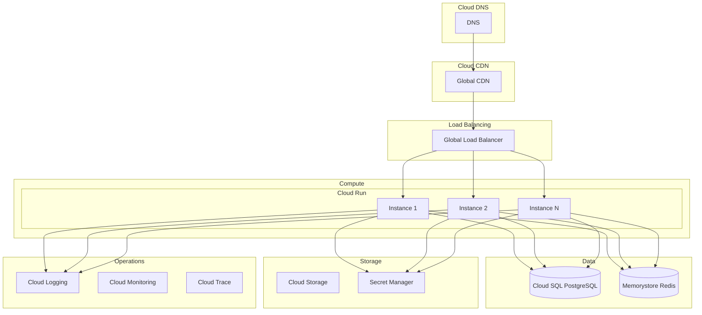

# Google Cloud Platform Deployment Guide

## Overview

Deploy FraiseQL on Google Cloud Platform using Cloud Run for serverless containers, Cloud SQL for managed PostgreSQL, and Cloud Load Balancing for global distribution.

## Architecture



## Prerequisites

- Google Cloud account with billing enabled
- gcloud CLI installed and configured
- Docker installed locally
- Domain name (optional)

## Quick Start

```bash
# Set up gcloud
gcloud auth login
gcloud config set project YOUR_PROJECT_ID

# Enable required APIs
gcloud services enable \
  run.googleapis.com \
  sqladmin.googleapis.com \
  redis.googleapis.com \
  secretmanager.googleapis.com \
  cloudtrace.googleapis.com

# Deploy to Cloud Run
gcloud run deploy fraiseql \
  --image gcr.io/YOUR_PROJECT_ID/fraiseql:latest \
  --platform managed \
  --region us-central1 \
  --allow-unauthenticated
```

## Cloud Run Deployment

### Build and Push Image

```bash
# Configure Docker for GCR
gcloud auth configure-docker

# Build image
docker build -t fraiseql:latest .

# Tag for GCR
docker tag fraiseql:latest gcr.io/YOUR_PROJECT_ID/fraiseql:latest

# Push to GCR
docker push gcr.io/YOUR_PROJECT_ID/fraiseql:latest

# Or use Cloud Build
gcloud builds submit --tag gcr.io/YOUR_PROJECT_ID/fraiseql:latest
```

### Cloud Run Service Configuration

```yaml
# service.yaml
apiVersion: serving.knative.dev/v1
kind: Service
metadata:
  name: fraiseql
  annotations:
    run.googleapis.com/ingress: all
    run.googleapis.com/execution-environment: gen2
spec:
  template:
    metadata:
      annotations:
        autoscaling.knative.dev/minScale: "2"
        autoscaling.knative.dev/maxScale: "100"
        run.googleapis.com/cpu-throttling: "false"
        run.googleapis.com/startup-cpu-boost: "true"
    spec:
      containerConcurrency: 100
      timeoutSeconds: 300
      serviceAccountName: fraiseql-sa@YOUR_PROJECT_ID.iam.gserviceaccount.com
      containers:

      - image: gcr.io/YOUR_PROJECT_ID/fraiseql:latest
        ports:

        - name: http1
          containerPort: 8000
        env:

        - name: FRAISEQL_MODE
          value: "production"

        - name: GCP_PROJECT
          value: "YOUR_PROJECT_ID"

        - name: DATABASE_URL
          valueFrom:
            secretKeyRef:
              name: database-url
              key: latest

        - name: REDIS_URL
          valueFrom:
            secretKeyRef:
              name: redis-url
              key: latest

        - name: SECRET_KEY
          valueFrom:
            secretKeyRef:
              name: app-secret
              key: latest
        resources:
          limits:
            cpu: "2"
            memory: "2Gi"
        startupProbe:
          httpGet:
            path: /health
            port: 8000
          initialDelaySeconds: 0
          periodSeconds: 1
          timeoutSeconds: 1
          successThreshold: 1
          failureThreshold: 30
        livenessProbe:
          httpGet:
            path: /health
            port: 8000
          initialDelaySeconds: 0
          periodSeconds: 10
          timeoutSeconds: 1
          failureThreshold: 3
```

### Deploy Service

```bash
# Deploy using service.yaml
gcloud run services replace service.yaml --region us-central1

# Or deploy with CLI
gcloud run deploy fraiseql \
  --image gcr.io/YOUR_PROJECT_ID/fraiseql:latest \
  --platform managed \
  --region us-central1 \
  --min-instances 2 \
  --max-instances 100 \
  --memory 2Gi \
  --cpu 2 \
  --timeout 300 \
  --concurrency 100 \
  --service-account fraiseql-sa@YOUR_PROJECT_ID.iam.gserviceaccount.com \
  --set-env-vars "FRAISEQL_MODE=production,GCP_PROJECT=YOUR_PROJECT_ID" \
  --set-secrets "DATABASE_URL=database-url:latest,REDIS_URL=redis-url:latest,SECRET_KEY=app-secret:latest"
```

## Cloud SQL PostgreSQL

### Create Instance

```bash
# Create Cloud SQL instance
gcloud sql instances create fraiseql-db \
  --database-version=POSTGRES_15 \
  --tier=db-n1-standard-2 \
  --region=us-central1 \
  --network=default \
  --no-assign-ip \
  --availability-type=REGIONAL \
  --enable-point-in-time-recovery \
  --backup-start-time=03:00 \
  --maintenance-window-day=SUN \
  --maintenance-window-hour=4 \
  --maintenance-release-channel=production \
  --insights-config-enabled \
  --insights-config-query-insights-enabled \
  --insights-config-record-application-tags

# Create database
gcloud sql databases create fraiseql \
  --instance=fraiseql-db

# Create user
gcloud sql users create fraiseql_user \
  --instance=fraiseql-db \
  --password=YOUR_PASSWORD

# Get connection name
gcloud sql instances describe fraiseql-db --format="value(connectionName)"
```

### Terraform Configuration

```hcl
# cloud-sql.tf
resource "google_sql_database_instance" "fraiseql" {
  name             = "fraiseql-db"
  database_version = "POSTGRES_15"
  region           = "us-central1"

  settings {
    tier              = "db-n1-standard-2"
    availability_type = "REGIONAL"

    disk_config {
      size = 100
      type = "PD_SSD"
    }

    backup_configuration {
      enabled                        = true
      start_time                     = "03:00"
      point_in_time_recovery_enabled = true
      transaction_log_retention_days = 7
      backup_retention_settings {
        retained_backups = 30
      }
    }

    ip_configuration {
      ipv4_enabled    = false
      private_network = google_compute_network.vpc.id
      require_ssl     = true
    }

    database_flags {
      name  = "max_connections"
      value = "100"
    }

    database_flags {
      name  = "shared_buffers"
      value = "256MB"
    }

    insights_config {
      query_insights_enabled  = true
      query_string_length     = 1024
      record_application_tags = true
      record_client_address   = true
    }
  }
}

resource "google_sql_database" "fraiseql" {
  name     = "fraiseql"
  instance = google_sql_database_instance.fraiseql.name
}

resource "google_sql_user" "fraiseql" {
  name     = "fraiseql_user"
  instance = google_sql_database_instance.fraiseql.name
  password = var.db_password
}
```

## Memorystore Redis

### Create Redis Instance

```bash
# Create Redis instance
gcloud redis instances create fraiseql-redis \
  --size=1 \
  --region=us-central1 \
  --redis-version=redis_6_x \
  --redis-config maxmemory-policy=allkeys-lru \
  --enable-auth \
  --maintenance-window-day=sunday \
  --maintenance-window-hour=3

# Get Redis host
gcloud redis instances describe fraiseql-redis \
  --region=us-central1 \
  --format="value(host)"

# Get auth string
gcloud redis instances get-auth-string fraiseql-redis \
  --region=us-central1
```

### Terraform Configuration

```hcl
# memorystore.tf
resource "google_redis_instance" "fraiseql" {
  name           = "fraiseql-redis"
  tier           = "STANDARD_HA"
  memory_size_gb = 1
  region         = "us-central1"
  redis_version  = "REDIS_6_X"

  auth_enabled = true

  redis_configs = {
    "maxmemory-policy" = "allkeys-lru"
    "timeout"          = "300"
  }

  maintenance_policy {
    weekly_maintenance_window {
      day = "SUNDAY"
      start_time {
        hours   = 3
        minutes = 0
      }
    }
  }
}
```

## Secret Manager

```bash
# Create secrets
echo -n "postgresql://user:pass@/fraiseql?host=/cloudsql/CONNECTION_NAME" | \
  gcloud secrets create database-url --data-file=-

echo -n "redis://PASSWORD@REDIS_HOST:6379" | \
  gcloud secrets create redis-url --data-file=-

echo -n "$(openssl rand -hex 32)" | \
  gcloud secrets create app-secret --data-file=-

# Grant access to service account
gcloud secrets add-iam-policy-binding database-url \
  --member="serviceAccount:fraiseql-sa@YOUR_PROJECT_ID.iam.gserviceaccount.com" \
  --role="roles/secretmanager.secretAccessor"
```

## Load Balancing

### Global Load Balancer with CDN

```bash
# Create NEG for Cloud Run
gcloud compute network-endpoint-groups create fraiseql-neg \
  --region=us-central1 \
  --network-endpoint-type=serverless \
  --cloud-run-service=fraiseql

# Create backend service
gcloud compute backend-services create fraiseql-backend \
  --global \
  --enable-cdn \
  --cache-mode=CACHE_ALL_STATIC \
  --default-ttl=3600

# Add backend
gcloud compute backend-services add-backend fraiseql-backend \
  --global \
  --network-endpoint-group=fraiseql-neg \
  --network-endpoint-group-region=us-central1

# Create URL map
gcloud compute url-maps create fraiseql-lb \
  --default-service=fraiseql-backend

# Create HTTPS proxy
gcloud compute target-https-proxies create fraiseql-https-proxy \
  --url-map=fraiseql-lb \
  --ssl-certificates=fraiseql-cert

# Create forwarding rule
gcloud compute forwarding-rules create fraiseql-https \
  --global \
  --target-https-proxy=fraiseql-https-proxy \
  --ports=443
```

### SSL Certificate

```bash
# Create managed certificate
gcloud compute ssl-certificates create fraiseql-cert \
  --domains=api.example.com \
  --global

# Or import existing certificate
gcloud compute ssl-certificates create fraiseql-cert \
  --certificate=cert.pem \
  --private-key=key.pem \
  --global
```

## Cloud Build CI/CD

### cloudbuild.yaml

```yaml
steps:
  # Run tests

  - name: 'python:3.11'
    entrypoint: 'bash'
    args:

    - '-c'
    - |
      pip install -r requirements.txt
      pytest tests/

  # Build Docker image

  - name: 'gcr.io/cloud-builders/docker'
    args: ['build', '-t', 'gcr.io/$PROJECT_ID/fraiseql:$COMMIT_SHA', '.']

  # Push to Container Registry

  - name: 'gcr.io/cloud-builders/docker'
    args: ['push', 'gcr.io/$PROJECT_ID/fraiseql:$COMMIT_SHA']

  # Deploy to Cloud Run

  - name: 'gcr.io/google.com/cloudsdktool/cloud-sdk'
    entrypoint: gcloud
    args:

    - 'run'
    - 'deploy'
    - 'fraiseql'
    - '--image=gcr.io/$PROJECT_ID/fraiseql:$COMMIT_SHA'
    - '--region=us-central1'
    - '--platform=managed'

  # Run database migrations

  - name: 'gcr.io/$PROJECT_ID/fraiseql:$COMMIT_SHA'
    entrypoint: 'python'
    args: ['-m', 'fraiseql', 'migrate']
    env:

    - 'DATABASE_URL=${_DATABASE_URL}'

images:

  - 'gcr.io/$PROJECT_ID/fraiseql:$COMMIT_SHA'

options:
  logging: CLOUD_LOGGING_ONLY

substitutions:
  _DATABASE_URL: projects/$PROJECT_ID/secrets/database-url/versions/latest
```

### Trigger Configuration

```bash
# Create trigger for main branch
gcloud builds triggers create github \
  --repo-name=fraiseql \
  --repo-owner=your-org \
  --branch-pattern=^main$ \
  --build-config=cloudbuild.yaml
```

## Monitoring & Logging

### Cloud Monitoring

```python
# monitoring.py
from google.cloud import monitoring_v3
import time

client = monitoring_v3.MetricServiceClient()
project_name = f"projects/{project_id}"

# Create custom metric
descriptor = monitoring_v3.MetricDescriptor()
descriptor.type = "custom.googleapis.com/fraiseql/request_count"
descriptor.metric_kind = monitoring_v3.MetricDescriptor.MetricKind.GAUGE
descriptor.value_type = monitoring_v3.MetricDescriptor.ValueType.INT64
descriptor.description = "FraiseQL request count"

descriptor = client.create_metric_descriptor(
    name=project_name,
    metric_descriptor=descriptor
)

# Write metric data
series = monitoring_v3.TimeSeries()
series.metric.type = "custom.googleapis.com/fraiseql/request_count"
series.resource.type = "global"

now = time.time()
seconds = int(now)
nanos = int((now - seconds) * 10 ** 9)
interval = monitoring_v3.TimeInterval(
    {"end_time": {"seconds": seconds, "nanos": nanos}}
)
point = monitoring_v3.Point(
    {"interval": interval, "value": {"int64_value": 100}}
)
series.points = [point]

client.create_time_series(name=project_name, time_series=[series])
```

### Cloud Logging

```python
# logging_config.py
import google.cloud.logging
from google.cloud.logging.handlers import CloudLoggingHandler
import logging

# Set up Cloud Logging
client = google.cloud.logging.Client()
handler = CloudLoggingHandler(client)

# Configure root logger
logging.getLogger().setLevel(logging.INFO)
logging.getLogger().addHandler(handler)

# Structured logging
logger = logging.getLogger(__name__)
logger.info(
    "Request processed",
    extra={
        "labels": {
            "endpoint": "/graphql",
            "method": "POST",
        },
        "trace": trace_id,
        "span_id": span_id,
        "http_request": {
            "request_method": "POST",
            "request_url": "/graphql",
            "status": 200,
            "latency": "0.145s",
        },
    },
)
```

### Alerting Policies

```yaml
# alerting.yaml
displayName: "FraiseQL High Error Rate"
conditions:

  - displayName: "Error rate above 5%"
    conditionThreshold:
      filter: |
        resource.type = "cloud_run_revision"
        resource.labels.service_name = "fraiseql"
        metric.type = "run.googleapis.com/request_count"
        metric.labels.response_code_class = "5xx"
      comparison: COMPARISON_GT
      thresholdValue: 0.05
      duration: 300s
      aggregations:

        - alignmentPeriod: 60s
          perSeriesAligner: ALIGN_RATE
notificationChannels:

  - projects/YOUR_PROJECT_ID/notificationChannels/CHANNEL_ID
documentation:
  content: "FraiseQL service is experiencing high error rate"
  mimeType: text/markdown
```

## Service Account & IAM

```bash
# Create service account
gcloud iam service-accounts create fraiseql-sa \
  --display-name="FraiseQL Service Account"

# Grant necessary roles
gcloud projects add-iam-policy-binding YOUR_PROJECT_ID \
  --member="serviceAccount:fraiseql-sa@YOUR_PROJECT_ID.iam.gserviceaccount.com" \
  --role="roles/cloudsql.client"

gcloud projects add-iam-policy-binding YOUR_PROJECT_ID \
  --member="serviceAccount:fraiseql-sa@YOUR_PROJECT_ID.iam.gserviceaccount.com" \
  --role="roles/redis.editor"

gcloud projects add-iam-policy-binding YOUR_PROJECT_ID \
  --member="serviceAccount:fraiseql-sa@YOUR_PROJECT_ID.iam.gserviceaccount.com" \
  --role="roles/secretmanager.secretAccessor"

gcloud projects add-iam-policy-binding YOUR_PROJECT_ID \
  --member="serviceAccount:fraiseql-sa@YOUR_PROJECT_ID.iam.gserviceaccount.com" \
  --role="roles/cloudtrace.agent"

gcloud projects add-iam-policy-binding YOUR_PROJECT_ID \
  --member="serviceAccount:fraiseql-sa@YOUR_PROJECT_ID.iam.gserviceaccount.com" \
  --role="roles/monitoring.metricWriter"
```

## VPC & Private Service Connect

```bash
# Create VPC
gcloud compute networks create fraiseql-vpc \
  --subnet-mode=custom \
  --bgp-routing-mode=regional

# Create subnet
gcloud compute networks subnets create fraiseql-subnet \
  --network=fraiseql-vpc \
  --region=us-central1 \
  --range=10.0.0.0/24

# Create VPC connector for Cloud Run
gcloud compute networks vpc-access connectors create fraiseql-connector \
  --region=us-central1 \
  --subnet=fraiseql-subnet \
  --min-instances=2 \
  --max-instances=10 \
  --machine-type=f1-micro

# Configure Cloud Run to use VPC connector
gcloud run services update fraiseql \
  --vpc-connector=fraiseql-connector \
  --region=us-central1
```

## Cost Optimization

### Estimated Monthly Costs

| Service | Configuration | Cost/Month |
|---------|--------------|------------|
| Cloud Run | 2 CPU, 2GB RAM, 1M requests | ~$50 |
| Cloud SQL | db-n1-standard-2, 100GB | ~$150 |
| Memorystore | 1GB Standard | ~$40 |
| Load Balancer | Global LB + CDN | ~$20 |
| Cloud Storage | 100GB | ~$5 |
| Networking | Egress 100GB | ~$10 |
| **Total** | | **~$275** |

### Cost Saving Tips

1. **Use Cloud Run minimum instances** carefully
2. **Committed use discounts** for Cloud SQL
3. **Optimize Cloud CDN** cache hit ratio
4. **Use Cloud Scheduler** for batch jobs
5. **Set up budget alerts**
6. **Use Spot VMs** for non-critical workloads

## Troubleshooting

### Cloud Run Issues

```bash
# View service logs
gcloud logging read "resource.type=cloud_run_revision \
  AND resource.labels.service_name=fraiseql" \
  --limit=50 \
  --format=json

# Check service status
gcloud run services describe fraiseql --region=us-central1

# Test connectivity
curl -H "Authorization: Bearer $(gcloud auth print-identity-token)" \
  https://fraiseql-xxxxx-uc.a.run.app/health
```

### Cloud SQL Connection

```bash
# Test connection using Cloud SQL Proxy
cloud_sql_proxy -instances=PROJECT:REGION:INSTANCE=tcp:5432 &
psql "host=127.0.0.1 port=5432 dbname=fraiseql user=fraiseql_user"

# Check instance status
gcloud sql instances describe fraiseql-db
```

### Performance Issues

```bash
# View Cloud Run metrics
gcloud monitoring metrics-descriptors list \
  --filter="metric.type:run.googleapis.com"

# Check Cloud SQL slow queries
gcloud sql operations list --instance=fraiseql-db \
  --filter="status!=DONE"
```

## Next Steps

1. Set up [monitoring](./monitoring.md) with Cloud Operations
2. Configure [auto-scaling](./scaling.md) policies
3. Review [production checklist](./production-checklist.md)
4. Consider [multi-region deployment](./scaling.md)
