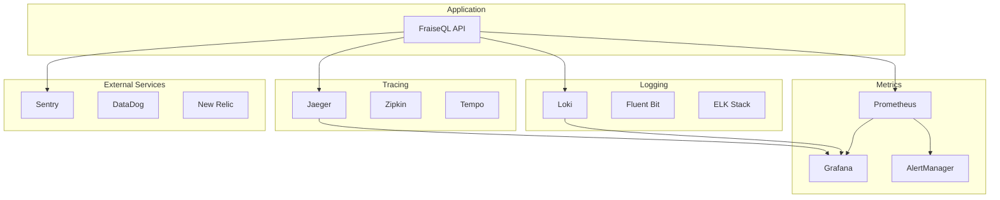

# Monitoring & Observability Guide

## Overview

Comprehensive monitoring ensures your FraiseQL application runs reliably in production. This guide covers metrics, logging, alerting, and distributed tracing across all deployment platforms.

## Observability Stack

### Core Components



## Application Metrics

### Prometheus Integration

```python
# src/fraiseql/monitoring/metrics.py
from prometheus_client import Counter, Histogram, Gauge, Info
import time
import functools

# Application info
app_info = Info('fraiseql_app_info', 'Application information')
app_info.info({
    'version': '1.0.0',
    'environment': 'production',
    'deployment': 'kubernetes'
})

# Request metrics
request_count = Counter(
    'fraiseql_requests_total',
    'Total HTTP requests',
    ['method', 'endpoint', 'status']
)

request_duration = Histogram(
    'fraiseql_request_duration_seconds',
    'HTTP request duration',
    ['method', 'endpoint']
)

# GraphQL metrics
query_count = Counter(
    'fraiseql_graphql_queries_total',
    'Total GraphQL queries',
    ['operation_type', 'operation_name']
)

query_duration = Histogram(
    'fraiseql_graphql_query_duration_seconds',
    'GraphQL query execution time',
    ['operation_type', 'operation_name']
)

query_complexity = Histogram(
    'fraiseql_graphql_query_complexity',
    'GraphQL query complexity score',
    ['operation_type']
)

# Database metrics
db_connections = Gauge(
    'fraiseql_database_connections_active',
    'Active database connections'
)

db_query_duration = Histogram(
    'fraiseql_database_query_duration_seconds',
    'Database query execution time',
    ['operation', 'table']
)

# Cache metrics
cache_operations = Counter(
    'fraiseql_cache_operations_total',
    'Cache operations',
    ['operation', 'result']
)

cache_hit_rate = Gauge(
    'fraiseql_cache_hit_rate',
    'Cache hit rate percentage'
)

# Business metrics
active_users = Gauge(
    'fraiseql_active_users',
    'Currently active users'
)

error_rate = Gauge(
    'fraiseql_error_rate',
    'Application error rate'
)

# Decorator for automatic metrics collection
def monitor_performance(operation_type: str = None):
    def decorator(func):
        @functools.wraps(func)
        async def wrapper(*args, **kwargs):
            start_time = time.time()

            try:
                result = await func(*args, **kwargs)

                # Record success metrics
                duration = time.time() - start_time
                if operation_type:
                    query_duration.labels(
                        operation_type=operation_type,
                        operation_name=func.__name__
                    ).observe(duration)

                return result

            except Exception as e:
                # Record error metrics
                error_rate.inc()
                raise

        return wrapper
    return decorator
```

### FastAPI Middleware

```python
# src/fraiseql/monitoring/middleware.py
from fastapi import Request, Response
from starlette.middleware.base import BaseHTTPMiddleware
import time

class MetricsMiddleware(BaseHTTPMiddleware):
    async def dispatch(self, request: Request, call_next):
        start_time = time.time()

        # Get request details
        method = request.method
        endpoint = request.url.path

        try:
            response: Response = await call_next(request)
            status = response.status_code

            # Record metrics
            request_count.labels(
                method=method,
                endpoint=endpoint,
                status=str(status)
            ).inc()

            duration = time.time() - start_time
            request_duration.labels(
                method=method,
                endpoint=endpoint
            ).observe(duration)

            return response

        except Exception as e:
            # Record error
            request_count.labels(
                method=method,
                endpoint=endpoint,
                status="500"
            ).inc()

            raise

# Add middleware to FastAPI
from fastapi import FastAPI
from prometheus_client import make_asgi_app

app = FastAPI()
app.add_middleware(MetricsMiddleware)

# Expose metrics endpoint
metrics_app = make_asgi_app()
app.mount("/metrics", metrics_app)
```

### GraphQL Query Monitoring

```python
# src/fraiseql/monitoring/graphql_metrics.py
from graphql import GraphQLError
import graphql

class GraphQLMetricsExtension:
    def __init__(self):
        self.start_time = None
        self.operation_name = None
        self.operation_type = None

    def request_started(self, request):
        self.start_time = time.time()

        # Parse operation info
        document = request.query
        if document:
            for definition in document.definitions:
                if hasattr(definition, 'operation'):
                    self.operation_type = definition.operation.value
                    if definition.name:
                        self.operation_name = definition.name.value

    def request_finished(self, request, result):
        if self.start_time:
            duration = time.time() - self.start_time

            # Record query metrics
            query_count.labels(
                operation_type=self.operation_type or "unknown",
                operation_name=self.operation_name or "anonymous"
            ).inc()

            query_duration.labels(
                operation_type=self.operation_type or "unknown",
                operation_name=self.operation_name or "anonymous"
            ).observe(duration)

            # Record complexity if available
            if hasattr(request, 'complexity'):
                query_complexity.labels(
                    operation_type=self.operation_type or "unknown"
                ).observe(request.complexity)
```

## Structured Logging

### Logging Configuration

```python
# src/fraiseql/monitoring/logging.py
import logging
import sys
import json
from datetime import datetime
from typing import Any, Dict

class StructuredFormatter(logging.Formatter):
    """JSON formatter for structured logging"""

    def format(self, record: logging.LogRecord) -> str:
        log_obj: Dict[str, Any] = {
            "timestamp": datetime.utcnow().isoformat(),
            "level": record.levelname,
            "logger": record.name,
            "message": record.getMessage(),
            "module": record.module,
            "function": record.funcName,
            "line": record.lineno,
        }

        # Add trace information if available
        if hasattr(record, 'trace_id'):
            log_obj['trace_id'] = record.trace_id
        if hasattr(record, 'span_id'):
            log_obj['span_id'] = record.span_id

        # Add user context if available
        if hasattr(record, 'user_id'):
            log_obj['user_id'] = record.user_id

        # Add request context if available
        if hasattr(record, 'request_id'):
            log_obj['request_id'] = record.request_id
        if hasattr(record, 'endpoint'):
            log_obj['endpoint'] = record.endpoint
        if hasattr(record, 'method'):
            log_obj['method'] = record.method

        # Add exception info if present
        if record.exc_info:
            log_obj['exception'] = {
                'type': record.exc_info[0].__name__,
                'message': str(record.exc_info[1]),
                'traceback': self.formatException(record.exc_info)
            }

        return json.dumps(log_obj)

def setup_logging():
    """Configure structured logging"""
    logger = logging.getLogger()
    logger.setLevel(logging.INFO)

    # Remove default handlers
    for handler in logger.handlers[:]:
        logger.removeHandler(handler)

    # Add structured handler
    handler = logging.StreamHandler(sys.stdout)
    handler.setFormatter(StructuredFormatter())
    logger.addHandler(handler)

    # Set specific levels
    logging.getLogger("uvicorn.access").setLevel(logging.WARNING)
    logging.getLogger("sqlalchemy.engine").setLevel(logging.WARNING)

    return logger

# Usage in application
logger = setup_logging()

# Log examples
logger.info("Application started", extra={
    'version': '1.0.0',
    'environment': 'production'
})

logger.error("Database connection failed", extra={
    'database_host': 'localhost',
    'database_name': 'fraiseql',
    'retry_count': 3
})
```

### Request Context Logging

```python
# src/fraiseql/monitoring/context.py
from contextvars import ContextVar
import uuid

# Context variables for tracing
request_id_var: ContextVar[str] = ContextVar('request_id')
user_id_var: ContextVar[str] = ContextVar('user_id')
trace_id_var: ContextVar[str] = ContextVar('trace_id')

class LoggingMiddleware(BaseHTTPMiddleware):
    async def dispatch(self, request: Request, call_next):
        # Generate request ID
        request_id = str(uuid.uuid4())
        request_id_var.set(request_id)

        # Set response headers
        response = await call_next(request)
        response.headers["X-Request-ID"] = request_id

        return response

# Enhanced logger with context
class ContextLogger:
    def __init__(self, logger):
        self.logger = logger

    def _add_context(self, extra):
        if not extra:
            extra = {}

        try:
            extra['request_id'] = request_id_var.get()
        except LookupError:
            pass

        try:
            extra['user_id'] = user_id_var.get()
        except LookupError:
            pass

        try:
            extra['trace_id'] = trace_id_var.get()
        except LookupError:
            pass

        return extra

    def info(self, message, extra=None):
        self.logger.info(message, extra=self._add_context(extra))

    def error(self, message, extra=None):
        self.logger.error(message, extra=self._add_context(extra))

    def warning(self, message, extra=None):
        self.logger.warning(message, extra=self._add_context(extra))

# Usage
context_logger = ContextLogger(logger)
```

## Distributed Tracing

### Jaeger Integration

```python
# src/fraiseql/monitoring/tracing.py
from opentelemetry import trace
from opentelemetry.exporter.jaeger.thrift import JaegerExporter
from opentelemetry.sdk.trace import TracerProvider
from opentelemetry.sdk.trace.export import BatchSpanProcessor
from opentelemetry.instrumentation.fastapi import FastAPIInstrumentor
from opentelemetry.instrumentation.sqlalchemy import SQLAlchemyInstrumentor
from opentelemetry.instrumentation.redis import RedisInstrumentor

def setup_tracing(service_name: str = "fraiseql"):
    # Configure tracer provider
    trace.set_tracer_provider(TracerProvider())
    tracer = trace.get_tracer(__name__)

    # Configure Jaeger exporter
    jaeger_exporter = JaegerExporter(
        agent_host_name="jaeger",
        agent_port=6831,
    )

    # Add span processor
    span_processor = BatchSpanProcessor(jaeger_exporter)
    trace.get_tracer_provider().add_span_processor(span_processor)

    return tracer

# Auto-instrument frameworks
def instrument_app(app):
    FastAPIInstrumentor.instrument_app(app)
    SQLAlchemyInstrumentor().instrument()
    RedisInstrumentor().instrument()

# Custom tracing decorator
def trace_function(operation_name: str = None):
    def decorator(func):
        @functools.wraps(func)
        async def wrapper(*args, **kwargs):
            tracer = trace.get_tracer(__name__)

            with tracer.start_as_current_span(
                operation_name or f"{func.__module__}.{func.__name__}"
            ) as span:
                # Add attributes
                span.set_attribute("function.name", func.__name__)
                span.set_attribute("function.module", func.__module__)

                try:
                    result = await func(*args, **kwargs)
                    span.set_status(trace.Status(trace.StatusCode.OK))
                    return result
                except Exception as e:
                    span.set_status(trace.Status(
                        trace.StatusCode.ERROR,
                        str(e)
                    ))
                    span.record_exception(e)
                    raise

        return wrapper
    return decorator

# Usage example
@trace_function("user.get_by_id")
async def get_user_by_id(user_id: int):
    tracer = trace.get_tracer(__name__)

    with tracer.start_as_current_span("database.query") as span:
        span.set_attribute("user.id", user_id)
        # Database query logic
        return user
```

## Alerting

### Prometheus Alert Rules

```yaml
# alerts/fraiseql.rules.yml
groups:
- name: fraiseql
  rules:

  # High error rate
  - alert: FraiseQLHighErrorRate
    expr: (
      rate(fraiseql_requests_total{status=~"5.."}[5m]) /
      rate(fraiseql_requests_total[5m])
    ) > 0.05
    for: 5m
    labels:
      severity: critical
    annotations:
      summary: "FraiseQL high error rate"
      description: "Error rate is {{ $value | humanizePercentage }} for 5 minutes"

  # High response time
  - alert: FraiseQLHighLatency
    expr: histogram_quantile(0.95, rate(fraiseql_request_duration_seconds_bucket[5m])) > 1
    for: 5m
    labels:
      severity: warning
    annotations:
      summary: "FraiseQL high latency"
      description: "95th percentile latency is {{ $value }}s"

  # Database connection issues
  - alert: FraiseQLDatabaseConnections
    expr: fraiseql_database_connections_active > 80
    for: 2m
    labels:
      severity: warning
    annotations:
      summary: "FraiseQL database connections high"
      description: "Active connections: {{ $value }}"

  # Low cache hit rate
  - alert: FraiseQLLowCacheHitRate
    expr: fraiseql_cache_hit_rate < 0.8
    for: 10m
    labels:
      severity: warning
    annotations:
      summary: "FraiseQL low cache hit rate"
      description: "Cache hit rate is {{ $value | humanizePercentage }}"

  # Application down
  - alert: FraiseQLDown
    expr: up{job="fraiseql"} == 0
    for: 1m
    labels:
      severity: critical
    annotations:
      summary: "FraiseQL is down"
      description: "FraiseQL has been down for more than 1 minute"
```

### AlertManager Configuration

```yaml
# alertmanager/config.yml
global:
  smtp_smarthost: 'localhost:587'
  smtp_from: 'alerts@example.com'

route:
  group_by: ['alertname']
  group_wait: 10s
  group_interval: 10s
  repeat_interval: 1h
  receiver: 'web.hook'
  routes:
  - match:
      severity: critical
    receiver: 'critical-alerts'
  - match:
      severity: warning
    receiver: 'warning-alerts'

receivers:
- name: 'web.hook'
  webhook_configs:
  - url: 'http://webhook.example.com/alerts'

- name: 'critical-alerts'
  email_configs:
  - to: 'oncall@example.com'
    subject: 'CRITICAL: {{ range .Alerts }}{{ .Annotations.summary }}{{ end }}'
    body: |
      {{ range .Alerts }}
      Alert: {{ .Annotations.summary }}
      Description: {{ .Annotations.description }}
      Details: {{ range .Labels.SortedPairs }}{{ .Name }}: {{ .Value }}{{ end }}
      {{ end }}

  slack_configs:
  - api_url: 'https://hooks.slack.com/services/YOUR/SLACK/WEBHOOK'
    channel: '#alerts'
    title: 'FraiseQL Critical Alert'
    text: '{{ range .Alerts }}{{ .Annotations.summary }}{{ end }}'

  pagerduty_configs:
  - integration_key: 'YOUR_PAGERDUTY_KEY'

- name: 'warning-alerts'
  slack_configs:
  - api_url: 'https://hooks.slack.com/services/YOUR/SLACK/WEBHOOK'
    channel: '#monitoring'
    title: 'FraiseQL Warning'
    text: '{{ range .Alerts }}{{ .Annotations.summary }}{{ end }}'
```

## Grafana Dashboards

### FraiseQL Overview Dashboard

```json
{
  "dashboard": {
    "title": "FraiseQL Overview",
    "tags": ["fraiseql", "api"],
    "time": {
      "from": "now-1h",
      "to": "now"
    },
    "panels": [
      {
        "title": "Request Rate",
        "type": "stat",
        "targets": [
          {
            "expr": "sum(rate(fraiseql_requests_total[5m]))",
            "legendFormat": "Requests/sec"
          }
        ],
        "fieldConfig": {
          "defaults": {
            "unit": "reqps"
          }
        }
      },
      {
        "title": "Error Rate",
        "type": "stat",
        "targets": [
          {
            "expr": "sum(rate(fraiseql_requests_total{status=~\"5..\"}[5m])) / sum(rate(fraiseql_requests_total[5m]))",
            "legendFormat": "Error Rate"
          }
        ],
        "fieldConfig": {
          "defaults": {
            "unit": "percentunit",
            "thresholds": {
              "steps": [
                {"color": "green", "value": null},
                {"color": "yellow", "value": 0.01},
                {"color": "red", "value": 0.05}
              ]
            }
          }
        }
      },
      {
        "title": "Response Time",
        "type": "timeseries",
        "targets": [
          {
            "expr": "histogram_quantile(0.50, rate(fraiseql_request_duration_seconds_bucket[5m]))",
            "legendFormat": "P50"
          },
          {
            "expr": "histogram_quantile(0.95, rate(fraiseql_request_duration_seconds_bucket[5m]))",
            "legendFormat": "P95"
          },
          {
            "expr": "histogram_quantile(0.99, rate(fraiseql_request_duration_seconds_bucket[5m]))",
            "legendFormat": "P99"
          }
        ],
        "fieldConfig": {
          "defaults": {
            "unit": "s"
          }
        }
      },
      {
        "title": "GraphQL Operations",
        "type": "timeseries",
        "targets": [
          {
            "expr": "sum(rate(fraiseql_graphql_queries_total[5m])) by (operation_type)",
            "legendFormat": "{{ operation_type }}"
          }
        ]
      },
      {
        "title": "Database Connections",
        "type": "timeseries",
        "targets": [
          {
            "expr": "fraiseql_database_connections_active",
            "legendFormat": "Active Connections"
          }
        ]
      },
      {
        "title": "Cache Hit Rate",
        "type": "stat",
        "targets": [
          {
            "expr": "fraiseql_cache_hit_rate",
            "legendFormat": "Hit Rate"
          }
        ],
        "fieldConfig": {
          "defaults": {
            "unit": "percentunit",
            "min": 0,
            "max": 1
          }
        }
      }
    ]
  }
}
```

### Database Performance Dashboard

```json
{
  "dashboard": {
    "title": "FraiseQL Database Performance",
    "panels": [
      {
        "title": "Query Duration by Operation",
        "type": "heatmap",
        "targets": [
          {
            "expr": "sum(rate(fraiseql_database_query_duration_seconds_bucket[5m])) by (operation, le)",
            "format": "heatmap"
          }
        ]
      },
      {
        "title": "Slow Queries",
        "type": "table",
        "targets": [
          {
            "expr": "topk(10, avg_over_time(fraiseql_database_query_duration_seconds[1h]) > 0.1)",
            "format": "table"
          }
        ]
      },
      {
        "title": "Connection Pool Status",
        "type": "timeseries",
        "targets": [
          {
            "expr": "fraiseql_database_connections_active",
            "legendFormat": "Active"
          },
          {
            "expr": "fraiseql_database_connections_idle",
            "legendFormat": "Idle"
          }
        ]
      }
    ]
  }
}
```

## Error Tracking

### Sentry Integration

```python
# src/fraiseql/monitoring/sentry.py
import sentry_sdk
from sentry_sdk.integrations.sqlalchemy import SqlalchemyIntegration
from sentry_sdk.integrations.fastapi import FastApiIntegration
from sentry_sdk.integrations.redis import RedisIntegration

def setup_sentry(dsn: str, environment: str = "production"):
    sentry_sdk.init(
        dsn=dsn,
        environment=environment,
        integrations=[
            FastApiIntegration(),
            SqlalchemyIntegration(),
            RedisIntegration(),
        ],
        traces_sample_rate=0.1,
        profiles_sample_rate=0.1,
        before_send=filter_sensitive_data,
    )

def filter_sensitive_data(event, hint):
    """Filter out sensitive information"""
    if 'request' in event:
        # Remove sensitive headers
        if 'headers' in event['request']:
            sensitive_headers = ['authorization', 'cookie', 'x-api-key']
            for header in sensitive_headers:
                event['request']['headers'].pop(header.lower(), None)

    return event

# Custom error reporting
def report_error(error: Exception, context: dict = None):
    with sentry_sdk.push_scope() as scope:
        if context:
            for key, value in context.items():
                scope.set_context(key, value)

        sentry_sdk.capture_exception(error)
```

## Health Checks

### Comprehensive Health Check

```python
# src/fraiseql/monitoring/health.py
from fastapi import FastAPI, HTTPException
from sqlalchemy import text
from typing import Dict, Any
import redis
import asyncio
import time

class HealthChecker:
    def __init__(self, db_engine, redis_client):
        self.db_engine = db_engine
        self.redis_client = redis_client
        self.checks = {
            'database': self._check_database,
            'redis': self._check_redis,
            'disk_space': self._check_disk_space,
            'memory': self._check_memory,
        }

    async def _check_database(self) -> Dict[str, Any]:
        """Check database connectivity and performance"""
        start_time = time.time()

        try:
            async with self.db_engine.connect() as conn:
                await conn.execute(text("SELECT 1"))

            duration = time.time() - start_time

            return {
                'status': 'healthy',
                'response_time': duration,
                'details': 'Database connection successful'
            }
        except Exception as e:
            return {
                'status': 'unhealthy',
                'error': str(e),
                'details': 'Database connection failed'
            }

    async def _check_redis(self) -> Dict[str, Any]:
        """Check Redis connectivity"""
        try:
            await self.redis_client.ping()
            return {
                'status': 'healthy',
                'details': 'Redis connection successful'
            }
        except Exception as e:
            return {
                'status': 'unhealthy',
                'error': str(e),
                'details': 'Redis connection failed'
            }

    async def _check_disk_space(self) -> Dict[str, Any]:
        """Check available disk space"""
        import shutil

        try:
            usage = shutil.disk_usage('/')
            free_percentage = (usage.free / usage.total) * 100

            status = 'healthy' if free_percentage > 10 else 'unhealthy'

            return {
                'status': status,
                'free_percentage': free_percentage,
                'free_bytes': usage.free,
                'total_bytes': usage.total
            }
        except Exception as e:
            return {
                'status': 'unhealthy',
                'error': str(e)
            }

    async def _check_memory(self) -> Dict[str, Any]:
        """Check memory usage"""
        import psutil

        try:
            memory = psutil.virtual_memory()
            status = 'healthy' if memory.percent < 90 else 'unhealthy'

            return {
                'status': status,
                'usage_percentage': memory.percent,
                'available_bytes': memory.available,
                'total_bytes': memory.total
            }
        except Exception as e:
            return {
                'status': 'unhealthy',
                'error': str(e)
            }

    async def check_all(self) -> Dict[str, Any]:
        """Run all health checks"""
        results = {}

        tasks = [
            asyncio.create_task(check(), name=name)
            for name, check in self.checks.items()
        ]

        completed_tasks = await asyncio.gather(*tasks, return_exceptions=True)

        for task, result in zip(tasks, completed_tasks):
            name = task.get_name()
            if isinstance(result, Exception):
                results[name] = {
                    'status': 'unhealthy',
                    'error': str(result)
                }
            else:
                results[name] = result

        # Overall status
        overall_status = 'healthy' if all(
            check.get('status') == 'healthy'
            for check in results.values()
        ) else 'degraded'

        return {
            'status': overall_status,
            'timestamp': time.time(),
            'checks': results
        }

# FastAPI endpoints
@app.get("/health")
async def basic_health():
    """Basic health check for load balancers"""
    return {"status": "healthy"}

@app.get("/health/detailed")
async def detailed_health():
    """Detailed health check with all components"""
    health_checker = HealthChecker(db_engine, redis_client)
    result = await health_checker.check_all()

    if result['status'] != 'healthy':
        raise HTTPException(status_code=503, detail=result)

    return result

@app.get("/ready")
async def readiness_check():
    """Kubernetes readiness probe"""
    health_checker = HealthChecker(db_engine, redis_client)

    # Check critical components only
    critical_checks = ['database', 'redis']

    for check_name in critical_checks:
        result = await health_checker.checks[check_name]()
        if result['status'] != 'healthy':
            raise HTTPException(status_code=503, detail=f"{check_name} not ready")

    return {"status": "ready"}
```

## Platform-Specific Monitoring

### AWS CloudWatch

```python
# src/fraiseql/monitoring/cloudwatch.py
import boto3
import json
from datetime import datetime

class CloudWatchLogger:
    def __init__(self, log_group: str, log_stream: str):
        self.client = boto3.client('logs')
        self.log_group = log_group
        self.log_stream = log_stream

    def put_log_events(self, events):
        """Send log events to CloudWatch"""
        try:
            self.client.put_log_events(
                logGroupName=self.log_group,
                logStreamName=self.log_stream,
                logEvents=events
            )
        except Exception as e:
            # Fallback to local logging
            print(f"CloudWatch logging failed: {e}")

# Custom metrics to CloudWatch
class CloudWatchMetrics:
    def __init__(self, namespace: str = "FraiseQL"):
        self.client = boto3.client('cloudwatch')
        self.namespace = namespace

    def put_metric(self, metric_name: str, value: float, unit: str = 'Count', dimensions: dict = None):
        """Send custom metric to CloudWatch"""
        metric_data = {
            'MetricName': metric_name,
            'Value': value,
            'Unit': unit,
            'Timestamp': datetime.utcnow()
        }

        if dimensions:
            metric_data['Dimensions'] = [
                {'Name': k, 'Value': v} for k, v in dimensions.items()
            ]

        self.client.put_metric_data(
            Namespace=self.namespace,
            MetricData=[metric_data]
        )
```

### Google Cloud Monitoring

```python
# src/fraiseql/monitoring/gcp_monitoring.py
from google.cloud import monitoring_v3
from google.cloud import logging as gcp_logging

class GCPMonitoring:
    def __init__(self, project_id: str):
        self.project_id = project_id
        self.metrics_client = monitoring_v3.MetricServiceClient()
        self.logging_client = gcp_logging.Client()

        # Get a Cloud Logging handler
        self.logging_handler = self.logging_client.get_default_handler()

    def send_metric(self, metric_type: str, value: float, labels: dict = None):
        """Send custom metric to Cloud Monitoring"""
        project_name = f"projects/{self.project_id}"

        series = monitoring_v3.TimeSeries()
        series.metric.type = f"custom.googleapis.com/{metric_type}"
        series.resource.type = "global"

        if labels:
            for key, val in labels.items():
                series.metric.labels[key] = val

        now = time.time()
        seconds = int(now)
        nanos = int((now - seconds) * 10 ** 9)
        interval = monitoring_v3.TimeInterval({
            "end_time": {"seconds": seconds, "nanos": nanos}
        })

        point = monitoring_v3.Point({
            "interval": interval,
            "value": {"double_value": value}
        })

        series.points = [point]

        self.metrics_client.create_time_series(
            name=project_name,
            time_series=[series]
        )
```

## Best Practices

### 1. Monitoring Strategy

- **Four Golden Signals**: Latency, Traffic, Errors, Saturation
- **USE Method**: Utilization, Saturation, Errors
- **RED Method**: Request rate, Error rate, Duration

### 2. Alert Fatigue Prevention

- Set meaningful thresholds
- Use alert severity levels
- Implement alert routing
- Regular alert review and tuning

### 3. Dashboard Design

- Focus on business metrics
- Use consistent time windows
- Implement drill-down capabilities
- Include SLA/SLO tracking

### 4. Log Management

- Use structured logging
- Include correlation IDs
- Implement log retention policies
- Sanitize sensitive data

### 5. Performance Impact

- Use sampling for traces
- Batch metrics collection
- Implement circuit breakers
- Monitor monitoring overhead

## Troubleshooting

### High Cardinality Issues

```python
# Avoid high cardinality labels
# BAD: user_id as label
user_requests = Counter('requests_by_user', 'Requests per user', ['user_id'])

# GOOD: Use bounded labels
user_requests = Counter('requests_by_tier', 'Requests per tier', ['user_tier'])
```

### Memory Leaks in Metrics

```python
# Use label bounds
from prometheus_client import CollectorRegistry, Counter

# Create custom registry with garbage collection
registry = CollectorRegistry()
counter = Counter('http_requests_total', 'HTTP requests', registry=registry)

# Periodic cleanup
def cleanup_metrics():
    registry._collector_to_names.clear()
    registry._names_to_collectors.clear()
```

### Log Volume Management

```python
# Implement sampling
import random

def should_log(level: str, sample_rate: float = 1.0) -> bool:
    if level == 'ERROR':
        return True  # Always log errors
    return random.random() < sample_rate

# Usage
if should_log('INFO', 0.1):  # Sample 10% of INFO logs
    logger.info("Request processed", extra=context)
```

## Next Steps

1. Set up your monitoring stack based on your platform
2. Configure alerts for critical metrics
3. Create custom dashboards for your use case
4. Implement distributed tracing
5. Review and tune alerts regularly
6. Set up [scaling policies](./scaling.md) based on metrics
