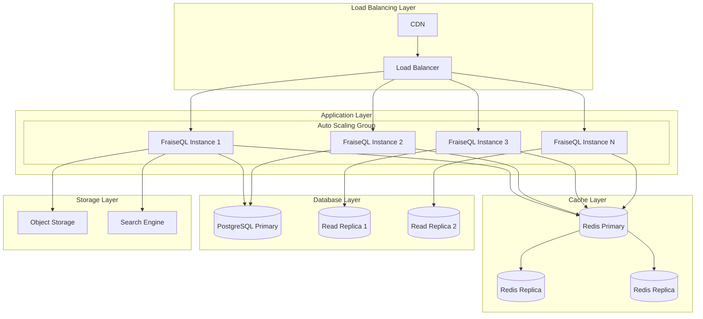

# Scaling Guide

## Overview

Scale your FraiseQL deployment to handle growing traffic, ensure high availability, and optimize performance. This guide covers horizontal and vertical scaling strategies across different platforms.

## Scaling Architecture



## Horizontal Scaling

### Kubernetes Horizontal Pod Autoscaler (HPA)

```yaml
# hpa.yaml
apiVersion: autoscaling/v2
kind: HorizontalPodAutoscaler
metadata:
  name: fraiseql-hpa
spec:
  scaleTargetRef:
    apiVersion: apps/v1
    kind: Deployment
    name: fraiseql
  minReplicas: 2
  maxReplicas: 50
  metrics:
  - type: Resource
    resource:
      name: cpu
      target:
        type: Utilization
        averageUtilization: 70
  - type: Resource
    resource:
      name: memory
      target:
        type: Utilization
        averageUtilization: 80
  - type: Pods
    pods:
      metric:
        name: graphql_queries_per_second
      target:
        type: AverageValue
        averageValue: "100"
  behavior:
    scaleDown:
      stabilizationWindowSeconds: 300
      policies:
      - type: Percent
        value: 10
        periodSeconds: 60
      - type: Pods
        value: 2
        periodSeconds: 60
      selectPolicy: Min
    scaleUp:
      stabilizationWindowSeconds: 0
      policies:
      - type: Percent
        value: 100
        periodSeconds: 15
      - type: Pods
        value: 4
        periodSeconds: 15
      selectPolicy: Max
```

### Vertical Pod Autoscaler (VPA)

```yaml
# vpa.yaml
apiVersion: autoscaling.k8s.io/v1
kind: VerticalPodAutoscaler
metadata:
  name: fraiseql-vpa
spec:
  targetRef:
    apiVersion: apps/v1
    kind: Deployment
    name: fraiseql
  updatePolicy:
    updateMode: "Auto"
  resourcePolicy:
    containerPolicies:
    - containerName: fraiseql
      maxAllowed:
        cpu: 4
        memory: 8Gi
      minAllowed:
        cpu: 250m
        memory: 512Mi
      controlledResources:
      - cpu
      - memory
```

### Custom Metrics Scaling

```python
# src/fraiseql/monitoring/custom_metrics.py
from prometheus_client import Gauge, Counter
import time

# Custom scaling metrics
active_connections = Gauge('fraiseql_active_connections', 'Active WebSocket connections')
queue_depth = Gauge('fraiseql_queue_depth', 'Background job queue depth')
response_time_p95 = Gauge('fraiseql_response_time_p95', 'Response time 95th percentile')
error_rate = Gauge('fraiseql_error_rate', 'Error rate over last 5 minutes')

class ScalingMetricsCollector:
    def __init__(self):
        self.metrics_history = []

    def collect_metrics(self):
        """Collect metrics for scaling decisions"""
        current_time = time.time()

        # Calculate metrics
        metrics = {
            'timestamp': current_time,
            'active_connections': self.get_active_connections(),
            'queue_depth': self.get_queue_depth(),
            'cpu_usage': self.get_cpu_usage(),
            'memory_usage': self.get_memory_usage(),
            'response_time_p95': self.calculate_p95_response_time(),
            'error_rate': self.calculate_error_rate(),
        }

        # Update Prometheus metrics
        active_connections.set(metrics['active_connections'])
        queue_depth.set(metrics['queue_depth'])
        response_time_p95.set(metrics['response_time_p95'])
        error_rate.set(metrics['error_rate'])

        # Store for trend analysis
        self.metrics_history.append(metrics)

        # Keep only last hour
        cutoff_time = current_time - 3600
        self.metrics_history = [
            m for m in self.metrics_history
            if m['timestamp'] > cutoff_time
        ]

        return metrics

    def should_scale_up(self) -> bool:
        """Determine if scaling up is needed"""
        recent_metrics = self.get_recent_metrics(300)  # Last 5 minutes

        if not recent_metrics:
            return False

        avg_cpu = sum(m['cpu_usage'] for m in recent_metrics) / len(recent_metrics)
        avg_memory = sum(m['memory_usage'] for m in recent_metrics) / len(recent_metrics)
        avg_response_time = sum(m['response_time_p95'] for m in recent_metrics) / len(recent_metrics)
        avg_error_rate = sum(m['error_rate'] for m in recent_metrics) / len(recent_metrics)

        # Scale up conditions
        return (
            avg_cpu > 70 or
            avg_memory > 80 or
            avg_response_time > 1.0 or
            avg_error_rate > 0.05 or
            any(m['queue_depth'] > 100 for m in recent_metrics)
        )

    def should_scale_down(self) -> bool:
        """Determine if scaling down is safe"""
        recent_metrics = self.get_recent_metrics(600)  # Last 10 minutes

        if not recent_metrics:
            return False

        avg_cpu = sum(m['cpu_usage'] for m in recent_metrics) / len(recent_metrics)
        avg_memory = sum(m['memory_usage'] for m in recent_metrics) / len(recent_metrics)
        max_queue_depth = max(m['queue_depth'] for m in recent_metrics)

        # Scale down conditions (conservative)
        return (
            avg_cpu < 30 and
            avg_memory < 50 and
            max_queue_depth < 10 and
            len(recent_metrics) >= 20  # Ensure enough data points
        )

    def get_recent_metrics(self, seconds: int):
        """Get metrics from the last N seconds"""
        cutoff_time = time.time() - seconds
        return [m for m in self.metrics_history if m['timestamp'] > cutoff_time]
```

## Database Scaling

### Read Replicas

```python
# src/fraiseql/database/routing.py
import random
from enum import Enum
from sqlalchemy import create_engine
from sqlalchemy.orm import sessionmaker

class DatabaseOperation(Enum):
    READ = "read"
    WRITE = "write"

class DatabaseRouter:
    def __init__(self, primary_url: str, replica_urls: list):
        self.primary_engine = create_engine(primary_url)
        self.replica_engines = [
            create_engine(url) for url in replica_urls
        ]

        self.primary_session = sessionmaker(bind=self.primary_engine)
        self.replica_sessions = [
            sessionmaker(bind=engine) for engine in self.replica_engines
        ]

    def get_session(self, operation: DatabaseOperation = DatabaseOperation.READ):
        """Route database operations to appropriate instance"""
        if operation == DatabaseOperation.WRITE or not self.replica_sessions:
            return self.primary_session()

        # Load balance read operations across replicas
        replica_session = random.choice(self.replica_sessions)
        return replica_session()

    def get_read_session(self):
        """Get session for read operations"""
        return self.get_session(DatabaseOperation.READ)

    def get_write_session(self):
        """Get session for write operations"""
        return self.get_session(DatabaseOperation.WRITE)

# Usage in GraphQL resolvers
class UserResolver:
    def __init__(self, db_router: DatabaseRouter):
        self.db_router = db_router

    async def get_user(self, user_id: int):
        """Read operation - use replica"""
        session = self.db_router.get_read_session()
        return session.query(User).filter(User.id == user_id).first()

    async def create_user(self, user_data: dict):
        """Write operation - use primary"""
        session = self.db_router.get_write_session()
        user = User(**user_data)
        session.add(user)
        session.commit()
        return user
```

### Connection Pooling Optimization

```python
# src/fraiseql/database/pool.py
from sqlalchemy import create_engine, pool
import os

def create_optimized_engine(database_url: str, is_replica: bool = False):
    """Create database engine with optimized connection pooling"""

    # Calculate pool size based on environment
    max_connections = int(os.environ.get('MAX_DB_CONNECTIONS', '100'))
    web_concurrency = int(os.environ.get('WEB_CONCURRENCY', '4'))

    if is_replica:
        # Replicas can have smaller pools
        pool_size = min(max_connections // (web_concurrency * 2), 10)
        max_overflow = pool_size // 2
    else:
        # Primary needs larger pool for writes
        pool_size = min(max_connections // web_concurrency, 20)
        max_overflow = pool_size

    return create_engine(
        database_url,
        pool_size=pool_size,
        max_overflow=max_overflow,
        pool_timeout=30,
        pool_recycle=3600,
        pool_pre_ping=True,
        poolclass=pool.QueuePool,
        connect_args={
            'server_settings': {
                'jit': 'off',
                'shared_preload_libraries': 'pg_stat_statements',
            },
            'command_timeout': 60,
            'options': '-c statement_timeout=30000'
        },
        echo_pool=True if os.environ.get('DEBUG_SQL_POOL') else False,
    )

# Monitor connection pool health
class PoolMonitor:
    def __init__(self, engine):
        self.engine = engine

    def get_pool_status(self):
        """Get current connection pool status"""
        pool = self.engine.pool

        return {
            'size': pool.size(),
            'checked_in': pool.checkedin(),
            'checked_out': pool.checkedout(),
            'overflow': pool.overflow(),
            'invalid': pool.invalid(),
        }

    def log_pool_status(self):
        """Log pool status for monitoring"""
        status = self.get_pool_status()
        logger.info("Database pool status", extra=status)

        # Emit metrics
        db_pool_size.set(status['size'])
        db_pool_checked_out.set(status['checked_out'])
        db_pool_overflow.set(status['overflow'])
```

### Database Query Optimization

```python
# src/fraiseql/database/optimization.py
from sqlalchemy import event, text
from sqlalchemy.engine import Engine
import time
import logging

logger = logging.getLogger(__name__)

# Log slow queries
@event.listens_for(Engine, "before_cursor_execute")
def receive_before_cursor_execute(conn, cursor, statement, parameters, context, executemany):
    context._query_start_time = time.time()

@event.listens_for(Engine, "after_cursor_execute")
def receive_after_cursor_execute(conn, cursor, statement, parameters, context, executemany):
    total = time.time() - context._query_start_time

    # Log slow queries
    if total > 0.5:  # Log queries taking more than 500ms
        logger.warning(
            "Slow query detected",
            extra={
                'duration': total,
                'statement': statement[:500],  # Truncate long statements
                'parameters': str(parameters)[:200] if parameters else None
            }
        )

    # Emit metrics
    db_query_duration.labels(
        operation=statement.split()[0].upper() if statement else "UNKNOWN"
    ).observe(total)

# Query complexity analysis
class QueryAnalyzer:
    def __init__(self, db_session):
        self.db_session = db_session

    async def analyze_query_plan(self, query: str):
        """Analyze query execution plan"""
        explain_query = f"EXPLAIN (ANALYZE, BUFFERS, FORMAT JSON) {query}"

        result = await self.db_session.execute(text(explain_query))
        plan = result.fetchone()[0]

        return self.extract_plan_metrics(plan[0]['Plan'])

    def extract_plan_metrics(self, plan: dict):
        """Extract useful metrics from query plan"""
        return {
            'total_cost': plan.get('Total Cost', 0),
            'actual_time': plan.get('Actual Total Time', 0),
            'rows': plan.get('Actual Rows', 0),
            'node_type': plan.get('Node Type'),
            'sequential_scans': self.count_sequential_scans(plan),
            'index_scans': self.count_index_scans(plan),
        }

    def count_sequential_scans(self, plan: dict, count: int = 0):
        """Count sequential scans in query plan"""
        if plan.get('Node Type') == 'Seq Scan':
            count += 1

        for child in plan.get('Plans', []):
            count = self.count_sequential_scans(child, count)

        return count

    def count_index_scans(self, plan: dict, count: int = 0):
        """Count index scans in query plan"""
        if 'Index' in plan.get('Node Type', ''):
            count += 1

        for child in plan.get('Plans', []):
            count = self.count_index_scans(child, count)

        return count
```

## Caching Strategies

### Multi-Level Caching

```python
# src/fraiseql/caching/strategy.py
import json
import hashlib
from typing import Any, Optional
from datetime import timedelta
import redis
import asyncio

class MultiLevelCache:
    def __init__(self, redis_client, local_cache_size: int = 1000):
        self.redis = redis_client
        self.local_cache = {}
        self.local_cache_access = {}
        self.max_local_size = local_cache_size

    def _generate_key(self, prefix: str, *args, **kwargs) -> str:
        """Generate cache key from arguments"""
        key_data = json.dumps([args, sorted(kwargs.items())], sort_keys=True)
        key_hash = hashlib.md5(key_data.encode()).hexdigest()[:16]
        return f"{prefix}:{key_hash}"

    async def get(self, key: str) -> Optional[Any]:
        """Get value from cache (local first, then Redis)"""
        # Try local cache first
        if key in self.local_cache:
            self.local_cache_access[key] = time.time()
            cache_hits.labels(level="local").inc()
            return self.local_cache[key]

        # Try Redis
        try:
            value = await self.redis.get(key)
            if value is not None:
                parsed_value = json.loads(value)
                # Store in local cache
                await self._store_local(key, parsed_value)
                cache_hits.labels(level="redis").inc()
                return parsed_value
        except Exception as e:
            logger.error(f"Redis cache error: {e}")

        cache_misses.inc()
        return None

    async def set(self, key: str, value: Any, ttl: int = 3600):
        """Set value in both caches"""
        serialized = json.dumps(value)

        # Store in local cache
        await self._store_local(key, value)

        # Store in Redis
        try:
            await self.redis.setex(key, ttl, serialized)
        except Exception as e:
            logger.error(f"Redis cache set error: {e}")

    async def _store_local(self, key: str, value: Any):
        """Store value in local cache with LRU eviction"""
        if len(self.local_cache) >= self.max_local_size:
            # Evict least recently used
            lru_key = min(
                self.local_cache_access.keys(),
                key=lambda k: self.local_cache_access[k]
            )
            del self.local_cache[lru_key]
            del self.local_cache_access[lru_key]

        self.local_cache[key] = value
        self.local_cache_access[key] = time.time()

# Cache decorators
def cached(
    cache_instance: MultiLevelCache,
    prefix: str,
    ttl: int = 3600,
    skip_if: callable = None
):
    def decorator(func):
        @functools.wraps(func)
        async def wrapper(*args, **kwargs):
            # Generate cache key
            cache_key = cache_instance._generate_key(prefix, *args, **kwargs)

            # Check if we should skip caching
            if skip_if and skip_if(*args, **kwargs):
                return await func(*args, **kwargs)

            # Try to get from cache
            cached_result = await cache_instance.get(cache_key)
            if cached_result is not None:
                return cached_result

            # Execute function and cache result
            result = await func(*args, **kwargs)

            if result is not None:
                await cache_instance.set(cache_key, result, ttl)

            return result

        return wrapper
    return decorator

# Usage examples
@cached(cache_instance, "user", ttl=1800)
async def get_user_by_id(user_id: int):
    # Database query
    return await db.fetch_user(user_id)

@cached(cache_instance, "graphql_query", ttl=300, skip_if=lambda query, variables: "mutation" in query.lower())
async def execute_graphql_query(query: str, variables: dict):
    # GraphQL execution
    return await execute_query(query, variables)
```

### Cache Warming Strategies

```python
# src/fraiseql/caching/warming.py
import asyncio
from datetime import datetime, timedelta

class CacheWarmer:
    def __init__(self, cache: MultiLevelCache, db_router: DatabaseRouter):
        self.cache = cache
        self.db_router = db_router

    async def warm_popular_data(self):
        """Pre-populate cache with frequently accessed data"""
        tasks = [
            self.warm_popular_users(),
            self.warm_recent_content(),
            self.warm_configuration_data(),
        ]

        await asyncio.gather(*tasks, return_exceptions=True)

    async def warm_popular_users(self):
        """Cache most active users"""
        session = self.db_router.get_read_session()

        # Get users active in last 24 hours
        popular_users = session.query(User).filter(
            User.last_active > datetime.utcnow() - timedelta(hours=24)
        ).order_by(User.last_active.desc()).limit(1000).all()

        # Cache each user
        for user in popular_users:
            cache_key = f"user:{user.id}"
            await self.cache.set(cache_key, user.to_dict(), ttl=1800)

    async def warm_recent_content(self):
        """Cache recently created content"""
        session = self.db_router.get_read_session()

        recent_posts = session.query(Post).filter(
            Post.created_at > datetime.utcnow() - timedelta(hours=6)
        ).order_by(Post.created_at.desc()).limit(500).all()

        for post in recent_posts:
            cache_key = f"post:{post.id}"
            await self.cache.set(cache_key, post.to_dict(), ttl=600)

    async def start_background_warming(self):
        """Start background cache warming process"""
        while True:
            try:
                await self.warm_popular_data()
                await asyncio.sleep(300)  # Warm every 5 minutes
            except Exception as e:
                logger.error(f"Cache warming error: {e}")
                await asyncio.sleep(60)  # Retry after 1 minute on error

# Start cache warming
cache_warmer = CacheWarmer(cache_instance, db_router)
asyncio.create_task(cache_warmer.start_background_warming())
```

## Load Balancing

### Advanced Load Balancing Configuration

```nginx
# nginx.conf
upstream fraiseql_backend {
    # Weighted round-robin
    server app1:8000 weight=3 max_fails=3 fail_timeout=30s;
    server app2:8000 weight=3 max_fails=3 fail_timeout=30s;
    server app3:8000 weight=2 max_fails=3 fail_timeout=30s;  # Lower spec server

    # Health check
    keepalive 32;
    keepalive_requests 1000;
    keepalive_timeout 60s;
}

server {
    listen 80;

    # Rate limiting per IP
    limit_req_zone $binary_remote_addr zone=api:10m rate=10r/s;
    limit_req zone=api burst=20 nodelay;

    # Connection limiting
    limit_conn_zone $binary_remote_addr zone=conn_limit_per_ip:10m;
    limit_conn conn_limit_per_ip 10;

    location / {
        proxy_pass http://fraiseql_backend;
        proxy_http_version 1.1;
        proxy_set_header Connection "";
        proxy_set_header Host $host;
        proxy_set_header X-Real-IP $remote_addr;
        proxy_set_header X-Forwarded-For $proxy_add_x_forwarded_for;
        proxy_set_header X-Forwarded-Proto $scheme;

        # Timeouts
        proxy_connect_timeout 5s;
        proxy_send_timeout 60s;
        proxy_read_timeout 60s;

        # Retry logic
        proxy_next_upstream error timeout http_500 http_502 http_503 http_504;
        proxy_next_upstream_tries 3;
        proxy_next_upstream_timeout 10s;
    }

    # Health check endpoint
    location /health {
        proxy_pass http://fraiseql_backend;
        proxy_connect_timeout 2s;
        proxy_read_timeout 2s;
        access_log off;
    }
}
```

### Session Affinity for WebSocket

```python
# src/fraiseql/websocket/affinity.py
import hashlib
import json

class SessionAffinityManager:
    def __init__(self, instance_id: str):
        self.instance_id = instance_id

    def should_handle_connection(self, user_id: str, total_instances: int) -> bool:
        """Determine if this instance should handle the WebSocket connection"""
        # Use consistent hashing to route connections
        hash_input = f"{user_id}".encode()
        hash_value = int(hashlib.md5(hash_input).hexdigest(), 16)
        target_instance = hash_value % total_instances

        return target_instance == int(self.instance_id)

    async def get_user_instance(self, user_id: str) -> str:
        """Get the instance ID handling a specific user"""
        # This would typically query a distributed cache or service registry
        instance_mapping = await redis.get(f"user_instance:{user_id}")
        return instance_mapping

# WebSocket connection handling with affinity
class WebSocketManager:
    def __init__(self, affinity_manager: SessionAffinityManager):
        self.affinity_manager = affinity_manager
        self.active_connections = {}

    async def connect(self, websocket, user_id: str):
        if not self.affinity_manager.should_handle_connection(user_id, 3):  # 3 instances
            # Redirect to correct instance
            correct_instance = await self.affinity_manager.get_user_instance(user_id)
            await websocket.send_text(json.dumps({
                "type": "redirect",
                "instance": correct_instance
            }))
            await websocket.close()
            return

        # Handle connection on this instance
        await websocket.accept()
        self.active_connections[user_id] = websocket

        # Register instance mapping
        await redis.set(f"user_instance:{user_id}", self.affinity_manager.instance_id, ex=3600)
```

## Auto-Scaling Policies

### AWS Auto Scaling Group

```yaml
# cloudformation-asg.yaml
Resources:
  LaunchTemplate:
    Type: AWS::EC2::LaunchTemplate
    Properties:
      LaunchTemplateName: fraiseql-launch-template
      LaunchTemplateData:
        ImageId: ami-0123456789abcdef0
        InstanceType: t3.medium
        SecurityGroupIds:
          - !Ref InstanceSecurityGroup
        UserData:
          Fn::Base64: !Sub |
            #!/bin/bash
            yum update -y
            docker run -d \
              -p 8000:8000 \
              -e DATABASE_URL=${DatabaseURL} \
              -e REDIS_URL=${RedisURL} \
              fraiseql:latest

  AutoScalingGroup:
    Type: AWS::AutoScaling::AutoScalingGroup
    Properties:
      VPCZoneIdentifier:
        - !Ref PrivateSubnet1
        - !Ref PrivateSubnet2
      LaunchTemplate:
        LaunchTemplateId: !Ref LaunchTemplate
        Version: !GetAtt LaunchTemplate.LatestVersionNumber
      MinSize: 2
      MaxSize: 20
      DesiredCapacity: 3
      TargetGroupARNs:
        - !Ref TargetGroup
      HealthCheckType: ELB
      HealthCheckGracePeriod: 300
      TerminationPolicies:
        - OldestInstance
      Tags:
        - Key: Name
          Value: fraiseql-instance
          PropagateAtLaunch: true

  ScaleUpPolicy:
    Type: AWS::AutoScaling::ScalingPolicy
    Properties:
      AdjustmentType: ChangeInCapacity
      AutoScalingGroupName: !Ref AutoScalingGroup
      Cooldown: 300
      ScalingAdjustment: 2
      PolicyType: SimpleScaling

  ScaleDownPolicy:
    Type: AWS::AutoScaling::ScalingPolicy
    Properties:
      AdjustmentType: ChangeInCapacity
      AutoScalingGroupName: !Ref AutoScalingGroup
      Cooldown: 300
      ScalingAdjustment: -1
      PolicyType: SimpleScaling

  CPUAlarmHigh:
    Type: AWS::CloudWatch::Alarm
    Properties:
      AlarmName: fraiseql-cpu-high
      AlarmDescription: Scale up on high CPU
      MetricName: CPUUtilization
      Namespace: AWS/EC2
      Statistic: Average
      Period: 300
      EvaluationPeriods: 2
      Threshold: 70
      ComparisonOperator: GreaterThanThreshold
      AlarmActions:
        - !Ref ScaleUpPolicy
      Dimensions:
        - Name: AutoScalingGroupName
          Value: !Ref AutoScalingGroup

  CPUAlarmLow:
    Type: AWS::CloudWatch::Alarm
    Properties:
      AlarmName: fraiseql-cpu-low
      AlarmDescription: Scale down on low CPU
      MetricName: CPUUtilization
      Namespace: AWS/EC2
      Statistic: Average
      Period: 300
      EvaluationPeriods: 2
      Threshold: 20
      ComparisonOperator: LessThanThreshold
      AlarmActions:
        - !Ref ScaleDownPolicy
      Dimensions:
        - Name: AutoScalingGroupName
          Value: !Ref AutoScalingGroup
```

### Google Cloud Instance Groups

```yaml
# gcp-mig.yaml
resources:
- name: fraiseql-template
  type: compute.v1.instanceTemplate
  properties:
    properties:
      machineType: n1-standard-2
      disks:
      - deviceName: boot
        type: PERSISTENT
        boot: true
        autoDelete: true
        initializeParams:
          sourceImage: projects/cos-cloud/global/images/family/cos-stable
      networkInterfaces:
      - network: global/networks/default
        accessConfigs:
        - name: External NAT
          type: ONE_TO_ONE_NAT
      metadata:
        items:
        - key: startup-script
          value: |
            #! /bin/bash
            docker run -d \
              -p 8000:8000 \
              -e DATABASE_URL="${DATABASE_URL}" \
              -e REDIS_URL="${REDIS_URL}" \
              gcr.io/PROJECT_ID/fraiseql:latest

- name: fraiseql-mig
  type: compute.v1.instanceGroupManager
  properties:
    zone: us-central1-a
    targetSize: 3
    instanceTemplate: $(ref.fraiseql-template.selfLink)
    autoHealingPolicies:
    - healthCheck: $(ref.fraiseql-health-check.selfLink)
      initialDelaySec: 300

- name: fraiseql-autoscaler
  type: compute.v1.autoscaler
  properties:
    zone: us-central1-a
    target: $(ref.fraiseql-mig.selfLink)
    autoscalingPolicy:
      minNumReplicas: 2
      maxNumReplicas: 10
      cpuUtilization:
        utilizationTarget: 0.7
      customMetricUtilizations:
      - metric: custom.googleapis.com/fraiseql/requests_per_second
        utilizationTarget: 100
        utilizationTargetType: GAUGE
```

## Performance Testing for Scaling

### Load Testing with k6

```javascript
// load-test.js
import http from 'k6/http';
import { check, sleep } from 'k6';
import { Rate } from 'k6/metrics';

const errorRate = new Rate('errors');

export let options = {
  stages: [
    { duration: '2m', target: 100 }, // Ramp-up
    { duration: '5m', target: 100 }, // Steady state
    { duration: '2m', target: 200 }, // Scale up
    { duration: '5m', target: 200 }, // Steady state
    { duration: '2m', target: 0 },   // Scale down
  ],
  thresholds: {
    http_req_duration: ['p(95)<500'], // 95% of requests under 500ms
    errors: ['rate<0.05'],            // Error rate under 5%
  },
};

const graphqlQuery = {
  query: `
    query GetUsers($limit: Int!) {
      users(limit: $limit) {
        id
        name
        email
        posts {
          id
          title
          createdAt
        }
      }
    }
  `,
  variables: {
    limit: 10
  }
};

export default function() {
  const response = http.post('https://api.example.com/graphql',
    JSON.stringify(graphqlQuery),
    {
      headers: {
        'Content-Type': 'application/json',
        'Authorization': `Bearer ${__ENV.API_TOKEN}`,
      },
    }
  );

  check(response, {
    'status is 200': (r) => r.status === 200,
    'response time < 500ms': (r) => r.timings.duration < 500,
    'no errors': (r) => !r.body.includes('error'),
  });

  errorRate.add(response.status !== 200);

  sleep(1);
}
```

### Stress Testing

```python
# stress-test.py
import asyncio
import aiohttp
import time
import json
from concurrent.futures import ThreadPoolExecutor

class StressTester:
    def __init__(self, base_url: str, max_concurrent: int = 1000):
        self.base_url = base_url
        self.max_concurrent = max_concurrent
        self.results = []

    async def single_request(self, session, query_data):
        """Execute single GraphQL request"""
        start_time = time.time()

        try:
            async with session.post(
                f"{self.base_url}/graphql",
                json=query_data,
                timeout=aiohttp.ClientTimeout(total=30)
            ) as response:
                end_time = time.time()

                result = {
                    'status': response.status,
                    'duration': end_time - start_time,
                    'success': response.status == 200
                }

                if response.status == 200:
                    data = await response.json()
                    result['has_errors'] = 'errors' in data

                return result

        except Exception as e:
            return {
                'status': 0,
                'duration': time.time() - start_time,
                'success': False,
                'error': str(e)
            }

    async def run_stress_test(self, duration_seconds: int = 60):
        """Run stress test for specified duration"""
        print(f"Starting stress test for {duration_seconds} seconds...")

        connector = aiohttp.TCPConnector(limit=self.max_concurrent)
        timeout = aiohttp.ClientTimeout(total=30)

        async with aiohttp.ClientSession(
            connector=connector,
            timeout=timeout
        ) as session:

            end_time = time.time() + duration_seconds
            semaphore = asyncio.Semaphore(self.max_concurrent)

            async def limited_request():
                async with semaphore:
                    query = self.generate_random_query()
                    return await self.single_request(session, query)

            tasks = []

            while time.time() < end_time:
                # Create batch of requests
                batch_size = min(100, self.max_concurrent)
                batch_tasks = [
                    asyncio.create_task(limited_request())
                    for _ in range(batch_size)
                ]
                tasks.extend(batch_tasks)

                # Wait a bit before next batch
                await asyncio.sleep(0.1)

            print(f"Executing {len(tasks)} requests...")
            results = await asyncio.gather(*tasks, return_exceptions=True)

            # Filter out exceptions and process results
            valid_results = [r for r in results if isinstance(r, dict)]
            self.analyze_results(valid_results)

    def generate_random_query(self):
        """Generate random GraphQL query for testing"""
        import random

        queries = [
            {
                'query': '{ users(limit: 10) { id name email } }',
            },
            {
                'query': '''
                    query GetUserPosts($userId: ID!) {
                        user(id: $userId) {
                            name
                            posts {
                                title
                                content
                                createdAt
                            }
                        }
                    }
                ''',
                'variables': {'userId': str(random.randint(1, 1000))}
            },
            {
                'query': '''
                    mutation CreatePost($input: CreatePostInput!) {
                        createPost(input: $input) {
                            id
                            title
                        }
                    }
                ''',
                'variables': {
                    'input': {
                        'title': f'Test Post {random.randint(1, 10000)}',
                        'content': 'Test content'
                    }
                }
            }
        ]

        return random.choice(queries)

    def analyze_results(self, results):
        """Analyze stress test results"""
        total_requests = len(results)
        successful_requests = sum(1 for r in results if r['success'])
        failed_requests = total_requests - successful_requests

        durations = [r['duration'] for r in results if r['success']]

        if durations:
            avg_duration = sum(durations) / len(durations)
            durations.sort()
            p95_duration = durations[int(len(durations) * 0.95)]
            p99_duration = durations[int(len(durations) * 0.99)]
        else:
            avg_duration = p95_duration = p99_duration = 0

        print("\n=== Stress Test Results ===")
        print(f"Total Requests: {total_requests}")
        print(f"Successful: {successful_requests} ({successful_requests/total_requests*100:.1f}%)")
        print(f"Failed: {failed_requests} ({failed_requests/total_requests*100:.1f}%)")
        print(f"Average Duration: {avg_duration:.3f}s")
        print(f"P95 Duration: {p95_duration:.3f}s")
        print(f"P99 Duration: {p99_duration:.3f}s")

        # Analyze error patterns
        error_counts = {}
        for result in results:
            if not result['success']:
                error_type = result.get('error', f"HTTP {result['status']}")
                error_counts[error_type] = error_counts.get(error_type, 0) + 1

        if error_counts:
            print("\n=== Error Breakdown ===")
            for error, count in error_counts.items():
                print(f"{error}: {count}")

# Run stress test
async def main():
    tester = StressTester('https://api.example.com', max_concurrent=500)
    await tester.run_stress_test(duration_seconds=120)

if __name__ == "__main__":
    asyncio.run(main())
```

## Cost Optimization

### Right-Sizing Instances

```python
# src/fraiseql/monitoring/cost_optimizer.py
import asyncio
from datetime import datetime, timedelta
from typing import Dict, List

class CostOptimizer:
    def __init__(self, metrics_collector):
        self.metrics = metrics_collector

    async def analyze_resource_usage(self, days: int = 7) -> Dict:
        """Analyze resource usage patterns over time"""
        end_time = datetime.utcnow()
        start_time = end_time - timedelta(days=days)

        # Collect historical metrics
        cpu_usage = await self.metrics.get_cpu_usage_history(start_time, end_time)
        memory_usage = await self.metrics.get_memory_usage_history(start_time, end_time)
        request_patterns = await self.metrics.get_request_patterns(start_time, end_time)

        analysis = {
            'cpu': self.analyze_cpu_usage(cpu_usage),
            'memory': self.analyze_memory_usage(memory_usage),
            'traffic': self.analyze_traffic_patterns(request_patterns),
            'recommendations': []
        }

        # Generate recommendations
        analysis['recommendations'] = self.generate_recommendations(analysis)

        return analysis

    def analyze_cpu_usage(self, cpu_data: List) -> Dict:
        """Analyze CPU usage patterns"""
        if not cpu_data:
            return {'avg': 0, 'max': 0, 'p95': 0, 'utilization': 'unknown'}

        cpu_values = [d['value'] for d in cpu_data]
        cpu_values.sort()

        return {
            'avg': sum(cpu_values) / len(cpu_values),
            'max': max(cpu_values),
            'p95': cpu_values[int(len(cpu_values) * 0.95)],
            'p99': cpu_values[int(len(cpu_values) * 0.99)],
            'utilization': self.categorize_utilization(sum(cpu_values) / len(cpu_values))
        }

    def categorize_utilization(self, avg_usage: float) -> str:
        """Categorize resource utilization"""
        if avg_usage < 20:
            return 'under-utilized'
        elif avg_usage < 50:
            return 'low-utilized'
        elif avg_usage < 70:
            return 'well-utilized'
        elif avg_usage < 85:
            return 'high-utilized'
        else:
            return 'over-utilized'

    def generate_recommendations(self, analysis: Dict) -> List[Dict]:
        """Generate cost optimization recommendations"""
        recommendations = []

        # CPU recommendations
        if analysis['cpu']['utilization'] == 'under-utilized':
            recommendations.append({
                'type': 'downsize',
                'resource': 'cpu',
                'current_avg': analysis['cpu']['avg'],
                'recommendation': 'Consider reducing CPU allocation by 25-50%',
                'potential_savings': 'Up to 40% cost reduction'
            })
        elif analysis['cpu']['utilization'] == 'over-utilized':
            recommendations.append({
                'type': 'upsize',
                'resource': 'cpu',
                'current_avg': analysis['cpu']['avg'],
                'recommendation': 'Increase CPU allocation to prevent performance issues',
                'urgency': 'high'
            })

        # Memory recommendations
        if analysis['memory']['utilization'] == 'under-utilized':
            recommendations.append({
                'type': 'downsize',
                'resource': 'memory',
                'current_avg': analysis['memory']['avg'],
                'recommendation': 'Consider reducing memory allocation',
                'potential_savings': 'Up to 30% cost reduction'
            })

        # Scaling recommendations
        traffic_pattern = analysis['traffic'].get('pattern', 'steady')
        if traffic_pattern == 'bursty':
            recommendations.append({
                'type': 'autoscaling',
                'recommendation': 'Implement aggressive auto-scaling to handle traffic bursts',
                'potential_savings': 'Up to 50% cost reduction during low traffic'
            })

        return recommendations

    async def generate_cost_report(self) -> str:
        """Generate cost optimization report"""
        analysis = await self.analyze_resource_usage()

        report = f"""
# Cost Optimization Report - {datetime.utcnow().strftime('%Y-%m-%d')}

## Current Resource Utilization

### CPU Usage
- Average: {analysis['cpu']['avg']:.1f}%
- Peak (P95): {analysis['cpu']['p95']:.1f}%
- Status: {analysis['cpu']['utilization']}

### Memory Usage
- Average: {analysis['memory']['avg']:.1f}%
- Peak (P95): {analysis['memory']['p95']:.1f}%
- Status: {analysis['memory']['utilization']}

### Traffic Patterns
- Pattern: {analysis['traffic'].get('pattern', 'unknown')}
- Peak Hours: {analysis['traffic'].get('peak_hours', 'unknown')}
- Off-Peak Utilization: {analysis['traffic'].get('off_peak_avg', 0):.1f}%

## Recommendations

"""

        for i, rec in enumerate(analysis['recommendations'], 1):
            report += f"{i}. **{rec['type'].title()}** - {rec['resource'].title()}\n"
            report += f"   {rec['recommendation']}\n"
            if 'potential_savings' in rec:
                report += f"   Potential Savings: {rec['potential_savings']}\n"
            report += "\n"

        return report
```

## Best Practices

### 1. Gradual Scaling
- Start with conservative scaling policies
- Monitor metrics during scale events
- Adjust thresholds based on observed behavior

### 2. Circuit Breakers
```python
class CircuitBreaker:
    def __init__(self, failure_threshold=5, recovery_timeout=60):
        self.failure_threshold = failure_threshold
        self.recovery_timeout = recovery_timeout
        self.failure_count = 0
        self.last_failure_time = None
        self.state = 'closed'  # closed, open, half-open

    async def call(self, func, *args, **kwargs):
        if self.state == 'open':
            if time.time() - self.last_failure_time > self.recovery_timeout:
                self.state = 'half-open'
            else:
                raise Exception("Circuit breaker is open")

        try:
            result = await func(*args, **kwargs)
            if self.state == 'half-open':
                self.state = 'closed'
                self.failure_count = 0
            return result
        except Exception as e:
            self.failure_count += 1
            self.last_failure_time = time.time()

            if self.failure_count >= self.failure_threshold:
                self.state = 'open'

            raise
```

### 3. Resource Quotas
```yaml
# kubernetes resource quotas
apiVersion: v1
kind: ResourceQuota
metadata:
  name: fraiseql-quota
spec:
  hard:
    requests.cpu: "10"
    requests.memory: 20Gi
    limits.cpu: "20"
    limits.memory: 40Gi
    persistentvolumeclaims: "4"
```

### 4. Monitoring Scaling Events
```python
def log_scaling_event(event_type: str, details: dict):
    logger.info(
        f"Scaling event: {event_type}",
        extra={
            'scaling_event': event_type,
            'instance_count': details.get('instance_count'),
            'trigger_metric': details.get('trigger_metric'),
            'trigger_value': details.get('trigger_value'),
            'timestamp': time.time()
        }
    )
```

This comprehensive scaling guide provides strategies for handling growth at every level of your FraiseQL deployment. Start with the basics and gradually implement more advanced techniques as your application scales.
