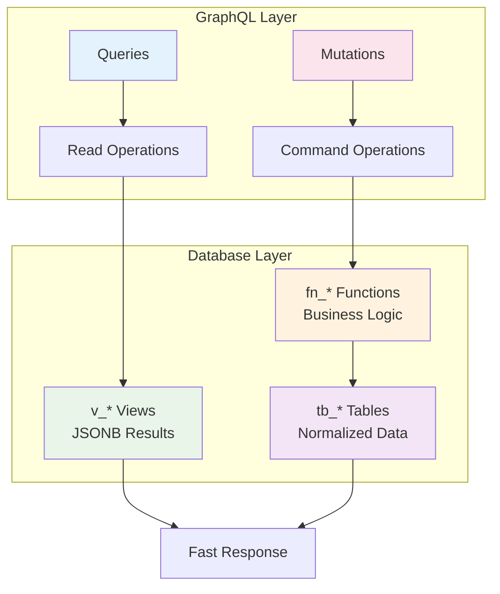

# CQRS Pattern in FraiseQL

## Overview
FraiseQL implements the Command Query Responsibility Segregation (CQRS) pattern to optimize read and write operations separately. This separation allows for different optimization strategies for queries (reads) and mutations (writes).

## ASCII Art Diagram

```
┌─────────────────────────────────────┐
│         GraphQL API                 │
├──────────────────┬──────────────────┤
│   QUERIES        │   MUTATIONS      │
│   (Reads)        │   (Writes)       │
├──────────────────┼──────────────────┤
│  v_* views       │  fn_* functions  │
│  tv_* tables     │  tb_* tables     │
│  (JSONB)         │  (Business Logic)│
├──────────────────┼──────────────────┤
│  Fast reads      │  ACID compliance │
│  Denormalized    │  Validation      │
│  Pre-computed    │  Side effects    │
└──────────────────┴──────────────────┘
```

## Detailed CQRS Separation

### Query Path (Reads)
```
GraphQL Query ──▶ v_* JSONB View ──▶ Direct Result
                     │
                     ▼
               PostgreSQL View
               - Pre-computed joins
               - JSONB aggregation
               - Optimized for reads
```

### Command Path (Writes)
```
GraphQL Mutation ──▶ fn_* Function ──▶ Business Logic + Write
                        │
                        ▼
                  PostgreSQL Function
                  - Input validation
                  - Business rules
                  - tb_* table updates
                  - Transaction handling
```

## Mermaid Diagram



## Component Roles

### Queries (Read Operations)
**Purpose**: Retrieve data efficiently
**Database Objects**:
- `v_*` views: JSONB views for simple queries
- `tv_*` tables: Table views for complex aggregations

**Characteristics**:
- Optimized for speed
- May use denormalized data
- Read-only operations
- No side effects

### Mutations (Write Operations)
**Purpose**: Modify data with business logic
**Database Objects**:
- `fn_*` functions: Business logic functions
- `tb_*` tables: Normalized storage tables

**Characteristics**:
- ACID compliant
- Input validation
- Business rule enforcement
- May have side effects (triggers, logging)

## Example: Blog Post System

### Read Operations (Queries)
```sql
-- Simple post list (uses v_* view)
CREATE VIEW v_post AS
SELECT jsonb_build_object(
    'id', p.id,
    'title', p.title,
    'content', p.content,
    'author', jsonb_build_object('name', u.name)
) as data
FROM tb_post p
JOIN tb_user u ON p.author_id = u.id;

-- Complex analytics (uses tv_* table)
CREATE TABLE tv_post_stats AS
SELECT
    p.id,
    p.title,
    COUNT(c.id) as comment_count,
    AVG(c.rating) as avg_rating
FROM tb_post p
LEFT JOIN tb_comment c ON p.id = c.post_id
GROUP BY p.id, p.title;
```

### Write Operations (Mutations)
```sql
-- Create post function
CREATE FUNCTION fn_create_post(
    p_title text,
    p_content text,
    p_author_id uuid
) RETURNS uuid AS $$
DECLARE
    v_post_id uuid;
BEGIN
    -- Validation
    IF NOT EXISTS (SELECT 1 FROM tb_user WHERE id = p_author_id) THEN
        RAISE EXCEPTION 'Author does not exist';
    END IF;

    -- Business logic
    INSERT INTO tb_post (title, content, author_id, created_at)
    VALUES (p_title, p_content, p_author_id, now())
    RETURNING id INTO v_post_id;

    -- Side effects (audit logging)
    INSERT INTO tb_audit (action, entity_type, entity_id, user_id)
    VALUES ('create', 'post', v_post_id, p_author_id);

    RETURN v_post_id;
END;
$$ LANGUAGE plpgsql;
```

## Performance Benefits

### Read Optimization
- **Pre-computed joins**: Views eliminate N+1 query problems
- **JSONB aggregation**: Single query returns complete object graphs
- **Materialized views**: For expensive computations
- **Indexing**: Optimized for common query patterns

### Write Optimization
- **Stored procedures**: Reduce network round trips
- **Transaction grouping**: Related changes in single transaction
- **Validation at database level**: Prevents invalid data
- **Audit trails**: Automatic logging of changes

## When to Use Each Pattern

### Use v_* Views (Reads)
- Simple object retrieval
- Real-time data requirements
- No complex aggregations
- Performance-critical reads

### Use tv_* Tables (Reads)
- Complex aggregations
- Statistical data
- Data that changes infrequently
- Heavy computation requirements

### Use fn_* Functions (Writes)
- Business logic required
- Multiple table updates
- Validation needed
- Audit trails required

### Use tb_* Tables (Direct Writes)
- Simple data insertion
- No business logic
- Bulk operations
- Migration scripts

## Consistency Considerations

### Eventual Consistency
- Some views may lag behind table updates
- Materialized views refresh on schedule
- Real-time views always current

### Transactional Consistency
- Mutations use database transactions
- All-or-nothing operations
- Rollback on errors

## Migration from Traditional ORM

### Before (Traditional)
```
User → ORM → SQL → Database → ORM → User
    ↓       ↓       ↓       ↓       ↓
   Load   Generate  Execute  Return  Map
```

### After (CQRS)
```
User → GraphQL → v_* View → JSONB → Response
User → GraphQL → fn_* Function → Transaction → Success
```

## Monitoring and Observability

### Read Metrics
- Query execution time
- View refresh frequency
- Cache hit rates
- Data freshness

### Write Metrics
- Transaction success rate
- Function execution time
- Validation failure rates
- Audit log volume
