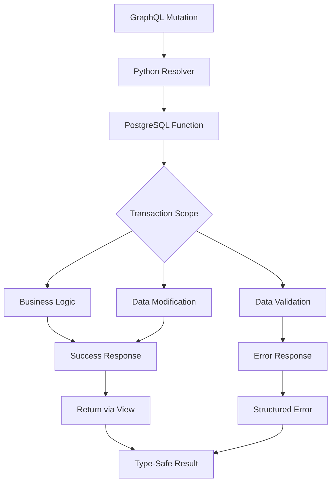

# PostgreSQL Function-Based Mutations

Complete guide to implementing mutations via PostgreSQL functions with transaction management, error handling, and type-safe return patterns.

## Overview

FraiseQL's PostgreSQL function-based mutations provide a powerful pattern for implementing business logic directly in the database. This approach ensures data consistency through automatic transaction management, enables complex validations at the database level, and provides a clean separation between data modification (functions) and data retrieval (views) following CQRS principles.

By implementing mutations as PostgreSQL functions, you gain atomic operations, reduced network round-trips, and the ability to leverage PostgreSQL's rich feature set including triggers, constraints, and procedural logic.

## Architecture

FraiseQL mutations follow a clear architectural pattern that separates concerns:



## Configuration

### Database Setup

```sql
-- Create schema for GraphQL functions
CREATE SCHEMA IF NOT EXISTS graphql;

-- Grant necessary permissions
GRANT USAGE ON SCHEMA graphql TO app_user;
GRANT EXECUTE ON ALL FUNCTIONS IN SCHEMA graphql TO app_user;

-- Enable required extensions
CREATE EXTENSION IF NOT EXISTS "uuid-ossp";
CREATE EXTENSION IF NOT EXISTS "pgcrypto";
```

### Python Configuration

```python
from fraiseql import FraiseQL, mutation
from fraiseql.mutations import MutationConfig

# Configure mutations
app = FraiseQL(
    connection_string="postgresql://...",
    mutation_config=MutationConfig(
        default_schema="graphql",  # Schema for functions
        function_prefix="fn_",     # Function naming prefix
        timeout_seconds=30,        # Function execution timeout
        enable_transactions=True   # Automatic transaction wrapping
    )
)
```

## Implementation

### Function Design Patterns

#### Basic CRUD Operation

```sql
-- Create user with validation
CREATE OR REPLACE FUNCTION fn_create_user(input_data JSONB)
RETURNS JSONB AS $$
DECLARE
    v_user_id UUID;
    v_email TEXT;
    v_name TEXT;
BEGIN
    -- Extract and validate input
    v_email := input_data->>'email';
    v_name := input_data->>'name';

    -- Validate required fields
    IF v_email IS NULL OR v_name IS NULL THEN
        RETURN jsonb_build_object(
            'success', false,
            'error', 'Email and name are required',
            'code', 'VALIDATION_ERROR',
            'field_errors', jsonb_build_object(
                'email', CASE WHEN v_email IS NULL THEN 'Required' END,
                'name', CASE WHEN v_name IS NULL THEN 'Required' END
            )
        );
    END IF;

    -- Check for existing user
    IF EXISTS (SELECT 1 FROM tb_users WHERE email = v_email) THEN
        RETURN jsonb_build_object(
            'success', false,
            'error', 'Email already registered',
            'code', 'EMAIL_EXISTS',
            'field_errors', jsonb_build_object('email', 'This email is already in use')
        );
    END IF;

    -- Insert new user
    INSERT INTO tb_users (email, name, bio, avatar_url, created_at)
    VALUES (
        v_email,
        v_name,
        input_data->>'bio',
        input_data->>'avatar_url',
        CURRENT_TIMESTAMP
    )
    RETURNING id INTO v_user_id;

    -- Return success with created user data from view
    RETURN jsonb_build_object(
        'success', true,
        'user', (
            SELECT row_to_json(u)
            FROM v_users u
            WHERE u.id = v_user_id
        )
    );

EXCEPTION
    WHEN unique_violation THEN
        RETURN jsonb_build_object(
            'success', false,
            'error', 'Email already exists',
            'code', 'UNIQUE_VIOLATION'
        );
    WHEN OTHERS THEN
        RETURN jsonb_build_object(
            'success', false,
            'error', SQLERRM,
            'code', 'INTERNAL_ERROR'
        );
END;
$$ LANGUAGE plpgsql SECURITY DEFINER;
```

#### Complex Business Logic

```sql
-- Process order with inventory management and payment
CREATE OR REPLACE FUNCTION fn_process_order(
    p_input JSONB,
    p_context JSONB DEFAULT '{}'
) RETURNS JSONB AS $$
DECLARE
    v_order_id UUID;
    v_user_id UUID;
    v_total_amount DECIMAL(10,2) := 0;
    v_item RECORD;
    v_inventory_check JSONB;
BEGIN
    -- Extract context
    v_user_id := (p_context->>'user_id')::UUID;

    -- Create order record
    INSERT INTO tb_orders (user_id, status, created_at)
    VALUES (v_user_id, 'pending', CURRENT_TIMESTAMP)
    RETURNING id INTO v_order_id;

    -- Process each order item
    FOR v_item IN SELECT * FROM jsonb_array_elements(p_input->'items') AS item
    LOOP
        -- Check inventory
        v_inventory_check := fn_check_inventory(
            (v_item->>'product_id')::UUID,
            (v_item->>'quantity')::INT
        );

        IF NOT (v_inventory_check->>'available')::BOOLEAN THEN
            -- Rollback will happen automatically
            RAISE EXCEPTION 'Insufficient inventory for product %',
                v_item->>'product_id';
        END IF;

        -- Add order item
        INSERT INTO tb_order_items (
            order_id,
            product_id,
            quantity,
            price_at_time
        )
        SELECT
            v_order_id,
            (v_item->>'product_id')::UUID,
            (v_item->>'quantity')::INT,
            p.price
        FROM tb_products p
        WHERE p.id = (v_item->>'product_id')::UUID;

        -- Update running total
        v_total_amount := v_total_amount + (
            SELECT p.price * (v_item->>'quantity')::INT
            FROM tb_products p
            WHERE p.id = (v_item->>'product_id')::UUID
        );

        -- Reserve inventory
        UPDATE tb_inventory
        SET reserved_quantity = reserved_quantity + (v_item->>'quantity')::INT
        WHERE product_id = (v_item->>'product_id')::UUID;
    END LOOP;

    -- Process payment
    PERFORM fn_process_payment(
        v_order_id,
        v_total_amount,
        p_input->'payment_method'
    );

    -- Update order status
    UPDATE tb_orders
    SET
        status = 'confirmed',
        total_amount = v_total_amount,
        confirmed_at = CURRENT_TIMESTAMP
    WHERE id = v_order_id;

    -- Return order details from view
    RETURN jsonb_build_object(
        'success', true,
        'order', (
            SELECT row_to_json(o)
            FROM v_order_details o
            WHERE o.id = v_order_id
        )
    );

EXCEPTION
    WHEN OTHERS THEN
        -- Log error for debugging
        INSERT INTO tb_error_log (
            error_message,
            error_detail,
            context_data,
            occurred_at
        ) VALUES (
            SQLERRM,
            SQLSTATE,
            jsonb_build_object(
                'function', 'fn_process_order',
                'input', p_input,
                'user_id', v_user_id
            ),
            CURRENT_TIMESTAMP
        );

        RETURN jsonb_build_object(
            'success', false,
            'error', 'Failed to process order',
            'code', 'ORDER_PROCESSING_FAILED',
            'details', SQLERRM
        );
END;
$$ LANGUAGE plpgsql SECURITY DEFINER;
```

### Transaction Management

#### Nested Transactions with Savepoints

```sql
CREATE OR REPLACE FUNCTION fn_bulk_update_with_rollback(p_updates JSONB)
RETURNS JSONB AS $$
DECLARE
    v_update RECORD;
    v_results JSONB[] := '{}';
    v_success_count INT := 0;
    v_error_count INT := 0;
BEGIN
    -- Process each update in a savepoint
    FOR v_update IN SELECT * FROM jsonb_array_elements(p_updates) AS update
    LOOP
        BEGIN
            -- Create savepoint for this update
            EXECUTE 'SAVEPOINT sp_' || v_update->>'id';

            -- Perform update
            UPDATE tb_items
            SET
                data = v_update->'data',
                updated_at = CURRENT_TIMESTAMP
            WHERE id = (v_update->>'id')::UUID;

            -- Record success
            v_results := array_append(v_results, jsonb_build_object(
                'id', v_update->>'id',
                'success', true
            ));
            v_success_count := v_success_count + 1;

            -- Release savepoint
            EXECUTE 'RELEASE SAVEPOINT sp_' || v_update->>'id';

        EXCEPTION
            WHEN OTHERS THEN
                -- Rollback to savepoint
                EXECUTE 'ROLLBACK TO SAVEPOINT sp_' || v_update->>'id';

                -- Record error
                v_results := array_append(v_results, jsonb_build_object(
                    'id', v_update->>'id',
                    'success', false,
                    'error', SQLERRM
                ));
                v_error_count := v_error_count + 1;
        END;
    END LOOP;

    RETURN jsonb_build_object(
        'success', v_error_count = 0,
        'results', array_to_json(v_results),
        'summary', jsonb_build_object(
            'total', jsonb_array_length(p_updates),
            'succeeded', v_success_count,
            'failed', v_error_count
        )
    );
END;
$$ LANGUAGE plpgsql;
```

#### Distributed Transaction Pattern

```sql
-- Coordinate multiple operations across services
CREATE OR REPLACE FUNCTION fn_distributed_operation(p_input JSONB)
RETURNS JSONB AS $$
DECLARE
    v_transaction_id UUID := gen_random_uuid();
    v_local_result JSONB;
    v_remote_result JSONB;
BEGIN
    -- Log transaction start
    INSERT INTO tb_distributed_transactions (
        id,
        operation,
        status,
        started_at
    ) VALUES (
        v_transaction_id,
        'distributed_operation',
        'started',
        CURRENT_TIMESTAMP
    );

    -- Phase 1: Prepare local changes
    BEGIN
        v_local_result := fn_prepare_local_changes(p_input);

        IF NOT (v_local_result->>'success')::BOOLEAN THEN
            RAISE EXCEPTION 'Local preparation failed: %',
                v_local_result->>'error';
        END IF;
    END;

    -- Phase 2: Call external service (using pg_net or similar)
    SELECT content::JSONB INTO v_remote_result
    FROM http_post(
        'https://api.external.com/prepare',
        jsonb_build_object(
            'transaction_id', v_transaction_id,
            'data', p_input
        )::TEXT,
        'application/json'
    );

    -- Phase 3: Commit or rollback based on remote result
    IF (v_remote_result->>'success')::BOOLEAN THEN
        -- Commit local changes
        PERFORM fn_commit_local_changes(v_transaction_id);

        -- Notify remote to commit
        PERFORM http_post(
            'https://api.external.com/commit',
            jsonb_build_object('transaction_id', v_transaction_id)::TEXT
        );

        UPDATE tb_distributed_transactions
        SET status = 'committed', completed_at = CURRENT_TIMESTAMP
        WHERE id = v_transaction_id;

        RETURN jsonb_build_object(
            'success', true,
            'transaction_id', v_transaction_id
        );
    ELSE
        -- Rollback everything
        RAISE EXCEPTION 'Remote operation failed';
    END IF;

EXCEPTION
    WHEN OTHERS THEN
        -- Ensure remote rollback
        PERFORM http_post(
            'https://api.external.com/rollback',
            jsonb_build_object('transaction_id', v_transaction_id)::TEXT
        );

        UPDATE tb_distributed_transactions
        SET
            status = 'rolled_back',
            error = SQLERRM,
            completed_at = CURRENT_TIMESTAMP
        WHERE id = v_transaction_id;

        RETURN jsonb_build_object(
            'success', false,
            'error', SQLERRM,
            'transaction_id', v_transaction_id
        );
END;
$$ LANGUAGE plpgsql;
```

### Error Handling

#### Comprehensive Error Types

```sql
-- Define custom error handling function
CREATE OR REPLACE FUNCTION fn_handle_mutation_error(
    p_sqlstate TEXT,
    p_sqlerrm TEXT,
    p_context JSONB
) RETURNS JSONB AS $$
BEGIN
    CASE p_sqlstate
        WHEN '23505' THEN  -- unique_violation
            RETURN jsonb_build_object(
                'success', false,
                'error', 'Duplicate entry',
                'code', 'UNIQUE_VIOLATION',
                'field_errors', fn_extract_unique_fields(p_sqlerrm)
            );

        WHEN '23503' THEN  -- foreign_key_violation
            RETURN jsonb_build_object(
                'success', false,
                'error', 'Referenced entity not found',
                'code', 'FOREIGN_KEY_VIOLATION',
                'details', fn_extract_fk_details(p_sqlerrm)
            );

        WHEN '23502' THEN  -- not_null_violation
            RETURN jsonb_build_object(
                'success', false,
                'error', 'Required field missing',
                'code', 'NOT_NULL_VIOLATION',
                'field', fn_extract_column_name(p_sqlerrm)
            );

        WHEN '23514' THEN  -- check_violation
            RETURN jsonb_build_object(
                'success', false,
                'error', 'Validation failed',
                'code', 'CHECK_VIOLATION',
                'constraint', fn_extract_constraint_name(p_sqlerrm)
            );

        WHEN 'P0001' THEN  -- raise_exception
            RETURN jsonb_build_object(
                'success', false,
                'error', p_sqlerrm,
                'code', 'BUSINESS_RULE_VIOLATION'
            );

        ELSE
            -- Log unexpected errors
            INSERT INTO tb_error_log (
                sqlstate,
                message,
                context,
                occurred_at
            ) VALUES (
                p_sqlstate,
                p_sqlerrm,
                p_context,
                CURRENT_TIMESTAMP
            );

            RETURN jsonb_build_object(
                'success', false,
                'error', 'An unexpected error occurred',
                'code', 'INTERNAL_ERROR',
                'reference_id', gen_random_uuid()
            );
    END CASE;
END;
$$ LANGUAGE plpgsql;
```

#### Field-Level Validation

```sql
CREATE OR REPLACE FUNCTION fn_create_product(p_input JSONB)
RETURNS JSONB AS $$
DECLARE
    v_errors JSONB := '{}';
    v_name TEXT;
    v_price DECIMAL;
    v_sku TEXT;
BEGIN
    -- Extract fields
    v_name := p_input->>'name';
    v_price := (p_input->>'price')::DECIMAL;
    v_sku := p_input->>'sku';

    -- Validate name
    IF v_name IS NULL OR length(trim(v_name)) = 0 THEN
        v_errors := v_errors || jsonb_build_object('name', 'Product name is required');
    ELSIF length(v_name) > 255 THEN
        v_errors := v_errors || jsonb_build_object('name', 'Name must be 255 characters or less');
    END IF;

    -- Validate price
    IF v_price IS NULL THEN
        v_errors := v_errors || jsonb_build_object('price', 'Price is required');
    ELSIF v_price <= 0 THEN
        v_errors := v_errors || jsonb_build_object('price', 'Price must be greater than 0');
    ELSIF v_price > 999999.99 THEN
        v_errors := v_errors || jsonb_build_object('price', 'Price exceeds maximum allowed');
    END IF;

    -- Validate SKU format
    IF v_sku IS NOT NULL AND NOT v_sku ~ '^[A-Z0-9\-]+$' THEN
        v_errors := v_errors || jsonb_build_object('sku', 'SKU must contain only uppercase letters, numbers, and hyphens');
    END IF;

    -- Check for duplicate SKU
    IF EXISTS (SELECT 1 FROM tb_products WHERE sku = v_sku) THEN
        v_errors := v_errors || jsonb_build_object('sku', 'This SKU is already in use');
    END IF;

    -- Return errors if any
    IF jsonb_object_keys(v_errors) IS NOT NULL THEN
        RETURN jsonb_build_object(
            'success', false,
            'error', 'Validation failed',
            'code', 'VALIDATION_ERROR',
            'field_errors', v_errors
        );
    END IF;

    -- Proceed with creation...
END;
$$ LANGUAGE plpgsql;
```

### Input Validation

#### Type-Safe Input Parsing

```sql
CREATE OR REPLACE FUNCTION fn_safe_parse_input(
    p_input JSONB,
    p_schema JSONB
) RETURNS JSONB AS $$
DECLARE
    v_field RECORD;
    v_value JSONB;
    v_parsed JSONB := '{}';
    v_errors JSONB := '{}';
BEGIN
    -- Iterate through schema fields
    FOR v_field IN SELECT * FROM jsonb_each(p_schema)
    LOOP
        v_value := p_input->v_field.key;

        -- Check required fields
        IF (v_field.value->>'required')::BOOLEAN AND v_value IS NULL THEN
            v_errors := v_errors || jsonb_build_object(
                v_field.key,
                format('%s is required', v_field.value->>'label')
            );
            CONTINUE;
        END IF;

        -- Parse by type
        CASE v_field.value->>'type'
            WHEN 'string' THEN
                v_parsed := jsonb_set(v_parsed, ARRAY[v_field.key], to_jsonb(v_value#>>'{}'));

            WHEN 'integer' THEN
                BEGIN
                    v_parsed := jsonb_set(v_parsed, ARRAY[v_field.key], to_jsonb((v_value#>>'{}')::INT));
                EXCEPTION
                    WHEN OTHERS THEN
                        v_errors := v_errors || jsonb_build_object(v_field.key, 'Must be a valid integer');
                END;

            WHEN 'decimal' THEN
                BEGIN
                    v_parsed := jsonb_set(v_parsed, ARRAY[v_field.key], to_jsonb((v_value#>>'{}')::DECIMAL));
                EXCEPTION
                    WHEN OTHERS THEN
                        v_errors := v_errors || jsonb_build_object(v_field.key, 'Must be a valid decimal number');
                END;

            WHEN 'uuid' THEN
                BEGIN
                    v_parsed := jsonb_set(v_parsed, ARRAY[v_field.key], to_jsonb((v_value#>>'{}')::UUID));
                EXCEPTION
                    WHEN OTHERS THEN
                        v_errors := v_errors || jsonb_build_object(v_field.key, 'Must be a valid UUID');
                END;

            WHEN 'email' THEN
                IF NOT (v_value#>>'{}') ~ '^[A-Za-z0-9._%+-]+@[A-Za-z0-9.-]+\.[A-Z|a-z]{2,}$' THEN
                    v_errors := v_errors || jsonb_build_object(v_field.key, 'Must be a valid email address');
                ELSE
                    v_parsed := jsonb_set(v_parsed, ARRAY[v_field.key], v_value);
                END IF;

            WHEN 'array' THEN
                IF jsonb_typeof(v_value) != 'array' THEN
                    v_errors := v_errors || jsonb_build_object(v_field.key, 'Must be an array');
                ELSE
                    v_parsed := jsonb_set(v_parsed, ARRAY[v_field.key], v_value);
                END IF;
        END CASE;
    END LOOP;

    IF jsonb_object_keys(v_errors) IS NOT NULL THEN
        RETURN jsonb_build_object(
            'success', false,
            'errors', v_errors
        );
    END IF;

    RETURN jsonb_build_object(
        'success', true,
        'data', v_parsed
    );
END;
$$ LANGUAGE plpgsql;
```

### Trigger Integration

#### Audit Trail with Triggers

```sql
-- Audit trigger for mutations
CREATE OR REPLACE FUNCTION fn_audit_mutation()
RETURNS TRIGGER AS $$
BEGIN
    INSERT INTO tb_audit_log (
        table_name,
        operation,
        user_id,
        old_data,
        new_data,
        changed_fields,
        occurred_at
    ) VALUES (
        TG_TABLE_NAME,
        TG_OP,
        current_setting('app.user_id', true)::UUID,
        CASE TG_OP WHEN 'DELETE' THEN row_to_json(OLD) ELSE NULL END,
        CASE TG_OP WHEN 'INSERT' THEN row_to_json(NEW) WHEN 'UPDATE' THEN row_to_json(NEW) ELSE NULL END,
        CASE TG_OP WHEN 'UPDATE' THEN
            (SELECT jsonb_object_agg(key, value)
             FROM jsonb_each(row_to_json(NEW)::JSONB)
             WHERE row_to_json(OLD)::JSONB->key IS DISTINCT FROM value)
        ELSE NULL END,
        CURRENT_TIMESTAMP
    );

    RETURN CASE TG_OP WHEN 'DELETE' THEN OLD ELSE NEW END;
END;
$$ LANGUAGE plpgsql;

-- Apply to tables
CREATE TRIGGER audit_users
    AFTER INSERT OR UPDATE OR DELETE ON tb_users
    FOR EACH ROW EXECUTE FUNCTION fn_audit_mutation();
```

#### Side Effects via Triggers

```sql
-- Trigger for cascading updates
CREATE OR REPLACE FUNCTION fn_after_order_confirmed()
RETURNS TRIGGER AS $$
BEGIN
    -- Update inventory
    UPDATE tb_inventory i
    SET
        available_quantity = available_quantity - oi.quantity,
        reserved_quantity = reserved_quantity - oi.quantity
    FROM tb_order_items oi
    WHERE oi.order_id = NEW.id
        AND i.product_id = oi.product_id;

    -- Send notification
    INSERT INTO tb_notifications (
        user_id,
        type,
        title,
        message,
        data,
        created_at
    ) VALUES (
        NEW.user_id,
        'order_confirmed',
        'Order Confirmed',
        format('Your order #%s has been confirmed', NEW.order_number),
        jsonb_build_object('order_id', NEW.id),
        CURRENT_TIMESTAMP
    );

    -- Queue email
    PERFORM pg_notify(
        'email_queue',
        jsonb_build_object(
            'type', 'order_confirmation',
            'to', (SELECT email FROM tb_users WHERE id = NEW.user_id),
            'order_id', NEW.id
        )::TEXT
    );

    RETURN NEW;
END;
$$ LANGUAGE plpgsql;

CREATE TRIGGER after_order_confirmed
    AFTER UPDATE OF status ON tb_orders
    FOR EACH ROW
    WHEN (OLD.status != 'confirmed' AND NEW.status = 'confirmed')
    EXECUTE FUNCTION fn_after_order_confirmed();
```

### Return Type Patterns

#### Standard Success/Error Pattern

```python
# Python types matching PostgreSQL returns
@fraiseql.success
class CreateUserSuccess:
    user: User
    message: str = "User created successfully"

@fraiseql.failure
class CreateUserError:
    message: str
    code: str
    field_errors: dict[str, str] | None = None

# Mutation definition
@mutation(function="fn_create_user", schema="app")
class CreateUser:
    input: CreateUserInput
    success: CreateUserSuccess
    failure: CreateUserError
```

#### Batch Operation Results

```sql
-- Function returning batch results
CREATE OR REPLACE FUNCTION fn_batch_update_status(p_updates JSONB)
RETURNS JSONB AS $$
DECLARE
    v_results JSONB[];
    v_item RECORD;
BEGIN
    FOR v_item IN SELECT * FROM jsonb_array_elements(p_updates)
    LOOP
        v_results := array_append(v_results,
            CASE
                WHEN fn_update_single_status(v_item)->>'success' = 'true' THEN
                    jsonb_build_object(
                        'id', v_item->>'id',
                        'success', true,
                        'new_status', v_item->>'status'
                    )
                ELSE
                    jsonb_build_object(
                        'id', v_item->>'id',
                        'success', false,
                        'error', 'Update failed'
                    )
            END
        );
    END LOOP;

    RETURN jsonb_build_object(
        'success', true,
        'results', array_to_json(v_results),
        'summary', jsonb_build_object(
            'total', array_length(v_results, 1),
            'succeeded', (
                SELECT count(*)
                FROM unnest(v_results) r
                WHERE (r->>'success')::BOOLEAN
            )
        )
    );
END;
$$ LANGUAGE plpgsql;
```

### Testing Strategies

#### Unit Testing Functions

```sql
-- Test framework for PostgreSQL functions
CREATE OR REPLACE FUNCTION test_fn_create_user()
RETURNS SETOF TEXT AS $$
DECLARE
    v_result JSONB;
BEGIN
    -- Test: Missing required fields
    v_result := fn_create_user(jsonb_build_object('email', 'test@example.com'));
    RETURN NEXT ok(
        NOT (v_result->>'success')::BOOLEAN,
        'Should fail without name'
    );
    RETURN NEXT is(
        v_result->>'code',
        'VALIDATION_ERROR',
        'Should return validation error code'
    );

    -- Test: Duplicate email
    INSERT INTO tb_users (email, name) VALUES ('existing@example.com', 'Existing');
    v_result := fn_create_user(jsonb_build_object(
        'email', 'existing@example.com',
        'name', 'New User'
    ));
    RETURN NEXT ok(
        NOT (v_result->>'success')::BOOLEAN,
        'Should fail with duplicate email'
    );

    -- Test: Successful creation
    v_result := fn_create_user(jsonb_build_object(
        'email', 'new@example.com',
        'name', 'New User',
        'bio', 'Test bio'
    ));
    RETURN NEXT ok(
        (v_result->>'success')::BOOLEAN,
        'Should succeed with valid input'
    );
    RETURN NEXT ok(
        v_result->'user' IS NOT NULL,
        'Should return user data'
    );

    -- Cleanup
    DELETE FROM tb_users WHERE email IN ('existing@example.com', 'new@example.com');
END;
$$ LANGUAGE plpgsql;

-- Run tests
SELECT * FROM test_fn_create_user();
```

#### Integration Testing

```python
import pytest
from fraiseql.testing import FraiseQLTestClient

@pytest.mark.asyncio
async def test_create_user_mutation(test_client: FraiseQLTestClient):
    """Test complete mutation flow."""

    # Execute GraphQL mutation
    result = await test_client.execute(
        """
        mutation CreateUser($input: CreateUserInput!) {
            createUser(input: $input) {
                ... on CreateUserSuccess {
                    user {
                        id
                        email
                        name
                    }
                    message
                }
                ... on CreateUserError {
                    message
                    code
                    fieldErrors
                }
            }
        }
        """,
        variables={
            "input": {
                "email": "test@example.com",
                "name": "Test User",
                "password": "secure123"
            }
        }
    )

    assert result["data"]["createUser"]["__typename"] == "CreateUserSuccess"
    assert result["data"]["createUser"]["user"]["email"] == "test@example.com"

    # Verify database state
    user = await test_client.db.fetchrow(
        "SELECT * FROM tb_users WHERE email = $1",
        "test@example.com"
    )
    assert user is not None
    assert user["name"] == "Test User"
```

## Performance Considerations

### Function Optimization

- **Use SECURITY DEFINER carefully**: Only when necessary for elevated privileges
- **Prepare statements**: Use `EXECUTE USING` for dynamic queries
- **Limit result sets**: Return only necessary data from views
- **Index foreign keys**: Ensure all FK columns are indexed
- **Use JSONB operators**: Leverage GIN indexes on JSONB columns

```sql
-- Optimize JSONB queries
CREATE INDEX idx_user_metadata ON tb_users USING GIN (metadata);

-- Use containment operator for fast lookups
SELECT * FROM tb_users WHERE metadata @> '{"role": "admin"}';
```

### Connection Pooling

```python
# Configure connection pool for mutations
mutation_pool = await asyncpg.create_pool(
    connection_string,
    min_size=20,      # Higher min for mutations
    max_size=50,      # Allow bursts
    max_queries=1000, # Reuse connections
    max_inactive_connection_lifetime=300
)
```

### Query Planning

```sql
-- Analyze function performance
EXPLAIN (ANALYZE, BUFFERS) SELECT fn_create_user(
    '{"email": "test@example.com", "name": "Test"}'::JSONB
);

-- Create function-specific statistics
CREATE STATISTICS stat_user_email ON email, created_at FROM tb_users;
ANALYZE tb_users;
```

## Security Implications

### SQL Injection Prevention

1. **Always use parameterized queries** in functions
2. **Validate input types** before casting
3. **Use JSONB path operators** instead of string concatenation
4. **Whitelist allowed operations** in dynamic queries

```sql
-- Safe dynamic query construction
CREATE OR REPLACE FUNCTION fn_dynamic_update(
    p_table TEXT,
    p_id UUID,
    p_data JSONB
) RETURNS JSONB AS $$
DECLARE
    v_allowed_tables TEXT[] := ARRAY['tb_users', 'tb_posts', 'tb_comments'];
    v_query TEXT;
BEGIN
    -- Whitelist validation
    IF NOT p_table = ANY(v_allowed_tables) THEN
        RAISE EXCEPTION 'Invalid table name';
    END IF;

    -- Safe query construction
    v_query := format(
        'UPDATE %I SET data = $1 WHERE id = $2',
        p_table
    );

    EXECUTE v_query USING p_data, p_id;

    RETURN jsonb_build_object('success', true);
END;
$$ LANGUAGE plpgsql;
```

### Access Control

```sql
-- Row-level security for mutations
ALTER TABLE tb_posts ENABLE ROW LEVEL SECURITY;

CREATE POLICY user_own_posts ON tb_posts
    FOR ALL
    USING (author_id = current_setting('app.user_id')::UUID);

-- Grant execute permissions carefully
REVOKE EXECUTE ON ALL FUNCTIONS IN SCHEMA public FROM PUBLIC;
GRANT EXECUTE ON FUNCTION fn_create_post TO app_user;
```

## Best Practices

1. **Use consistent naming**: Always prefix mutation functions with `fn_`
2. **Return from views**: Fetch data through v_ views for consistency
3. **Implement idempotency**: Design mutations to be safely retryable
4. **Log all mutations**: Maintain audit trail for compliance
5. **Validate early**: Perform validation before any state changes
6. **Use transactions wisely**: Keep transaction scope minimal
7. **Handle errors gracefully**: Return structured errors with codes
8. **Document side effects**: Clear comments about triggers and cascades
9. **Test error paths**: Ensure all error cases are handled
10. **Monitor performance**: Track slow mutations and optimize

## Common Pitfalls

### Pitfall 1: Long-running transactions
**Problem**: Holding locks for extended periods
**Solution**: Break into smaller transactions or use queues

```sql
-- Bad: Long transaction
BEGIN;
UPDATE large_table SET ...;
PERFORM pg_sleep(10); -- Simulating slow operation
COMMIT;

-- Good: Use job queue
INSERT INTO tb_job_queue (job_type, payload)
VALUES ('process_large_update', jsonb_build_object(...));
```

### Pitfall 2: Missing error context
**Problem**: Generic error messages without details
**Solution**: Include context in error responses

```sql
-- Bad: No context
EXCEPTION
    WHEN OTHERS THEN
        RETURN jsonb_build_object('success', false, 'error', 'Failed');

-- Good: Detailed context
EXCEPTION
    WHEN OTHERS THEN
        RETURN jsonb_build_object(
            'success', false,
            'error', SQLERRM,
            'code', SQLSTATE,
            'context', jsonb_build_object(
                'function', 'fn_create_order',
                'user_id', v_user_id,
                'input', p_input
            )
        );
```

### Pitfall 3: Inefficient view joins
**Problem**: Complex views in return statements
**Solution**: Create optimized views for mutations

```sql
-- Bad: Complex view in function
RETURN (
    SELECT row_to_json(sub)
    FROM (
        SELECT u.*,
               array_agg(p.*) as posts,
               array_agg(c.*) as comments
        FROM tb_users u
        LEFT JOIN tb_posts p ON p.author_id = u.id
        LEFT JOIN tb_comments c ON c.user_id = u.id
        WHERE u.id = v_user_id
        GROUP BY u.id
    ) sub
);

-- Good: Dedicated return view
CREATE VIEW v_user_mutation_result AS
SELECT id, email, name, created_at
FROM tb_users;

RETURN (
    SELECT row_to_json(u)
    FROM v_user_mutation_result u
    WHERE u.id = v_user_id
);
```

## Troubleshooting

### Error: "function does not exist"
**Solution**: Check schema and search path
```sql
-- Set search path
SET search_path TO graphql, public;
-- Or use fully qualified name
SELECT graphql.fn_create_user(...);
```

### Error: "permission denied for function"
**Solution**: Grant execute permissions
```sql
GRANT EXECUTE ON FUNCTION fn_create_user TO app_user;
GRANT USAGE ON SCHEMA graphql TO app_user;
```

### Error: "deadlock detected"
**Solution**: Review lock ordering
```sql
-- Check current locks
SELECT * FROM pg_locks WHERE NOT granted;
-- Ensure consistent lock ordering across functions
```

### Error: "stack depth limit exceeded"
**Solution**: Check for recursive calls
```sql
-- Increase stack depth if needed (carefully)
SET max_stack_depth = '4MB';
-- Better: Refactor to avoid deep recursion
```

## See Also

- [Table Views](../core-concepts/table-views.md) - Understanding tb_/v_/tv_ naming conventions
- [Authentication Patterns](../advanced/authentication.md) - Context parameter security
- [Error Handling](../api-reference/error-handling.md) - Structured error responses
- [Testing Guide](../testing/mutation-testing.md) - Testing mutation functions
- [Performance Optimization](../advanced/performance.md) - Optimizing function execution
