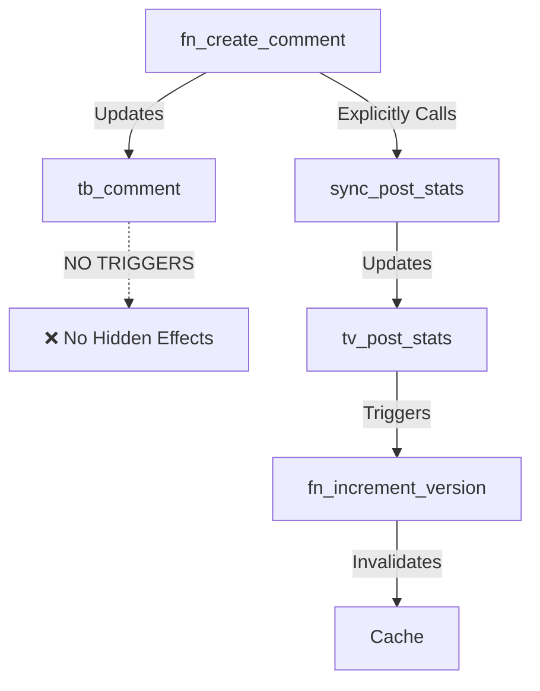

# Building a Blog API with FraiseQL

> **In this tutorial:** Build a complete blog API with posts, comments, and users
> **Prerequisites:** Completed [quickstart](../getting-started/quickstart.md) and [first API](../getting-started/first-api.md)
> **Time to complete:** 30-45 minutes

This tutorial walks through building a complete blog API using FraiseQL's CQRS architecture. We'll create a production-ready API with posts, comments, and user management.

## Overview

We'll build:
- User management with profiles
- Blog posts with tagging and publishing
- Threaded comments system
- Optimized views to eliminate N+1 queries
- Type-safe GraphQL API with modern Python

## Prerequisites

- PostgreSQL 14+
- Python 3.10+
- Basic understanding of GraphQL
- Familiarity with CQRS concepts (see [Architecture](../core-concepts/architecture.md))

## Project Structure

```
blog_api/
├── db/
│   ├── migrations/
│   │   ├── 001_initial_schema.sql    # Tables
│   │   ├── 002_functions.sql         # Mutations
│   │   └── 003_views.sql             # Query views
│   └── views/
│       └── composed_views.sql        # Optimized views
├── models.py                          # GraphQL types
├── queries.py                         # Query resolvers
├── mutations.py                       # Mutation resolvers
├── dataloaders.py                     # N+1 prevention
├── db.py                             # Repository pattern
└── app.py                            # FastAPI application
```

## Step 1: Database Schema

FraiseQL follows CQRS, separating writes (tables) from reads (views).

**CRITICAL ARCHITECTURAL RULE: Triggers ONLY on tv_ tables for cache invalidation**

Before we start, understand FraiseQL's strict trigger philosophy:
- ❌ **NEVER** create triggers on `tb_` tables (base tables)
- ✅ **ONLY** create triggers on `tv_` tables for cache invalidation
- All business logic must be explicit in mutation functions

### Tables (Write Side)

```sql
-- Users table
CREATE TABLE tb_users (
    -- Sacred Trinity Pattern
    id INTEGER GENERATED BY DEFAULT AS IDENTITY,
    pk_user UUID DEFAULT gen_random_uuid() NOT NULL,
    identifier TEXT,

    -- Core fields
    email VARCHAR(255) NOT NULL,
    name VARCHAR(255) NOT NULL,
    bio TEXT,
    avatar_url VARCHAR(500),
    is_active BOOLEAN DEFAULT true,
    roles TEXT[] DEFAULT '{}',
    created_at TIMESTAMPTZ DEFAULT NOW(),
    updated_at TIMESTAMPTZ DEFAULT NOW(),

    -- Constraints
    CONSTRAINT pk_tb_users PRIMARY KEY (id),
    CONSTRAINT uq_tb_users_pk UNIQUE (pk_user),
    CONSTRAINT uq_tb_users_identifier UNIQUE (identifier) WHERE identifier IS NOT NULL,
    CONSTRAINT uq_tb_users_email UNIQUE (email)
);

-- Posts table
CREATE TABLE tb_posts (
    -- Sacred Trinity Pattern
    id INTEGER GENERATED BY DEFAULT AS IDENTITY,
    pk_post UUID DEFAULT gen_random_uuid() NOT NULL,
    identifier TEXT,

    -- Core fields
    fk_author INTEGER NOT NULL,
    title VARCHAR(500) NOT NULL,
    slug VARCHAR(500) NOT NULL,
    content TEXT NOT NULL,
    excerpt TEXT,
    tags TEXT[] DEFAULT '{}',
    is_published BOOLEAN DEFAULT false,
    published_at TIMESTAMPTZ,
    view_count INTEGER DEFAULT 0,
    created_at TIMESTAMPTZ DEFAULT NOW(),
    updated_at TIMESTAMPTZ DEFAULT NOW(),

    -- Constraints
    CONSTRAINT pk_tb_posts PRIMARY KEY (id),
    CONSTRAINT uq_tb_posts_pk UNIQUE (pk_post),
    CONSTRAINT uq_tb_posts_identifier UNIQUE (identifier) WHERE identifier IS NOT NULL,
    CONSTRAINT uq_tb_posts_slug UNIQUE (slug),
    CONSTRAINT fk_tb_posts_tb_users FOREIGN KEY (fk_author) REFERENCES tb_users(id)
);

-- Comments table (with threading support)
CREATE TABLE tb_comments (
    -- Sacred Trinity Pattern
    id INTEGER GENERATED BY DEFAULT AS IDENTITY,
    pk_comment UUID DEFAULT gen_random_uuid() NOT NULL,
    identifier TEXT,

    -- Core fields
    fk_post INTEGER NOT NULL,
    fk_author INTEGER NOT NULL,
    fk_parent INTEGER,
    content TEXT NOT NULL,
    is_edited BOOLEAN DEFAULT false,
    created_at TIMESTAMPTZ DEFAULT NOW(),
    updated_at TIMESTAMPTZ DEFAULT NOW(),

    -- Constraints
    CONSTRAINT pk_tb_comments PRIMARY KEY (id),
    CONSTRAINT uq_tb_comments_pk UNIQUE (pk_comment),
    CONSTRAINT uq_tb_comments_identifier UNIQUE (identifier) WHERE identifier IS NOT NULL,
    CONSTRAINT fk_tb_comments_tb_posts FOREIGN KEY (fk_post) REFERENCES tb_posts(id) ON DELETE CASCADE,
    CONSTRAINT fk_tb_comments_tb_users FOREIGN KEY (fk_author) REFERENCES tb_users(id),
    CONSTRAINT fk_tb_comments_tb_comments FOREIGN KEY (fk_parent) REFERENCES tb_comments(id)
);

-- Indexes for performance
CREATE INDEX idx_tb_posts_fk_author ON tb_posts(fk_author);
CREATE INDEX idx_tb_posts_published ON tb_posts(is_published, published_at DESC);
CREATE INDEX idx_tb_comments_fk_post ON tb_comments(fk_post);
CREATE INDEX idx_tb_comments_fk_parent ON tb_comments(fk_parent);
```

### Views (Read Side)

FraiseQL requires views with JSONB `data` columns containing camelCase fields:

```sql
-- Basic user view (without posts/comments to avoid circular deps)
CREATE OR REPLACE VIEW v_user_basic AS
SELECT
    u.id,
    jsonb_build_object(
        '__typename', 'User',
        'id', u.pk_user,
        'email', u.email,
        'name', u.name,
        'bio', u.bio,
        'avatar_url', u.avatar_url,
        'is_active', u.is_active,
        'roles', u.roles,
        'created_at', u.created_at,
        'updated_at', u.updated_at
    ) AS data
FROM tb_users u;

-- Basic comment view (without post/author to avoid circular deps)
CREATE OR REPLACE VIEW v_comment_basic AS
SELECT
    c.id,
    jsonb_build_object(
        '__typename', 'Comment',
        'id', c.pk_comment,
        'content', c.content,
        'is_edited', c.is_edited,
        'is_approved', c.is_approved,
        'created_at', c.created_at,
        'updated_at', c.updated_at
    ) AS data
FROM tb_comments c;

-- Basic posts view with embedded author
CREATE OR REPLACE VIEW v_post AS
SELECT
    p.id,
    jsonb_build_object(
        '__typename', 'Post',
        'id', p.pk_post,
        'title', p.title,
        'slug', p.slug,
        'content', p.content,
        'excerpt', p.excerpt,
        'tags', p.tags,
        'is_published', p.is_published,
        'published_at', p.published_at,
        'view_count', p.view_count,
        'created_at', p.created_at,
        'updated_at', p.updated_at,
        -- Embed author
        'author', (SELECT data FROM v_user_basic WHERE id = p.fk_author)
    ) AS data
FROM tb_posts p;
```

## Step 2: Composed Views (N+1 Prevention)

The key to FraiseQL's performance is composed views that pre-aggregate related data:

```sql
-- Full user view with posts and comments
CREATE OR REPLACE VIEW v_user AS
SELECT
    u.id,
    jsonb_build_object(
        '__typename', 'User',
        'id', u.pk_user,
        'email', u.email,
        'name', u.name,
        'bio', u.bio,
        'avatar_url', u.avatar_url,
        'is_active', u.is_active,
        'roles', u.roles,
        'created_at', u.created_at,
        'updated_at', u.updated_at,
        -- Embed posts
        'posts', COALESCE(
            (SELECT jsonb_agg(v_post.data ORDER BY p.created_at DESC)
            FROM tb_posts p
            JOIN v_post ON v_post.id = p.id
            WHERE p.fk_author = u.id),
            '[]'::jsonb
        ),
        -- Embed comments
        'comments', COALESCE(
            (SELECT jsonb_agg(v_comment_basic.data ORDER BY c.created_at DESC)
            FROM tb_comments c
            JOIN v_comment_basic ON v_comment_basic.id = c.id
            WHERE c.fk_author = u.id),
            '[]'::jsonb
        )
    ) AS data
FROM tb_users u;

-- Full comment view with post, author, and replies
CREATE OR REPLACE VIEW v_comment AS
SELECT
    c.id,
    jsonb_build_object(
        '__typename', 'Comment',
        'id', c.pk_comment,
        'content', c.content,
        'is_edited', c.is_edited,
        'is_approved', c.is_approved,
        'created_at', c.created_at,
        'updated_at', c.updated_at,
        -- Embed author
        'author', (SELECT data FROM v_user_basic WHERE id = c.fk_author),
        -- Embed post
        'post', (SELECT data FROM v_post WHERE id = c.fk_post),
        -- Embed parent if it exists
        'parent', (SELECT data FROM v_comment_basic WHERE id = c.fk_parent),
        -- Embed replies
        'replies', COALESCE(
            (SELECT jsonb_agg(v_comment_basic.data ORDER BY r.created_at)
            FROM tb_comments r
            JOIN v_comment_basic ON v_comment_basic.id = r.id
            WHERE r.fk_parent = c.id),
            '[]'::jsonb
        )
    ) AS data
FROM tb_comments c;

-- Full post view with author and comments
CREATE OR REPLACE VIEW v_post_full AS
SELECT
    p.id,
    jsonb_build_object(
        '__typename', 'Post',
        'id', p.pk_post,
        'title', p.title,
        'slug', p.slug,
        'content', p.content,
        'excerpt', p.excerpt,
        'tags', p.tags,
        'is_published', p.is_published,
        'published_at', p.published_at,
        'view_count', p.view_count,
        'created_at', p.created_at,
        'updated_at', p.updated_at,
        -- Embed author
        'author', (SELECT data FROM v_user_basic WHERE id = p.fk_author),
        -- Embed comments with full nesting
        'comments', COALESCE(
            (SELECT jsonb_agg(v_comment.data ORDER BY c.created_at)
            FROM tb_comments c
            JOIN v_comment ON v_comment.id = c.id
            WHERE c.fk_post = p.id AND c.fk_parent IS NULL),
            '[]'::jsonb
        )
    ) AS data
FROM tb_posts p;
        'comments', COALESCE(
            (SELECT jsonb_agg(
                jsonb_build_object(
                    '__typename', 'Comment',
                    'id', c.pk_comments,
                    'content', c.content,
                    'createdAt', c.created_at,
                    'author', jsonb_build_object(
                        '__typename', 'User',
                        'id', cu.pk_users,
                        'name', cu.name
                    ),
                    -- Nested replies
                    'replies', COALESCE(
                        (SELECT jsonb_agg(
                            jsonb_build_object(
                                '__typename', 'Comment',
                                'id', r.pk_comments,
                                'content', r.content,
                                'author', jsonb_build_object(
                                    'name', ru.name
                                )
                            )
                        )
                        FROM tb_comments r
                        JOIN tb_users ru ON ru.id = r.fk_author
                        WHERE r.fk_parent = c.id),
                        '[]'::jsonb
                    )
                )
            )
            FROM tb_comments c
            JOIN tb_users cu ON cu.id = c.fk_author
            WHERE c.fk_post = p.id AND c.fk_parent IS NULL),
            '[]'::jsonb
        )
    ) AS data
FROM tb_posts p
JOIN tb_users u ON u.id = p.fk_author;
```

This single view fetches posts with authors, comments, comment authors, and replies in **one query**!

### Table Views (tv_) for Statistics Caching

Following FraiseQL's architecture, we'll create table views (`tv_`) for caching computed statistics:

```sql
-- Table view for post statistics caching
CREATE TABLE tv_post_stats (
    id INTEGER GENERATED BY DEFAULT AS IDENTITY,
    pk_post_stats UUID DEFAULT gen_random_uuid() NOT NULL,
    fk_post INTEGER NOT NULL,
    data JSONB NOT NULL,
    version INTEGER NOT NULL DEFAULT 1,
    updated_at TIMESTAMPTZ DEFAULT NOW(),

    CONSTRAINT pk_tv_post_stats PRIMARY KEY (id),
    CONSTRAINT uq_tv_post_stats_pk UNIQUE (pk_post_stats),
    CONSTRAINT fk_tv_post_stats_post FOREIGN KEY (fk_post) REFERENCES tb_posts(id),
    CONSTRAINT uq_tv_post_stats_post UNIQUE (fk_post)
);

-- ONLY acceptable trigger: cache invalidation on tv_ table
CREATE TRIGGER trg_tv_post_stats_version
AFTER INSERT OR UPDATE OR DELETE ON tv_post_stats
FOR EACH STATEMENT
EXECUTE FUNCTION fn_increment_version('post_stats');

-- Stats sync function (called explicitly from mutations)
CREATE OR REPLACE FUNCTION sync_post_stats(p_post_id INTEGER)
RETURNS void AS $$
BEGIN
    INSERT INTO tv_post_stats (fk_post, data, version, updated_at)
    SELECT
        p.id AS fk_post,
        jsonb_build_object(
            '__typename', 'PostStatistics',
            'post_id', p.pk_post,
            'comment_count', COALESCE(c.comment_count, 0),
            'latest_comment_at', c.latest_comment_at,
            'view_count', p.view_count,
            'engagement_score', (
                COALESCE(c.comment_count, 0) * 10 +
                COALESCE(p.view_count, 0) * 1
            )
        ) AS data,
        COALESCE(
            (SELECT version + 1 FROM tv_post_stats WHERE fk_post = p.id),
            1
        ) AS version,
        NOW() AS updated_at
    FROM tb_posts p
    LEFT JOIN (
        SELECT
            fk_post,
            COUNT(*) AS comment_count,
            MAX(created_at) AS latest_comment_at
        FROM tb_comments
        WHERE fk_post = p_post_id
        GROUP BY fk_post
    ) c ON c.fk_post = p.id
    WHERE p.id = p_post_id
    ON CONFLICT (fk_post) DO UPDATE SET
        data = EXCLUDED.data,
        version = EXCLUDED.version,
        updated_at = EXCLUDED.updated_at;
END;
$$ LANGUAGE plpgsql;
```

## Step 3: GraphQL Types

Define types using modern Python 3.10+ syntax:

```python
from datetime import datetime
from uuid import UUID
import fraiseql
from fraiseql import fraise_field

@fraiseql.type
class User:
    """User type for blog application."""
    id: UUID  # Maps to pk_user
    email: str = fraise_field(description="Email address")
    name: str = fraise_field(description="Display name")
    bio: str | None = fraise_field(description="User biography")
    avatar_url: str | None = fraise_field(description="Profile picture URL")
    created_at: datetime
    updated_at: datetime
    is_active: bool = fraise_field(default=True)
    roles: list[str] = fraise_field(default_factory=list)

    # Embedded fields
    posts: list['Post'] = fraise_field(description="Posts written by this user")
    comments: list['Comment'] = fraise_field(description="Comments made by this user")

@fraiseql.type
class Post:
    """Blog post type."""
    id: UUID  # Maps to pk_post
    title: str = fraise_field(description="Post title")
    slug: str = fraise_field(description="URL-friendly identifier")
    content: str = fraise_field(description="Post content in Markdown")
    excerpt: str | None = fraise_field(description="Short description")
    published_at: datetime | None = None
    created_at: datetime
    updated_at: datetime
    tags: list[str] = fraise_field(default_factory=list)
    is_published: bool = fraise_field(default=False)
    view_count: int = fraise_field(default=0)

    # Embedded fields
    author: User = fraise_field(description="The post's author")
    comments: list['Comment'] = fraise_field(description="Comments on this post")

@fraiseql.type
class Comment:
    """Comment on a blog post."""
    id: UUID  # Maps to pk_comment
    content: str = fraise_field(description="Comment text")
    created_at: datetime
    updated_at: datetime
    is_edited: bool = fraise_field(description="Whether comment was edited")
    is_approved: bool = fraise_field(default=True)

    # Embedded fields
    author: User = fraise_field(description="The comment's author")
    post: Post = fraise_field(description="The post this comment belongs to")
    parent: 'Comment' | None = fraise_field(description="Parent comment if this is a reply")
    replies: list['Comment'] = fraise_field(description="Replies to this comment")
```

## Step 4: Query Implementation

Queries use the repository pattern to fetch from views:

```python
from typing import Optional
from uuid import UUID
import fraiseql
from fraiseql.auth import requires_auth

@fraiseql.query
async def get_post(info, id: UUID) -> Post | None:
    """Get a post by ID."""
    db: BlogRepository = info.context["db"]

    post_data = await db.get_post_by_id(id)
    if not post_data:
        return None

    # Increment view count asynchronously
    await db.increment_view_count(id)

    return Post.from_dict(post_data)

@fraiseql.query
async def get_posts(
    info,
    filters: PostFilters | None = None,
    order_by: PostOrderBy | None = None,
    limit: int = 20,
    offset: int = 0,
) -> list[Post]:
    """Get posts with filtering and pagination."""
    db: BlogRepository = info.context["db"]

    # Convert filters to WHERE clause
    filter_dict = {}
    if filters:
        if filters.is_published is not None:
            filter_dict["is_published"] = filters.is_published
        if filters.author_id:
            filter_dict["author_id"] = filters.author_id
        if filters.tags_contain:
            filter_dict["tags"] = filters.tags_contain

    # Get posts from view
    posts_data = await db.get_posts(
        filters=filter_dict,
        order_by=order_by.field if order_by else "created_at DESC",
        limit=limit,
        offset=offset
    )

    return [Post.from_dict(data) for data in posts_data]

@fraiseql.query
@requires_auth
async def me(info) -> User | None:
    """Get the current authenticated user."""
    db: BlogRepository = info.context["db"]
    user_context = info.context["user"]
    user_data = await db.get_user_by_id(UUID(user_context.user_id))
    return User.from_dict(user_data) if user_data else None
```

## Step 5: Mutations via PostgreSQL Functions

FraiseQL mutations use PostgreSQL functions (prefixed with `fn_`):

```sql
-- Create comment function with explicit stats sync
CREATE OR REPLACE FUNCTION fn_create_comment(input_data JSON)
RETURNS JSON AS $$
DECLARE
    v_comment_id INTEGER;
    v_comment_pk UUID;
    v_post_id INTEGER;
    v_author_id INTEGER;
BEGIN
    -- Validate required fields
    IF input_data->>'post_id' IS NULL
    OR input_data->>'author_id' IS NULL
    OR input_data->>'content' IS NULL THEN
        RETURN json_build_object(
            'success', false,
            'error', 'Required fields missing'
        );
    END IF;

    -- Get post internal ID
    SELECT id INTO v_post_id
    FROM tb_posts
    WHERE pk_post = (input_data->>'post_id')::UUID;

    -- Get author internal ID
    SELECT id INTO v_author_id
    FROM tb_users
    WHERE pk_user = (input_data->>'author_id')::UUID;

    IF v_post_id IS NULL OR v_author_id IS NULL THEN
        RETURN json_build_object(
            'success', false,
            'error', 'Post or author not found'
        );
    END IF;

    -- Insert comment (NO triggers will fire on tb_comments)
    INSERT INTO tb_comments (
        fk_post, fk_author, content
    )
    VALUES (
        v_post_id,
        v_author_id,
        input_data->>'content'
    )
    RETURNING id, pk_comment INTO v_comment_id, v_comment_pk;

    -- Explicit stats sync (NOT via trigger)
    PERFORM sync_post_stats(v_post_id);

    -- Explicit activity logging
    INSERT INTO tb_user_activity (fk_user, activity_type, entity_type, entity_id)
    VALUES (v_author_id, 'comment_created', 'comment', v_comment_id);

    RETURN json_build_object(
        'success', true,
        'comment_id', v_comment_pk
    );

EXCEPTION
    WHEN OTHERS THEN
        RETURN json_build_object(
            'success', false,
            'error', SQLERRM
        );
END;
$$ LANGUAGE plpgsql;

-- Create post function with explicit stats sync
CREATE OR REPLACE FUNCTION fn_create_post(input_data JSON)
RETURNS JSON AS $$
DECLARE
    v_post_id INTEGER;
    v_post_pk UUID;
    v_author_id INTEGER;
    generated_slug VARCHAR(500);
BEGIN
    -- Validation and slug generation logic...
    -- [Previous validation code here]

    -- Insert post (NO triggers will fire on tb_posts)
    INSERT INTO tb_posts (
        fk_author, title, slug, content, excerpt, tags,
        is_published, published_at
    )
    VALUES (
        v_author_id,
        input_data->>'title',
        generated_slug,
        input_data->>'content',
        input_data->>'excerpt',
        COALESCE(
            ARRAY(SELECT json_array_elements_text(input_data->'tags')),
            ARRAY[]::TEXT[]
        ),
        COALESCE((input_data->>'is_published')::BOOLEAN, false),
        CASE
            WHEN COALESCE((input_data->>'is_published')::BOOLEAN, false)
            THEN NOW()
            ELSE NULL
        END
    )
    RETURNING id, pk_post INTO v_post_id, v_post_pk;

    -- Explicit stats sync (NOT via trigger)
    PERFORM sync_post_stats(v_post_id);

    -- Explicit user activity tracking
    INSERT INTO tb_user_activity (fk_user, activity_type, entity_type, entity_id)
    VALUES (v_author_id, 'post_created', 'post', v_post_id);

    RETURN json_build_object(
        'success', true,
        'post_id', v_post_pk,
        'slug', generated_slug
    );

EXCEPTION
    WHEN OTHERS THEN
        RETURN json_build_object(
            'success', false,
            'error', SQLERRM
        );
END;
$$ LANGUAGE plpgsql;
```

Python mutation handler:

```python
@fraiseql.mutation
async def create_post(
    info,
    input: CreatePostInput
) -> CreatePostSuccess | CreatePostError:
    """Create a new blog post."""
    db: BlogRepository = info.context["db"]
    user = info.context.get("user")

    if not user:
        return CreatePostError(
            message="Authentication required",
            code="UNAUTHENTICATED"
        )

    try:
        result = await db.create_post({
            "author_id": user.user_id,
            "title": input.title,
            "content": input.content,
            "excerpt": input.excerpt,
            "tags": input.tags or [],
            "is_published": input.is_published
        })

        if result["success"]:
            post_data = await db.get_post_by_id(result["post_id"])
            return CreatePostSuccess(
                post=Post.from_dict(post_data),
                message="Post created successfully"
            )
        else:
            return CreatePostError(
                message=result["error"],
                code="CREATE_FAILED"
            )
    except Exception as e:
        return CreatePostError(
            message=str(e),
            code="INTERNAL_ERROR"
        )
```

## Step 6: FastAPI Application

Wire everything together:

```python
import os
from fraiseql.fastapi import create_fraiseql_app
from psycopg_pool import AsyncConnectionPool

# Import to register decorators
import queries
from models import Comment, Post, User
from mutations import (
    create_comment,
    create_post,
    create_user,
    delete_post,
    update_post,
)
from db import BlogRepository

# Create the FraiseQL app
app = create_fraiseql_app(
    database_url=os.getenv("DATABASE_URL", "postgresql://localhost/blog_db"),
    types=[User, Post, Comment],
    mutations=[
        create_user,
        create_post,
        update_post,
        create_comment,
        delete_post,
    ],
    title="Blog API",
    version="1.0.0",
    description="A blog API built with FraiseQL",
    production=os.getenv("ENV") == "production",
)

# Create connection pool
pool = AsyncConnectionPool(
    os.getenv("DATABASE_URL", "postgresql://localhost/blog_db"),
    min_size=5,
    max_size=20,
)

# Dependency injection for repository
async def get_blog_db():
    """Get blog repository for the request."""
    async with pool.connection() as conn:
        yield BlogRepository(conn)

app.dependency_overrides["db"] = get_blog_db

if __name__ == "__main__":
    import uvicorn
    uvicorn.run("app:app", host="0.0.0.0", port=8000, reload=True)
```

## Step 7: Testing the API

### GraphQL Queries

Get posts with authors and comments (no N+1!):

```graphql
query GetPosts {
  getPosts(limit: 10, filters: { isPublished: true }) {
    id
    title
    slug
    excerpt
    author {
      id
      name
      avatarUrl
    }
    comments {
      id
      content
      author {
        name
      }
      replies {
        id
        content
        author {
          name
        }
      }
    }
  }
}
```

### GraphQL Mutations

Create a post:

```graphql
mutation CreatePost($input: CreatePostInput!) {
  createPost(input: $input) {
    __typename
    ... on CreatePostSuccess {
      post {
        id
        title
        slug
      }
      message
    }
    ... on CreatePostError {
      message
      code
    }
  }
}
```

## Performance Optimization

### 1. Materialized Views for Hot Paths

```sql
-- Popular posts with engagement metrics
CREATE MATERIALIZED VIEW mv_popular_post AS
SELECT
    p.id,
    jsonb_build_object(
        '__typename', 'PopularPost',
        'id', p.pk_posts,
        'title', p.title,
        'author', jsonb_build_object(
            'id', u.pk_users,
            'name', u.name
        ),
        'metrics', jsonb_build_object(
            'viewCount', p.view_count,
            'commentCount', COUNT(DISTINCT c.id),
            'engagementScore', (
                p.view_count +
                (COUNT(DISTINCT c.id) * 10)
            )
        )
    ) AS data
FROM tb_posts p
JOIN tb_users u ON u.id = p.fk_author
LEFT JOIN tb_comments c ON c.fk_post = p.id
WHERE p.is_published = true
GROUP BY p.id, p.pk_posts, p.title, p.view_count, u.id, u.pk_users, u.name
HAVING p.view_count > 100;

-- Refresh periodically
CREATE OR REPLACE FUNCTION refresh_blog_statistics()
RETURNS void AS $$
BEGIN
    REFRESH MATERIALIZED VIEW CONCURRENTLY v_popular_post;
END;
$$ LANGUAGE plpgsql;
```

### 2. DataLoader for Remaining N+1 Cases

```python
from fraiseql import dataloader_field

@fraiseql.type
class Post:
    # ... other fields ...

    @dataloader_field
    async def related_posts(self, info) -> list["Post"]:
        """Get related posts by tags."""
        loader = info.context["related_posts_loader"]
        return await loader.load(self.id)
```

### 3. Query Analysis

Enable query analysis in development:

```python
app = create_fraiseql_app(
    # ...
    analyze_queries=True,  # Logs slow queries
    query_depth_limit=5,    # Prevent deep nesting
    query_complexity_limit=1000,  # Limit complexity
)
```

## Best Practices

1. **View Composition**: Create specialized views for common query patterns
2. **Filter Columns**: Add filter columns to views for WHERE clauses
3. **Batch Operations**: Use DataLoaders for any remaining N+1 patterns
4. **Caching**: Use materialized views for expensive aggregations
5. **Monitoring**: Track slow queries and optimize views accordingly

## Testing

```python
import pytest
from httpx import AsyncClient

@pytest.mark.asyncio
async def test_create_and_get_post():
    async with AsyncClient(app=app, base_url="http://test") as client:
        # Create post
        mutation = """
            mutation CreatePost($input: CreatePostInput!) {
                createPost(input: $input) {
                    ... on CreatePostSuccess {
                        post { id, slug }
                    }
                }
            }
        """

        response = await client.post(
            "/graphql",
            json={
                "query": mutation,
                "variables": {
                    "input": {
                        "title": "Test Post",
                        "content": "Content here",
                        "isPublished": true
                    }
                }
            }
        )

        assert response.status_code == 200
        data = response.json()
        post_id = data["data"]["createPost"]["post"]["id"]

        # Get post
        query = """
            query GetPost($id: UUID!) {
                getPost(id: $id) {
                    title
                    content
                }
            }
        """

        response = await client.post(
            "/graphql",
            json={
                "query": query,
                "variables": {"id": post_id}
            }
        )

        assert response.status_code == 200
        data = response.json()
        assert data["data"]["getPost"]["title"] == "Test Post"
```

## Deployment

### Production Configuration

```python
# Production settings
app = create_fraiseql_app(
    database_url=os.getenv("DATABASE_URL"),
    production=True,  # Disables playground, enables security
    cors_origins=["https://yourdomain.com"],
    max_query_depth=7,
    query_complexity_limit=5000,
    rate_limit="100/minute",
)
```

### Database Migrations

Use a migration tool like Alembic or migrate manually:

```bash
# Apply migrations
psql $DATABASE_URL -f db/migrations/001_initial_schema.sql
psql $DATABASE_URL -f db/migrations/002_functions.sql
psql $DATABASE_URL -f db/migrations/003_views.sql
psql $DATABASE_URL -f db/views/composed_views.sql
```

## Key Architectural Patterns

This blog API demonstrates several critical FraiseQL patterns:

### 1. **Trigger Philosophy: ONLY on tv_ Tables**
- ❌ NO triggers on `tb_post`, `tb_comment`, `tb_users`
- ✅ ONLY triggers on `tv_post_stats` for cache invalidation
- All business logic handled explicitly in mutation functions

### 2. **Explicit Side Effects**
```sql
-- WRONG: Hidden trigger behavior
INSERT INTO tb_comment (...);  -- Trigger fires hidden post stat update

-- CORRECT: Explicit side effects
INSERT INTO tb_comment (...);  -- NO triggers fire
PERFORM sync_post_stats(...);  -- Explicit stats update
```

### 3. **Data Flow Transparency**


### 4. **Benefits of This Architecture**
- **Predictable**: Know exactly what each mutation does
- **Debuggable**: No hidden side effects to trace
- **Performance**: No surprise trigger overhead
- **Maintainable**: Clear separation of concerns
- **Testable**: Easy to unit test functions

## Summary

This blog API demonstrates FraiseQL's power:

- **CQRS Architecture**: Clean separation of reads and writes
- **Strict Trigger Rules**: Triggers only on tv_ tables for cache invalidation
- **Performance**: Composed views eliminate N+1 queries
- **Type Safety**: Full type checking from database to GraphQL
- **Production Ready**: Authentication, error handling, and monitoring
- **PostgreSQL Native**: Leverages database features for performance

The complete example is available in `/home/lionel/code/fraiseql/examples/blog_api/`.

## Next Steps

- Add full-text search using PostgreSQL's `tsvector`
- Implement real-time subscriptions for comments
- Add image uploads with S3 integration
- Implement content moderation workflow
- Add analytics and metrics collection

See the [Mutations Guide](../mutations/index.md) for more complex mutation patterns.

## See Also

### Core Concepts
- [**Architecture Overview**](../core-concepts/architecture.md) - Understand CQRS and DDD
- [**Database Views**](../core-concepts/database-views.md) - View design patterns
- [**Type System**](../core-concepts/type-system.md) - GraphQL type definitions
- [**Query Translation**](../core-concepts/query-translation.md) - How queries work

### Related Guides
- [**Mutations Guide**](../mutations/index.md) - Advanced mutation patterns
- [**Authentication**](../advanced/authentication.md) - User authentication
- [**Performance**](../advanced/performance.md) - Optimization techniques
- [**Security**](../advanced/security.md) - Production security

### Advanced Features
- [**Lazy Caching**](../advanced/lazy-caching.md) - Database-native caching
- [**TurboRouter**](../advanced/turbo-router.md) - Skip GraphQL parsing
- [**Event Sourcing**](../advanced/event-sourcing.md) - Event-driven patterns
- [**Multi-tenancy**](../advanced/multi-tenancy.md) - Tenant isolation

### API Reference
- [**Decorators**](../api-reference/decorators.md) - All decorators reference
- [**Repository Methods**](../api-reference/application-api.md#repository) - Database access
- [**Built-in Types**](../api-reference/decorators.md#scalar-types) - Available types

### Troubleshooting
- [**Error Types**](../errors/error-types.md) - Common errors
- [**Debugging Guide**](../errors/debugging.md) - Debug strategies
- [**FAQ**](../errors/troubleshooting.md) - Common issues
