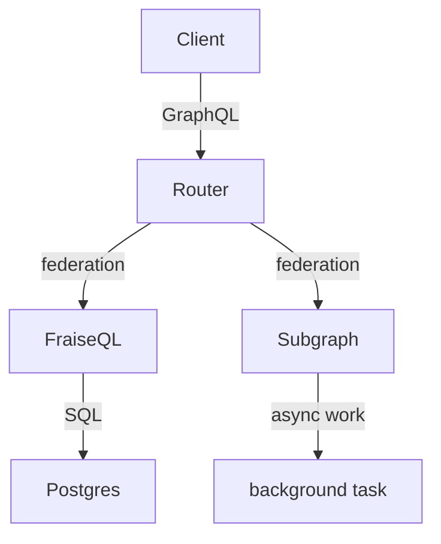

# Async Jobs Subgraph

How to handle **non-SQL mutations** in a FraiseQL API — AI/ML calls, payment
APIs, external services, long-running jobs — by composing a small GraphQL
**subgraph** via Apollo Federation v2.

FraiseQL compiles mutations to PostgreSQL function calls. Anything that can't be
expressed as PL/pgSQL has no mutation path in FraiseQL itself — and that is *by
design*. Instead of bolting a runtime job-orchestration layer onto the compiler
(see [ADR-0010](../../docs/adr/0010-async-mutation-handlers.md), Rejected), you
put the async work in its own GraphQL service and let federation present one
unified API to clients.

See the decision guide
[docs/guides/non-sql-mutations.md](../../docs/guides/non-sql-mutations.md) for
when to reach for this pattern versus a plain SQL mutation versus "not a
mutation at all".

## What you'll see

```
client ──► router (:4000)        Apollo Federation v2 supergraph
              │
              ├─► fraiseql (:8080)   SQL-backed subgraph ──► postgres   (User)
              └─► subgraph (:4001)   async-graphql subgraph            (enqueueJob / jobStatus)
```



The router serves **one** GraphQL endpoint. SQL-backed types (`User`) come from
FraiseQL; the non-SQL async mutation (`enqueueJob`) and its polling query
(`jobStatus`) come from the Rust subgraph. Clients can't tell which subgraph
answers which field.

## File layout

```
async-jobs-subgraph/
├── README.md                this file
├── Makefile                 dev / run / demo / down targets
├── docker-compose.yml       postgres + both subgraphs + router
├── subgraph/                the non-SQL subgraph (Rust + async-graphql)
│   ├── Cargo.toml           standalone crate — NOT a FraiseQL workspace member
│   ├── Dockerfile
│   └── src/
│       ├── main.rs          GraphQL surface + HTTP server (axum)
│       └── store.rs         in-memory JobStore (dev only) + JobHandle/JobStatus
├── fraiseql-side/           the SQL subgraph (authoring artifacts)
│   ├── fraiseql.toml        federation = subgraph "users"
│   ├── schema.py            owns the User entity
│   ├── init.sql             Trinity-Pattern table + view + seed rows
│   └── Dockerfile
└── router/
    ├── supergraph.yaml      rover composition config (lists both subgraphs)
    └── router.yaml          Apollo Router runtime config
```

## The subgraph surface

```graphql
type JobHandle @key(fields: "id") {
  id: ID!
  status: JobStatus!
  result: String        # populated only when status = SUCCEEDED
}

enum JobStatus { PENDING RUNNING SUCCEEDED FAILED }

type Mutation { enqueueJob(input: String!): JobHandle! }
type Query    { jobStatus(id: ID!): JobHandle }
```

The toy job sleeps 2 seconds, then completes with the **uppercase** of its
input — deterministic and observable. Replace it with anything real.

## Run it

### Fast path — the subgraph alone (no docker, no rover)

The async-jobs subgraph is a self-contained Rust binary. Run and exercise it
directly:

```bash
make dev          # cargo run on :4001 (GraphiQL at http://localhost:4001/graphql)
# in another shell:
make demo-local   # enqueue a job, poll until SUCCEEDED, print the result
```

Expected `demo-local` output (after ~3s):

```json
{"data":{"jobStatus":{"id":"job-1","status":"SUCCEEDED","result":"HELLO"}}}
```

### Full federation path — router composing both subgraphs

Prerequisites: docker + docker compose, and the Apollo
[`rover`](https://www.apollographql.com/docs/rover/getting-started) CLI for
supergraph composition.

```bash
make run    # boots postgres, both subgraphs, composes the supergraph, starts the router
make demo   # issues enqueueJob + polls jobStatus through the router on :4000
make down   # tears everything down
```

`make run` brings the subgraphs up first, then runs `rover supergraph compose`
(introspecting both running services) to produce `router/supergraph.graphql`,
then starts the router against it. That ordering matters: the router needs a
composed supergraph before it can serve.

## Extending

- **Durable job store.** `subgraph/src/store.rs` keeps jobs in process memory —
  lost on restart, not shared across instances. Swap `JobStore` for Redis, SQS,
  or a database table. The GraphQL surface doesn't change.
- **Real work.** Replace the "uppercase after 2s" body in `JobStore::enqueue`
  with an HTTP call, ML inference, or a payment request. The handle-then-poll
  shape stays identical.
- **Any language.** The subgraph happens to be Rust + `async-graphql` because
  this repo is Rust. It could be Python + Strawberry, JS + Apollo Server, Go +
  gqlgen — federation doesn't care. FraiseQL never calls into it directly; the
  router composes their SDLs.
- **More subgraphs.** Add a third subgraph and list it in
  `router/supergraph.yaml`; the router stays the single endpoint clients use.

## Why not build this into FraiseQL?

Because it would break the property that makes FraiseQL worth using: every
query and mutation is statically known and compiled to SQL before the server
boots. A runtime handler that calls an arbitrary endpoint can't be validated or
planned at compile time. The full analysis is in
[ADR-0010](../../docs/adr/0010-async-mutation-handlers.md).
